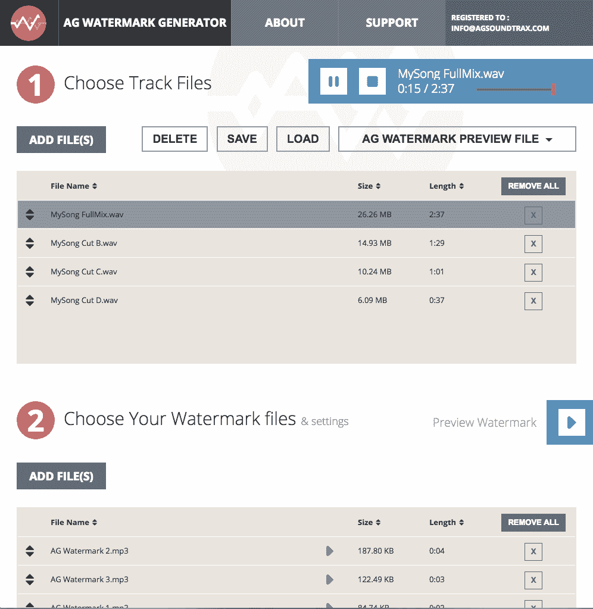
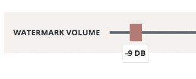

# AG 音频水印生成器 V.2

> 原文：<https://medium.com/hackernoon/ag-audio-watermark-generator-v-2-9d6d7d074fcc>

大家好，

我们非常兴奋地宣布，我们新的 [AG](https://hackernoon.com/tagged/ag) [水印](https://hackernoon.com/tagged/watermark)生成器 2.0 版本现已准备就绪，可以在我们的网站上下载！！！

【https://Watermark.AGsoundtrax.com 

V.2 New Design!

# 那么 V.2 有什么新功能呢？

## 我们今年真的很努力地工作来满足你所有的愿望和要求，所以这里有一些新的功能和改进，我们希望你喜欢它们！

# 控制你的水印混合音量。✔️

在 V.2 中，我们增加了控制水印音量的功能，因此您可以调整音量以适应您的曲目。

Watermark Volume Fader

# 在处理之前预览您的水印组合。✔️

Preview Your Watermark Mix

在您完成流程之前，现在比以往任何时候都更容易知道您的水印在原始轨道上的声音。只需选择您的曲目并点击“预览水印”。

# 相同的输出文件夹。✔️

我们希望让您的工作流程更简单、更快速，因此无需浪费时间浏览输出文件夹。

Easy & Fast Navigation

## 以下是一些更多的功能:

## -全新的设计。✔️
-更快的文件处理。✔️
-进程进度条。✔️
-转换器预设。✔️
-水印文件的快速播放器。✔️
-随时停止或取消 AGwatermark 的进程。✔️
-你现在可以给短 SFX 加水印了(0-1 秒)。✔️
-现在接受超过 15 秒的水印文件。✔️
-拖放文件顺序。✔️
-通过简单的排序你的大小/长度/文件名来定义曲目的顺序。✔️
-选择相同的输出文件夹。✔️
—“提个建议”部分。✔️
-覆盖文件通知..✔️
-错误信息现在得到解释。✔️
-过程结束时播放声音通知。✔️

[https://Watermark.AGsoudntrax.com](https://Watermark.AGsoudntrax.com)