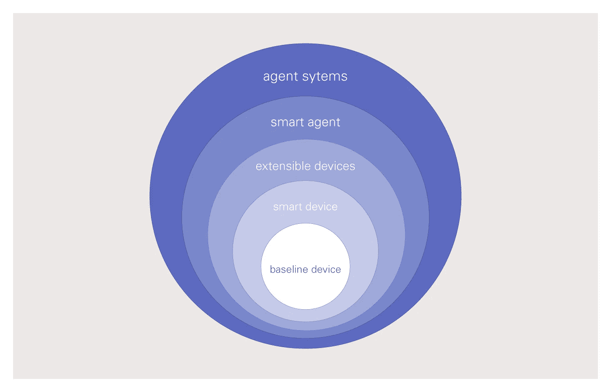
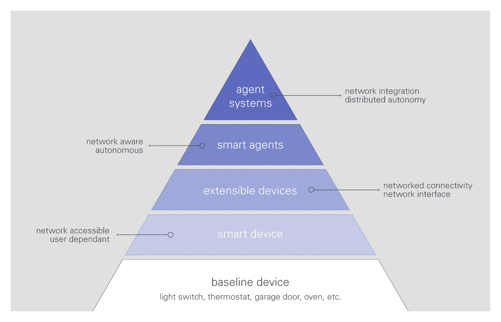
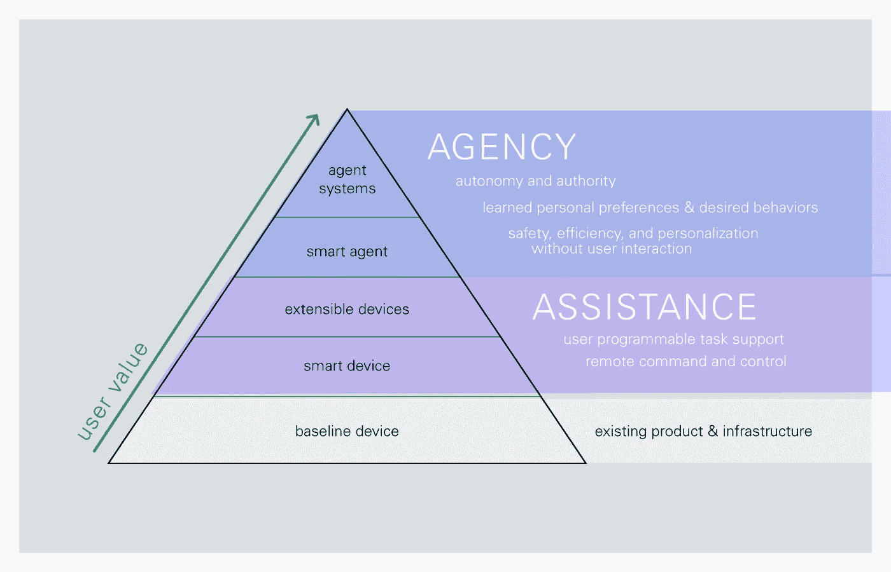

# 援助代理人

> 原文：<https://medium.com/hackernoon/agency-and-assistance-7185b0e8c12c>

## *理解 IOT 消费产品价值和复杂性的简单框架*

*本文是与* [*布伦特【恩格斯】*](https://twitter.com/ebrent) *和* [*谢利【沃尔伯特】*](http://linkedin.com/in/shellywalbert) *合作撰写的。*

# 对于消费者来说，有意义的产品超出了预期，积极的态度塑造了行为和情感。

随着 [IOT](https://hackernoon.com/tagged/iot) 产品、系统和网络慢慢变得更加融入我们的生活，嵌入我们的环境，我们对这些产品的期望很简单:我们希望它们为我们做事——让我们的生活更轻松、更安全、更高效。为了让这些产品持续下去，它们必须做得和我们一样好，甚至比我们更好，并且投入最少。今天，可能会有一些 IOT 产品接近这种有意义、可持续利用的状态，但不幸的是，大多数只是逐渐消失。这很大程度上是因为他们只是简单地将用户任务从物理任务转换成数字或口头任务。我们应该努力创造出不仅仅是协助完成任务的产品和服务，而是取代代理完成任务。

> ***展望未来，最有意义的系统将是那些推断我们的行为和欲望，同时需要最少用户干预的系统。***

这些产品将有权代表我们行事，而不仅仅是我们的助手——它们将是我们的代理。

下面是一个简单的模型，通过援助和代理的视角来思考和创造有意义的 IOT 消费产品。该模型将产品划分为简单的类别，这些类别相互依赖，价值不断增加，但也越来越复杂。

## 基线(主导)设备:

基准设备是现有的、以前被替换的“哑”或机械产品。这些是现有的电灯开关、恒温器、扬声器、烤箱等。这些物理设备和基础设施需要明确的用户输入或动作来控制。这种投入的回报是即时的，反馈是明确的。轻弹开关，灯就亮了。它们往往很简单，但却很有效。

这些基线设备已经发展了几十年，并且在这些对象中嵌入了表示信任、安全和效用的残余代码和行为。因此，取代这些简单而有效的设备的门槛非常高。

## 智能设备

智能设备是基本设备的联网、可控版本。他们提供给用户的是通过[网络](https://hackernoon.com/tagged/network)远程控制的能力。智能手机通过提供一个通用的控制界面来连接和控制这些新设备，为这些设备打开了市场。虽然这些设备通过其远程性和新颖性提供了价值，但任务管理在很大程度上只是将物理任务转换为数字任务。然而，这些设备的显著优势来自于运行编程时间表和提供双向反馈的能力。调度允许用户“一劳永逸”，并在系统检测到错误时得到通知。虽然初始设置的复杂性各不相同，但目前市场上的大多数智能设备仍能可靠运行并提供持续服务。如今市场上有很多这种设备的例子，从飞利浦 Hue 到 Nest 和亚马逊 Dash buttons。

## 可扩展设备

可扩展设备通过允许智能设备连接到第三方系统来扩展智能设备的功能。开放 API 的好处是允许通过第三方系统和设备进行控制。这种信息和控制共享可以是双向的:可扩展设备可以成为网络上共享数据的传感器，它们可以接收命令。通过协同工作，这些可扩展设备可以协同工作来执行基本的连接脚本，如 IFTT 中的“食谱”，通过 Amazon echo 对第三方服务进行语音控制，以及 Nest 的联网烟雾探测器。可扩展设备网络的价值受限于对系统进行编程以协同工作的能力。虽然通过第三方设备的相当简单的命令和控制能力变得越来越普遍，但是定制仍然需要用户方面的大量技术能力。

> ***智能和可扩展设备可以被认为是“助手”，因为它们帮助用户执行与基线设备相关的任务，但它们仍然需要用户显式编程和控制系统。***

它们通过执行可重复的任务或受益于远程执行的任务来帮助用户。这些设备可以帮助我们，但是它们没有独立行动的能力。就像基本设备一样，它们仍然需要某种形式的用户输入或命令。我们可以告诉阿利克夏把灯光调暗。但是她从来不知道自己去做。不管我们告诉她多少次，没有我们的命令，她是不会做的。

> ***区分*代理*和*协助*的是代表用户行动的自主性和权威性，而不需要用户输入。***

通过代表用户作出决定，代理商真正减轻了特定的任务或工作，而不仅仅是将其从物理转换到数字。这给用户带来了完全的认知放松。他们不再需要考虑或执行任务。助手工具关注的是任务的自动化，而智能代理关注的是结果和对用户有益的结果。

## 智能代理

智能代理和助理设备之间的主要区别在于代表用户做出决策的权限。这些决定可以基于个人偏好或个人和社区安全。一个常见的例子是具有防撞功能的自动驾驶汽车。防撞系统有权覆盖用户的巡航控制设置，因为要确保司机的安全。高频交易系统能够分析市场并进行交易，从而在没有任何用户交互的情况下达到预期的结果。我们已经可以看到这种智能正在进入家庭，比如洗衣机的自动负载感应功能，它有权调节水量，以最大限度地提高负载效率。未来的智能代理将不再像智能设备那样简单地遵循编程脚本，而是能够根据学习到的偏好、愿望和结果来执行操作。

## 代理系统

有了代理系统，智能代理的网络通过开放系统代表用户一起工作、协商和行动。通过这些系统协同工作的力量，生活的大部分可以朝着预期的结果自动进行。代理系统可以像自主的、协调的导航系统一样复杂，或者简单地像烤箱和洗碗机一样与食品输送系统一起工作，以便在没有任何用户干预的情况下预热、烹饪和清洗，从而获得最佳的效率和性能。独立的家庭系统可以在家庭就寝时自动协调照明、温度和安全，而不是需要明确的用户命令来实现类似的结果。交通、娱乐、安全和教育都有潜力适应和改造用户环境，以满足他们的个人需求和愿望。

# 需要考虑的重要事项:

在这个模型中，价值和复杂性是直接相关的——当我们从辅助工具转移到代理工具时，它们会上升。智能代理拥有执行任务的权限需要用户信任。因为这种信任是至关重要的，所以它们必须表现得完美无缺——不断地感知、学习并适应用户的偏好和周期。他们需要实时操作和无故障连接。所有这些因素大大增加了代理工具的复杂性。

作为用户的“代表”,任何代理都必须让用户知道决策，但重要的是，不需要明确的确认就可以行动。通过意识到代表用户采取的代理动作，可以在系统和用户之间增加互利的透明度和信任。用户可以理解并纠正代理的动作，并且代理可以学习用户偏好和例外。做到这一点的最简单的方法是使用某种及时但不打扰的通知方法，并结合可逆的“撤销”功能。

考虑、计划和构建这些系统将如何失败总是很重要的。优雅地失败应该是任何 IOT 系统的重要要求，也是设计的一部分。分层模型为故障保护措施提供了一个简单而有效的蓝图。最佳实践是沿着价值链适度降级:如果代理系统出现故障，恢复到预编程的援助计划。如果协助失败，用户仍必须能够手动控制设备，因此需要基线功能。Nest 是这个原则的一个很好的例子。如果它失去网络，它仍然运行其自动计划。虽然在这种情况下，用户不能远程控制恒温器，但用户仍然可以简单地覆盖程序并像基线、标准恒温器一样使用 Nest。

> ***自主智能体的最终轨迹是一个根据我们的个人偏好配置的世界——在没有任何用户交互的情况下，积极致力于个人安全、效率和机会*** 。

希望这个模型提供了一个清晰的方式来思考当前和未来的 IOT 产品，粗略地概述了技术复杂性，并强调了对消费者有意义的价值。

> [黑客中午](http://bit.ly/Hackernoon)是黑客如何开始他们的下午。我们是 [@AMI](http://bit.ly/atAMIatAMI) 家庭的一员。我们现在[接受投稿](http://bit.ly/hackernoonsubmission)并乐意[讨论广告&赞助](mailto:partners@amipublications.com)机会。
> 
> 如果你喜欢这个故事，我们推荐你阅读我们的[最新科技故事](http://bit.ly/hackernoonlatestt)和[趋势科技故事](https://hackernoon.com/trending)。直到下一次，不要把世界的现实想当然！

