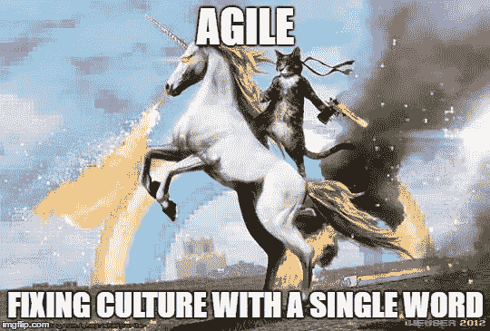

# 敏捷:3 个迹象表明你可能在喝独角兽的血

> 原文：<https://medium.com/hackernoon/agile-3-signs-that-you-may-be-drinking-unicorn-blood-81ca6c56a5eb>

我最近完成了我最喜欢的敏捷项目之一。不，真的，我喜欢去工作和做敏捷。我得救了。我的生活有条理。这个项目有起有落，但每个人都对他们所做的工作和共事的人感到满意。

Agile is beautiful like a cat riding a unicorn while holding a Desert Eagle in front of a rainbow.

我记得在障碍滑雪咨询办公室重新集合，与我的兄弟们分享这个好消息…