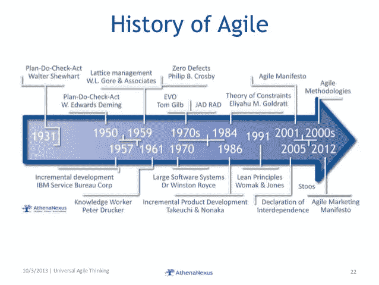
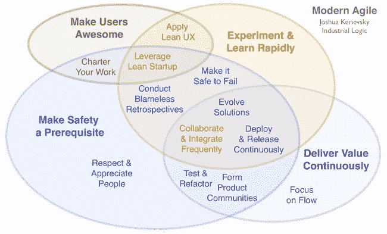
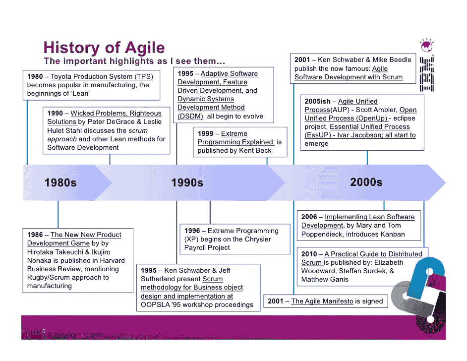
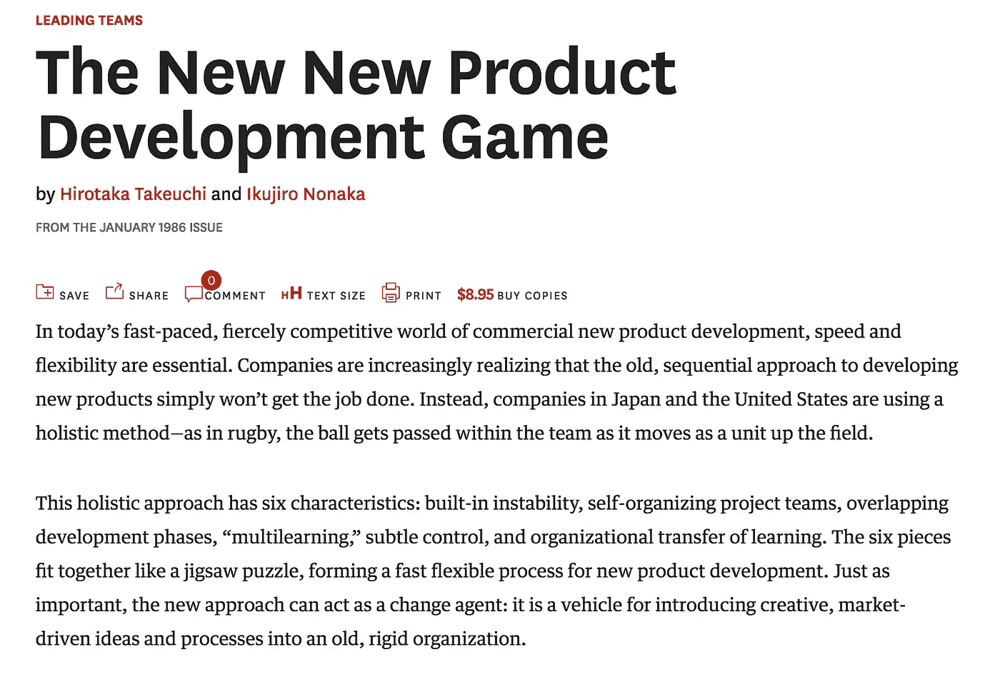
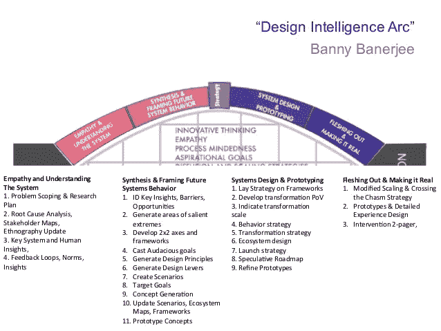
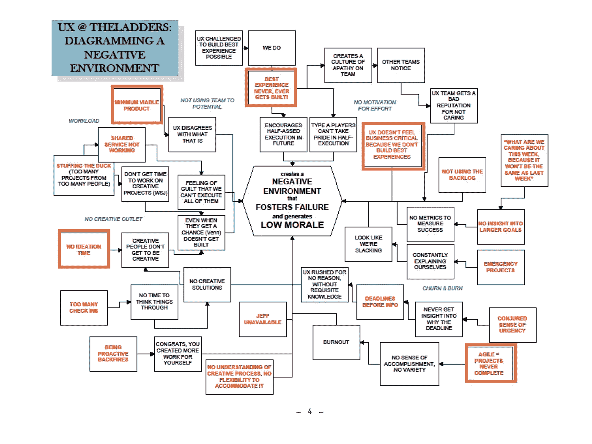
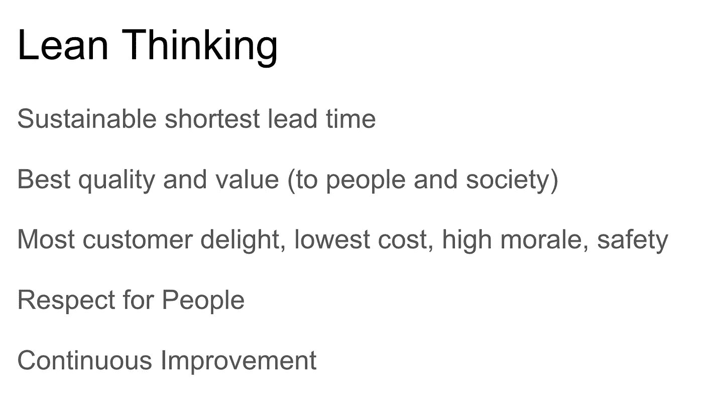

# 敏捷没吃你的作业…

> 原文：<https://medium.com/hackernoon/agile-didnt-eat-your-homework-269cece92274>

这里有一个通风口…

我已经厌倦了阅读那些将[在此插入组织功能障碍]归咎于敏捷的文章。我都听说了。敏捷是关于短期思维的。敏捷创造了糟糕的设计。敏捷是微观管理。敏捷会把你送进迭代地狱。敏捷激发了你不喜欢的东西。

这并不是因为敏捷是我的福音或者支付我的个人账单。

是的，敏捷已经被顾问、认证和“转型”的承诺污染了。DevOps 也一样。孙子也一样。斯多葛派也一样。福音也是如此。任何美化书籍封面的[在此插入创意]都是如此，并作为一种快速解决方案在董事会中流传。或者与组织结构图的每一部分结合起来，形成新的术语…敏捷[在此插入功能筒仓]。这是必然的。好东西会被滥用。

敏捷就是这样…一些有趣的(及时的，有灵感的)想法激发了一个社区，这激发了更多的想法(重复，直到你得到一些非常非常好的想法，以及热衷于分享它们的人)。那些想法——以及那个社区——是“敏捷”的。这是一个丰富而有趣的社区。这个词给人一种货物崇拜和乏味的感觉，但这个社区(很大程度上)并非如此。一位高管喷着鼻息说“我们需要敏捷！”有点恶心，但“协同”这个词也是。

软件开发界的很大一部分人已经通过糟糕的 Scrum 实现体验了敏捷。但这并不是重点。[敏捷！= Scrum](https://stackoverflow.com/questions/11469358/what-is-the-difference-between-scrum-and-agile-development) 。

重点是…谷歌和维基百科是你的朋友。我们所知的敏捷中包含了很多很多的传统。作为参与产品开发的个人，做好自己的功课并了解自己的历史是你的责任(提示，历史可以追溯到犹他州雪鸟之前)。当产品或 UX 社区喋喋不休地谈论敏捷，然后不能描述他们自己的传统，或者他们的传统如何转化为当前的上下文时，这让我很恼火。

所以这不是在为一个夸大的词辩护(变成社区，变成标签，变成发票行项目)。这是超越简单化的思考——我们“做敏捷”,我们没有得到结果，因此它必须是敏捷的——思考。我想对任何“方法”说同样的话，或者希望任何“方法”能解决你所有的问题。停止为你的组织寻找银弹。学习，卷自己的，冲洗，重复。

成为学生，学习。做你的作业。然后写博文。

大多数道路不会以敏捷开始和结束。但是大部分会通过它。

[http://modernagile.org/](http://modernagile.org/)

[http://www.brighthubpm.com/agile/45157-using-lean-thinking-in-agile-project-management/](http://www.brighthubpm.com/agile/45157-using-lean-thinking-in-agile-project-management/)

[https://hbr.org/1986/01/the-new-new-product-development-game](https://hbr.org/1986/01/the-new-new-product-development-game)

[http://www.leanprimer.com/downloads/lean_primer.pdf](http://www.leanprimer.com/downloads/lean_primer.pdf)

[https://www.slideshare.net/TommyLiu3/design-thinking-history-methodology](https://www.slideshare.net/TommyLiu3/design-thinking-history-methodology)

[https://www.invisionapp.com/blog/5-years-lean-ux-jeff-gothelf/](https://www.invisionapp.com/blog/5-years-lean-ux-jeff-gothelf/)

> [黑客中午](http://bit.ly/Hackernoon)是黑客如何开始他们的下午。我们是 [@AMI](http://bit.ly/atAMIatAMI) 家庭的一员。我们现在[接受投稿](http://bit.ly/hackernoonsubmission)，并乐意[讨论广告&赞助](mailto:partners@amipublications.com)机会。
> 
> 如果你喜欢这个故事，我们推荐你阅读我们的[最新科技故事](http://bit.ly/hackernoonlatestt)和[趋势科技故事](https://hackernoon.com/trending)。直到下一次，不要把世界的现实想当然！

