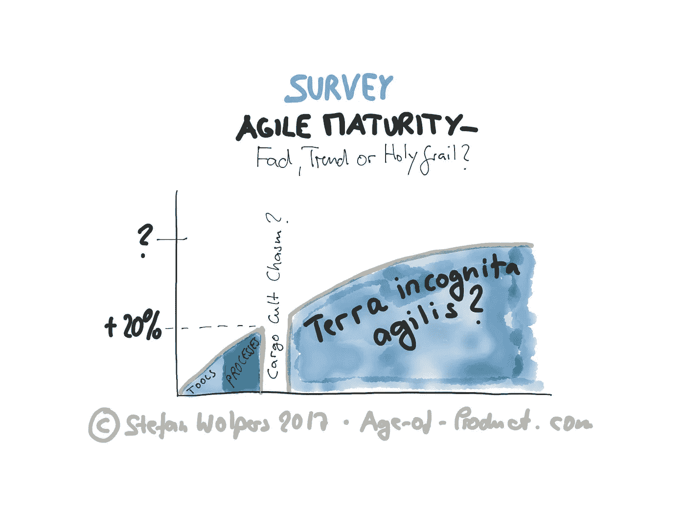

# 敏捷成熟:时尚、趋势还是圣杯？#调查

> 原文：<https://medium.com/hackernoon/agile-maturity-survey-595bfb021443>

# TL；DR:参与敏捷成熟度调查，帮助我们理解敏捷成熟度的本质

加入 60 位同行(截至 2017 年 10 月 23 日)并参与匿名的[敏捷成熟度调查](https://docs.google.com/forms/d/e/1FAIpQLSc5fX5d_yoxuwbRS92mJpAJBvF6t3DVNSfzCVgojWtkzQXRQg/viewform?usp=sf_link)并帮助我们找出:*敏捷成熟度是一种时尚、趋势还是敏捷转型的圣杯？*

我将[像往常一样分享结果](https://age-of-product.com/scrum-master-salary-report-2017/)，为您提供一个工具来应用您组织或团队的情况。

# 有类似敏捷成熟的东西吗？

“这是我们经历过的最好的冲刺。我们正变得(更加)敏捷。”不知何故，当谈到“敏捷”时，进步的感觉似乎总是模糊的概念所有这一切的核心问题总是相同的:我们如何发现我们是“敏捷”的，而不仅仅是实践一种货物崇拜版本的它？

提供一条通往终极存在状态的道路一直是哲学、社会学、政治学和宗教中许多教义的核心原则:如果你遵循这个准则，如果你接受以下规则对你生活的指导，一切都会好的。(为了每个人的方便，我们为您提供了一本书、一本指南，甚至可能还有一份清单。)

毫不奇怪，敏捷世界也不例外。从敏捷软件开发的[宣言](http://agilemanifesto.org/)——四个价值观和十二个原则在一页纸上——开始，接着是仍然轻量级的 [Scrum 指南](http://www.scrumguides.org/scrum-guide.html)。今天，教学的口径已经改变——只要看看 SAFe 的大图就知道了——即使在敏捷世界中，通往乐土的道路似乎也是精心规划的。

> 这就引出了一个问题:敏捷术语中的“乐土”是什么？我们都应该转向社会主义还是社会主义？

通过[参与这个简短的匿名调查](https://docs.google.com/forms/d/e/1FAIpQLSc5fX5d_yoxuwbRS92mJpAJBvF6t3DVNSfzCVgojWtkzQXRQg/viewform?usp=sf_link)，帮助我们更好地理解成为“敏捷”的目标对一个组织意味着什么。这不会占用你超过五分钟的宝贵时间。当然，调查结果将在稍后阶段公布。

敏捷成熟度调查是匿名的。

***请点击【鼓掌手】*** 👏 ***，如果你觉得这篇帖子有用，那对我来说意义重大！***

***要不要这样多读书？嗯:***

*   📰 ***加入 12308 位同行和*** [***报名参加本周刊快讯***](https://age-of-product.com/subscribe/?ref=Food4ThoughtMedium)
*   🐦 ***关注我上*** [***推特***](https://twitter.com/stefanw) ***并订阅我的博客*** [***产品年龄***](https://age-of-product.com)
*   💬 ***或者，免费加入*** [***Slack 团队【动手敏捷】***](https://goo.gl/forms/XIsABn0fLn9O0hqg2)***…***

敏捷成熟度调查:时尚、趋势还是圣杯首次发表于《产品时代》。