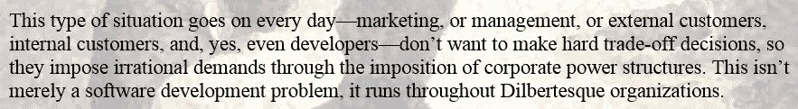

# 面对现实，敏捷方法的承诺似乎没有兑现

> 原文：<https://medium.com/hackernoon/agile-methodology-s-promise-seems-to-fall-short-in-the-face-of-reality-b16d3e775dbe>

在过去的 5、6 年里，我一直在参与一些项目，这些项目本应遵循[敏捷](https://hackernoon.com/tagged/agile)过程。不同的团队拥有不同的技能和采用水平。这种方法在我当前的项目中得到了积极的应用，包含了所有敏捷方法的特征，包括:

*   每日站立会议
*   积压
*   积压整理
*   故事要点
*   烧毁图表
*   敏捷教练
*   回顾展
*   以及其他诸如此类的

我认为我最喜欢敏捷的一点是它承认现实(大写 R 意为)。[为真实的人类设计真实世界的解决方案——即使是非常简单的解决方案——也非常复杂，原因有很多。](https://hackernoon.com/tagged/designing)

[http://agilemanifesto.org/history.html](http://agilemanifesto.org/history.html)

敏捷方法吸引了像我这样的人，因为它解决了这一现实，并提供了管理这种疯狂的复杂性的伟大过程。它有效地回应了“[通过强加公司权力结构来强加非理性要求的传统选择](http://agilemanifesto.org/history.html)当然，关于非理性需求的问题是，你根本无法满足它，除非是偶然的。

但是尽管我对敏捷方法倾注了所有的希望，我发现自己经常失望。以下是一些原因:

*   对于许多开发人员来说，Sprint 规划会议是一个非常模糊的过程。我们永远无法完全理解“故事点”的含义，在很多情况下甚至不去尝试。我个人对“故事点”的不精确本质和现实世界的含义没有意见然而，许多开发者不是，也许是一半。我见过一些人或多或少地完全退出，因为他们不明白或不喜欢它，并从这个过程中收回他们的智慧。
*   作为上述的一个推论，这种“我们计划，但是认识到在动荡的环境中计划的局限性”的想法对于那类开发人员来说也有点失败，不管出于什么原因，他们在内心深处仍然相信事情可以被很好地计划。
*   “优先处理积压的工作，直到你的预算用完”是一种谎言，每个看过这部电影的人都知道这一点。真正的规则是“处理优先的待办事项，但是在相同的预算和时间内完成整个待办事项，就像这是一个固定的项目一样。”这意味着早期的冲刺相对来说是无忧无虑的，专注于构建产品、基础设施和充满高尚思想。中间冲刺变得不那么无忧无虑，最后冲刺倾向于容易焦虑的深夜、周末甚至彻底的恐慌。最后的“稳定冲刺”不是用来稳定事情的，而是在任何最终“必须拥有”的待办事项中完成。
*   站立会议几乎从不在所有人都站着的情况下进行。

最后一点看起来很小，但它实际上达到了这篇比预期长得多的帖子的目的:)。

当“敏捷”项目开始时，通常有人会制定基本规则，其中最简单的就是每天的 scrum 会议。他们被限制在 15 分钟的时间内，团队成员几乎一直站着，只谈论三个话题:1)我昨天做了什么，2)我今天希望完成什么，3)我受阻了吗？

这通常开始还不错，但是到了某个时候，有人开始坐着，然后又有人坐下，接下来你知道，就不再是“站着开会”了，而是“坐下来开会”这是过程中的第一个小裂缝，它开始解开真正遵循敏捷方法所需的规程。接下来，人们不只是谈论他们的三个话题。他们会被打断。有人用一个建议回应一个阻止者，然后其他人参与进来。接下来，你知道，你的站立会议有点像一个“适当的”站立会议，但实际上只是另一个随机的团队会议。

一旦我们停止站立，我们就抛弃了一个最简单的规则。抛弃别人就变得容易了。

对于那些更注重字面意义的开发人员来说，也有类似的挑战。我目前正在进入我当前项目的第七个冲刺阶段，我的一些开发同事继续举着故事点估计作为一种挡箭牌，来解释为什么一个用户故事花费的时间比他认为应该花费的时间长或少。或者稍后，在任务分解过程中，当我们最终得到工时估计值时，他们会抱怨两个具有相同故事点的故事不等于彼此的工时估计值。本周我们将参加一个 scrum 计划会议，我只知道在连续的第七次会议中，人们仍然试图将故事点转化为工时，我们将进行同样的(到目前为止)令人厌倦的讨论，即故事点不等同于开发工时。

尽管如此，我仍然相信敏捷方法是做事的“正确”方式。我心里也觉得是和另一种“正确”的做事方式妥协了，就是正确的做瀑布而已:)。如果我们能够花费正确的时间，与正确的人一起“正确地”记录需求，那么我们应该能够创造出好的产品。我已经把自己从瀑布中解放出来，因为正如我一直说的，敏捷更加基于现实，而现实并不在乎你心里相信什么。

但是现在我也对敏捷作为一种方法论失去了信心，因为尽管敏捷是轻量级的和明智的，但似乎不可能遵循它。

我的政治倾向极左，几年前(2009 年 1 月)，我读了希瑟“迪格比”帕顿的博客，她用了这样一句话，“保守主义永远不会失败，它只会失败”这真的引起了我的共鸣，我发现自己把这句话应用到了非政治领域。例如，“正确实现的瀑布永远不会失败，人们只能不遵循它。”

我几乎不相信“敏捷方法过程永远不会失败，人们只能不遵循它。”要是我们*在起立会议上站起来*就好了！如果 scrum master 能够专注于解除阻塞，如果每个人都能够在一个故事点的意义上保持一致，那该多好啊！如果每个人都能坦然面对固有的问题，即即使在你丢失重要信息时，也需要进行评估。要是这样就好了！要是那样就好了！

这是一件令人失望的事情，因为对我来说，这基本上意味着在宏观层面上，什么都没有留下。成功或失败比我希望它出现在我的项目中要随机得多，唯一能让转盘朝着对你有利的方向移动的方法是通过某种英雄模型、运气和对“成功”的创造性定义英勇的项目经理。英勇的 scrum 大师。英勇的建筑师和开发者。幕后交易是由有经验的商人做出的商业妥协。诸如此类的事情。

我仍然对敏捷方法非常投入，因为我*确实*认为这是我们最大的希望:)。也许这只是一个坚持不懈的团队需要更多的练习。我们走着瞧。

> [黑客中午](http://bit.ly/Hackernoon)是黑客如何开始他们的下午。我们是 [@AMI](http://bit.ly/atAMIatAMI) 家庭的一员。我们现在[接受投稿](http://bit.ly/hackernoonsubmission)并乐意[讨论广告&赞助](mailto:partners@amipublications.com)机会。
> 
> 如果你喜欢这个故事，我们推荐你阅读我们的[最新科技故事](http://bit.ly/hackernoonlatestt)和[趋势科技故事](https://hackernoon.com/trending)。直到下一次，不要把世界的现实想当然！

