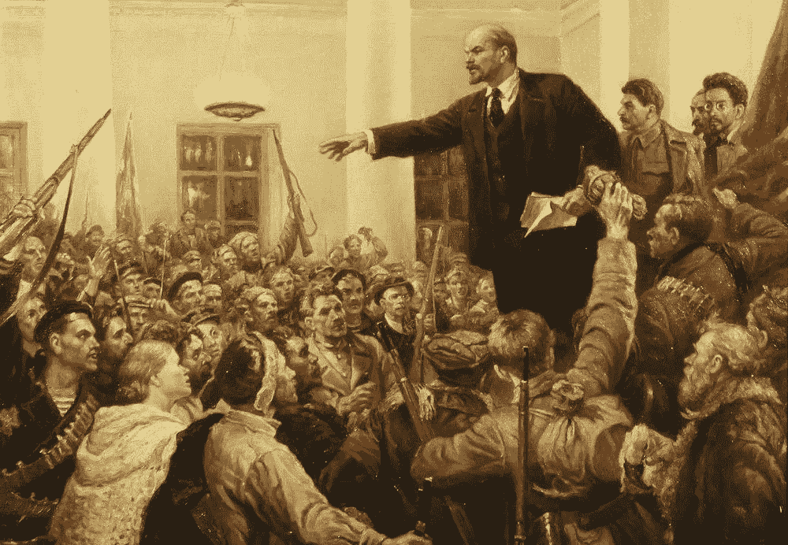

# 敏捷:革命与反革命

> 原文：<https://medium.com/hackernoon/agile-revolution-and-counter-revolution-1d0a5fe08183>

## 从敏捷宣言到共产党宣言，然后再回来

这是 1917 年俄国革命 100 周年的季节。所以我们换个话题，谈谈敏捷软件开发。

## 两个敏捷的故事

> 这是最好的时代，这是最坏的时代，这是智慧的时代，这是愚蠢的时代，这是信仰的时代，这是怀疑的时代，这是光明的季节，这是黑暗的季节，这是希望的春天，这是绝望的冬天，我们面前拥有一切，我们面前一无所有，我们都将直奔天堂， 我们都在朝着另一个方向前进——简而言之，那个时代与现在的时代如此相似，以至于它的一些最喧闹的权威人士坚持认为，无论是好是坏，它只是在最高级的比较中被接受。 
> 
> ***—狄更斯***

这是最好的方法，也是最坏的方法。在互联网讨论中，不同公司的不同人对敏捷/scrum 软件开发实践的体验存在着令人困惑的差异。似乎有两个阵营，有着截然相反的经历。

一方面，有些人称赞轻松的日常站立会议、松散的结构以及工作的即兴“敏捷”性质。另一方面，也有人抱怨过多的会议，计划不足，以及过分的重复记账。

人们意识到存在分歧，但很快会挥挥手，说什么“不同的公司是不同的”但这是一个错失的机会，让我们明白这些差异背后有着可识别的潜在原因。

虽然每个公司都不一样，但事实证明有一种方法可以将敏捷团队精确地分为两类，你会发现这两类提供了一个相当准确的预测，即工程师在该系统下会喜欢还是讨厌敏捷。

为了理解区分这两个 Agiles 的简单区别，让我们再次改变话题，讨论俄罗斯革命。

# 俄罗斯革命

我们低调地接近了十月革命的一百周年纪念日，它发生在 1917 年 10 月 25 日，但是他们用错了日历。)这是 1917 年俄罗斯大革命的标志性事件。为了纪念这一历史事件，我研读了俄国革命。我强烈推荐你去看看，即使只是在维基百科上。无论如何，我想分享一些我感兴趣的鲜为人知的细节。*免责声明:善良一点，我更像书评人而不是历史学家。*

***“Lenin Proclaims Soviet Power,”*** *Vladimir Serov*

俄国革命是由群众的不满推动的压倒性的民众起义。一些最大的因素是 1905 年革命的延续。第一次世界大战引入或放大了其他因素。不满来自各个方面——农民、工厂工人和士兵，他们共同构成了绝大多数。他们的许多共同抱怨与世界上其他革命的情绪非常相似，如法国革命，甚至美国革命，这两次革命都发生在 100 多年前。这些都是启蒙运动的理想，稍微延迟一下行程就超越了这个国家。也就是说，社会大众已经形成了这样一种感觉，即统治的君主政体并没有真正做任何有用的事情，但是他们制定了所有的规则，拿走了所有的东西，并且偶尔派人去打仗。这只是一个无用的有资格的贵族阶级——启蒙运动/革命时代的态度可能是我们得到“权利”的负面内涵的地方(这意味着这个“头衔”虽然声称是不值得的。沙皇尼古拉斯的独裁被视为不合时宜的官僚制度。

因此，也许关于俄国革命的最大问题如下:它是在什么时候从一场民众起义转变为我们所知的最终独裁的苏联的？是斯大林吗？列宁？马克思的鬼魂？还有别的吗？

当群众认为他们已经受够了并推翻了独裁政权时，弗拉基米尔·列宁已经掌握了一种演讲的形式，这种形式使他能够站在运动的前沿。至少在美国，没有完整历史观的人倾向于将列宁视为另一个煽动家，斯大林的早期形式，这是很常见的。这并不准确。列宁实际上是一个意识形态的马克思主义者，所以他对沙皇的批评以及他的授权和民主的口号都是真实的，并且符合大众的情绪。列宁的布尔什维克不是最受欢迎的政党，他们足够接近——大多数受欢迎的政党都是左翼社会主义/共产主义/马克思主义团体，都在说同样类型的事情。所以列宁的组织就这样走进了大门，夺取了政府，每个人都认为这是一种进步。

列宁的神秘之处在于，马克思主义除了批判之外别无其他——它会告诉你什么是错的，但除了口号和抽象概念之外，没有给出“应该做什么”的具体处方。俄罗斯被拖入了一场内战，几个基本上不相容的团体(资本家、君主主义者等)卷入其中。)在几个欧洲国家的支持下，打败了布尔什维克，恢复了君主制或其他新的政权。这导致了所有雅各宾派关于“保护革命”等等的言论——战争宣传。布尔什维克必须明白，拥有某种稳定的权力先于他们所有的经济制度理论。列宁在国家稳定下来之前就去世了，你完全可以责怪(或祝贺)他。你不能称他为煽动家或其他人，因为他对如何在更稳定的长期环境中执政有任何具体的计划是令人怀疑的。他制定了短期计划和长期口号。更公平地说，他不知道自己在做什么。

我想把列宁和斯大林区分开，这样我就能指出我认为苏联在哪里变成了我们所知的大官僚主义。布尔什维克在俄国内战中把每个人都派去击退欧洲其他国家，同时四处找人来帮助他们管理这个据说是他们正在建立的新政府系统。工作要求是 1)有文化 2)就这样。他们没有找到很多工作候选人，所以他们最终雇用了所有沙皇的旧官僚。同样的人！这些是他们刚刚完成的令人作呕的家伙，现在他们不得不为了一份薪水重新雇用他们。)

所以列宁的故事是你想怎么理解就怎么理解，但是斯大林的故事完全是另一种类型。在斯大林统治下，他们创造了我们所记得的东西。斯大林是那种通过吸引其他官僚而不是试图吸引大众来爬到官僚机构顶端的人。但是官僚机构是建立在沙皇时代的基础上的，有一些完全相同的人。俗话说，“共产主义在纸上行得通……”但我不相信曾经有过纸。布尔什维克不知道他们在做什么，所以他们只是适应已经存在的体制，这是一个专制的官僚体制。

我们所知道的苏联(和其他地方)共产主义的一个特殊特征是他们不会闭嘴。不仅仅是共产主义，还有革命。你可能有一个 100 岁的共产主义专政，他们仍然会说“保护革命！”正常情况下不会出现这种情况。没有人还在说任何关于法国或美国革命的口号。他们停止争吵后就不再说那些话了。独裁政权和官僚机构总是不停地说这些话，因为他们从来不知道也不在乎这些话的真正含义——他们只是拿起时代的说法，专注于推进自己的事业。他们不能停止谈论革命，因为这是他们工作的基础。都是嘴上说说。

反革命不是发生在内战的战场上，而是发生在克里姆林宫党内。

# **敏捷革命**

这让我想起了另一场革命。敏捷革命。

在过去的日子里，软件开发人员据称使用瀑布方法，在那里他们试图做“大的预先设计”他们会在编写一行代码之前尝试设计一个完整的系统。他们甚至可能在编码前编写全面的文档。他们会使用 UML 图，甚至在打出任何一个类之前，就用一些工具画出他们要制作的每个 Java 类。所有细节都将写进与客户的合同中。所有的工作都将通过各种工具进行跟踪和微观管理。整个努力将落在某种项目经理之下，就好像这是某种巨大的 NASA 建造宇宙飞船的合同。他们试图将装配线的逻辑应用到软件中，因为自从创建字面上的装配线以来，管理科学从未在学术上成熟过。

但是大多数类型的软件开发不像流水线，甚至不像任何类型的工程。软件开发，尤其是在新兴的网络上，是一个试错的过程。所以有些人，尤其是有合同导向的网络工作经验的人，厌倦了，说“我们不再做这个了。”17 名开发人员聚集在犹他州，把他们的新原则写进了《敏捷软件开发宣言》,或《敏捷宣言》。敏捷的四个主要原则是:

*   过程和工具之上的个人和交互
*   综合文档之上的工作软件
*   合同谈判中的客户协作
*   响应变化而不是遵循计划

这种类型的敏捷直到今天还在使用。人们喜欢它。它允许人们以最符合逻辑的方式来创建软件，因为它没有规定您必须采取(或不采取)的一系列特定的步骤！)如果你只是想去写一些代码，那就写吧。如果你改变主意，就改代码。另一方面，如果你确实需要一个大规格的东西，那就去做。你选择那些更容易更快得到结果的规则；消除痛苦。

但是这种敏捷让很多中层经理失业，他们不打算接受。中层管理者，像沙皇官僚一样，有一种权利感——认为他们应该在生活中比其他下层民众高一等。所以他们决定成为敏捷的领导者。

当这些项目经理开始一个项目时，他们被训练以福音式的演讲开始。在第一张幻灯片上，他们将向你展示我上面列出的敏捷的四个原则。在下一张幻灯片上，他们将告诉你将要使用的所有新流程和工具，以及将要参加的所有新计划会议，你将如何提前 3 个月计划所有工作，并迫使你尽可能紧密地遵循这些工作。他们看不到虚伪。

现在，这些中层管理人员发明了周期更长的外管局，并不时进行季度规划。这只是瀑布，除了它有所有的费用和不灵活性，但仍然禁止生产任何有价值的东西，如规格或蓝图。你只是得到了一堆以后要换的 Trello 卡——当然你以后要换，这就是为什么我们去掉了瀑布。但是为什么我们要提前计划好一切呢？

所以在这个版本的敏捷中，它有着和旧系统一样的流水线管理，并且由最初反对的人来管理。是同一伙人！旧制度，高喊新制度的口号。Scrum Master 现在是一个高薪职位。你不向任何人汇报，控制所有人。这份工作的要求是 1)识字，2)仅此而已。这是敏捷的反革命。

这种形式的敏捷有一个独特的特点，那就是他们不会对此闭口不谈。不仅仅是敏捷，还有 Scrum 和 SAFe，以及敏捷革命的所有相同口号。没有人想做任何类似瀑布的事情，他们仍然试图杀死那个稻草人。这在软件的其他地方不会发生。没人喊着要杀飞侠。五年前它死了，我们就不再捕杀它了。但是官僚们会一直喊着他们的口号，因为他们从来不知道也不关心他们真正的意思——他们只是拿起时代的说法，专注于推进他们的事业。他们无法停止对敏捷的叫嚣，因为敏捷是他们工作的正当理由。都是嘴上说说。

# 结论

敏捷有意地称自己为“革命”,并使用“宣言”这样的术语来营造摆脱无用社会阶层的形象。他们可以称之为“敏捷启蒙”，但是他们没有。但就像一场政治革命一样，同样的老家伙一次又一次地回来，有时还戴着革命本身的面具。

一天结束时，你会通过数特雷罗牌来了解敏捷反革命。如果一个开发人员运行 stand up，你可能处于真正的敏捷中。如果你的会议是由某个古怪的家伙主持的，他不是工程师，除了运行 scrum 之外，在项目中没有任何其他利益，那就离开吧。官僚们想要所有的权力和地位，却不想承担任何责任。他们隐藏在不同的组织结构下。不是敏捷，不是 scrum，只是臃肿；它会扼杀你的公司，你会讨厌它。

像布尔什维克一样，这个版本的敏捷只能批判，不能假设新的东西。他们想要成为领导者，但是他们明确地不知道他们想要建立的是什么——他们只是想要在发生的时候有一个高的位置。他们会闲聊，高谈阔论，巩固权力，清洗所有反对他们议程的人。

***革命万岁！***