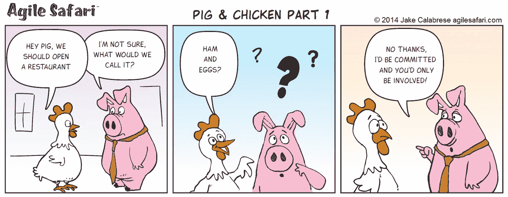
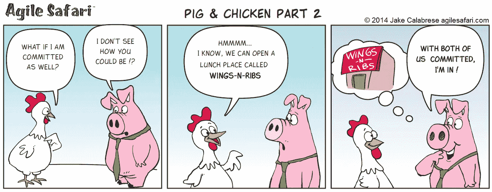
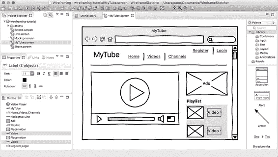
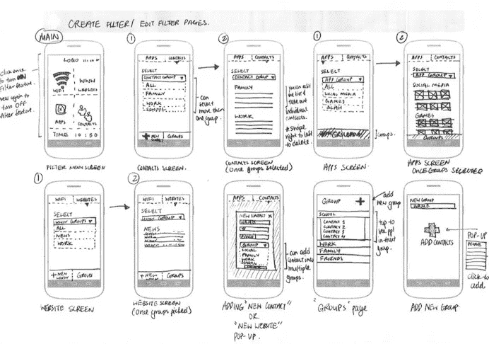

# 我关于敏捷软件开发方法及其核心团队成员的一些经验

> 原文：<https://medium.com/hackernoon/agile-software-development-methodology-and-its-core-team-members-b33e40c0bccf>

我记得:1998 年的一天，我在学校，给我的学校朋友看我的个人网站。这绝对令人惊讶，我觉得自己是我朋友中非常酷的人。因为，在那个时候，虽然使用计算机对人们来说是未知的和复杂的，但我已经成功地通过使用 HTML，JavaScript 和雅虎的一项服务(GeoCities)创建了自己的网站。

从那时到现在，大约 20 年过去了，我仍然在从事[软件开发](https://hackernoon.com/tagged/software-development)。除了软件开发人员，我在不同的岗位上工作过，但是在我的工作和生活中，我从未放弃过写代码。在这 20 年里，我使用过不同的编程语言、工具和服务。我已经做了 7 年的经理。

在这篇文章中，我将尝试分享一些关于软件开发过程和软件开发团队成员类型的经验。

# 方法学

如今，很明显，所有人都完全赞同软件开发的[敏捷](https://hackernoon.com/tagged/agile)方法论。我也是。但是我们需要知道敏捷方法不是一个新的事物或者一种独特的体验。在[敏捷宣言](http://agilemanifesto.org/)发布之前，它已经被软件开发团队使用了很多年。众所周知，一般聪明的人都对软件开发感兴趣，他们已经发现并开始在他们的过程中使用这种方法。

让我举一个例子来说明为什么方法论很重要。

今天，如果你想建一栋建筑，你需要雇佣工人，需要和建筑师一起准备建筑计划。然后，你可以通过花时间来创造这个建筑。建成这个结构后，你会花多少精力去维护它？不太多，因为它坚固，不变的结构。例如，没有人会带着一个极端的想法来找你:让我们给这个建筑加一个火箭，这样它就可以从一个地方移动到另一个地方！，然而它在软件开发中不起作用。因为，变更需求是软件开发中很正常的事情，会发生。因此，在你开始开发他们的需求之后，人们会提出许多不同的极端想法。甚至，他们可能会因为你为他们开发的产品而一百八十度的改变他们的想法。因此，应对变化变得比遵循计划更重要。这只是使用方法论的原因之一，但我们需要知道我们面临着不同的挑战。所以，他们中至少有一个应该是本次挑战的首选。

没有一种软件开发方法是最好的。说“*其中一个是最佳方法”*是不成立的。软件开发方法依赖于公司的文化、项目和人员等。软件开发领导者的主要职责是定义适合公司文化和项目等的正确方法。因此，领导者应该了解公司、产品和人员，并积极参与定义。

你可能会问，敏捷方法学已经被很好地定义了，为什么领导者需要再次定义它？你是对的，但是几乎所有的公司都根据公司的需求、文化、项目等来修改敏捷方法。所以领导才重新定义。

另一方面，说“*瀑布方法不是软件开发的正确方法”*也是不正确的。一些项目需要在开始项目之前被很好地定义，例如军事项目或健康项目。例如，在发布一个健康产品后，说“*我们还没有考虑这个情况，让我们解决它*”是不真实的。这可能是死因。因此，在发布这类产品之前，应该定义所有的需求，并根据这些需求开发产品。

就我所见，无论选择哪种方法，最重要的是团队成员的承诺。每个团队成员都应该投入到项目中，而不是参与其中。

The chicken was involved. The pig was committed.

Both were committed now.

这是一个理解承诺和参与之间不同的很好的故事。猪提供它自己的一部分(肉)，而鸡只提供它产生的一部分来支持餐馆。这就是承诺和参与的区别。

另一件重要的事情是每天的会议。它更新人们，让他们为那一天做好准备。在我看来，敏捷方法论的一切都可以修改，除了日常会议。它驱动团队，所以它应该总是停留在方法论中。

在本文中，我不会提及敏捷方法论的方法。关于敏捷方法学，有很多专家写的论文比我知道的多。

让我们关注团队成员。

# 团队成员

# 项目管理人

敏捷团队的理想规模是六到十人。如果你的一个团队超过六个人，如果你有不止一个团队，最好和一个项目经理一起工作。

对于项目经理来说，我认为需要具备三个主要条件。

1.  收集信息和指导他人的沟通技巧
2.  忠诚的人的特征
3.  分析技能

项目经理的 KPI 可以是

1.  日程安排
2.  费用
3.  资源分配(有时，他们想要的比他们需要的多)

# 软件开发人员

我相信软件开发人员和出租车司机差不多。想想看:如果你和一个好出租车司机一起旅行会发生什么？他/她用最便宜的方式和最快的速度带你安全地去你想去的地方。如果你和一个糟糕的出租车司机一起旅行，他/她会用一种不是最短的方式，会花更多的时间，这导致你需要付更多的钱。另外，你会感到压力很大。像出租车司机一样，软件开发人员有时会占用你的时间，用他们不合格的工作让你紧张。

Traveling with a bad taxi driver

到目前为止，我和不同层次的软件开发人员一起工作过。不管软件开发人员是好是坏，我总是会考虑在项目的初始阶段与资深人员合作。当一个新项目开始时，你应该和一个资深软件开发人员一起开始。否则很可能在项目结束时被打乱。不管他/她有多积极，多投入，多聪明。这是自然的过程，他们没有看到正确的结构，没有花足够的时间去理解什么对软件开发是好的或坏的。因此，我总是在最初阶段考虑与前辈合作。在初始阶段之后，初级开发人员可以在项目中扮演积极的角色。

**资格**

1.  好奇的
2.  通力合作者
3.  忠诚的人的特征
4.  技术知识

技术知识是必需的，但是它在我的列表的末尾。不管一个软件开发人员有多少技术知识，都是很容易增加的。

**关键绩效指标**

1.  日程安排
2.  使用软件开发的最佳实践
3.  代码中的错误率

# 业务分析师/测试人员

我相信巴和考斯特应该是同一个人。否则，BA 收集客户期望的需求，测试人员控制它。很明显，测试人员并不理解 BA 文档或其他资料中的所有需求。这就产生了问题。因此，我认为让一个身兼两职的人工作比让两个对这个职位有不同职责的人工作要好。我不是说在一个项目中只让一个 BA 人工作。根据需要，可以有多个 BA/Tester 加入项目。

BA 应该有一个好奇的个性，喜欢使用工具，如模型工具，线框工具，工作流程工具等。

Visualization is important to tell expectations.

Wireframes is another important thing in software development.

**资历**

1.  通力合作者
2.  忠诚的人的特征
3.  收集信息的沟通技巧
4.  好奇的

**关键绩效指标**

很难找到一个可以衡量的 KPI 来显示 BA 的表现。然而，这是我这个职位的名单。

1.  快速查找信息
2.  被委托
3.  以适当和详细的方式定义问题
4.  通过绘制需求来显示需求

职位数量可以随着产品负责人、团队领导、scrum master 等的增加而增加。我只想提一下一个团队的核心成员。希望对你有用。

最好的，

多安·艾登

*推特简介:*[*https://twitter.com/dgnaydin*](https://twitter.com/dgnaydin)

*领英简介:*[*https://www.linkedin.com/in/doganaydin/*](https://www.linkedin.com/in/doganaydin/)