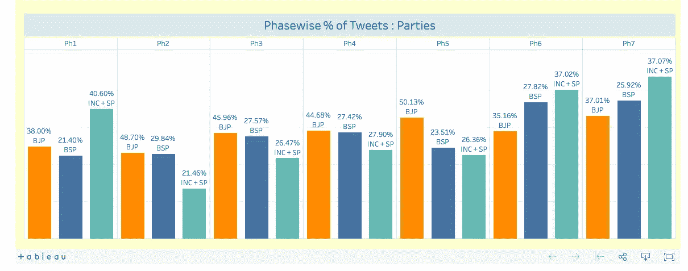
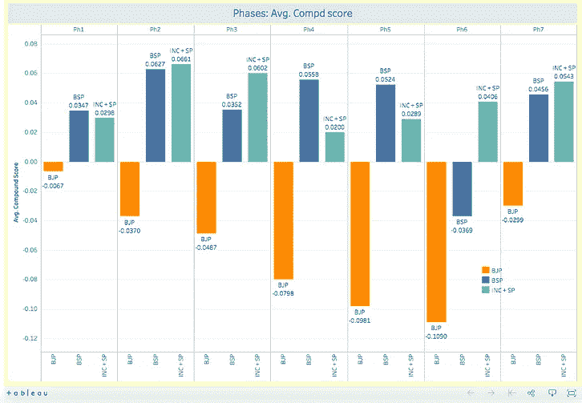

# 作为产品的人工智能>>作为技术的人工智能

> 原文：<https://medium.com/hackernoon/ai-as-a-product-ai-as-a-technology-7007486ed7be>

## 但这两者是一样的，不是吗？


You can call it a technology, not a product. (Thanks [Jacques Van Blokland](https://medium.com/u/9911b39dde50?source=post_page-----7007486ed7be--------------------------------))

不久前，我的几个朋友开发了一个时尚的情绪分析工具。该工具访问围绕某些关键词的推文流，它可以告诉你推文的语气、方向和情绪——以及这些推文或推文风暴产生的影响。这种系统在过去也存在过，但是，是的，我看过他们的系统，我不得不说，它的分析比我过去见过的任何其他工具都更强大、更稳健、更准确。整洁，对不对？也许吧。要是他们能回答我一个问题就好了——那又怎样？？



Cool cool cool… One question — What does any of it mean?

总的来说，我喜欢产品。产品简单。就像蜉蝣一样，它们有一个单一的目的，好的产品能很好地实现这个功能。


This is a Mayfly. Did you know that possibly the only reason a Mayfly has to exist is to reproduce? (Adults do not feed, and have only vestigial mouthparts, and their digestive systems are filled with air.)

就像蜉蝣一样，产品必须有一个真正定义好的、非常独特的功能，这必须是你一看到产品就明白的第一件事。如果你的产品缺少这一点，那么你需要重新思考产品模型。

回到我朋友建立的情绪分析系统，我的问题不是它的有效性或准确性，而是我不知道它如何帮助我做生意？

所以，我就是从这个开始的。我问了他们这个问题，他们给了我一个可以称之为满意的答案。但是现在，我有了一个新的问题陈述。为什么他们需要向我解释？通过浏览系统本身难道不应该很明显吗？

你会注意到我一直称之为系统。因为在我看来，事实就是如此。它是一个系统，一种技术应用，融合了数据科学、机器学习和内容提要。肯定是**不是产品**！如果你没有产品，很可能你也不会有消费者。

产品，正如我前面提到的，本质上需要直观。产品是用来传递价值的。它们旨在解决瓶颈。产品需要承载它们所能提供的所有商业价值。这才是产品有用的原因。这就是推动产品采用的因素。这才是主流。

在我看来，他们的系统错过了这些。它可能在离成为一个产品只有一步之遥的时候停止了。也许只是一个，但可能是最关键的一个。

## 所有科技产品的问题是

这是我刚刚强调的，可能是任何技术系统的最大问题，包括那些基于人工智能和机器学习的系统。我们需要理解并尊重这样一个事实:在我们非常有价值的*系统背后有一个完善的技术并不一定能使它成为一个产品。*

*看看你在业务中使用的任何产品——无论是谷歌分析，脸书广告经理，谷歌广告词。让它们如此有意义的是它们有多强大，以及它们给我们的业务增加了多少价值。但是让我们如此广泛地使用它们的是它们背后的简单和易用性。如果目标受众不喜欢脸书广告管理器，你会使用它吗？大概不会；你肯定会对这个系统的崩溃感到愤怒。但是，如果受众细分工具不够直观和简单，还会有那么多人使用它吗？肯定不是！*

> *以一种可用和直观的方式展示一个产品几乎和这个产品做它应该做的事情一样重要。*

## *学术和商业应用是不同的*

*在人工智能发挥作用的大部分时间里，它被限制在学术领域。人们会发表关于它的研究论文，令人惊叹的计算机模拟被创造出来。因此，其中很多内容是面向学术受众的。*

*现在，人工智能已经从纯粹的学术转向在商业世界中寻找应用。这完全改变了观众的形象。产品需要足够简单和直观，让每个人都能使用。产品赋予的价值应该与商业目标直接一致。如果你不确定任何企业的商业目标是什么，那就从基础做起——增加收入、降低成本、降低人均成本、降低每秒成本。)*

*大企业每天每小时都在产生万亿字节的数据，更有效地处理这些数据并以可用的方式呈现这些数据的需求是人工智能和机器学习从学术界到商业界的这一重大转变背后的原因。*

*意识到机器学习在业务流程中的应用不可避免地会出现，大型科技公司甚至开始发布越来越多的开源包来帮助初创公司和个人开发者。现在，开发人员可以更快地构建基于深度学习的产品，而不必像世界上的 IBM 那样投资数百万美元进行研究。*

*结果呢？我们看到越来越多的初创公司声称正在围绕深度学习开发产品。但是，只要他们不能理解技术产品和技术包/系统之间的区别，这些初创公司中的许多人就无法看到他们理应得到的采用。*

*你在忙什么？你是在研究一些很棒的技术，还是在开发一种人们会排队购买的产品？我真的希望你现在明白这两者的区别。*

# *今天到此为止；明天见！*

**

```
*I am Abhishek. I am here... there.... Everywhere...[**Medium**](/@abyshake) **|** [**Twitter**](http://twitter.com/@abyshake) **|** [**Facebook**](http://facebook.com/abyshake) **|** [**Quora**](http://bit.ly/abyshake) **|** [**LinkedIn**](http://in.linkedin.com/in/abyshake) **|** [**E-mail**](mailto:mail@abyshake.com)*
```

*[](https://upscri.be/a5ccb9/)

**Click here to get the best scoop on marketing and business strategy***