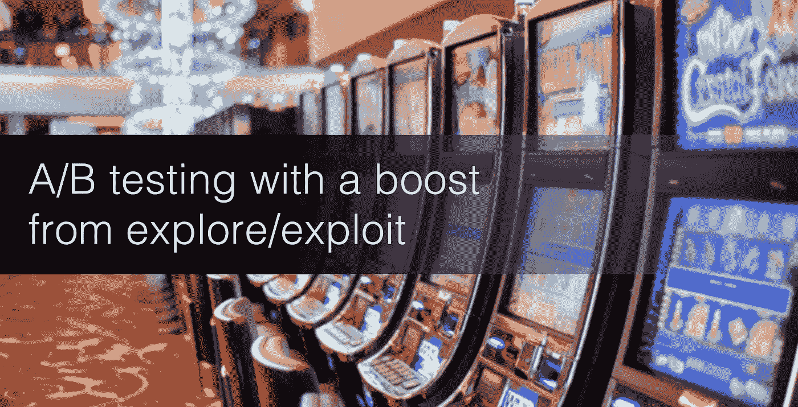
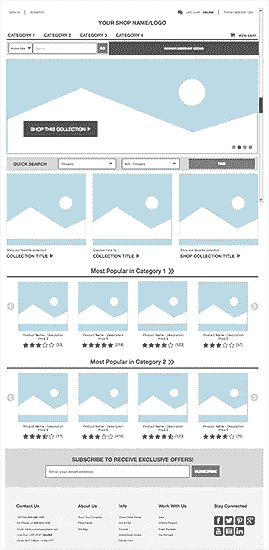

# 使用人工智能作为你实验设计的补充

> 原文：<https://medium.com/hackernoon/ai-as-complement-to-a-b-test-design-e8f4b5e28d92>

分割测试的实践和科学由来已久，仍然是数字属性中微观和宏观优化的标准，但我们统称为*人工智能*的新贵将改变这种说法。机器[学习](https://hackernoon.com/tagged/learning)将如何增强我们交付最有利可图、令客户满意的体验的能力？

**A/B 测试的高失败率**
近 80%的 A/B 测试变化未能为用户和[业务](https://hackernoon.com/tagged/business)成果提供有意义的、积极的结果。来自全球数十万个数字实验的冷酷无情的事实。这促使我们共同快速思考和行动，通过低成本、高影响力的实验来降低全球失败率。我们变得聪明了，知道在哪里、如何以及向谁提供体验，结果，成功率增加了，工作满意度飙升，我们可以活到下一天去测试。

> 但是，是否有另一种方法来保持 A/B 测试者对积极变化的渴望，同时降低每次成功经验交付的成本？

进入机器。有了人工智能的帮助，随着时间的推移，通过机器学习优化，多种设计叙事和数十种创意资产可以同时存在和呼吸。

**减少运气的影响**
A/B 测试依靠扎实的用户研究、历史数据和强大的设计、产品和技术直觉，形成可以用现场观众测试的假设。但最终，找到下一个改变游戏规则的观众或创意还是有很大的运气成分的。

有了 AI 作为增强，你的 A/B 测试现在可以围绕更大的框架和元假设，而机器学习则随着时间的推移进行探索，微观测量内容交付和 UX 优化。测试人员现在可以自由地处理更大的问题，把优化留给机器。

More than 1,000,000 total combinations

**理解复杂性**
举个例子来说明。我的网站在主页上有三个主要区域的 10 个创意资产。10 个样本点(n)和每个样本点(r)的 4 个适度变化，总共有超过 **1，000，000 个**组合可供选择。再加上可互换的 UX 变奏曲，你就明白了。

我没有让一波又一波最优秀的人来解决这个优化问题，而是选择核心指标，包括正面和负面指标，衡量期望的结果(增加利润和减少放弃)，并让进化算法来确定队列和位置。最终结果是一种令人难以置信的快速探索/利用方法，其数学会让除了最坚定的 A/B 测试从业者之外的所有人哭叔叔。

机器学习还擅长观察价值流中的微小变化，以便在正确的时间将正确的信息(资产)带给正确的访问者。及时、有背景、相关。

**首先，我们可以用人工智能来建模:**

*   针对代码和内容的设备类型和浏览器优化
*   数字肢体语言，包括悬停、滚动、移动按键
*   具有下次点击优化的全流程优化
*   先前访问的历史消耗
*   我们可能无法直接观察到的微观互动模式

**打造自己的**
已经出现了几个现成的系统来挖掘这个 21 世纪的金矿，包括 Sentient Ascend、Dynamic Yield、Conductrics、Monetate 等。一个你不喜欢的供应商？许多人结合数据收集、高度可用的数据库和推荐引擎(如 Python、PostgreSQL、H2O.ai)建立了自己的网站。

随着市场迅速转向智能体验交付，是时候用人工智能提升你的 A/B 测试游戏，并提高你的数字体验的积极变化率了。