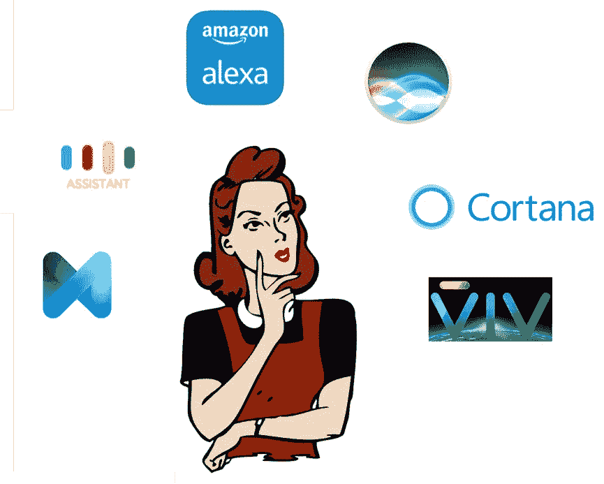
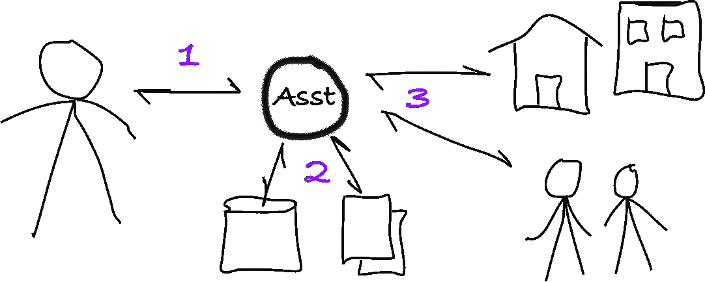
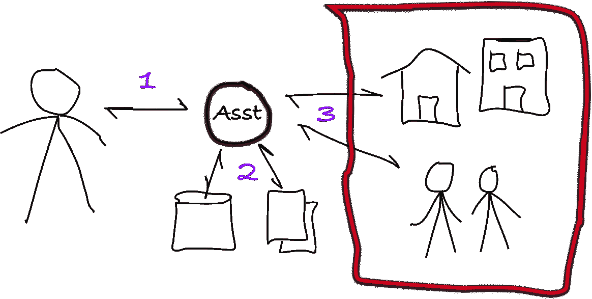

# 人工智能助手和最后一公里问题

> 原文：<https://medium.com/hackernoon/ai-assistants-the-last-mile-problem-b995c5aa7e37>

**五年后**，你将不会因为手机的拍照能力、外观时尚或可折叠显示屏而购买手机。

事实上，你不会买一部“手机”。你将雇佣一名[数字](https://hackernoon.com/tagged/digital)助理。

通过耳机、口袋里的平板玻璃(“电话”)和汽车里的助手。

# 一个好的助理应该怎么做？

比方说，你雇了一个真正的，有血有肉的人类助手。假设她叫艾米。你会如何与艾米互动？

> 艾米，我想这个月去看我的牙医。让我进去。

或者

> 艾米，去纽约的话，你能让我们去 Airbnb 而不是旅馆吗？

甚至是这个

> 艾米，你能为吉尔的生日找个好地方吃饭吗？

这些看似简单的任务对数字助理来说都非常复杂。它需要多层上下文和第三方交互。

# 完成工作

你的助手，不管是人还是数字，都需要做三件复杂的事情，每件事情的难度都不一样。

1.  **理解语言:**你的助手需要理解你所说的话。
2.  **寻找背景**:你的助手需要“知道”你的牙医是谁，并且“为了纽约”指的是你即将到来的纽约之行。你的助理需要进入你的电子邮件、日历和记录中，找到并记住关于你的事情。
3.  **完成工作**:你的助手需要联系你的牙医、你的 Airbnb 房东或一家餐馆，为你预订牙根管治疗，为你找一个住处或靠窗的完美双人桌。

**工作**是**最后一公里**。

# 最后一英里问题

自然语言理解的指数级提高将会解决(1)。你的助手将能够(或多或少)理解你在说什么。

日历、电子邮件和其他个人信息已经可以在数字仓库中找到。这些存储库提供了对数字助理的不同级别的访问。这处理(2)的数据访问部分。

现在，毫无疑问，“上下文”是很难的，确定和维护多层上下文是非常复杂的，但它将在算法上得到解决。

这就把我们带到了最后一英里:完成工作

艾米将如何与我的牙医“交谈”,协商预约并为我预约？

艾米将如何在我最喜欢的餐厅设计出最完美的靠窗桌子？

大多数中小型企业在与客户互动时都是模拟/人工的。

我们能期待 AI 助手与人类进行最后一英里的对话吗？

至少可以说，理解人类语音以确定意图是很困难的，但生成类似人类的语音以与人类进行交流则要复杂得多。

最后一英里的复杂性不是来自算法的复杂性，而是来自让各种各样的行动者与像 AI 助手这样的数字实体进行交互。

# 处理最后一英里

像诊所和餐馆这样的企业将需要一个纯数字、非结构化的界面来执行数字助理的任务。

今天，一个企业有一个电话号码(人机界面)，电子邮件(人机界面)，传真(人机界面)。所有这些与客户的接口都是由人操作的，因此受到人的工作条件的限制。

是的，企业有网站，但网站不是数字助理的好界面。大多数企业没有你可以用来处理任务的网站。

最好的数字接口将是能够以纯文本形式接受查询和命令，并提供响应或执行动作的接口。这样一个纯非结构化的数字界面将会是一个**聊天机器人**。

一名牙医可以部署一个[聊天机器人](https://hackernoon.com/tagged/chat-bot)，与她的日程安排系统和患者记录进行交互。

零售商可以有一个聊天机器人，连接到他们的供应链系统，并回答有关运输时间的查询。

餐馆可以有一个机器人来响应预订和特价菜及菜单信息的查询。

利用这种代表商业的数字代理，数字个人助理将只需要发现接口。然后，它可以发出文本命令来执行任务。

数字代理之间的文本对话可以免除人类对话的“精确”开销，并快速完成工作。

助手们来了。

但是助手们将需要商务聊天机器人**带他们走完最后一英里。**