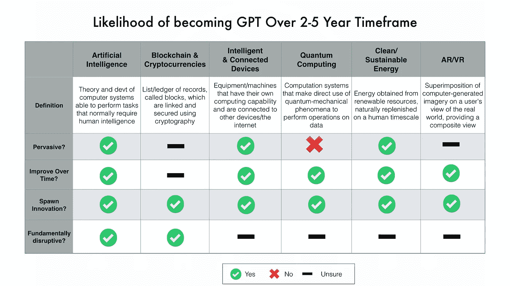
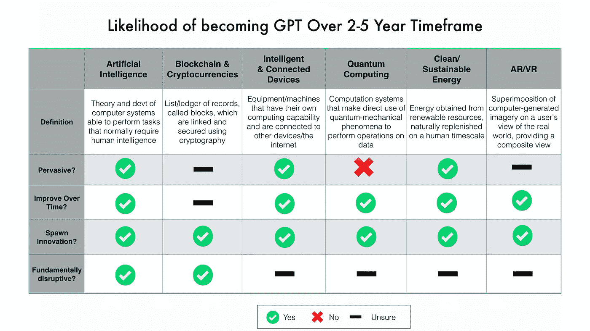

# AI、区块链、AR 和/或 VR 会成为通用技术吗？

> 原文：<https://medium.com/hackernoon/ai-blockchain-ar-vr-etc-which-one-is-a-general-purpose-technology-9b5510ca25e3>

关于颠覆性技术的噪音震耳欲聋；[首次发行硬币(ico)创造出的密码百万富翁的速度甚至让政府担心](https://finance.yahoo.com/news/market-snapshot-bitcoin-prices-plunge-153119023.html)、[大脑+机器接口](https://medicalxpress.com/news/2017-09-biomedical-human-brain-internet-real.html)和[你的脸取代了你的指纹/密码](https://www.wired.com/story/apples-faceid-could-be-a-powerful-tool-for-mass-spying/)。这些以及其他一些命题，让我们看起来生活在一个发展速度超出我们大多数人适应能力的世界。但是，这些技术中的哪一项会超越宣传，真正大规模改变我们的生活呢？这些技术中哪一个将是通用的[技术](https://hackernoon.com/tagged/technology) (GPT)。

## 什么是通用技术(GPT)？

为了评估上述问题，我决定从通用技术(GPT)的角度来看待这些技术。[**GPT 是那些影响经济增长、改变家庭生活和企业经营方式的技术**](http://amzn.to/2x80Wdi) 。我很快想到的例子有[蒸汽、电力(我认为是第一)、内燃机、计算机和互联网](https://www.economist.com/blogs/freeexchange/2012/04/general-purpose-technologies)。我还会提供电话服务。这些技术从根本上影响了我们的生活方式，扩展了我们的生活(身体和情感)，建设了我们的城市，并改变了我们与周围世界的互动方式。根据 Bresnahan 和 Trajtenberg 的观点，GPT 还具有 [3 个基本特征或特性](http://econpapers.repec.org/article/eeeeconom/v_3a65_3ay_3a1995_3ai_3a1_3ap_3a83-108.htm)

1.  GPT 无处不在，扩散到大多数部门
2.  GPTs **会随着时间的推移而改进**,并且会不断降低用户的成本
3.  GPTs **催生创新**让发明和生产新产品或新工艺变得更加容易。

有一个关于生产率增长作为 GPTs 特征的讨论。这是一个有分歧的话题，因为根据对生产率衡量标准的投入，它是产品 GPT 还是过程 GPT？)、你所订阅的经济学院，以及考虑的时间框架，并不是所有的 GPT 都能提供生产力的提升。但是他们仍然被认为是 GPT。人们还认识到，一些全球生产性技术转让提高了之前全球生产性技术转让的生产率收益。例如，电气化改善了 GPT 的交通运输。

出于我们自己的目的，虽然这 3 个广泛的特性或特征可以应用于任何 GPT，但我们将通过添加第 4 个(我建议使用重要的过滤器)特性来进一步过滤

**4。GPT 是颠覆性的还是基础性的**？电力取代了之前的照明、机械化和加工技术。它也是我们今天认为绝对必要的许多 GPT 的基础(电话和互联网是没有电气化就不会存在的两个 GPT)。有什么新技术是这种基础性的吗？尤其是在未来 2-5 年内

根据上面的分析，最有可能的 GPT 是人工智能。它已经被应用在我们的购物建议中，公司已经在使用 [*智能代理来检测恶意软件，防止洗钱，并在新加坡的一家保险公司自动化索赔过程。就像电力一样，所有其他现在被大肆宣传的技术只有在人工智能的帮助下才能真正实现其潜力。这就是为什么大多数了解正在发生的事情的人(老实说，有些人不了解)都专注于这种特殊的技术。*](https://hbr.org/cover-story/2017/07/the-business-of-artificial-intelligence)

人工智能可能是一种选择，这是有道理的；与可再生能源相比，我们需要更高的能源效率，增强现实和虚拟现实对我们的影响将小于从收音机到电视的转变，联网设备仍然(基本上)是设备，区块链/加密货币的不可信承诺要求我们首先信任底层系统。

虽然在这一点上人工智能的宣传远远超过了真正的能力，但正如凯文·凯利在这篇精彩的文章中正确指出的那样，人工智能将改变我们所知的 T2 商业。因为，如果它实现了作为 GPT 的潜力，正如下面引用的研究人员所说，它将会是一段颠簸的旅程…

> [*总体而言，证据清楚地支持了这样一种观点，即技术进步是不均衡的，它确实需要周期性的全球生产总值的到来，这些全球生产总值在早期带来动荡和较低的增长，在后期带来较高的增长和繁荣*](https://www.google.com/url?sa=t&rct=j&q=&esrc=s&source=web&cd=1&cad=rja&uact=8&ved=0ahUKEwjG8IKS1afWAhVBjVQKHc8KDr0QFggrMAA&url=http%3A%2F%2Fwww.nber.org%2Fpapers%2Fw11093&usg=AFQjCNHswcpBWRZOTK6PlpgDLgB6zpewdw)

**请分享、点赞、推文。**

*[*你可以表明你对“雷达”感兴趣，这是一个类似彭博码头的平台，用于监控私人公司的创新和战略。*](https://goo.gl/forms/4S8dS3Xdp5g5xl7u1) *Asha Labs 为公用事业行业的高管提供创新战略咨询。**

**报名参加* [*博学月刊*](https://www.getrevue.co/profile/seyifabo?utm_campaign=Issue&utm_content=forwarded&utm_medium=email&utm_source=Seyi+Fabode)*——如果你已经读到这里，我打赌你会爱上它。* [***你可以在亚马逊***](https://www.amazon.com/dp/B072875DFJ) *上买我的书《抗碎网格》。**