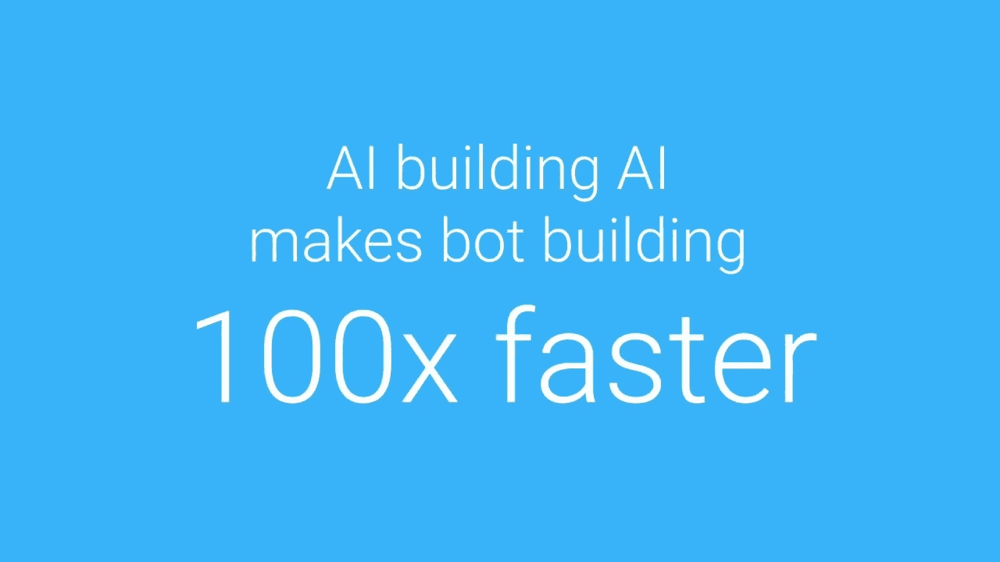
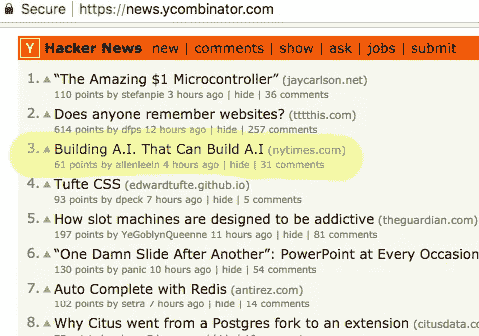
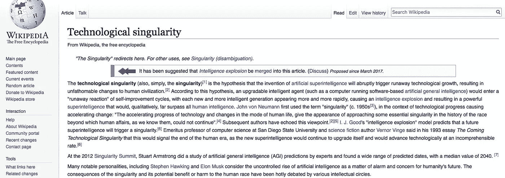
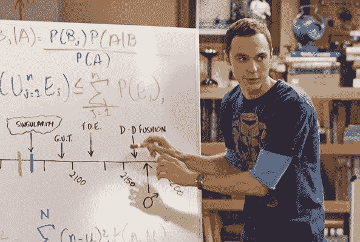

# 人工智能建筑人工智能——当今最新的热门话题。

> 原文：<https://medium.com/hackernoon/ai-building-ai-the-latest-buzz-today-867469648eb0>

## “谷歌研究人员正在教他们的人工智能构建自己的、更强大的人工智能”…嗯，好吧！



Photo Credit, [Recast.AI Youtube](https://www.youtube.com/watch?v=YXwoyidZm64)

因此，在过去的几个小时里，推特上出现了一系列提到《纽约时报》一篇文章的推文。

[](https://www.nytimes.com/2017/11/05/technology/machine-learning-artificial-intelligence-ai.html) [## 建造人工智能，可以建造人工智能。

### 从可以识别人脸的智能手机应用程序到可以自动驾驶的汽车，科技行业承诺了一切

www.nytimes.com](https://www.nytimes.com/2017/11/05/technology/machine-learning-artificial-intelligence-ai.html) 

很快，这个消息就传到了每个人都去谈论有趣事情的地方——Reddit。



It is the third item on HackerNews.

# 那么，这是怎么回事呢？

这一切都是为了实现人工智能中的奇点。



The red line is where Sheldon dies, and the blue one at which he can achieve Singularity — essentially missing it by — “This Much”

每当有人谈到奇点，我就觉得有必要提一下《生活大爆炸》(Big Bang Theory)中的一集，在这一集里，谢尔登绘制了他将错过多少时间来实现奇点——或者在一个他能够将自己的思想、知识和心智能力转移到一台机器的地方，本质上实现永生。

> “……差这么多……”

总之。技术奇点是围绕自学型人工智能的一切。创造一个能够自我学习的人工智能系统，从而进入自我改进周期的模式，这将最终导致人类思维无法理解的技术进步。

> 另一方面，科技奇点正是斯蒂芬·霍金、埃隆·马斯克等人不断警告我们的。

今年早些时候，在谷歌的 I/O 开发者大会上，谷歌首席执行官桑德尔·皮帅强调了谷歌的 AutoML 项目，即自动化设计深度学习过程——直到选择正确的神经网络架构。

这是机器学习专家在日常生活中使用的相同的“试错”方法，只是现在有一个人工智能可以做到这一点。一个能够以更快的速度、更高的效率做事的公司，一个不受偏见限制的公司。

> "….结果不仅媲美或超过了人类设计的最佳架构的性能，而且该系统做出了一些非传统的选择，研究人员此前认为这些选择不适合这些类型的任务……”
> 
> —来源:[奇点枢纽](https://singularityhub.com/2017/05/31/googles-ai-building-ai-is-a-step-toward-self-improving-ai/)

虽然我不知道为什么今天会流传到这种程度，但谷歌、脸书和其他公司在这方面的发展肯定值得关注。谷歌可能在这方面处于一定的领先地位(*根据一些估计，全球现有的 10，000 多名机器学习专家中有很大一部分受雇于谷歌*)。

# 为什么重要？

基础经济学——需求/供给不匹配。

如果你曾经试图雇佣一名数据科学家，你会意识到找到优质资源是多么困难。那些符合要求的可能会超出你对这个角色的预算。对于各种形式和规模的公司来说，这都是一个现实问题。现在，世界各地的谷歌和 Facebooks 可能拥有雄厚的资金，可以保护他们免受财务影响的影响，但即使是他们，也很难找到优质资源来加入团队。在食物链的顶端也有太多的竞争。这正是价值所在。

掌握像深度学习这样的技能需要数年的研究和无数小时的生产性工作，因此需求/供给平衡的差距不太可能很快消失。这就是为什么我们看到越来越多的工具和系统推出，让你能够构建基于人工智能的程序，无论是聊天机器人还是分析平台。

# 为什么谷歌、FACEBOOK、微软都在做？

首先，显然他们的意图并不全是利他的。他们是企业，企业基于商业目标进行强有力的押注没有错。

你在这些公司的任何产品上添加一个人工通用智能，你会发现非常了不起。更容易使用的产品，需要越来越少的“T0”专家的干预，以及可以为最终消费者带来更多价值的产品。为什么这些公司不想尽早涉足这一领域。

酪暂时让我们忽略一个自我学习、自我改进、有点自我创造的人工智能对他们业务的影响。让我们从纯学术的角度来看，这些企业开放了像 AutoML 这样的系统供每个人使用。这对他们有什么帮助？数以百万计的数据点和互动手段，让他们微调和训练他们的算法。对于他们投入的所有工作，还有什么比这更好的压力测试呢？

# 所以。一个构建 AI 的 AI？

机器学习不仅仅是编写一个高效的算法，做人们期望它做的事情。问题是在你碰到那个“*高效的*算法之前。这涉及到很多直觉，在处理了大量数据后，算法会随着时间的推移而演变和完善——找出“*可行的方法需要做很多工作。*

一个`**intelligent AI that builds AI**`基本上就是你把这部分过程交给一台机器。你建立一个算法的唯一目的是分析其他算法，并在这个过程中找出哪些方法可行，哪些不可行。目标？以消除基础机器学习算法开发中的大量艰苦工作和痛苦。圣杯可能是你告诉这个人工智能你正在寻找的人工智能系统是什么，它应该做什么，人工智能为你建立一个算法来做这些。

这样做可能吗？是的。谷歌的 AutoML 已经成功开发了一种算法，可以比机器学习专家自己设计的算法更精确地识别图像中的对象。

我们距离人工智能可以根据你的需要为你提供机器学习系统的阶段还有点太远，但这似乎是我们努力的方向。

激动人心的时刻即将到来。

# 今天到此为止；明天见！


```
I am Abhishek. I am here... there.... Everywhere...[**Medium**](/@abyshake) **|** [**Twitter**](http://twitter.com/@abyshake) **|** [**Facebook**](http://facebook.com/abyshake) **|** [**Quora**](http://bit.ly/abyshake) **|** [**LinkedIn**](http://in.linkedin.com/in/abyshake) **|** [**E-mail**](mailto:mail@abyshake.com)
```

[](https://upscri.be/a5ccb9/)

Click here to join the mailing list.

## 此外，我想我必须指出——这并不是一个真正的“新”消息

这已经准备了很长时间，也受到了媒体的广泛关注。事情就是这样

1.  **2017 年 5 月 31 日**——[谷歌的人工智能建设人工智能是迈向自我完善人工智能的一步](https://singularityhub.com/2017/05/31/googles-ai-building-ai-is-a-step-toward-self-improving-ai/)
2.  **2017 年 5 月 19 日**——[谷歌研究人员正在教他们的人工智能构建自己的、更强大的人工智能](https://sciencealert.com/google-is-improving-its-artificial-intelligence-with-artificial-intelligence)
3.  **2017 年 1 月 18 日**——[AI 软件学习制作 AI 软件](https://www.technologyreview.com/s/603381/ai-software-learns-to-make-ai-software/)
4.  **2016 年 5 月 6 日**——[造 AI 难——所以脸书在造 AI 造 AI](https://www.wired.com/2016/05/facebook-trying-create-ai-can-create-ai/)
5.  **2013 年 1 月 27 日**——[利用人工智能编写自我修改/改进程序](http://www.primaryobjects.com/2013/01/27/using-artificial-intelligence-to-write-self-modifying-improving-programs/)