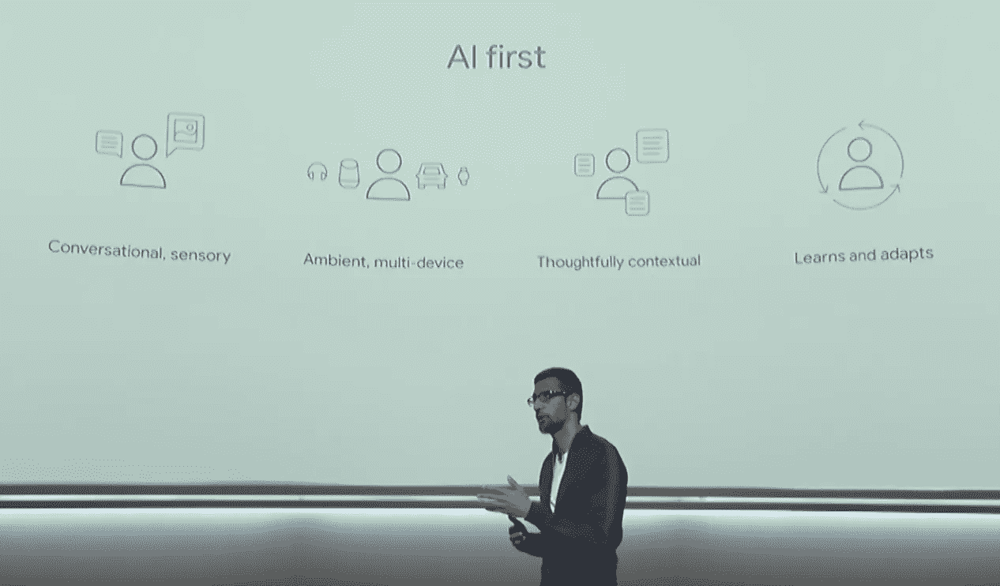
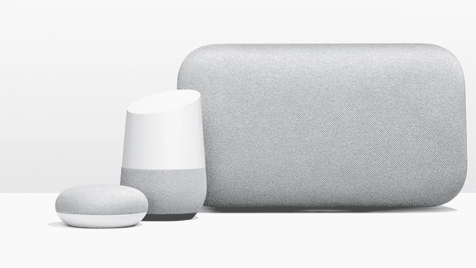
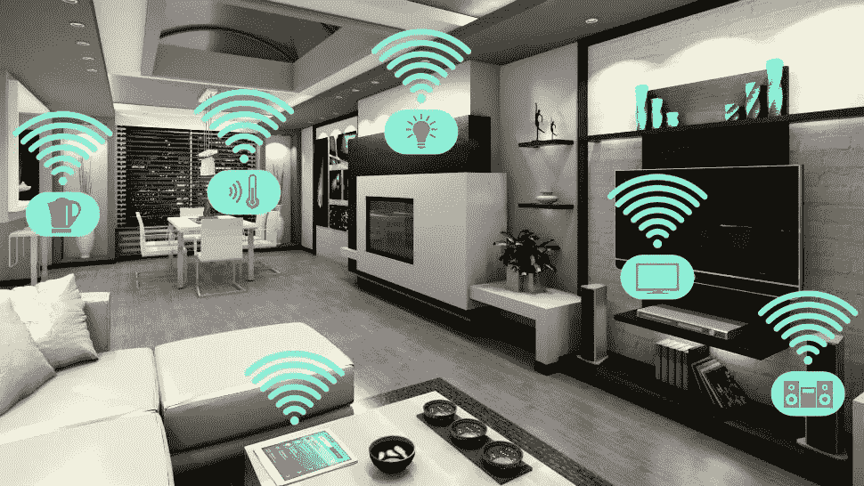

# 人工智能默认:消费产品的未来

> 原文：<https://medium.com/hackernoon/ai-by-default-the-future-of-consumer-products-787273933362>

在谷歌 2017 年 10 月 4 日发布的产品公告中，他们公开押注于他们认为的计算未来:人工智能。这并不奇怪。每个主要的[科技](https://hackernoon.com/tagged/technology)公司、汽车制造商和政府都宣布了他们自己的人工智能优先事项。但谷歌今天所做的是向我们展示了人工智能将如何集成到我们每天使用的物体中的未来。

Sundar Pichai speaking at Made by Google

从推出的产品范围来看——两款智能扬声器、两款智能手机、头戴式耳机、一款 Chromebook 和一款夹式相机——很明显，谷歌正在着眼于这样一个未来，即人工智能不仅无处不在，而且无处不在。记住，这家公司在 2014 年收购了智能恒温器制造商 [nest](https://nest.com/) 。从那时起，nest 将其产品线从烟雾探测器扩展到可以使用计算机视觉识别人的联网视频门铃。

从那次收购到今天宣布的产品，很明显谷歌的目标是无处不在的人工智能技术。但是这个不是原创。谷歌、亚马逊、苹果、三星都在无处不在的人工智能技术市场开拓空间。关于谷歌的方法，最能说明问题的不是有什么，而是缺少什么。

两款产品脱颖而出:谷歌 Home Max & Mini

Google Home Max and Mini shown next to the original Google Home

注意到它们有什么特别之处了吗——一个与众不同的特征或“谷歌”美学？没错。没有了。事实上，如果大多数人在朋友家看到这些，他们可能甚至不知道它们是谷歌的产品。

> 但是*那个*才是重点。Max 和 Mini 是*只是*音箱。

它们可以无缝地融入你的空间，也可以轻松地成为任何其他品牌。除了四个白点之外，谷歌品牌的缺失揭示了谷歌对未来技术的想法。

> 每个对象都应该连接到互联网。
> 
> 每个物体都应该有人工智能。
> 
> 每个对象都应该正常工作。

谷歌不希望我们将扬声器、门铃或可夹式相机视为科技产品。他们想改变我们的思维模式，认为人工智能门铃是成为门铃的先决条件。如果一个门铃没有人工智能，它就不再是真正的门铃了。如果你的音箱不知道你的音乐品味或者你无法与之对话，那它还算是音箱吗？

这是谷歌对未来的信念。他们试图重新定义消费品的含义。每个产品默认状态都应该是智能的。这种想法通过他们简单、干净的设计巧妙地传达出来。坦白地说，这很像苹果。

既然谷歌已经展示了未来的框架，其他公司很可能会效仿。无处不在和人工智能将成为我们生活中每个物体的默认设置。这是一个令人兴奋的未来。

