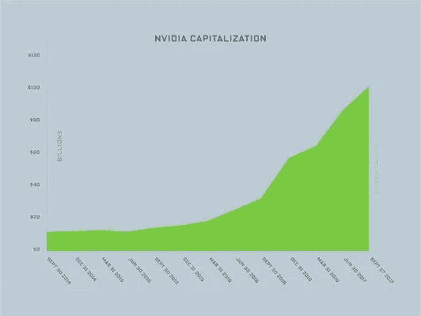

# 人工智能和深度学习最新进展:10 月更新，第 3 部分

> 原文：<https://medium.com/hackernoon/ai-deep-learning-update-colaboratory-openfermion-micromouse-october-update-part-3-6a284fcaabe5>

## 分享一些关于深度学习的最新研究、公告和资源。

*由* [*萨克*](https://www.linkedin.com/in/isaacmadan) *(* [*邮箱*](mailto:isaac@venrock.com) *)*

继续我们的深度学习系列更新，我们收集了一些自我们上一篇帖子以来出现的令人敬畏的资源。如果你错过了，你可以在这里找到所有过去的更新。和往常一样，这个列表并不全面，所以如果有我们应该添加的东西，或者如果你有兴趣进一步讨论这个领域，请让我们知道。如果你是一名机器学习从业者或学生，在这里 加入我们的人才网 [**，获得绝佳的机器学习机会。**](https://docs.google.com/forms/d/e/1FAIpQLScSLc-772-6rsumQ2fCGqzNMjkqtpE2h3yIBLh5jgwEP-g0gA/viewform)

# 研究和公告

[**谷歌研究合作实验室**](https://colab.research.google.com/notebook#fileId=/v2/external/notebooks/welcome.ipynb&forceEdit=true&sandboxMode=true&scrollTo=9J7p406abzgl) 。 *Colaboratory 是一个数据分析工具，它将文本、代码和代码输出合并到一个协作文档中。谷歌发布自己的云笔记本平台——试试吧。*

[**OpenFermion:谷歌**](https://github.com/quantumlib/OpenFermion) 量子计算机的电子结构包。 *OpenFermion 是一项开源工作，用于编译和分析量子算法，以模拟费米系统，包括量子化学。在其他功能中，当前版本的特点是数据结构和工具，用于获得和操纵费米子和量子位哈密顿量的表示。*原文 [**此处**](https://arxiv.org/abs/1710.07629) 。

安大略大学米尔斯*等人*的 [**深度学习和薛定谔方程**](https://journals.aps.org/pra/abstract/10.1103/PhysRevA.96.042113) 。我们已经训练了一个深度(卷积)神经网络来预测四类受限二维静电势中电子的基态能量。

[**英伟达深度学习加速器**](http://nvdla.org/) 。英伟达开源其深度学习芯片架构，以扩大其作为物联网标准的采用范围。*NVIDIA 深度学习加速器(NVDLA)是一个免费的开放架构，它促进了设计深度学习推理加速器的标准方法。*

[**微鼠大赛第一名视频**](https://www.youtube.com/watch?v=q_TfclLzKAU) 。 *Micromouse 是小型机器鼠解决一个 16x16 迷宫的活动*(维基百科)。观看第一名得主 Ning6A1 的 BengKiat Ng 解决迷宫(Youtube 视频)。通过这篇博文，在这里 阅读更多关于比赛 [**的信息。**](http://www.micromouseonline.com/2017/10/11/taiwan-micromouse-intelligent-robot-contest-2017/)

[**神经网络 API**](https://developer.android.com/ndk/guides/neuralnetworks/index.html) 由 Google 提供。谷歌宣布面向 Android 的神经网络 API，该 API 在设备上针对机器学习模型执行，将更多人工智能带到了边缘。*Android 神经网络 API (NNAPI)是一个 Android C API，设计用于在移动设备上运行机器学习的计算密集型操作。*

[**生成性对抗网络:伦敦帝国理工学院的 Creswell *等人的综述***](https://arxiv.org/abs/1710.07035) 。*这篇综述文章的目的是为信号处理界提供一个 GANs 概述，尽可能利用熟悉的类比和概念。除了确定训练和构建 GANs 的不同方法之外，我们还指出了在它们的理论和应用中仍然存在的挑战。*

[**宣布 PlaidML:Vertex AI**](http://vertex.ai/blog/announcing-plaidml)面向每个平台的开源深度学习。开源便携式深度学习引擎。*我们的使命是让每一个人在每一种设备上都可以使用深度学习。*

# 资源、教程和数据

[**Arxiv 虚空**](https://www.arxiv-vanity.com/) 作者安德烈亚斯·扬松和本·弗什曼。一个方便的工具，使 Arxiv 学术论文像网页一样容易阅读，所以你不必阅读 PDF 版本，这是大多数 ML 论文的典型。

[**视频讲座伴随*深度学习*书**](https://www.youtube.com/channel/UCF9O8Vj-FEbRDA5DcDGz-Pg/videos) 作者阿列娜·克鲁奇科娃。Goodfellow *等人*的深度学习书籍之后的一系列精彩讲座视频。原书 [**此处**](http://www.deeplearningbook.org/) 。

[**树莓 Pi:用 OpenCV 进行深度学习对象检测**](https://www.pyimagesearch.com/2017/10/16/raspberry-pi-deep-learning-object-detection-with-opencv/) 作者 Adrian Rosebrock。演示通过 Rasberry Pi 进行近实时物体检测的教程。

[**降维:主成分分析，第一部分**](https://www.youtube.com/watch?v=ZqXnPcyIAL8) by Data4Bio。主成分分析透彻易懂的讲解(Youtube 视频)。

[**解释你的机器学习模型(或者 5 种评估特征重要性的方法)**](https://blog.clearbrain.com/posts/explaining-your-machine-learning-model-or-5-ways-to-assess-feature-importance) 由 ClearBrain。了解模型中的哪些特征、输入或变量影响了它的有效性，这对提高它的可操作性是有价值的。然而，评估特性的重要性并不简单。下面我们概述了解决特征重要性的五种方法，为了简单起见，重点是逻辑回归模型。

[**2017 年单词嵌入:趋势与未来方向**](http://ruder.io/word-embeddings-2017/ #word embeddings #natural language processing) 塞巴斯蒂安·鲁德著。*单词嵌入是自然语言处理(NLP)中一组语言建模和特征学习技术的统称，其中来自词汇表的单词或短语被映射到实数向量(维基百科)。这篇文章将关注单词嵌入的缺陷以及最近的方法是如何试图解决它们的。*

[**如何赢得数据科学竞赛:向 Coursera 的顶尖高手**](https://www.coursera.org/learn/competitive-data-science) 学习。*在本课程中，你将学会分析和有竞争力地解决此类预测建模任务。*课程刚于 10 月 23 日开始。

艾萨克·马丹。艾萨克是文洛克公司的投资者。如果你对深度学习感兴趣，或者我应该在未来的简讯中分享一些资源，我很乐意收到你的来信。如果你是机器学习从业者或学生，请在这里 加入我们的人才网 [**，获得绝佳的机器学习机会。**](https://docs.google.com/forms/d/e/1FAIpQLScSLc-772-6rsumQ2fCGqzNMjkqtpE2h3yIBLh5jgwEP-g0gA/viewform)

[**创业请求**](http://www.requestsforstartups.com) 是一份由投资者、经营者和影响者提供的创业想法&观点的时事通讯。

***请点击或点击“︎***【❤】*帮助向他人推广此作品。*

