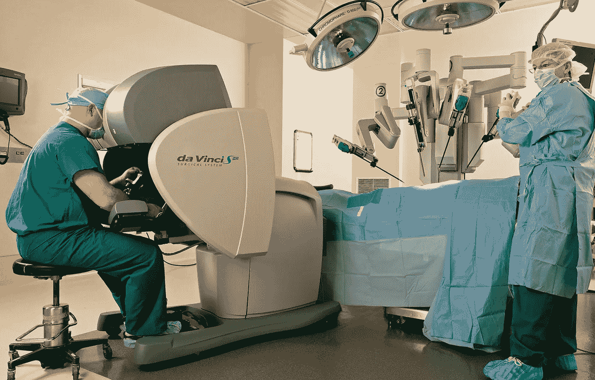
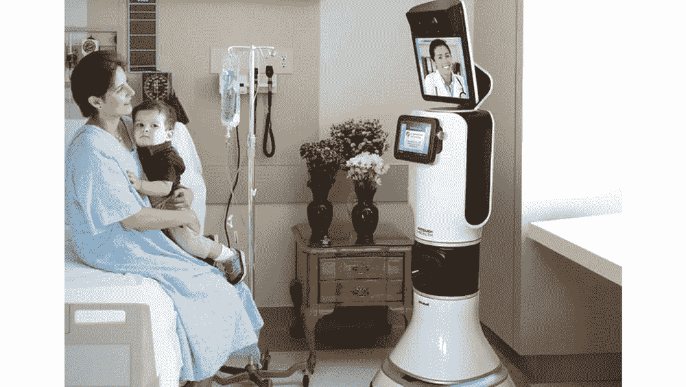

# 医学中的人工智能:医生的视角

> 原文：<https://medium.com/hackernoon/ai-in-medicine-a-physicians-perspective-c7df33339129>

有趣的是，我多么想学习，但却不在学校。 对我来说，更重要的是早点离开学校，去听多伦多大学的一场生物伦理讲座，讲的是在医学领域对人工智能的期待。这篇文章解释了我所学到的一切，以及我为什么要分享给大家。

那么，人工智能在医学上有什么特别之处，你为什么要关注它呢？

就我个人而言，我关心的是未来我愿意信任哪些类型的医生来拯救我的生命。一个有趣的事实引起了我的注意，那就是在 10 年左右的时间里，我可能会去看医生，那里挤满了比人类还多的机器人。现在我不知道我对此有什么感觉，所以我决定找出答案。

# 如今机器人是如何融入医疗领域的？

**#1。机器人辅助程序**

外科医生在机器人结构的帮助下进行手术是很常见的，它们为医生提供了速度和准确性。一些优点是:

*   对切口精度的更多控制
*   最大限度减少失血，切口基本无疤痕
*   感染风险更小的表面积
*   痛苦更少，恢复时间更快

**#2。远程医疗**

医生现在能够不受地域限制地与病人交流。基本上，通过使用电信，偏远农村地区的人口可以获得专家医疗咨询。

这个概念已经发展到引入 iRobot 和 InTouch Health 的远程医疗机器人 RP-VITA。这种新机器人基本上允许医生通过机器人的自主导航与病人互动。它以更快的速度实时处理数据，这允许医院更熟练地分配医生和护士。

这是一个展示机器人和病人互动的视频链接:[https://youtu.be/hoAPTpwkFtw](https://youtu.be/hoAPTpwkFtw)

**#3。其他方式艾在纳入医学**

*   挖掘医疗记录，以便更快地访问患者记录和数据
*   协助许多重复性的工作，有助于更好地管理时间
*   提高区分正常头痛和脑瘤症状的临床专业知识。
*   为一种常见疾病出现多种症状的患者制定个性化治疗计划
*   用于各国的药物研发和医疗保健系统分析

到目前为止，机器人在医疗领域非常有用，那么我们什么时候开始担心呢？

# 人工智能在医学上造成灾难的 3 个原因:

#1.护理差异

可悲的是，即使是医学实践也受到当今世界基于性别、种族、经济地位和地理的歧视的影响。例如，在美国，最富有的 0.001%的美国人在过去 40 年里经历了 636%的收入增长率。底层 50%人口的收入增长率接近 0。

美国一半的人口不仅收入分配不均，而且没有免费的医疗保健。这是悲剧，因为，

*   医疗援助只提供给那些付得起昂贵治疗费用的人
*   人工智能只会增加医疗费用，这将使中产阶级和下层人民难以支付医疗费用
*   像我们世界上大多数其他公司一样，人工智能公司通常只想提高收入，而不是为每个人提供平等的服务
*   维持一个免费的医疗保健系统对未来来说是不现实的，因为个人医疗保健的成本每年都在增加，到 2051 年，随着人工智能技术的吸收，将超过政府预算

#2.黑盒问题

**什么是黑匣子？**

它指的是复杂的电子技术，其中包含的内部机制释放的输出对用户来说过于神秘，难以理解。

我们现在有一种技术，它有一个精致的特性，叫做人工神经网络(ANN)。它的工作原理很像我们的大脑如何通过我们的神经系统处理信息。它用于模式识别和数据处理。

ANN 将能够使用医生可能无法识别的隐藏模式来发现疾病的潜在原因和解决方案。人工智能很可能会超越我们对医学研究的理解，变得超出我们的理解。这就提出了一个问题:*你会相信你的医生还是人工智能的诊断？*

**为什么这是一个问题？**

可以假设人工智能是无偏差编程的，但是由于我们无法理解人工神经网络如何做出决定，假设其结论总是正确是有风险的。被证明是这种情况的时间是:

在佛罗里达州的一所监狱里，一个人工智能系统被用来评估罪犯再次参与犯罪活动的可能性。它得出了一个独立的结论**将两个偷自行车和滑板车的年轻女孩贴上高风险和中等风险罪犯的标签，声称她们是黑人**。如需更深入的详细信息，请参考本文:[https://qz . com/1055145/ai-in-the-insight-system-to-fix-algorithm-bias-we-first-need-fix-ource/](https://qz.com/1055145/ai-in-the-prison-system-to-fix-algorithmic-bias-we-first-need-to-fix-ourselves/)

这种情况只是众多问题之一，它让我们质疑，在不知道人工智能的决策会导致解决方案的过程的情况下，我们是否能够完全信任人工智能的决策。

我们的基因组是复杂的系统。医生面临的一个问题是，当一种疾病在统计上没有在纸面上显示为真实，但在患者的生物数据上却是真实的。

人工神经网络处理可能得出与一个人的基因组生物学差异不一致的结论，这些差异在模式算法中通常是异常值。

演讲的神经外科医生达斯博士指出:

> “很多时候，我们**的直觉**现象会影响他对疾病的诊断或决策，他发现同事之间也是如此。”

无法解释的本能决定，即人工智能没有被编程可以影响医疗。**直觉非常真实，对医生也非常有用。**

#3.医生在社会中的身份

医生在社会中有两种角色，治疗者和专业人士。

*一个治疗者是:*

*   有同理心和同情心，能够治愈病人并与他们相处。

*一个专业是:*

*   逻辑推理，并在照顾病人的整个过程中保持公正。

医生必须平衡两者才能在工作中取得成功。关心病人并在犯错误时有负罪感是很重要的。一个人只会从错误中学习，对于医生来说，风险很高，所以任何错误都保证不会再发生。即使结果对患者来说是不愉快的，医生或任何护理人员总是会承受坏消息的负担，很多时候我们人类的情感允许我们关心和联系正在遭受痛苦的人。

人工智能不会因为错误而受到责备，也不会因为坏消息而感到内疚。人工智能是严格专业的，并在人类和护理人员之间创造了理解的鸿沟。信任是建立在透明的基础上的，如果一个人不能理解人工智能的推理，他或她就永远不会信任它。我们将失去人类与药物的联系，透明度将变得微不足道。到目前为止，我知道我们无法让人工智能感受到遗憾或任何人类情感。这就是人工智能不同于人类的地方。

# 有哪些重要的经验教训:

1.  通过机器人手术、远程医疗等流行实践，人工智能已经被整合到医学中。
2.  使用人工智能有风险和优势，每个人都应该尽早考虑这些问题
3.  第一个问题是，有能力或无力支付昂贵人工智能治疗的人之间存在巨大的边际差距
4.  第二个问题是人工智能算法得出结论的未知过程，以及我们是否可以相信人工智能总能给出 100%准确的诊断
5.  最后一个风险是人与医生之间关系的丧失，这会使透明度变得微不足道

我要感谢 UofT 伦理中心给我机会了解这个问题，并感谢 Sunit Das 博士的全面介绍。请在下面评论你对人工智能在医学领域是积极还是消极的看法。