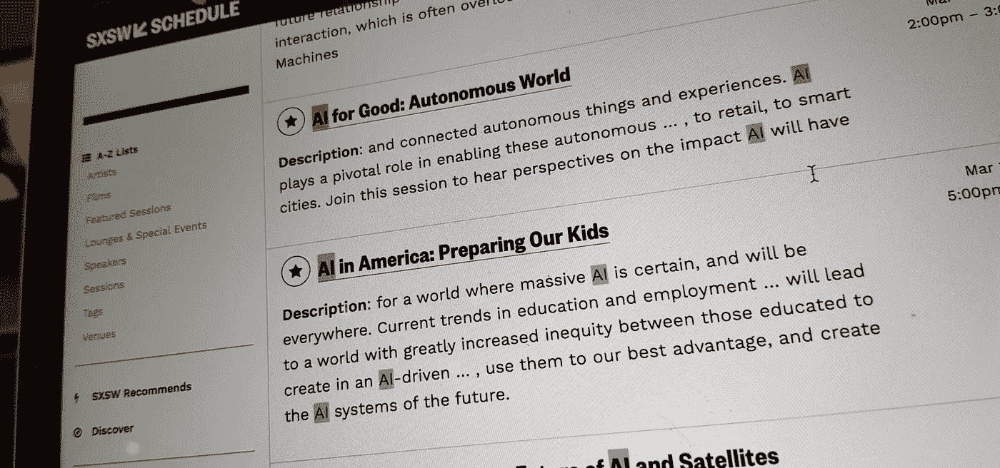
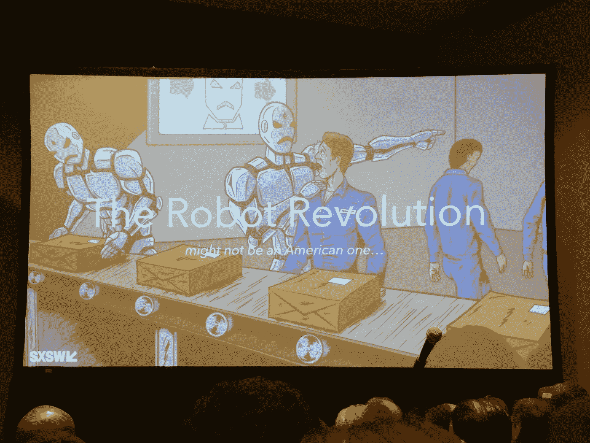

# 人工智能正在接管 SXSW——在接管世界的路上

> 原文：<https://medium.com/hackernoon/ai-is-taking-over-sxsw-on-the-way-to-take-over-the-world-bac45ddf4b8f>

## 人工智能会导致我们自相残杀，还是会让我们学会说话？以下是我回忆一个月前 SXSW 的一些想法。

SXSW 是个看浪的好地方。虽然这只是我第四年参加[大会](https://hackernoon.com/tagged/conderence)，但很明显，人工智能主题正在接管这项活动，并且很可能接管世界。大量的演讲，整整两天致力于主题本身和[现在，你应该不会对破坏机器成为死罪感到惊讶。](https://medium.com/u/818999f7d461#Government_response)

# 美国在科技领域主导地位的未来

人工智能对社会的复杂影响甚至可能在破坏美国在技术领域的整体主导地位方面发挥重要作用。如果这种转变会像预期的那样巨大，硅谷还能继续成为宇宙的中心吗？

民主可能不是人工智能的朋友，特别是如果社会的重要部分受到变化的负面影响。失业者也是选民，代表他们的利益——甚至在转变发生之前——可能会导致进程放缓。

此外，至少人工智能部署的某些方面——如无人驾驶汽车——可能也需要大量的基础设施投资，这在中国等受控社会中更容易投入，而不是美国。

在消费者采纳方面也有一些有趣的迹象。毕竟，西方消费者并不那么渴望与脸书上的聊天机器人互动，现在焦点正转向以特定任务为中心的界面。然而，据报道，人工智能聊天伙伴在亚洲正迅速获得关注。

正如奥托汽车公司的 Matt Rendal 指出的那样，美国在一些关键的硬件领域远远没有领先。中国已经错过了工业机器人的第一波浪潮:工业机器人领域最大的四家公司都不是美国公司，出口到中国的机器人数量大约是北美的四倍。

美国不应该被低估，它已经回到了过去。2000 年代中期，手机行业由芬兰的诺基亚和韩国的三星主导，然而在过去的十年里，美国的苹果和谷歌在该领域处于领先地位。

# 社会中的分歧

有序转型依赖于运转良好的社会。然而，最近的趋势指向另一个方向。美国选举前后的分歧显而易见，社交媒体为此受到了很多指责。[滤镜泡泡](https://en.wikipedia.org/wiki/Filter_bubble)都是真的。这些都是人工智能驱动的。

围绕你已经看到或喜欢的东西的社交圈和推荐让你陷入了确认偏见的恶性循环。随着时间的推移，每个人看到的世界越来越不同。然后我们突然变得惊讶——怎么会有人投票给英国退出欧盟，因为脸书到处都是投反对票的人。猜猜支持英国脱欧者的反馈是什么样的？

尽管脸书似乎最终承认存在问题，但公司外部没有人相信[马克·扎克伯格著名的 6000 字文章](https://www.facebook.com/notes/mark-zuckerberg/building-global-community/10154544292806634/)包含解决方案。无论是试图回到网上社区之前，还是给那些不信任任何看门人的人贴上假新闻的标签，看起来都不是可行的解决方案。根据泡沫破灭者克莱尔·伍德库克的说法，关键是站在别人的立场上考虑不同的观点。[你可以从看看特朗普打开推特](https://twitter.com/RobertMackey/status/804052846060732416)时看到的内容开始。

# 多元化现在是关于另一个美国

多样性一直是 SXSW 的一个大话题。每年听起来都很不一样。三年前，它主要是关于种族的。后来，女性开始主导主题。两者仍然非常相关和重要。上个月，优步的工程文化(或者说缺乏工程文化)仍然是一件大事。

基于多样性问题的一个方面——经常被搁置一旁的社会群体的代表性和包容性——今年是关于白人的。更确切地说，是关于另一个美国。选举特朗普的人。不，还没有拥抱，但有一种下沉的感觉，有人在大多数对话中失踪。

> “如果人们不喜欢你或者讨厌你，忽略他们、避开他们或者以牙还牙是很正常的。唯一真正的解决办法是去见那些讨厌你的人。”
> —[布莱恩·切斯基](https://medium.com/u/bb249e5e0d1b?source=post_page-----bac45ddf4b8f--------------------------------)，Airbnb 首席执行官

无知不是答案。认为另一方是愚蠢的，明显不如你所代表的群体，这将使我们一事无成。令我震惊的是，我们对另一个美国、对英国退欧者、对今天投票给勒庞的人是多么不屑一顾——现在许多国家都站在了另一边。不同的一方不互相交谈。就连我们友善的 Airbnb 房东也公开承认赶走了一名特朗普的支持者，她对此真的不感到羞耻。

这个问题不会消失。人工智能可能会对社会和工作产生重大影响。这些问题很可能会变得更加困难。所有这些都可以理解和解决，但如果我们通过与受影响最大的人交谈来解决这些问题，解决方案看起来会非常不同。否则，我们——技术领域的特权者——将成为问题，并面临解决方案。

> [黑客中午](http://bit.ly/Hackernoon)是黑客们下午的开始。我们是 [@AMI](http://bit.ly/atAMIatAMI) 家庭的一员。我们现在[接受投稿](http://bit.ly/hackernoonsubmission)并乐意[讨论广告&赞助](mailto:partners@amipublications.com)机会。
> 
> 如果你喜欢这个故事，我们推荐你阅读我们的[最新科技故事](http://bit.ly/hackernoonlatestt)和[趋势科技故事](https://hackernoon.com/trending)。直到下一次，不要把世界的现实想当然！

