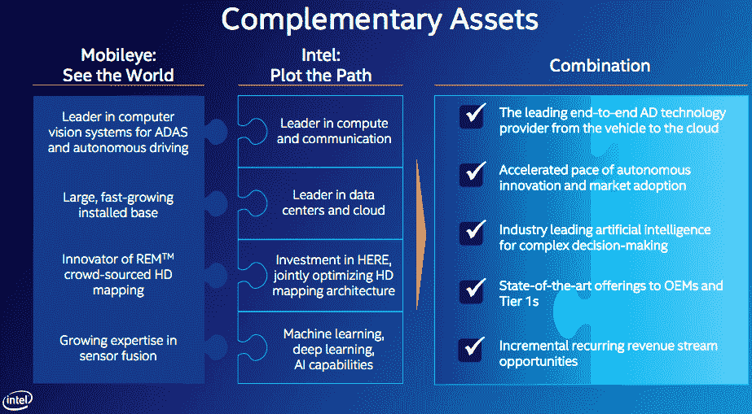

# 人工智能和机器学习新闻

> 原文：<https://medium.com/hackernoon/ai-newsletter-issue18-6dfd07ddedeb>

## 更多人工智能新闻和分析，[在这里注册我的时事通讯](http://www.nathan.ai)。

*报道从****2017 年 1 月 19 日至 2017 年 3 月 28 日***

我是[内森·贝纳奇](http://www.nathanbenaich.com)——欢迎来到我的人工智能时事通讯第 18 期！我将综合一个叙述，分析和链接来自人工智能世界的重要事件、数据、研究和创业活动。拿起你的热饮，享受阅读吧，☕！在我们开始之前，有几个要点:

1.**个人声明**:在投资和建立 Playfair Capital 近 4 年后，我离开了，去利用人工智能领域令人兴奋的机会。如果你正在寻找投资、研究、建立或购买人工智能驱动的公司，请点击回复并给我写信。

2.我在牛津人工智能学会做了一个关于如何创办一家人工智能公司的演讲，其中包括寻找技术的框架，人工智能驱动的软件模型的产品设计技巧，以及融资建议。

3.**我的状元** : a) [*五个 AI 创业预测*](http://www.bradfordcross.com/blog/2017/3/3/five-ai-startup-predictions-for-2017) 布拉德福德·克罗斯(*TL；*死亡博士以 bots 和 ML 为服务，长垂直应用，但记得谨慎行事)，和 b) [*所以贵公司想做 AI*](/@edersantana/so-your-company-wants-to-do-ai-824b0fbf8b1a#.8d1hgpu56) 由 Eder Santana。

朋友推荐的？[在这里报名](http://www.nathan.ai)。通过[发布推文](https://twitter.com/intent/tweet?url=http%3A%2F%2Fwww.getrevue.co%2Fprofile%2Fnathanbenaich%2Farchive%2F42746&text=I%20just%20read%20%22News%20in%20%23AI%20and%20%23machinelearning%22%20by%20%40nathanbenaich.%20Check%20out%20the%20latest%20edition%20here!):)来帮助分享

# ***科技新闻、趋势和观点***

## **🚗无人驾驶汽车部**

## **答:大型在任者**

在本季度的一项重大交易中，**英特尔**首席执行官[同意以 153 亿美元收购 **Mobileye**](http://intelandmobileye.transactionannouncement.com/wp-content/uploads/2017/03/Intel-CEO-Message-to-Intel-Employees.pdf) 。这家在纽约证券交易所上市的 18 岁以色列公司拥有一系列基于摄像头的计算机视觉、传感器融合、地图和驾驶政策产品，用于高级驾驶辅助功能，如行人、车辆和标志检测，以及与一级原始设备制造商的关系。英特尔的观点是*“谁拥有最好的数据，谁就能开发出最好的人工智能”*。英特尔已经在芯片(内部+ **Nervana** 和 **Movidius** )、内存和通信领域占据了强势地位。因此，Mobileye 增加了“大脑”组件，以加速客户要求的“机架规模”端到端自主解决方案。这包括 1600 万个已安装的 EyeQ3 芯片(特斯拉使用的那些)，这些芯片运行 Mobileye 的[道路体验管理](http://www.mobileye.com/our-technology/rem/) (REM)产品等工具，用于地图绘制和定位(2018 年实现高清)，以及用于 3-4 级自动化的下一代芯片。Mobileye 和英特尔的组合将在以下定位上与 NVIDIA 展开正面竞争(更多详情请参见本[官方演示](http://intelandmobileye.transactionannouncement.com/wp-content/uploads/2017/03/Intel-to-Acquire-Mobileye-Presentation.pdf)):

为了分散建立自动化安全和意识处理堆栈的挑战， **Udacity** 和领先的中国拼车初创公司**滴滴出行**宣布了一项[10 万美元的自动驾驶汽车挑战](http://blog.udacity.com/2017/03/udacity-didi-self-driving-car-challenge.html)。数据集包括威力登激光雷达点云、雷达物体和相机图像帧(此处[为](http://academictorrents.com/details/76352487923a31d47a6029ddebf40d9265e770b5))。

从 Google X 衍生出来的无人驾驶汽车 Waymo,[在加州的道路上比其竞争对手更有效](https://www.ft.com/content/77680d24-e8d7-11e6-967b-c88452263daf)。数据显示，Waymo 在 2016 年比其他公司多记录了 30 倍的自动驾驶里程，出于安全原因，每千英里只需要 0.2 倍的人工干预。Waymo 还因[对**优步**提起联邦民事诉讼](https://www.wired.com/2017/02/googles-waymo-just-dropped-explosive-lawsuit-uber-stealing-self-driving-tech/)而成为新闻。它聚焦于安东尼莱万多夫斯基(Anthony Levandowski)，他曾是 Waymo 的关键工程师，也是成立仅 7 个月的无人驾驶卡车软件公司 Otto 的联合创始人，该公司被优步以 7 亿美元收购。 [Waymo 声称【Levandowski 在将公司出售给优步之前，从 Otto 服务器上窃取了 14000 份机密文件，这些文件描述了关键的自动驾驶软件和激光雷达知识产权。随后有消息称，莱万多夫斯基在创办 Otto 的 6 个月前，曾向优步咨询过自动驾驶技术。让优步进一步成为焦点的是，它的一辆 AVs](/waymo/a-note-on-our-lawsuit-against-otto-and-uber-86f4f98902a1#.u3uk4vrby)[在亚利桑那州](https://www.bloomberg.com/news/articles/2017-03-25/uber-autonomous-vehicle-gets-in-accident-in-tempe-arizona)卷入了一场严重的车祸，该公司的汽车在旧金山街道的测试禁令发布后撤退。

在过去的 2.5 年里，百度已经在人工智能上花费了 29 亿美元研发预算的大部分，这项工作由 1300 名研究人员负责。该公司也是针对其自动驾驶知识产权的网络攻击的受害者。赌注很高。

**特斯拉**宣布即将发布基于 NVIDIA Drive PX2 和内部软件(对比 1.0 Mobileye 系统)的自动驾驶 (AP2)的[2.0 版本。虽然 Autosteer 的速度限制已经提高，但新硬件堆栈上的 8 个摄像头传感器中只有 1 个正在使用。因此，一家美国律师事务所](https://electrek.co/2017/03/18/tesla-autopilot-2-autosteer-test-video/)[正试图起诉特斯拉](https://www.hbsslaw.com/cases/tesla-autopilot-2-ap2-defect)在 AP2 还没准备好的时候就把它卖给顾客。另一方面，俄亥俄州的一家汽车保险公司为拥有自动驾驶功能的特斯拉车主提供优惠的保费。

**与宝马/大众/奔驰相反，福特**据说会考虑[取消其定于 2021 年首次亮相的自动驾驶汽车的所有驾驶控制](https://www.bloomberg.com/news/articles/2017-02-17/ford-s-dozing-engineers-side-with-google-in-full-autonomy-push)。他们不相信休息中的司机能够足够快地做出反应，在需要时进行干预，这意味着福特将从 3 级自动驾驶跳到 5 级自动驾驶。

**英伟达**宣布与全球最大的汽车供应商 [**【博世**](https://blogs.nvidia.com/blog/2017/03/16/bosch/) 和全球领先的卡车制造商 [**PACCAR**](https://blogs.nvidia.com/blog/2017/03/16/paccar/) 合作开发 DRIVE PX 平台。

## **b .创业公司**

**AutoX** ，一家被授权在加州公共道路上测试的美国自动驾驶初创公司，[发布了一段令人印象深刻的视频](http://www.autox.ai/)演示，展示了一辆 2017 款林肯 MKZ 在白天、夜晚、小雨和多云的黑暗中仅使用前置摄像头进行自主导航。该公司声明的走向市场模式是向原始设备制造商提供自动驾驶操作系统，而不是销售售后服务或运营自己的服务。这个团队来自普林斯顿的视觉小组。

[**Oxbotica**](http://www.oxbotica.com) ，由保罗纽曼和英格玛波斯纳(Ingmar Posner)领导的牛津衍生公司，已经悄悄地建立了令人印象深刻的移动自治软件，[在英国《金融时报》上做了专题报道](https://www.ft.com/content/a52821f6-d368-11e6-b06b-680c49b4b4c0)。这个团队将牛津大学机器人研究所的基础研究与自动驾驶的现实应用紧密结合起来。在 3 年时间里，它在没有风险融资的情况下完成了重大壮举，发布了一个自主控制系统 [Selenium](http://www.oxbotica.com/selenium/) 。#龙古开！这是一个 CMU/优步式的收购目标…

**Comma.ai** [公布了 *Panda*](https://arstechnica.com/cars/2017/03/geohots-new-automated-driving-device-can-only-be-redeemed-by-coughing-up-data/) ，这是一种从车辆中提取粒状驾驶数据，并能向汽车发出油门和刹车命令的电路板。获得一个的唯一方法是在该公司的 *Chffr* dashcam 视频记录应用程序上积累足够的积分。(更新后的)长期目标是汇总全球驾驶数据，大概是作为一个伪 Mobileye REM 产品。

稍微[更多关于 **Drive.ai** 的信息出现](http://spectrum.ieee.org/cars-that-think/transportation/self-driving/how-driveai-is-mastering-autonomous-driving-with-deep-learning)，另一家可以在加州公共道路上测试的初创公司**。**该公司改造了一个屋顶安装的钻机，配备了九个高清摄像头，两个雷达和六个威力登帕克激光雷达传感器，并使用传感器融合深度学习[将输入转化为驾驶指令。目前的限制包括在飞行中改变车辆路径，以补偿突然出现的障碍物。据说该公司还专注于密集地理区域的物流，而不是运输人员。](https://hackernoon.com/tagged/learning)

# 大男孩们

**苹果**加入了[人工智能伙伴关系，以造福人类和社会](https://www.partnershiponai.org/2017/01/partnership-ai-update/)，任命 Siri 联合创始人/首席技术官[汤姆·格鲁伯](http://tomgruber.org/bio.htm)以及来自 DeepMind、亚马逊、微软、脸书和 IBM 的代表进入董事会。继去年收购 Turi 之后，苹果还在西雅图建立了自己的工程和人工智能研究基地。这包括华盛顿大学价值 100 万美元的法学教授职位。该公司还发布了一个新的应用程序， [Clips](http://uk.businessinsider.com/apple-unveils-ai-fueled-video-sharing-app-2017-3?r=US&IR=T) ，用于通过计算机视觉、NLP 和 AR 工具进行原生 iOS 视频编辑。此外，新的 iOS 10.3 更新包括苹果同意[读取用户 iCloud 数据](https://techcrunch.com/2017/01/27/apple-aims-to-up-its-ai-smarts-with-icloud-user-data-in-ios-10-3/)(在差分隐私处理之后)以改善 Siri 中的预测功能。

**Google** 在 Cloud NEXT 2017 上发布了[许多公告](https://blog.google/topics/google-cloud/100-announcements-google-cloud-next-17/)，包括收购数据科学社区 Kaggle，GA 发布 a)用于培训和部署专有模型到云的 Cloud ML 引擎，以及 b) Cloud Vision API。还有一些版本可以帮助数据科学家直观地探索和准备数据(Cloud Dataprep ),以及集成来自 BigQuery 和商业数据集的数据，以及用于批处理和流式数据(数据流)的完全托管的数据处理管道。这表明，ML 基础设施确实仍然是一个本地空间，在这里专业的创业公司有机会存在。另外， **YouTube** 宣布其音频内容的机器生成视频字幕已经达到了[10 亿。以后再来视频理解！](https://youtube.googleblog.com/2017/02/one-billion-captioned-videos.html)

《麻省理工科技评论》刊登了一篇关于高盛(Goldman Sachs)努力让 T2 将自动化引入他们的业务(T3)的文章。从用 1 名软件工程师取代 4 名货币交易员开始，该公司绘制了公司上市所需的 146 个步骤，以确定许多“乞求自动化”的公司。在他们这边， **JP 摩根**已经进行了[重大投资](https://www.bloomberg.com/news/articles/2017-02-28/jpmorgan-marshals-an-army-of-developers-to-automate-high-finance)来开发内部云基础设施和环境，以构建和运行机器学习应用。这包括他们的合同智能软件，解释商业贷款协议。该产品减少了每年分析 1.2 万份合同所需的 36 万工时。

**脸书** [*“没有人工智能就没有今天”*](https://backchannel.com/inside-facebooks-ai-machine-7a869b922ea7#.y8xzdyr7e) ，Joaquin Candela(applied ML group 的负责人)在这篇关于该集团的起源及其在过去两年对脸书、Instagram 和 Messenger 的影响的背道而驰的文章中说道。

# **硬件**

英国芯片制造商 **ARM** ，去年被**软银**以 320 亿美元收购，[宣布了他们的 DynamIQ 技术](https://community.arm.com/processors/b/blog/posts/arm-dynamiq-technology-for-the-next-era-of-compute)。它适用于 ARM 的 Cortex-A CPU，并支持在单个集群中定制大小 CPU 的配置。它还提供了一个共享内存子系统，更快的加速器数据传输和节能，这些都集中在为在边缘运行人工智能应用程序提供性能和效率上。ARM 最近突破了自 1991 年以来的 1000 亿芯片销售里程碑。

**英特尔**宣布推出首款采用 [3D XPoint 内存技术](https://www.wired.com/2017/03/intels-bold-plan-reinvent-computer-memory/)的产品，旨在通过提供更高的密度和性能来取代硬盘或固态硬盘。

**NVIDIA** 不断扩大云提供商的范围，提供基于 Pascal 架构的 Tesla GPUs。他们刚刚[添加了腾讯云](http://nvidianews.nvidia.com/news/tencent-cloud-adopts-nvidia-tesla-for-ai-cloud-computing)，随后[与微软](http://nvidianews.nvidia.com/news/nvidia-and-microsoft-boost-ai-cloud-computing-with-launch-of-industry-standard-hyperscale-gpu-accelerator)合作开发了一款新的超大规模 GPU 加速器，由 8 倍特斯拉 P100 GPU 支持，用于人工智能云计算。

**生产中的人工智能研究**

NYT 对自动创作音乐的各种努力做了一个简介。该作品包括来自 [**Jukedeck**](http://www.jukedeck.com) 和 **DeepMind** 的样品。Jukedeck 首席执行官还在 BBC 播客上讨论了他们的进展，该播客也邀请了 Geoff Hinton。

人工智能的创新，无论是发生在现实世界还是研究实验室，都建立在已发表的研究成果的基础上。在研究的实施过程中有两个根本性的缺陷:论文 a)很少花时间解决和公开讨论工程问题，b)缺乏严谨性和可重复性。这些都是我们作为一个群体必须努力纠正的重要问题。一个新的机器学习开源出版物 DistillPub ，可以在这方面有所帮助。它提供了新的数据可视化机会，方法的透明性，以及对清晰交流的工作的现金奖励。

# **大创意！**

很明显，人才是软件工程的瓶颈，在人工智能领域更是如此。为了兑现对人工智能的承诺，我们需要推动更多来自不同背景的人才进入该领域，并通过维持教育后代的机构来做到这一点。

事实证明，布伦特里创始人布莱恩·约翰逊对 [**内核**](http://www.kernel.co) 的 1 亿美元投资并不像他希望的那样合理。这个项目显然是[“太复杂，太投机，而且离医学现实太远了”](https://www.technologyreview.com/s/603771/the-entrepreneur-with-the-100-million-plan-to-link-brains-to-computers/)。注意:确保科幻项目基于科学现实。与此同时，埃隆马斯克终于宣布启动[**neural ink**](http://www.theverge.com/2017/3/27/15077864/elon-musk-neuralink-brain-computer-interface-ai-cyborgs)**项目！**

**Ben Medlock 认为，当前人工智能系统和真正的 AGI 之间缺少的环节是人工智能代理的一个具体化系统。他指出，人工智能系统只是复制了人类认知的许多层中的一层，其他层是真核系统的生物基底和复杂性。**

**NYT 写了一篇关于 Santiago Ramon y Cajal 的文章，Santiago Ramon y Cajal 是一位 20 世纪的西班牙神经科学家，他发表了关于信息如何通过大脑中的神经元和突触的基础文章。借助显微镜，他煞费苦心地勾画出这些神经结构，并在此基础上相当令人难以置信地建立了自己的推理。**

**上一期我们谈到了训练人工智能代理的新领域:复杂的模拟环境。在 Google NEXT 2017 上，**不可思议的**创始人 Herman Narula 就他们的**空间**分布式计算模拟基础设施做了一个简短的演讲，你[可以在这里观看](https://youtu.be/h9FSqVbdHis?t=1h19m38s )。**

# ****政策和治理****

**剑桥的研究人员[发表了一篇尖锐的批评文章](https://link.springer.com/article/10.1007%2Fs12553-017-0179-1)关于**谷歌 DeepMind** 和**英国国家医疗服务体系** (NHS)之间的合作。基于对《新科学家》去年报道的信息的分析，作者认为，各方之间共享的患者数据的广度远远大于最初公布的数据，而且涉及的不仅仅是接受急性肾病直接护理的患者。他们声称，为 NHS 建立一个统一和规范的数据基础设施的计划超出了最初声明的合作范围(见 [DeepMind 区块链项目](https://www.wired.com/2017/03/google-deepminds-untrendy-blockchain-play-make-actually-useful/))。更重要的是，作者表示，他们很少与管理数据隐私、健康研究和医疗设备监管的公共机构进行磋商。NHS 和 DeepMind 回应说，这篇论文歪曲了数据的使用，犯了事实错误和分析错误。虽然这篇文章的语气也不公平地严厉，但它强调了需要在充分遵守现有监管框架和简化这些程序之间达成谨慎的平衡，以促进对核心国民保健服务的必要升级。**

**由未来生命研究所运营的阿西洛马人工智能原则的签署者名单还在继续增长。今年会议讨论道德、价值观和长期目标的视频可以在这里找到。**

**继比尔·盖茨今年早些时候之后，法国社会党候选人伯努瓦·哈蒙(Benoit Hamon)建议对人工智能产生的经济价值征收公司税(“机器人税”)，用于资助普遍基本收入。赞成理由:这是一种有效的方法，可以[防止有钱人为他们工作的富人和没钱为他们工作的穷人之间进一步的贫富差距](https://www.theguardian.com/technology/2017/mar/02/robot-tax-job-elimination-livable-wage)。**反对案例:** [机器人税扼杀创新](https://www.bloomberg.com/view/articles/2017-01-23/why-benoit-hamon-s-idea-of-a-robot-tax-is-flawed)自动化并不是影响参与劳动力市场(如教育、安全网、贸易)的唯一因素，因此不应该孤立地针对它。**

# ****人工智能的下一个前沿****

****视频理解:**开发实时理解视频内容的系统仍然是一个复杂的、尚未解决的问题。这很大程度上是因为当前的静态图像 ML 工具没有超越对象识别、语义分割(标记每个像素)和字幕。**用户每天消耗超过 1 亿小时视频的脸书**，已经着眼于这个问题，因为*[*视频理解将会产生可笑的影响*](http://finance.yahoo.com/news/how-video-understanding-could-transform-facebook-210834011.html)*。**谷歌**利用 YouTube-8M 数据集发起了一场 Kaggle 竞赛，但这只专注于预测来自 4716 个类别的视频标签(例如，“电吉他”、“美食”和“选秀节目”)。与此同时，柏林一家名为 [**TwentyBN**](http://www.twentybn.com) 的初创公司正在从一个独特的角度攻击[视频理解。首先，他们建立了一个群体行为视频数据集，这些视频描述了对象之间相互作用的小段(例如，将对象放置/推/放在桌子上/上/下)。接下来，他们训练网络准确预测这些正确的动作标签，以学习关于物体交互的 3D 世界的常识，这些常识可以转移到新的问题。](https://www.re-work.co/blog/the-something-something-video-dataset)****

******学会学习:** [几个研究小组](https://www.technologyreview.com/s/603381/ai-software-learns-to-make-ai-software/)已经表明，机器学习可以用来改善学习系统的学习方式(称为“学会学习”)。Google Brain 的 Jeff Dean 表示，这种“自动化机器学习”是他的团队正在研究的最有前途的途径。****

******数据效率:**《连线》杂志报道了一些研究人员和公司在研究[处理不确定性的数据高效方法](https://www.wired.com/2017/02/ai-learn-like-humans-little-uncertainty)。这在现实世界中很关键，在现实世界中，驾驶事故只占正常驾驶镜头的一小部分。人工智能系统必须对这种不确定性进行推理，以做出最佳(可解释的)决策。****

******用于计算的硬件:英国半导体初创公司 Graphcore** ，开发针对智能应用优化的新型硅，发布了在其硬件上工作的网络的[美丽的挑逗性可视化](http://www.wired.co.uk/gallery/machine-learning-graphcore-pictures-inside-ai)。观看这个空间，因为该公司在本季度公布了其核心技术的各个方面！****

# ******医疗保健******

****[**Arterys**](https://arterys.com/) 获得了美国食品和药物管理局的 510(k)许可，将其用于心脏 MRI 图像上[自动心室分割](http://www.prnewswire.com/news-releases/arterys-receives-fda-clearance-for-the-first-zero-footprint-medical-imaging-analytics-cloud-software-with-deep-learning-for-cardiac-mri-300387880.html)的深度学习解决方案推向市场。据称，这是首次在临床环境中监管基于云的深度学习的实施，并增加了 2016 年 12 月获得的 CE 标志。****

****[**MedyMatch**](http://www.medymatch.com) 宣布与 IBM Watson Health 展开[合作，整合并销售其基于深度学习的非对比 CT 系统，以帮助评估疑似头部外伤或中风的患者，并排除脑出血。该公司正在进行一项临床试验，旨在与美国食品和药物管理局达成 PMA III 类法规。](http://www.ibm.com/press/us/en/pressrelease/51835.wss)****

******十一个两个资本**概述[数据驱动健康](/@eleventwocap/data-driven-health-843615559096#.of5wm4bss)技术的机遇。我确实同意，在诊断(成像和生理传感器)、治疗发现和开发(参见英伟达的[这篇文章)、治疗&护理监控以及临床&管理工作流程优化方面，存在巨大的价值。最近的例子包括 Grail 和 Freenome(液体活检)。](https://blogs.nvidia.com/blog/2017/02/08/ai-drug-discovery/)****

****多伦多**大学**斯卡伯勒(通过 Structura Bio 商业化)的研究人员已经证明，他们能够[从数万张低分辨率 2D 电子冷冻显微镜图像中重建蛋白质分子的 3D 结构](http://www.kurzweilai.net/new-machine-learning-algorithms-may-revolutionize-drug-discover-and-our-understanding-of-life)。现有方法需要几天到几周的时间和多达 500，000 个 CPU 小时，并且需要事先了解目标结构——新方法克服了这些瓶颈，加快了药物发现的速度。[纸在这里](http://www.nature.com/nmeth/journal/v14/n3/full/nmeth.4169.html)。****

# ******人物追踪器******

******百度首席科学家、[谷歌大脑原负责人吴恩达](/@andrewng/opening-a-new-chapter-of-my-work-in-ai-c6a4d1595d7b#.sg2qcmim3)**宣布从中国搜索巨头离职。Andrew 仍然是全球企业和学生(例如，通过他的 Coursera ML 课程)采用人工智能背后的驱动动机和教育力量。王海峰在百度领导人工智能。****

****[**邹斌·格拉马尼**](http://mlg.eng.cam.ac.uk/zoubin/)[剑桥大学信息工程教授，晋升为优步](https://newsroom.uber.com/announcing-zoubin-ghahramani-as-ubers-chief-scientist/)首席科学家，与获取几何智能有关。邹斌是概率建模和机器学习领域的世界领导者，专注于不确定性下的决策和从有限数据中高效学习。邹斌将搬到西海岸。****

****[**默里·沙纳汉**](https://www.doc.ic.ac.uk/~mpsha/)[伦敦帝国理工学院认知机器人学教授](https://twitter.com/mpshanahan/status/836249423369756672)在 DeepMind 担任高级研究科学家。他去了帝国酒店做兼职。他早期的工作专注于符号推理、认知机器人学，并逐渐将符号推理与强化学习结合起来。****

****前 OpenAI 创始团队成员 Ian Goodfellow 已经回到谷歌大脑。****

******克莱门特·法拉贝特**，他是 Madbits (acq。Twitter)然后 Twitter 的 Cortex AI 团队的技术负责人已经离开[加入 NVIDIA](https://twitter.com/clmt/status/838996738966892544?refsrc=email&s=11) 担任 AI 基础设施负责人。****

# *******研究*******

****[**递归像素超分辨率**](https://arxiv.org/abs/1702.00783) ，*谷歌大脑*。许多最近的工作已经解决了拍摄低分辨率照片并将其映射到高分辨率版本(“超分辨率”)的问题。然而，当考虑存在多个合理的高质量映射的低质量高放大率图像时，这些方法往往效果不佳。在这里，作者在低质量和高质量的高放大图像对上训练了概率性的逐像素 CNN。该模型可以被采样以产生多个看似可信的高分辨率图像，这些图像愚弄了天真的人类观察者。****

****[**针对计算机视觉的贝叶斯深度学习，我们需要哪些不确定性？**](https://arxiv.org/pdf/1703.04977.pdf) ，*剑桥大学*。我们周围的世界充满了固有的不确定性，这使得理解现在和对未来进行推理成为一种挑战。在这项工作中，作者提出了一个学习模型的框架，以解决 a)环境观测中固有的不确定性和 b)应用于计算机视觉任务的学习模型中的不确定性。他们的方法统一了两种不确定性的建模，以实现街道级别和家庭内部图像的分割和深度回归基准的新的最先进的结果。****

****[**一拍模仿学习**](https://arxiv.org/abs/1703.07326 ) 、 *OpenAI 和 UC Berkeley* 。本文考虑了机器人通过观看一个演示(开始和结束)有效地学习 a)一项任务和 b)同样通过一个演示概括训练数据中没有的新条件和任务的问题。这很有趣，因为虽然可以使用行为克隆(监督学习)和反向强化学习(解释行为的奖励函数)，但这些方法不允许机器人加速学习以模仿新技能。另一方面，强化学习需要许多反复试验的例子。****

****[**克服神经网络中的灾难性遗忘**](http://www.pnas.org/content/early/2017/03/13/1611835114.full)*deep mind 和 UCL* 。今天的神经网络在学习有监督的任务方面非常有效。然而，为了使为任务#1 训练的网络在新的任务#2 中表现良好，它必须用任务#2 的数据重新训练。这样一来，它就失去了解决任务 1 的能力——这是对一般智力的一个主要限制，被称为“灾难性遗忘”。这项工作提出了一种方法来克服这一问题，即通过减缓神经网络中权重的更新来解决这一问题，而神经网络在学习任务 2 时对其解决任务 1 的能力至关重要。这种选择性地降低重量可塑性保护了先前的知识，并使得能够在 Atari 2600 游戏的挑战性强化学习场景中持续学习。[此处博文](https://deepmind.com/blog/enabling-continual-learning-in-neural-networks/)来自 DeepMind。****

****[**带记忆的生成时态模型**](https://arxiv.org/pdf/1702.04649.pdf) ， *DeepMind* 。为了对时间和顺序数据(例如语言、时间序列、视频流)进行建模，了解数据中固有的长时间依赖性是很重要的。然而，使用长短期存储器(lst ms)rnn 来长期存储和保护信息，不能与大容量存储一起扩展。作者提出了一个生成时态模型，其中计算与存储是分离的，它可以存储序列中的早期信息，并在将来有效地重用这些信息。****

*******【deep mind】*神经幕式控制。深度强化学习方法表现出非常慢的学习速度。例如，最先进的代理需要> 200 小时的游戏才能表现得像一个只有 2 小时经验的人一样好。在这里，作者介绍了神经情节控制作为一种方法，以显着提高学习率和发现在 Atari 2600 环境中非常成功的策略。这是通过将代理的所有经历写入内存并比深度神经网络的其余部分更快地更新其内存来实现的。另外，卡耐基梅隆大学的研究人员发表了一种存储 2D 记忆图像的方法，以解决使用深度 RL ( [**神经地图:深度强化学习的结构化记忆**](https://arxiv.org/pdf/1702.08360.pdf) )在 3D 迷宫中的长期导航。******

# *********资源*********

******脸书大学的研究人员和其他人发布了 PyTorch，这是一个 python 包，提供了一个 GPU 就绪的张量库来取代 numpy，以及一个使用动态而非静态图来构建神经网络的框架，这可以更好地处理可变的工作负载。Stephen Merity 讨论了[为什么它在这里有用](https://news.ycombinator.com/item?id=13429355)。******

******有 ML 的基础知识，热衷于从 Google 学习最佳实践？这是谷歌的研究科学家马丁·津克维奇的 43 规则剧本。******

******请听伊恩·古德费勒和理查德·马拉在未来生命研究所播客上为人工智能带来的 2016 年[亮点。](https://futureoflife.org/2017/01/31/podcast-top-ai-breakthroughs-with-ian-goodfellow-and-richard-mallah/)******

******训练深度学习网络的最佳实践:[高水平信息图](/intuitionmachine/infographic-best-practices-in-training-deep-learning-networks-b8a3df1db53#.kixrbga65)！******

# *********融资和退出*********

******135 笔交易(64%来自美国，25%来自欧盟)，总额 12.6 亿美元(43%来自美国，4%来自欧盟)。******

## ********大回合********

******[**【data robot】**](http://www.datarobot.com)[在由 NEA 牵头的 C 轮](https://www.datarobot.com/news/datarobot-solidifies-ai-machine-learning-leadership-with-54-million-c-series-funding-first-close/)中筹集了 5500 万美元的第一笔资金，该机器人自动化了数据准备、预测模型设计、训练和评估中的繁重步骤。这标志着人们对特定于人工智能的基础设施软件产生了浓厚的兴趣，这些软件可以将原本只存在于人工智能优先的公司(如脸书和谷歌)中的工具带给大众。******

******[**Chorus.ai**](http://www.chorus.ai) ，一款记录、分析和提升销售拜访效果的软件产品[获得由 Redpoint Ventures 和 Emergence Capital 领投的 1600 万美元 A 轮](https://venturebeat.com/2017/02/07/chorus-ai-raises-16-million-to-further-develop-ai-for-sales-call-analysis/)。目标是在现场通话中严格发现机会，并提升销售人员的技能。******

******[**Uptake Technologies**](http://www.uptake.com)为行业预测应用提供数据科学软件，从 RevolutionGrowth 领投的 1.25 亿美元计划 C 轮融资中筹集了 7000 万美元。******

## ********早期回合********

******[**DeepScale**](http://www.deepscale.ai) 发表了一个显著压缩但功能强大的计算机视觉任务模型( [SqueezeNet](https://arxiv.org/abs/1602.07360) )，可应用于自动驾驶的边缘设备，[从 Bessemer，Greylock 和 Auto Tech Ventures 筹集了 300 万美元的种子轮](https://techcrunch.com/2017/03/21/deepscale-raises-3-million-for-perception-ai-to-make-self-driving-cars-safe)。******

******BluHaptics 是一家开发软件的公司，该公司使用视频融合技术，帮助人类帮助机器人自动完成高价值的任务，在这些任务中误差很小，该公司获得了由西雅图天使(Seattle Angel)牵头的 136 万美元的 A 轮融资。该团队从华盛顿大学汲取经验，并与海军合作，从海底清理武器和弹药。******

********Y-Combinator** 毕业(W17: [第 1 天](https://techcrunch.com/2017/03/20/yc-demo-day-winter-2017/)和[第 2 天](https://techcrunch.com/2017/03/21/demo-day-y-combinator/))一些基于 ML 的公司包括:1) [**AlemHealth**](http://www.alemhealth.com) (新兴市场中机器驱动的 CT 扫描分析的远程医疗)，2) [**Vinsight**](http://www.vinsight.co) (利用卫星和天气数据优化作物产量)，3)[**Clover Intelligence**](http://www.cloverintelligence.com)(基于语音的分析) 4) [**Quiki**](http://www.askquiki.com) (使用 NLP 将之前的客户支持交互转换为网站 FAQ)和 5) [**lvl5**](http://www.lvl5.ai) (来自街道级图像的 3D 点云，用于自动车辆定位和导航)。******

********企业家第一次**毕业( [#EF7](https://techcrunch.com/2017/03/07/ef7/) )许多 ML 驱动的公司包括:1)**(预测心脏骤停的发作)，2) [**观察**](http://www.observe.tech) (使用水下视频片段优化水产养殖场的鱼类喂养)，3) [**【最优**](http://www.optimal.ag) (控制温室环境以优化养殖产量)。********

## ********18 起收购**(其中 5 起仍在进行中)，包括:******

******[**mobile ye**](http://www.mobileye.com)**如前所述被**英特尔**以 153 亿美元收购。********

******德国初创公司数据安全解决方案公司 Neokami 被 T4 Relayr 收购，以加强物联网实施平台的安全性。******

********Kaggle** ，最大的在线数据科学家社区，以锦标赛的方式就贡献的数据问题进行竞争，被[通过**字母表**收购](https://techcrunch.com/2017/03/08/google-confirms-its-acquisition-of-data-science-community-kaggle/)。此举收购了数据科学家中的 Google mindshare，并为向新兴市场分发云基础设施服务提供了一个新的渠道。******

********开发应用于直播的视频搜索和发现解决方案的 Dextro** ，被 **TASER International** 收购的[成立了一个致力于警察犯罪视频数据的计算机视觉小组。](http://www.geekwire.com/2017/two-taser-acquisitions-create-new-axon-ai-group-boosting-effort-analyze-vast-police-video-data/)******

********提供视频内容推荐服务的 MightyTV** 被**Spotify**收购[。](http://uk.businessinsider.com/spotify-acquires-mighty-tv-2017-3)******

******—******

******还有什么吸引你的吗？您对本新闻简报的内容/结构有何反馈？只需点击回复！******

> ******[黑客中午](http://bit.ly/Hackernoon)是黑客如何开始他们的下午。我们是 [@AMI](http://bit.ly/atAMIatAMI) 家庭的一员。我们现在[接受投稿](http://bit.ly/hackernoonsubmission)并乐意[讨论广告&赞助](mailto:partners@amipublications.com)机会。******
> 
> ******要了解更多信息，[请阅读我们的“关于”页面](https://goo.gl/4ofytp)、[赞/在脸书给我们发消息](http://bit.ly/HackernoonFB)，或者简单地说， [tweet/DM @HackerNoon。](https://goo.gl/k7XYbx)******
> 
> ******如果你喜欢这个故事，我们推荐你阅读我们的[最新科技故事](http://bit.ly/hackernoonlatestt)和[趋势科技故事](https://hackernoon.com/trending)。直到下一次，不要把世界的现实想当然！******