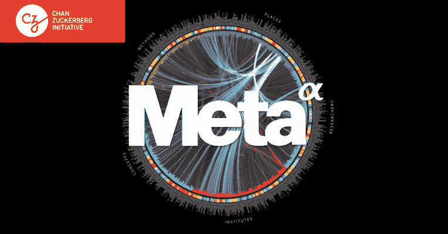

# 人工智能或机器学习技术在你最意想不到的领域蓬勃发展

> 原文：<https://medium.com/hackernoon/ai-or-machine-learning-technologies-flourishing-in-fields-where-you-least-expected-7697ff9da90a>

人工智能，或称 AI，在最近几年变得很突出。如今许多新产品都融入了人工智能或机器学习，或 ML，似乎越来越多的人欣赏这些进步。但在深入探究之前，什么是人工智能？

根据韦氏词典的说法，人工智能是“机器模仿人类智能行为的能力”具有这种功能的产品可以以类似于人类的方式处理信息。但是，AI 还是相当有限的。人工智能可用的操作取决于产品的结构、功能和目的。例如，用胳膊和腿构造的机器可以具有行走的能力，就像本田的 ASIMO(创新机动性的高级步骤)。

此外，或许幸运的是，由于目前的技术限制，人工智能或机器学习仍然缺乏人类情感。

在过去，人工智能的想法似乎遥不可及。这一概念通常出现在科幻电影和电视节目中，比如《T2》《星球大战》和《T4》《星际迷航》系列、《终结者》系列和广受好评的电影制作人克里斯托弗·诺兰的《星际穿越》*(有塔斯和凯斯机器人)等等。甚至在 20 世纪 20 年代，人工智能的概念就已经存在了，1927 年的德国电影 *Metropolis* 。*

*如今，人工智能已经成为现实，因为产品将机器学习用于各种用途——辅助、生物识别、语音识别和制造等。许多商业机构现在也采用这项技术。由*叙事科学* 去年进行的一项[调查发现，38%的企业已经在利用人工智能技术，而 62%的企业将在 2018 年前使用这些技术。](http://www.forbes.com/sites/gilpress/2016/07/20/artificial-intelligence-rapidly-adopted-by-enterprises-survey-says/#36a809876bf5)*

*例如，智能个人助理(IPAs)是目前最受欢迎的产品之一。投资促进机构不只是为企业服务。[*Webopedia*](http://www.webopedia.com/TERM/I/intelligent-personal-assistant.html)*将 IPAs(数字助理)定义为软件代理，编程为用户提供任务或服务方面的帮助，如搜索最新新闻或城市中最新或最热门的餐馆。这些命令和问题的输入可以通过语音命令来完成，这就是苹果的 Siri 所做的。**

**亚马逊开发的 Alexa 是一款出色且独立的 IPA。作为一款独立的产品，Alexa 有很多锦囊妙计。如果你问 Alexa 一个问题，它可以从互联网上获得答案，并使用关键词给你最好的结果。Alexa 还可以分析用户的设备，以确定它连接到哪个软件，以便执行像设置闹钟或为任务和待办事项列表设置提醒这样的命令。**

**随着[亚马逊 Echo](https://www.amazon.com/Amazon-SK705DI-Echo/dp/B00X4WHP5E) 智能音箱连接到 Alexa，这款助手在消费者中的受欢迎程度持续上升。通过扬声器，Alexa 可以接收人们的命令，以控制家中的一些智能设备。例如，关掉房间的灯和控制房间的空调。Echo 和 Alexa 甚至出现在广受欢迎且屡获殊荣的心理惊悚剧系列*的第二季中，其中一个主要角色发出语音命令并向产品提问——就好像技术是人类一样互动。***

**脸书的首席执行官和联合创始人马克·扎克伯格也是人工智能的倡导者。扎克伯格和他的妻子陈慧娴的组织，Chan Zuckerberg Initiative，现在正在收购 Meta ，这是一家人工智能搜索引擎初创公司，旨在帮助科学家寻找与他们的项目相关的其他研究。**

**通过人工智能，搜索引擎以卓越的准确性、速度和规模“对科学和技术发现进行组织、预测和推理”。Meta 还可以帮助投资者和资助机构与研究人员合作，寻找具有高投资潜力或影响力的领域。**

****

**Meta 的一个突出特点是它能够识别论文中的作者和引文，从而为用户提供最佳结果，而不是仅仅依赖于搜索引擎中输入的关键字。Meta 还让用户可以免费获得 18，000 种期刊和文献的全文。**

**扎克伯格最近在他题为“[建立全球社区](https://www.facebook.com/notes/mark-zuckerberg/building-global-community/10103508221158471/?pnref=story)的笔记中也谈到了人工智能，他认为人工智能和人工智能可以提供一种更好的方法来创建一个支持性、安全、知情、公民参与和包容性的社区。这家社交网络巨头为实现这一目标所做的努力之一，是组建团队，研究开发能够通过查看脸书上发布的照片和视频来标记审查内容的系统。他进一步表示，这将有助于打击恐怖主义。**

**“现在，我们开始探索如何使用人工智能来区分关于恐怖主义的新闻报道和实际的恐怖主义宣传，以便我们可以快速清除任何试图使用我们的服务为恐怖组织招募人员的人。这在技术上很难，因为它需要建立能够阅读和理解新闻的人工智能，但我们需要致力于此，以帮助打击全球恐怖主义，”扎克伯格写道。**

**扎克伯格可能正好击中了要害。将人工智能整合到公共安全中是保护社区免受攻击的关键一步，如果不是必要的话。武器检测公司[爱国者一号技术公司](https://patriot1tech.com/)。(OTCMKTS: [PTOTF](http://finance.yahoo.com/quote/PTOTF/?p=PTOTF) ，TSX。V: [PAT](http://finance.yahoo.com/quote/PAT.V/?p=PAT.V) ，FRA: [OPL](http://finance.yahoo.com/quote/0PL.F?p=0PL.F) )正在让这成为现实。**

****

**这家总部位于北美的公司专注于商业化和制造最先进的安全系统，正在开发一种新的隐藏武器检测系统，称为 [NForce CMR1000](https://patriot1tech.com/solutions/nforce-data-sheet/) 。它可以检测到质量异常的物体和与隐藏在人体上的武器有关的材料，即使这些武器正在移动。这就是机器学习的用武之地。**

**它的雷达探测系统是认知的——CMR 代表认知微波雷达。在部署之前，该系统被“训练”以访问各种武器档案，分析和识别武器特征。它还知道如何区分手无寸铁的人或非威胁目标。此外，它能够从以前的扫描中“学习”,适应新的威胁。**

**把它想象成随着每一次筛选而变平，完善它的准确性。此外，这种学习能力可以在指定的网络上共享，这使得它的能力呈指数增长。该产品的尺寸很小，只有一个小面包盒的大小，便于安装，并谨慎地放置在看不见的地方。不再需要人工操作，因为它是实时操作的。**

**网络安全也积极拥抱人工智能，例如 [Deep Instinct](http://www.deepinstinct.com/) ，一家网络安全公司，总部位于以色列特拉维夫，在旧金山和加利福尼亚州的 Aliso Viejo 设有办事处。该公司利用深度学习，这是人工智能的一个更复杂的分支，并将其融入公司的网络安全服务，以开发一种先进的网络安全解决方案。**

**深度学习增强了人工智能设备吸收数据的方式，在某种程度上模仿了人类神经元在我们身体周围传递信息的方式。据 [*麻省理工科技评论*](https://www.technologyreview.com/s/513696/deep-learning/)*报道，它使软件能够学习识别声音、图像、视频和其他数据中重复出现的模式或布局。***

***Deep Instinct 的[深度学习网络防御解决方案](http://www.deepinstinct.com/#/what-we-do)由三个组件:D 组成——大脑、设备和客户端。此[解决方案](http://www.marketwired.com/press-release/deep-instinct-launches-first-commercially-available-real-time-cybersecurity-solution-2069686.htm)在移动设备和计算机上提供实时零时差威胁和高级持续威胁(APT)检测和防御。它改变了防御应对威胁的方式。它已经从被动的威胁转变为主动的，以实现服务的预防方面，并更准确地寻找小工具中可能存在的危险。该服务还可以使用深度学习算法准确预测未知的网络威胁。***

*****D-Brain** 通过从各种来源获得的恶意软件数据集进行学习，提供实时网络威胁情报功能。 **D-Appliance** 利用 D-Brain 的可视化和管理工具的更新来配置公司的安全策略，并实现对网络威胁的详细监控。***

*****D-Client** 现在赋予设备无连接、轻量级和实时网络威胁防御的优势，当它安装在移动设备上时，它会扫描移动设备，并根据 Deep Instinct 的安全策略主动自动采取行动。即使移动设备没有连接到互联网或 Deep Instinct 的网络，D-Client 也可以运行。***

***Deep Instinct 开发的网络防御解决方案被证明是抵御小工具上的恶意软件的有效答案。因此，该公司最近被授予第五届信息安全奖反恶意软件解决方案类别的[热门公司奖](http://www.businesswire.com/news/home/20170214005169/en/Deep-Instinct-Honored-Hot-Company-Winner-5th)。***

***人工智能正在迅速融入人们的生活。人工智能融入到我们的日常生活中，使生活变得更加简单和方便。呼应扎克伯格的观点，人工智能在安全和安保领域的冒险可能正是我们需要面对和对抗世界各地许多社区和空间的威胁。***

******************

> ***[黑客中午](http://bit.ly/Hackernoon)是黑客如何开始他们的下午。我们是 [@AMI](http://bit.ly/atAMIatAMI) 家庭的一员。我们现在[接受投稿](http://bit.ly/hackernoonsubmission)并乐意[讨论广告&赞助](mailto:partners@amipublications.com)机会。***
> 
> ***如果你喜欢这个故事，我们推荐你阅读我们的[最新科技故事](http://bit.ly/hackernoonlatestt)和[趋势科技故事](https://hackernoon.com/trending)。直到下一次，不要把世界的现实想当然！***

******