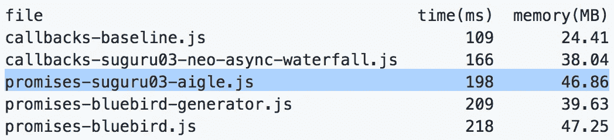
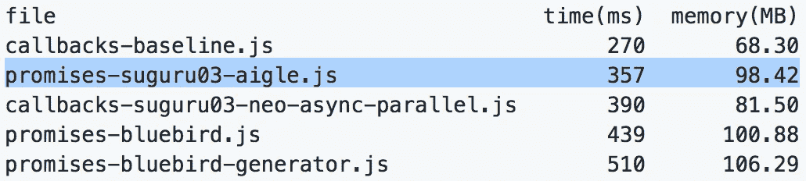

# 艾格 vs 蓝鸟

> 原文：<https://medium.com/hackernoon/aigle-vs-bluebird-5ed3becb4c4c>



bench doxbee



bench parallel

`[Aigle](https://github.com/suguru03/aigle)`是一个理想的 promise 库，我创建它是为了改善我在使用其他 promise 库如`Bluebird`时发现的低效率。除了令人印象深刻的基准测试之外，它还是一个实现 Promise A+标准的生产就绪库。

# 基准

[以上基准练习](https://github.com/suguru03/bluebird/tree/aigle/benchmark)表明`Aigle`比`Bluebird`快。这是通过避免不必要的内存分配和函数调用实现的。例如，`Aigle`能够优化它的依赖项，而蓝鸟的性能会受到影响，如果它的依赖项使用它的不同版本。想了解更多关于`Aigle`如何比`Bluebird`更快的信息，我鼓励你阅读我的文章。

# 功能

`Aigle`让你的代码不那么冗长，包含很多类似于`[Lodash](https://github.com/lodash/lodash)`和`[Async](https://github.com/caolan/async)`的函数。因此，您将能够更快地编写代码，并且有更轻松的时间来维护代码。

## Aigle.map vs 蓝鸟. map

与`Bluebird.map`相比，`Aigle.map`快了 1.5 倍，并且不像`Bluebird.map`那样支持对象作为第一参数。

```
const object = {
  a: 1,
  b: 2,
  c: 3
};
Blubird.map(Object.keys(object), key => {
  const value = object[key];
  ...
});
Aigle.map(object, (value, key) => { ... });
```

如果要使用并发，`Aigle`有`Aigle.mapLimit`类似于`Async.mapLimit`。

```
const array = [1, 2, 3, 4, 5];
Bluebird.map(array, value => {
  console.log(value); // 1, 2, 5, 4, 3 the order is not ensured
  return Bluebird.delay(10);
}, { concurrency: 2 });Aigle.mapLimit(array, 2, value => {
  console.log(value); // 1, 2, 3, 4, 5 the order is ensured
  return Aigle.delay(10);
});// you could use default limit, the limit is 8
Aigle.mapLimit(array, value => {
  console.log(value); // 1, 2, 3, 4, 5
  return Aigle.delay(10);
});
```

此外，`Aigle`支持类似于`Lodash`的简写符号，用于更清晰的代码。

```
const array = [{ name: 'barney' }, { name: 'fred' }];
Aigle.resolve(array)
  .map('name') // the function is called asynchronously
  .then(names => console.log(names)); // ['barney', 'fred']
```

## Aigle.mapValues

功能与`Async.mapValues`和`Lodash.mapValues`类似。它也类似于`Aigle.map`，但是它返回一个对象。下面是`Aigle`和`Bluebird`的代码对比。

```
const object = { a: 1, b: 2, c: 3 };
const iterator = value => Promise.resolve(value * 2);// Bluebird
const result = {};
Bluebird.each(Object.keys(object), key => {
  const value = object[key];
  return iterator(value)
    .then(val => {
      result[key] = val;
    });
}).then(() => console.log(result)); // { a: 2, b: 4, c: 6 }// Aigle
Aigle.mapValues(object, iterator)
  .then(result => console.log(result)); // { a: 2, b: 4, c: 6 }
```

# 艾格尔时报

功能类似于`Async.times`和`Lodash.times`。它调用迭代器指定的次数。

```
const n = 10;
const iterator = value => Promise.resolve(value * 2);// Bluebird
const times = [];
for (let i = 0; i < n; i++) {
  times.push(i);
}
Bluebird.map(times, iterator)
  .then(result => console.log(result)); // [0, 2, 4, ..., 18]// Aigle
Aigle.times(n, iterator)
  .then(result => console.log(result)); // [0, 2, 4, ..., 18]
```

# 结论

`Aigle`是一个有前途的库，它提供了更安全、更简洁、更易维护的代码，拥有令人印象深刻的基准。上面记录的例子只是`Aigle`功能的一个子集。如果你已经熟悉了`Lodash`或`Async`，你将能够很容易地过渡到用`Aigle`编写更可读的代码。也就是说，让我们享受使用`Aigle`编写更快更高效的 Javascript 吧。

# 参考

*   [艾格](https://github.com/suguru03/aigle)
*   [蓝鸟](https://github.com/petkaantonov/bluebird)

[](http://bit.ly/HackernoonFB)[](https://goo.gl/k7XYbx)[](https://goo.gl/4ofytp)

> [黑客中午](http://bit.ly/Hackernoon)是黑客如何开始他们的下午。我们是 AMI 家庭的一员。我们现在[接受投稿](http://bit.ly/hackernoonsubmission)并乐意[讨论广告&赞助](mailto:partners@amipublications.com)机会。
> 
> 如果你喜欢这个故事，我们推荐你阅读我们的[最新科技故事](http://bit.ly/hackernoonlatestt)和[趋势科技故事](https://hackernoon.com/trending)。直到下一次，不要把世界的现实想当然！

