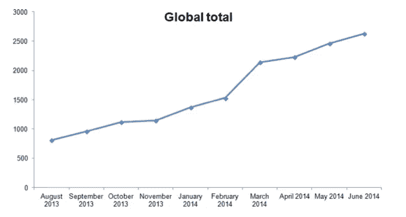

# 现在没有什么能阻止我们了

> 原文：<https://medium.com/hackernoon/ain-t-no-stopping-us-now-26d88dd134ca>

# 2**1 世纪终身学习**

# 孩子们绝对喜欢问问题:如果我能看到所有的星星，它们真的会那么远吗？谁是世界上跑得最快的人？牛奶从哪里来？

随着一些孩子长大，他们的兴趣可能会开始减弱，但对其他人来说，他们的问题的复杂性和热情只会随着他们试图满足贪得无厌的求知欲而升级。这象征着你可能称之为*的好奇心基因*，它在未来肯定会越来越受到重视。

教育的潮流转变是显而易见的，因为顶尖专家 [**肯·罗宾逊**](http://www.ted.com/talks/ken_robinson_changing_education_paradigms) 已经记录了多年。我们的正规教育体系是建立在工业化的基础上的，例如把银行知识灌输给被动的学生，并虚假地出售这些知识作为工作保障的保证。改革的理由是令人信服的，尤其是面对整合了更多定制化、参与性和开放性学习形式的新模式。

[Abstract brain icon](http://www.shutterstock.com/pic-260573819.html?pl=businesstips-whyyouneedtoconske&cr=imgc)

# **继续教育案例**

一生中的持续教育，无论是正式的还是非正式的，将对下一代发挥越来越重要的作用——特别是考虑到围绕大学教育价值的长期争论。正如战略教育中心首席执行官托尼·麦凯所说，不断获取新知识和新技能，或者实际上是“学习生活”的能力，是下一代工人必备的能力之一。幸运的是，有许多新的教育资源为任何人提供了学习和扩展知识的机会，所有这些都可以在舒适的家中或移动设备上实现。

# **选择你的技能组合**

提升你的情商和策划新技能的进步教育渠道现在很多。每个人都有自己的事情，无论是学习如何缝纫，还是我个人最喜欢的，参加周日在****生活学校的布道(现在在伦敦、贝尔德、伊斯坦布尔和安特卫普)。在技术领域有太多的选择，包括在 [**创客学院**](http://www.makersacademy.com/) 学习编程，或者通过 [**Escape 的创业 MBA**](http://school.escapethecity.org/) 探索从企业到创业世界的飞跃。在下一代教育中提供更广泛的课程选择是 [**大会**](https://generalassemb.ly/) (我也是其中的讲师)。我亲眼目睹了这种增长，看到 GA 被《Fast Company》评选为世界上最具创新性的公司之一，我并不感到惊讶。****

# ******大规模开放在线课程******

****此外还有 MOOCs。这些大规模的开放在线课程已经开放了教育，因此任何人都可以通过联网设备访问曾经专有的课程。比较流行的一些门户网站有[**【uda city】**](https://www.udacity.com/)[**edX**](https://www.edx.org/)[**可汗学院**](https://www.khanacademy.org/)[**Coursera**](https://www.coursera.org/)，Shutterstock 自己的 [**Skillfeed**](https://www.skillfeed.com/#!) 。如果你还没有涉猎，那么通过课程聚合器 [**Class Central**](https://www.class-central.com/) 进入这个世界是一个很好的起点。有趣的是，尽管 mooc 的增长率在下降，但全球 mooc 的实际总数却在增加。****

********

# ******启动教育******

****在线创业教育也很健康。也许最好的参考资料是 Y Combinator 的 [**如何在启动阶段开始**](http://startupclass.samaltman.com/) 或者 Steve Blank 的 [**精益发射台**](https://www.udacity.com/course/ep245) 。许多其他人提供免费的教学工具，从 [**【快乐创业学校】**](http://thehappystartupschool.com/) 和 [**设计思想家学院**](http://www.designthinkersacademy.com/) 到**的播客。有偏好有能力亲自露面的，还有《另类 MBA》里的领袖人物，包括 [**设计作品**](https://www.rotman.utoronto.ca/FacultyAndResearch/EducationCentres/DesignWorks/About.aspx)[**d . school**](http://dschool.stanford.edu/)[**Hyper Island**](https://www.hyperisland.com/)[**THNK**](http://www.thnk.org/)。******

# ****当然，价格标签可能会让你多看一眼，但好处是让学习者为 21 世纪的经济做好准备，在 21 世纪，响应、创新和创造力是最重要的。****

****然而，房间里的大象是未经认可的免费开放教育的特定领域，那里的保留率相当令人沮丧。例如，edX 最近的报告指出，平均只有 5%的注册学生真正完成了课程。据预测，在未来十年内，该平台上目前的 2000 万注册学生将增加 10 倍，达到近 2 亿人，但只有时间才能证明越来越多的学生中有多少人将成功完成在线课程，以及教育提供商的轨迹是否会专注于通过更多互动参与工具(如[**【Prollster】**](http://prollster.com/)、付费职业模式(如[**【Nano Degrees】**](https://www.udacity.com/nanodegree))或这些或无数其他激励因素的组合来增强当前的免费课程。****

********

****[Set of books in flat design](http://www.shutterstock.com/pic-222324796.html&src?pl=businesstips-whyyouneedtoconske&cr=imgc)****

****和几乎任何事情一样，你可以对你的教育采取一种态度。如果你喜欢**的成长心态，你很可能会点击这篇文章中的几个(或许多)链接，带你开始你学习经历中的下一个迷你旅程。这种倾向是合适的，因为它符合新教育的进步提供者，在那里获取知识既有效又有吸引力。有了比以往更多的选择，这些提供商确实为罗宾逊爵士对传统教育的批评提供了真正的替代选择。可以肯定的是，你有足够的时间来决定追求什么样的学习机会，无论是学习编码、设计帽子、提高你的 [**写作**](http://www.writebynight.net/) ，还是巧妙的哲学思考。******

# ****某个地方有一个座位，虚拟的或其他的，只为你；你所需要的只是一些业余时间和大量的训练。****

****The post title was inspired by this stupendous track from McFadden & Whitehead****