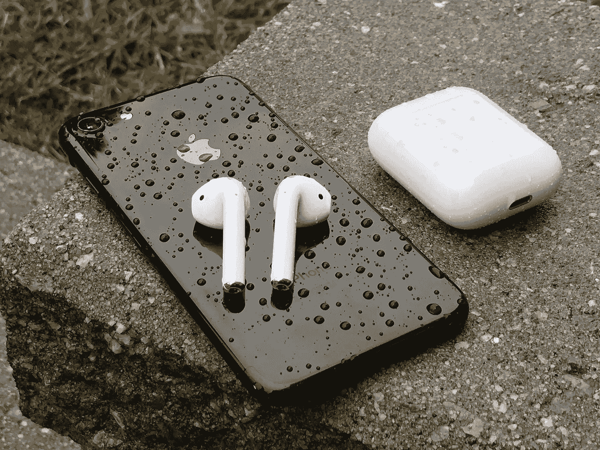

# AirPods 和为什么他们是一个美丽的耻辱

> 原文：<https://medium.com/hackernoon/airpods-and-why-theyre-a-beautiful-disgrace-dbf4a83c5b6f>

是啊，他们看起来有点奇怪。

老实说，这是我和他们唯一的问题。

我绝对喜欢这些奇怪的，亮白色的，小巧的无线耳塞。毫无疑问，它们是苹果多年来制作最好、设计最精良的产品。对于许多苹果的主流用户来说，它们并不为人所知，但今年夏天当它们在加拿大发布时，我在网上搜索它们——当一双在苹果商店或网上有货时，我会使用像 [NowInStock](http://www.nowinstock.net/ca/) 这样的网站给我发电子邮件。

现在，我在这篇文章的开头说 AirPods 看起来很奇怪。但真的，这篇文章是一封情书。我爱我的 AirPods，可能超过我拥有的任何其他技术。这正是我梦寐以求的产品。

当电子邮件告诉我在我当地的苹果商店有 4 双存货时，我还有两个小时下班。完美的时机。我冲动地在网上预订了一双，当天晚上就去取了。从那以后，我每天都用它们*。这包括旅行、通勤、飞行、步行去上课，以及整天工作。*

*他们是如此的*好，以至于我已经完全不再把我的有线音频技术 M40x 耳机放在我的包里，而完全转向这些坏男孩。**

*我在 iPhone 和 MacBook Pro 上使用它们。它们完全无缝，老实说，考虑到我的 iPhone 和 MacBook 现在都没有 3.5 毫米耳机插孔，想到使用任何其他选项都令人沮丧。*

*在我的购买研究过程中，一个主要的考虑因素是电池寿命。这些电池盒本身每只耳朵只有大约四个小时的寿命，但携带它们的盒子在其微小的框架内有超过 24 小时的电池寿命。从周三开始，我就没有给我的 AirPods 充电了，周六下午，当我坐在这家咖啡店里时，它还有 25%的电量，足够我听很多很多小时的音乐了。*

*最重要的是，这种情况下只需 15-20 分钟就可以将一个 AirPods 充满电，这意味着你可以跳“ai rPods 舞”(取下一个 pod，让它充满电，同时你只用一只耳朵听音频，然后交换两个，然后回到两只耳朵听音频)，使用这种方法，一整天都可以毫无问题地听音频。*

*与苹果新的 W1 芯片配对再简单不过了。将手机套放在手机前，按连接，完成。它完善了配对蓝牙设备的古老斗争。*

*诚然，有一些小吹毛求疵。*

*我喜欢 AirPods 本身的音量控制。谢天谢地，Apple Watch 的集成非常出色，在我的手表上控制音量是一个不错的解决方案。*

*我喜欢黑色的。*

**

*我喜欢低音少一点。音频质量总体来说相当不错。显然，我可以通过我的 Schiit Audio Modi/Magni 音频设备堆栈来区分这些和我的 ATH-M40x。很明显。*

*然而:我的桌面音频设置显然比不上这款便携设备。对于我的 AirPods，它们已经从外壳中出来，进入我的耳朵，甚至在我打开 Spotify 应用程序之前就已经连接上了。简单。*

> *自从我拥有了音乐，我听得更多了。*

*总的来说，这是苹果有史以来最好的产品之一。他们真的是未来。你应该考虑自己买一双。*