# 你如何不用等 6 个星期就把 AirPods 卖完

> 原文：<https://medium.com/hackernoon/airpods-isinstock-e86d39817e15>

## 这个世界上只有两种人——知道如何得到它的人和不知道的人。

我最近写了一篇关于“[**”ai rpods“hear able”——物联网计算的未来**](https://goo.gl/lkG8UY)**”**关于产品的重要性和潜力的小故事。

 [## AirPods“听得见”——物联网计算的未来

### AirPods 的计算能力比第一代 iPhone 更强

hackernoon.com](https://hackernoon.com/hearables-a7c6dc616bff) 

## AirPods 全球售罄。

正如我在故事中提到的，我去了一家[苹果](https://hackernoon.com/tagged/apple)商店，我被告知 AirPods 在全球范围内售罄，并建议我去苹果在线商店订购。

## AirPods 周后发货。

所以我就这么做了。根据 Apple store 网站，它将于 2017 年 6 月 13 日交付……6 周后。

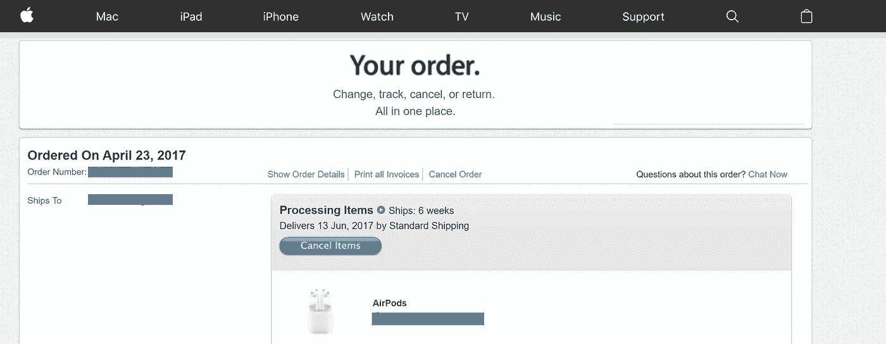

## 我不会轻易放弃我想要的。

所以我开始寻找授权经销商；百思买、塔吉特、B&H、GameStop、FRYS，甚至美国电话电报公司……嗯，似乎没有人拥有它。看起来商店时不时会收到少量的货物，但是 AirPads 在几分钟内就被抢购一空。

## 人们在等待重新进货。

但是怎么做呢？然后我偶然发现，这个词条“ [**购买一套 AirPods 的最佳方式——而且很快**](http://www.imore.com/how-to-buy-airpods)**由 [Serenity Caldwell](https://medium.com/u/9c38e344837e?source=post_page-----e86d39817e15--------------------------------) 撰写。考德威尔提出了几个选择。Apple Store、授权经销商和运营商。非常符合逻辑，这正是我所经历的，然后易贝溢价。对，这是我的下一步棋。但是等等，考德威尔也提到了这个网站:“****”。******

## ****该网站会在商品重新进货时通知您****

****我不知道他们是怎么做到的。但是界面和导航相当不错。您输入邮政编码并创建一个搜索半径来设置通知。默认情况下，通知是一次性电子邮件。如果你支付 5.00 美元，你得到优先权和短信。****

****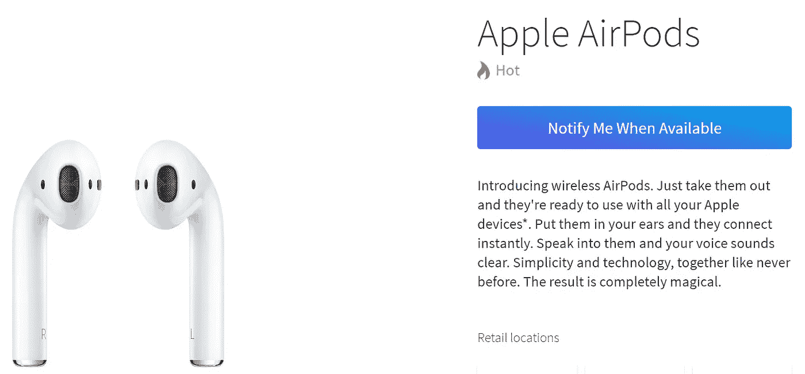********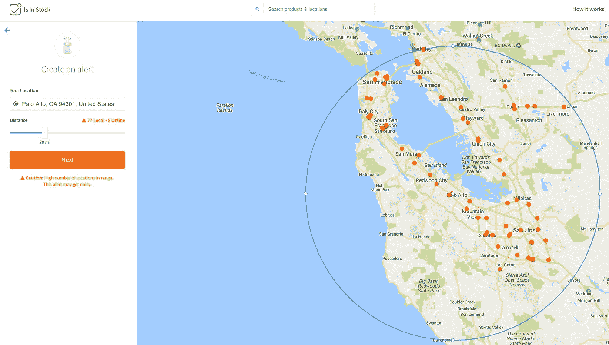********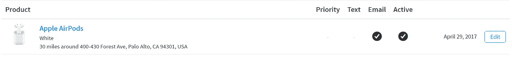****

****根据苹果斯坦福的库存历史，看起来这种商品一周内会进一两次货，而且大部分都在几分钟内销售一空****

****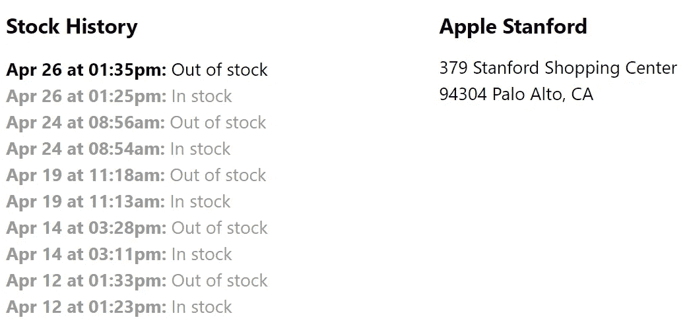****

## ****首先注意到并迅速行动是很重要的。****

****我可能需要在我的手机上设置一个通知，以便赢得这个快速拉动。所以我去“ [IFTTT](https://ifttt.com) ”触发了一封来自 isinstock.com 的邮件。****

****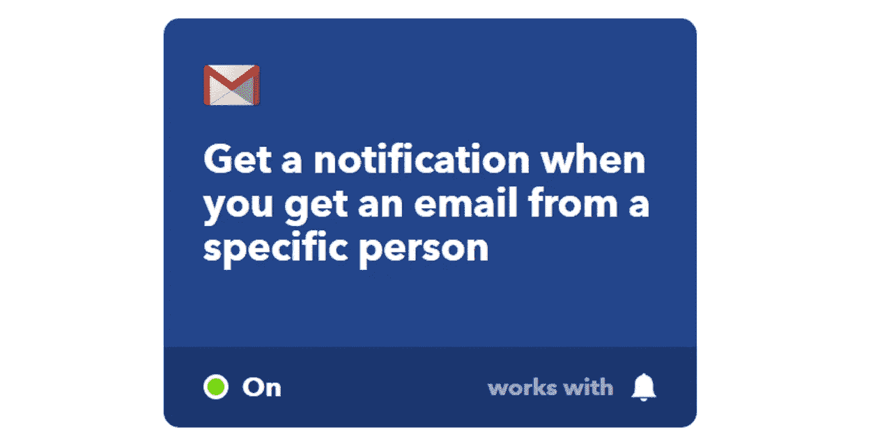****

## ****等待时机。****

****过了很短的时间(实际上只有 15 分钟)，我收到了一个通知。我赶紧打开链接，是美国电话电报公司拿到的复盘股票。****

****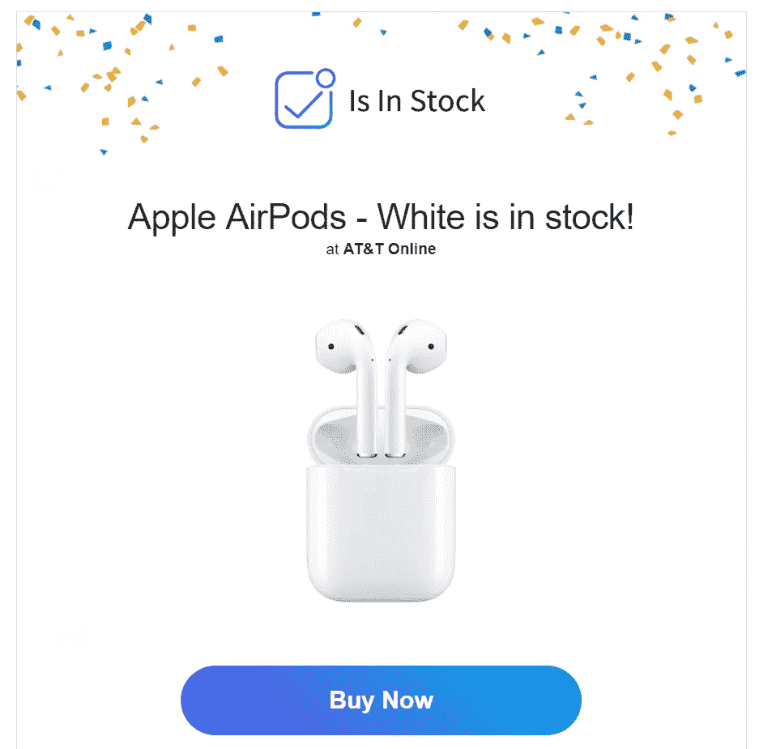****

****印心后不到一分钟，我就去了网上商店并浏览了网站。****

****订单已完成。****

****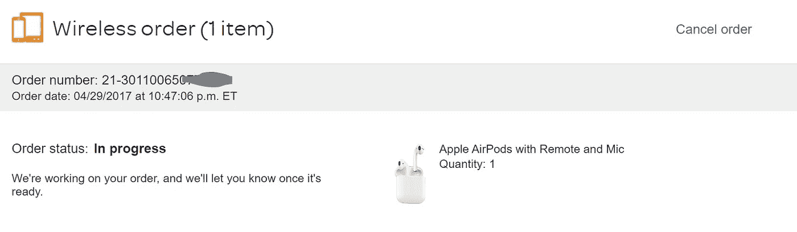****

****因为它发生在一个小时前，订单还没有被美国电话电报公司处理。因此，我不能确定这是否真的有效。****

****但我希望这能帮助那些像我一样为“6 周”的等待而尖叫的人。****

********

****(Source: [GIPTHY](https://giphy.com/gifs/give-it-to-me-co2UNa112ocOQ/))****

> ****"有志者事竟成。"****

****我会让你知道这是怎么回事，一旦我收到它，我会在这里放一个评论。****

****一会儿见。****

## ****[截至 5 月 1 日更新]****

****我已经从美国电话电报公司收到了装运的确认书。****

****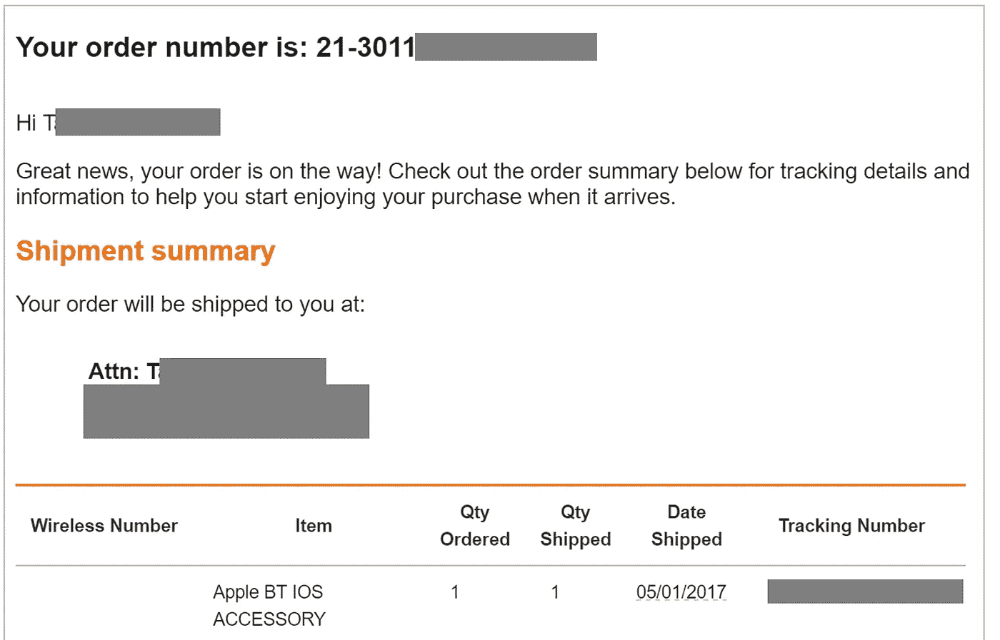****

****顺便说一句，当 IsInStock.com 的苹果商店再次进货时，你会收到这种类型的电子邮件通知。****

****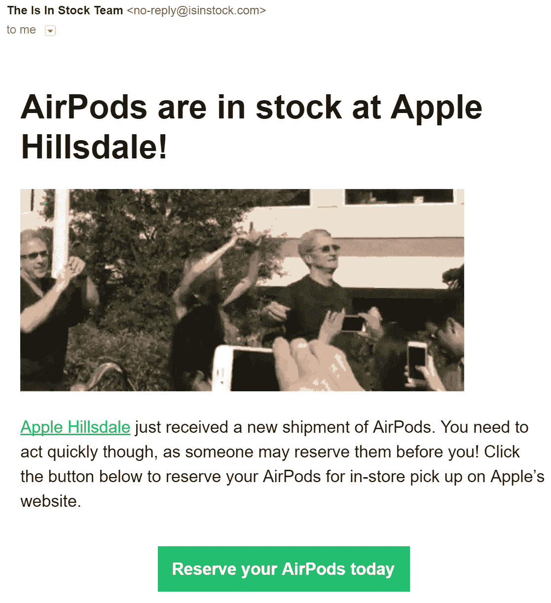****

## ****【更新截止 5 月 5 日】****

****多亏了 IsInStock.com，我在 5 月 3 日收到了包裹。
我开始寻找补货提示后，仅用了 **5 个工作日**。****

****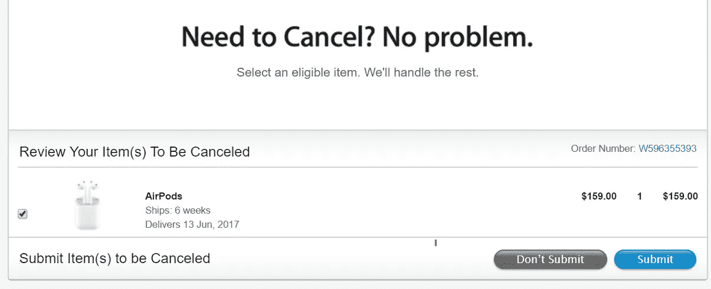****

****我现在取消了苹果在线商店的原始订单，这可能需要我 6 个星期才能收到(预定在 6 月 13 日)。****

****我开始用我的 iPhone 6 plus(我有一部旧手机)使用强大的 AirPods。它像宣传的那样非常容易连接到 iOS 设备。
然而，我在 iPhone 和我的 Windows Razer 笔记本电脑之间来回连接时遇到了一点麻烦。****

****AirPods 的 Seri 集成很棒，但反应很慢(Siri 需要 1.5 秒才能唤醒)。这肯定会让我更多地给 Siri 打电话。****

****耳机配合很棒。我的耳朵不太适合其他入耳式设备，但我一直喜欢 apple ear pieces 的配合，这款也很适合。底线是，它不会倒下。****

****购买 AirPods 也意味着我可以在 AirPods 上听更多的音乐，这导致我订阅 iTune Music(10 美元/月)。****

****我家里已经有亚马逊生态，交了亚马逊音乐订阅费。由于 Alexa 和 Siri 生活在不同的世界，他们不分享他们的内容，这是故意的。****

****订阅费不多。然而，为了更好的用户体验，最终我会决定一个来源，以避免[维护](https://hackernoon.com/tagged/maintaining)两个独立的音乐库。****

> ****我看到 AirPods 在下一代计算中的潜力了吗？—是的，未来会告诉我们它会产生怎样的影响。****

************************

> ****[黑客中午](http://bit.ly/Hackernoon)是黑客如何开始他们的下午。我们是 [@AMI](http://bit.ly/atAMIatAMI) 家庭的一员。我们现在[接受投稿](http://bit.ly/hackernoonsubmission)并乐意[讨论广告&赞助](mailto:partners@amipublications.com)机会。****
> 
> ****如果你喜欢这个故事，我们推荐你阅读我们的[最新科技故事](http://bit.ly/hackernoonlatestt)和[趋势科技故事](https://hackernoon.com/trending)。直到下一次，不要把世界的现实想当然！****

********