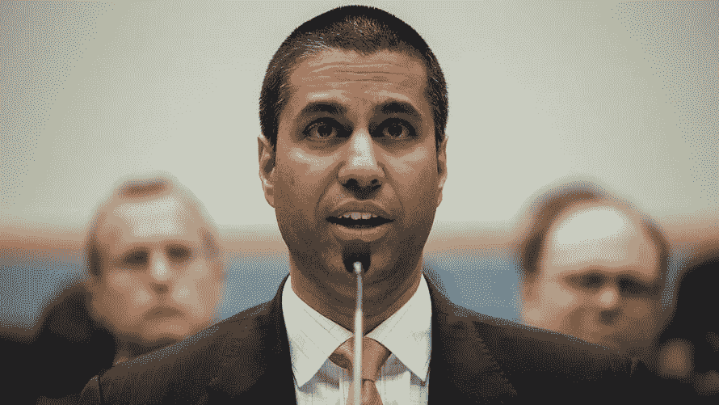

# Ajit Pai 的网络中立提议是愚蠢的

> 原文：<https://medium.com/hackernoon/ajit-pais-net-neutrality-proposal-is-stupid-f192c45b7760>

## 他的解释更糟糕。

本周早些时候，当新的联邦通信委员会主席和长期的网络中立的敌人，Ajit Pai 发布了他的计划，使互联网的平等原则成为过去不可执行的事情，他解释说，

> “这是基本的经济学。你对某样东西的监管力度越大，你可能得到的就越少。”

(头迎掌。)

我从哪里开始？

## 先说清楚，这是什么。

这是旋转。派先生(和/或撰写他的声明的通讯工作人员)并没有试图帮助我们理解他想要撤销的具体法规，或者他希望废除这些法规将达到的目的。他没有解释这项废除将如何影响我们，也没有列出他将采取的措施来解决我们的担忧。考虑到这个看似常识的新闻片段是多么的愚蠢，他绝对不是在试图提升我们对经济理论的理解，而是*。*

[不，派先生没有做任何那些事情。相反，他*所做的是*试图为一项政策变革建立支持，这项变革很可能会从根本上改变我们所知的互联网，方法是煽动一部分选民(最终是他们选出的代表)的反监管情绪，他知道，这些人会支持极其愚蠢的东西，只要它被描绘成反“政府控制”](https://arstechnica.com/tech-policy/2017/04/net-neutrality-rules-took-away-your-internet-freedom-fcc-chair-claims/)

## **反对“政府管制”是愚蠢的**。

(是的，我会经常用到这个词。)这并不是说没有值得反对的政府法规，确实有。但是,“政府监管”这个词涵盖了如此多的东西，以至于说你反对“政府监管”这个概念，因为你不支持其中的一些，有点像说你反对食物这个概念，因为你讨厌肝和洋葱。那太蠢了，对吧？

政府监管的反对者喜欢声称他们的立场得到了合理的经济思维的支持，因为，你知道，“如果人们不能‘自由’地做他们想做的事情，这就不是一个‘自由’市场。”我知道，这听起来很有道理，但它真正告诉你的是，提出这一论点的人要么太愚蠢，不明白市场没有那么简单，要么希望你愚蠢到被他们聪明的文字游戏所愚弄。仅仅因为某个单词出现在某个东西的标题中，*并不意味着这个单词告诉了你所有你需要知道的关于这个东西如何工作的信息。(你知道人们会获得经济学博士学位，对吗？)*

## 我们监管市场是有原因的。

现在，这个论点的提供者当然是正确的，因为仔细考虑对“自由市场”的任何干预的后果是重要的，因为 Pai 先生真正提到的基本经济原则是这样一个事实，即干预市场最终将改变人们、公司等的方式。参与那个市场。但这不一定是件坏事。信不信由你，改变市场参与者参与市场的方式基本上是监管的全部意义。

我这么说是什么意思？

首先，重要的是要记住，仅仅因为我们称之为自由市场，并不意味着市场没有规则。“免费”这个词基本上只是意味着市场不是用来挑选赢家和输家的(也就是说，它不是用来让一家公司比其他公司更有优势的。)所以，再简单点说:

*   自由市场为公司等创造了公平的竞争环境。为了争夺生意。
*   如果一家公司想要在那个市场/竞技场上竞争业务，它必须遵守它的规则。
*   规则规定了竞争的条件。

## 要理解这是如何运作的，考虑一下 NFL。

联盟通过制定所有竞争者都必须遵守的规则，为足球队创造了一个公平竞争的环境。只要球队遵守规则，他们就可以自由地做任何他们认为需要赢得的事情，而规则确保赢得比赛需要某种形式的运动能力和对我们所知的足球运动的掌握。

如果 NFL 取消所有规则，让球队“自由”使用他们认为必要的任何手段将球送入对方的端线区域，球队最终将停止竞争跑得最快和扔得最远，并开始竞争做一些事情，如制造更好的车辆和更大的炸弹来炸毁对方的车辆。所以，再一次，NFL 制定和执行规则，确保球队在我们所知的足球比赛中竞争成为最好的，他们不断修改和增加这些规则，以确保情况仍然如此。(例如，联盟设立了工资帽，以确保球队不会开始竞争“购买”更好的球队，最近它推出了一项脑震荡协议，以阻止球队以球员健康为代价追求胜利。)

## 市场的运作方式大致相同。

虽然，不是确保参与者竞争成为最好的足球运动员，而是通常建立市场规则/规章以确保参与者竞争以最好的价格提供最好的产品。同样，如果没有这些规则，这种情况不一定会自动发生。

例如，在患者保护与平价医疗法案成为法律之前，健康保险公司并没有竞争以最好的价格提供最好的健康保险，他们竞争的是只为健康的人提供保险，这些人不需要太多的医疗保健。但现在，由于规定要求保险公司覆盖任何想要注册的人，不管他们的健康状况如何，保险公司必须竞争提供一种保持客户健康的优质产品。这一规定是否加大了保险公司扭亏为盈的难度？是的。这是否意味着，可能会有更少的保险公司？是的。但是，如果市场上有更多的公司在做我们不希望它们做的事情，那么这些公司真的更好吗？

## “更多”并不总是更好。

我确信会有更多的制药公司，如果政府不再要求他们证明他们的产品是安全有效的。因为，如果他们可以销售药物，而不必担心副作用和药物是否真的会起到他们所说的作用，这将会便宜得多，利润也高得多。毫无疑问，美国也会有更多的制造业，如果政府让他们回到不必关心工人安全的日子，并强迫全职员工每周工作 100 小时(事实上，这是国会通过公平劳动标准法案之前美国制造业员工的平均每周工作时间。)我确信会有更多的住房建设，如果政府不再坚持建造不会倒塌的房屋。见鬼，如果政府允许人们继续蓄奴，我们甚至可能看到种植园的复兴。(澄清一下，我并不是在为这一点辩护。)

## 你真的信任康卡斯特吗？

Pai 先生认为，应该允许行业自我监管，但你不必回头看很久就能发现，历史上并没有人类做正确的事情，做错误的事情会让他们赚更多钱的例子。是的，这个世界上当然有这样的人，他们总会选择做正确的事，但是只要别人可以自由的做错误的事，那么那些人就输了。此外，鉴于 Pai 先生基本上是在谈论有线电视公司，如果没有人强迫他们，谁能说他们真的[相信他们的有线电视公司](http://www.pcmag.com/news/350979/comcast-is-americas-most-hated-company)会做正确的事情。(而且——要明确的是——如果你听信了他的“政府规章糟透了”的话，那就是你正在做的事情。)

## 网络中立很重要(像真的一样)。

网络中立——即互联网服务提供商必须平等对待所有内容的原则——是我们所知的互联网的核心原则。这一原则开创了无数的事业，使无数的创新成为可能，因为它使创新者沉潜和游泳成为可能——不是根据他们贿赂手掌的能力——而是根据他们创造的价值。互联网服务提供商是否希望放弃网络中立，这样他们就可以开始向网站收取更多的费用来获得更好的位置？当然，他们有。他们这样做可能会比每月向客户收取调制解调器费用赚得更多。但是，作为一个由创新者和创新消费者组成的社会，我们希望这种情况发生吗？我认为答案是，“不，我们不介意，”我们大多数人都不介意法规导致更少的 ISP，只要所述法规确保零 ISP 积极违反我们付钱让他们访问的东西的完整性。

所以，长话短说，Pai 先生说的对，监管一件事情往往会导致更少的事情，但他似乎忽略了一点，那就是我们希望这些监管到位的原因。我们不希望有线电视行业能够做更多我们不希望他们做的事情，即破坏网络中立性。

## 你不厌倦被人当傻子耍吗？

当然，Pai 先生并不是第一个试图为一种立场赢得支持的政策制定者，这种立场对一个实际上模糊了眼前真实问题的问题进行了过于简单但看似合理的错误描述。事实上，这是一个非常常见的策略，有些人甚至会告诉你，这是为政策赢得支持的“唯一”方法。“如果你在解释，你就输了，”他们喜欢说。他们是对的，这是可行的。例如，数百万美国人决定反对患者保护与平价医疗法案，因为他们反对“政府控制”和“死亡小组”，就像数百万人为伯尼·桑德斯欢呼一样，因为他似乎认为美国总统不应该与华尔街对话。(是的，这是一个问题，如果他/她只与华尔街对话，但你真的认为我们的政府回避我们经济中如此巨大的一部分没有错吗？因为，无意冒犯，这是个愚蠢的建议。)

就我个人而言，我不同意这是为一项政策赢得公众支持的“唯一”方法，尽管我确实认为这是许多人知道如何赢得公众支持的唯一方法。我还认为，正如约翰·奥利弗在这个问题上和 T2 在其他问题上所展示的那样，花时间帮助公众真正理解一些事情，比试图用一些片段来说服你的家人支持你，会产生更强大/更有影响力的支持。但做这种事情很难，而且需要时间，可悲的事实是:只要我们作为一个社会允许自己被简单的声音片段所左右，我们就越鼓励领导人使用它们。我们越鼓励他们，我们用来谈论[政治](https://goo.gl/ejcfUk)和政策的词汇就越少与这些事情的现实有任何关系，直到— —越来越多的情况是——我们认为我们了解我们的政府和它制定的政策与现实毫无相似之处。

所以，别再上这种当了，好吗？

或者——至少——不要让 Ajit Pai 欺骗你，让他破坏网络中立性。

联邦通信委员会正在接受公众对其提案的意见。如果你想留下评论，TechCrunch 在这里解释了你可以怎么做:[https://TechCrunch . com/2017/04/27/how-to-comment-on-the-fccs-proposal-to-revoke-net-neutral/](https://techcrunch.com/2017/04/27/how-to-comment-on-the-fccs-proposal-to-revoke-net-neutrality/)

***如果你觉得这个帖子有用，请点击*💚*(推荐)告诉算法大神给更多人看。***

***想了解更多关于我的信息，请访问:***[***http://www.jenniferhoelzer.online/***](http://www.jenniferhoelzer.online/)***你也可以在推特上关注我***[**https://twitter.com/JIHoelzer**](https://twitter.com/JIHoelzer)

> [黑客中午](http://bit.ly/Hackernoon)是黑客如何开始他们的下午。我们是 [@AMI](http://bit.ly/atAMIatAMI) 家庭的一员。我们现在[接受投稿](http://bit.ly/hackernoonsubmission)，并乐意[讨论广告&赞助](mailto:partners@amipublications.com)机会。
> 
> 如果你喜欢这个故事，我们推荐你阅读我们的[最新科技故事](http://bit.ly/hackernoonlatestt)和[趋势科技故事](https://hackernoon.com/trending)。直到下一次，不要把世界的现实想当然！

