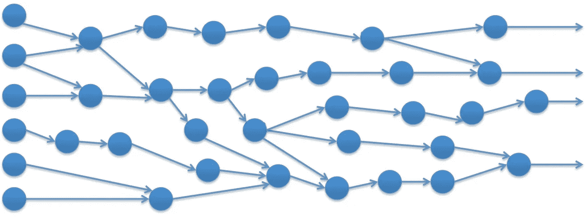

# Akka Streams，可扩展性的故事

> 原文：<https://medium.com/hackernoon/akka-streams-a-story-of-scalability-5d9e7c2d3ac3>



构建数据管道是当今几乎每个公司的共同任务。然而，它们的建造方式各不相同。

作为一家公司，我们和其他公司没有什么不同，所以我们也在构建这些数据路径，但是工具总是因地而异。

我将要描述的内容可以使用任何可用的大数据工具来实现，比如 Apache Spark，我也是它的忠实粉丝。然而，团队对 Akka 进行了大量投资，我们用它建立了几个内部系统，这在某种程度上意味着我们要探索如何完成手头的任务。

为了简化问题，我们会说我们的任务在于计算一个代表特定文件的唯一行的值。例如，给定一个文件**一个**，其内容如下:

```
This is just a 
Test file
For this example
```

使用函数 **f(s: String) = > int** 处理这个文件的结果是:

```
2342342
12341234151245
234
```

*请不要太在意函数 f，让我们专注于过程的整体视图。*

使用 Akka 流，我们可以创建一个简单的管道来处理这些文件。让我们看看怎么做。

首先，我们定义我们的流的构建块。然后，必须把它们放在一起。

现在我们基本上完成了。我们已经构建了一个流，它将逐行处理每个文件，计算每个文件的权重，最后写下值。

## 真正的问题是

当所描述的流执行其工作时，需要花费很长时间来处理，因为文件可能非常大。

## 第一次尝试。增加流并行度

我们的第一个尝试是增加流中并发映射器的数量。我们可以重新定义管道的部件，以便在给定的时刻做更多的工作。

因为我们有大型机器，我们可以增加并行性。此外，我们不太关心顺序，因为计算出的值每行都是唯一的，所以我们可以根据行的权重轻松确定确切的值(文件，行)。

如您所料，现在性能有所提高，但是考虑到等待处理的数据量，还不够好。即使我们在任何给定的时间做更多的处理，我们也不能超越一台计算机的能力，Akka 流现在还不支持它。

## 第二次尝试。回到基础

使用流很容易，很好，也很干净，但是有时我们需要回到基本的抽象上来。

我们将使用 *Akka 集群*和*分布式发布/订阅*通过管道移动我们的数据。

在这里，我们创建了两个 actors，它们的功能与我们之前创建的 streams 相同。尽管如此，我们还是错过了读取数据集的那个。

这个 actor 将获取一个流，并将它的元素(文件、行)发布到集群，这样`WeightCalculator`就可以做相应的工作。

让我们创建一个运行这个管道的应用程序，看看所有的东西是如何组合在一起的。

在这一点上，我们有一个可运行的应用程序，它做的和我们使用流时一样。然而，这种方法可以通过在同一个或不同的 JVM 中部署更多的某种类型的角色(`WeightCalculator or Writer`)来更容易地扩展。我们甚至可以在网络上的不同机器上远程部署它们。所有这些部署策略都由 Akka 集群提供支持。

我们对每一步的处理器数量没有限制，但是这种方法有一个有趣的问题。

在 stream 的世界中，我们有内置的反压力，所以我们不必担心过多的消息淹没演员。然而，使用我们的新方法，我们将大量消息推入集群，根据我们的经验，这会导致大量 JVM 崩溃。

## 第三次尝试。拉与推

如果我们能够使用 Akka 集群部署，同时能够控制消息从*源*传播的速度，那就太好了。我们可以通过改变演员来实现这一目标。

我们需要首先改变我们的来源，所以我们退出。

在这里，`Streamer`默认不推送任何东西。它等待某个消费者在集群上发布的 ***SendNext(to)*** 消息，其中 ***到*** 的值是消费者的地址。然后`Streamer`会将流的下一个元素直接发送给它。这种机制保证了元素只被发送给请求它们的参与者。

另一方面，任何参与者都可以通过在集群上发布请求来请求元素。我们需要改变`WeightCalculator`，以便它在需要时请求元素。

正如您所看到的，`WeightCalculator`只有在处理完一个给定的元素后才会请求新元素。通过这种方式，我们避免了过多的消息淹没它，使它无法一次处理。

在`WeightCalculator`处理完一条消息后，它将使用主题`out`在集群中发布结果，这样它就可以被`Writer`记录下来。

我们可以使用相同的`app`来运行我们的管道，但是请记住，由于集群的能力，我们可以在任何地方部署我们的参与者，我们不会受到单台计算机的限制。

使用 Akka 集群，我们可以无限制地扩大规模，但即使有大量的计算机，我们最终还是会淹没大量的参与者，导致崩溃和失败。在我们的特殊情况下，消息传播的方式很重要，改变为*拉动*的方式似乎是解决方案。通过从源头拉取，我们可以让不同的组件一起工作，每个组件以自己的速度进行处理；*速度慢的比速度快的处理得少，但是不会崩溃。*

我们相信，我们遇到的问题是一个非常普遍的问题，这篇文章旨在让您了解可能会出现的问题以及该解决方案如何为我们服务。

我们希望我们简单的例子能够清楚地说明问题，同时帮助您找到解决问题的方法。

希望我们将看到 Akka 流在集群上运行，因为它们的抽象很容易使用，也很容易放在一起；目前，我们需要寻找替代方案。

[](http://bit.ly/HackernoonFB)[](https://goo.gl/k7XYbx)[](https://goo.gl/4ofytp)

> [黑客中午](http://bit.ly/Hackernoon)是黑客如何开始他们的下午。我们是 [@AMI](http://bit.ly/atAMIatAMI) 家庭的一员。我们现在[接受投稿](http://bit.ly/hackernoonsubmission)并乐意[讨论广告&赞助](mailto:partners@amipublications.com)机会。
> 
> 如果你喜欢这个故事，我们推荐你阅读我们的[最新科技故事](http://bit.ly/hackernoonlatestt)和[趋势科技故事](https://hackernoon.com/trending)。直到下一次，不要把世界的现实想当然！

