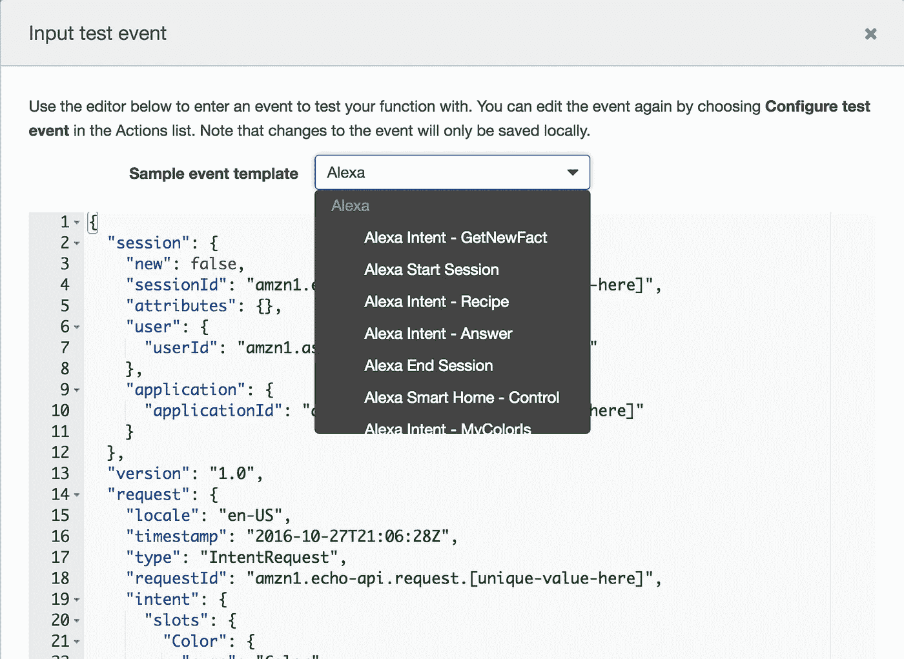
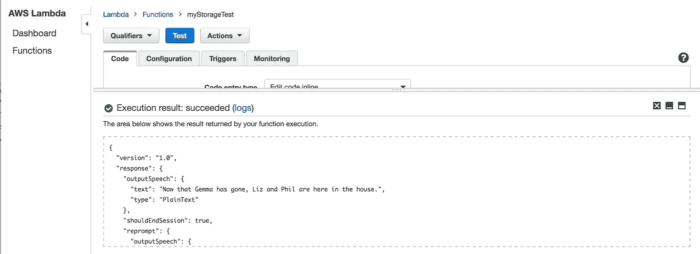
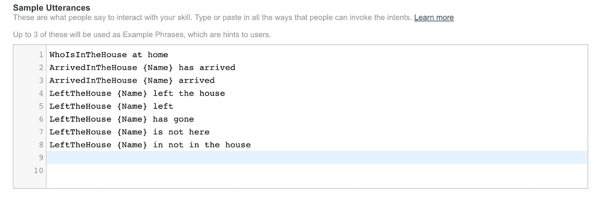

# Alexa 技能和意图

> 原文：<https://medium.com/hackernoon/alexa-skills-and-intents-be8886645ff>

这是关于我创建自定义 Alexa 技能的旅程的第三篇文章。我已经[设置了一个非常非常基础的技能](https://hackernoon.com/my-first-alexa-custom-skill-6a198d385c84)和[给它一些 DynamoDB 存储](https://hackernoon.com/my-alexa-skill-with-storage-5adb1d097b88)。现在我想通过添加一些更多的意图来使它更具互动性。

此刻，如果数据库中有名字安妮、鲍勃和查理，我的谈话技巧是这样的:

> “Alexa，谁在房子里？”
> 
> 安妮，鲍勃和查理在房子里

仅此而已。更改名称列表的唯一方法是在数据库中编辑它们。我希望能够告诉 Alexa 人们何时到达和离开，这样她就可以自己更新数据库。

# Alexa 意图

Alexa 技能使用意图来告诉 Lambda 函数它应该做什么。实际上，我首先编写了 Python 代码，然后添加了意图，但是反过来解释更容易。

这是我为在房子里的的*设置的意图模式。你可以在开发者门户中为你的 Alexa 技能定义交互模型。*

```
{
  "intents": [
    {
      "intent": "WhoIsInTheHouse"
    },    
    {
      "intent": "ArrivedInTheHouse",
      "slots": [{
        "name": "Name", 
        "type": "AMAZON.GB_FIRST_NAME"
      }]
    },
    {
      "intent": "LeftTheHouse",
      "slots": [{
        "name": "Name", 
        "type": "AMAZON.GB_FIRST_NAME"
      }]
    },
    {
      "intent": "AMAZON.HelpIntent"
    },    
    {
      "intent": "AMAZON.CancelIntent"
    },    
    {
      "intent": "AMAZON.StopIntent"
    }    
  ]
}
```

我希望能够添加或删除一个人的名字，所以每个动作都有一个意图。值(在我的例子中是要添加或删除的名字)在*槽*中被传递给 intent，所以我在每个 intent 中都有一个用于这个名字的槽。当我们开始定义将调用这些意图的句子或短语时，我们将指出这些槽出现在句子中的什么地方。

我用过[亚马逊。GB_FIRST_NAME](https://developer.amazon.com/public/solutions/alexa/alexa-skills-kit/docs/built-in-intent-ref/slot-type-reference#gb_first_name) 内置的名字槽类型，因为我希望这将有助于 Alexa 认识到，我希望人们谈论的是名字，而不是物体。我有一种感觉，我以后会回来，因为我可以看到它有缺点，例如，我的用户只能使用名，没有像姓的限定词。

## Alexa 会话

当你开始和一个 Alexa 技能对话时，你就开始了一个会话。到目前为止，我的 lambda 函数已经通过将 *should_end_session* 标志设置为 True，以其第一个响应结束了会话(这又在 Lambda 函数退出时返回的 JSON 响应中设置了*should session*)。

现在，我想用我的技能打开一个会话，选择性地执行添加或删除操作，然后结束会话。所以我修改了 *get_welcome_message()* ，将 *should_end_session* 设置为 False。

## 闭嘴，阿利克夏！

当你为你的 Alexa 技能设置意图时，你需要包括你想让我们知道的任何内置意图，包括停止会话的意图。

在某一点上，我的 Lambda 函数在无法识别的意图的情况下默认为欢迎消息——我已经更改了欢迎消息代码以不结束会话。直到我明确加入了亚马逊。对于我的 Alexa 技能来说，这意味着一旦我开始一个会话，无论我对她说什么，Alexa 都会读出名单，而不会结束会话。在我的数据库里有相当多的名字，它变得有点累了。

# 意图的 Lambda 实现

## 零和一

在我开始处理意图之前，还有一个改进要做。[如果家里只有一个人](https://medium.com/u/29e1d3425bad#.642kxsavu)就正确处理句子。我想理论上我们这里可能没有人。可能是我的 Google Home 在问 Alexa 谁在这里。所以我稍微更新了我的代码来处理这两种情况。

我修改了 get_names()函数，以返回列表中的名字数量以及名字本身。然后我添加了一个函数，把它变成一个好句子，在我们需要的任何地方使用。

```
def get_name_list():
    names, number = get_names()
    if number == 0:
        return “There is no-one here in the house”
    elif number == 1:
        return get_names() + “is the only person here in the house.”
    else:
        return get_names() + “are here in the house.”
```

# 从 DynamoDB 添加和删除

我需要从数据库中添加和删除名称的功能。如果出现问题，它们会返回一条错误消息。(我还从 *get_names()* 中提取了变量 *dynamodb* 和 *table* 的定义，这样我就不用重复了。)

```
dynamodb = boto3.resource('dynamodb', region_name='eu-west-1')
table = dynamodb.Table('WhoIsInTheHouse')def add_name(name):
    try:
        response = table.put_item(
           Item={
                'NameId': name
            }
        ) 
    except ClientError as e:
        return e.response['Error']['Code']        

    return Nonedef delete_name(name):
    try:
        response = table.delete_item(
           Key={
                'NameId': name
            }
        )    
    except ClientError as e:
        return e.response['Error']['Code'] return None
```

## 非常快速的测试

正如我们之前讨论的，你可以用一个触发事件来[测试 Lambda 函数。但是首先，我简单地硬编码了一个添加和删除调用，只是为了确认它们能够工作。](https://hackernoon.com/my-first-alexa-custom-skill-6a198d385c84#.f8lbnwxnr)

```
def get_welcome_response():

    add_name("Andy")
    delete_name("Suzie")

    speech_output = get_name_list() session_attributes = {}
    card_title = "Welcome"
    should_end_session = True return build_response(session_attributes, build_speechlet_response(card_title, speech_output, reprompt_text, should_end_session))
```

我可以问 Alexa“谁在房子里？”得到的回应是安迪被添加，苏西被带走。快，去掉那些硬编码的添加和删除调用！相反，当我得到一个告诉我要添加或删除名字的意图时，我想添加和删除名字。

## 从意向中添加名称

这是我添加名字的函数，以及一些基本的错误处理。(删除名字也有类似的方法)。

```
def add_name_in_session(intent, session):
    speech_output = ""
    reprompt_text = "" if 'Name' in intent['slots']:
        name = intent['slots']['Name']['value']
        should_end_session = True
        error = add_name(name)
        if error is not None:
            speech_output = "That didn't work. " + error
        else:
            speech_output = "Now that " + name + " is here, " + get_name_list()
    else:
        reprompt_text = "Sorry, I didn't understand. Please try again."
        should_end_session = False card_title = intent['name']
    return build_response({}, build_speechlet_response(
        card_title, speech_output, reprompt_text, should_end_session))
```

当一个意图被调用时， *card_title* 显示在 Alexa 应用中。我要跳过这一点，现在足以说，我的卡需要一些工作。

## 处理意图

我们需要在 Lambda 调用中调用适当的函数，这取决于我们从 Alexa 技能中接收到的意图。

```
def on_intent(intent_request, session):
    intent = intent_request['intent']
    intent_name = intent_request['intent']['name'] if intent_name == "WhoIsInTheHouse":
        return get_welcome_response()
    elif intent_name == "ArrivedInTheHouse":
        return add_name_in_session(intent, session)
    elif intent_name == "LeftTheHouse":
        return remove_name_in_session(intent, session)
    elif intent_name == "AMAZON.CancelIntent" or intent_name == "AMAZON.StopIntent":
        return handle_session_end_request()
    elif intent_name == "AMAZON.HelpIntent":
        return get_help_response()
    else:
         raise ValueError("Invalid intent")
```

# 测试意图

我想检查我的 Lambda 函数对于不同的意图是否如预期的那样运行。你可以通过配置测试事件来做到这一点，这里提供了一些有用的 Alexa 事件模板。



当您编辑示例事件模板时，您的更改将被保存，但请注意，如果您选择另一个示例事件模板，您以前的所有更改都将被丢弃。我想这就是他们所说的“对事件的更改将只保存在本地”的意思。一旦我设置了一个测试事件，我会复制一份并保存在本地机器上我的工作区中的某个地方，这样我以后就可以回去使用它了——这需要复制粘贴它回来。很遗憾没有一种更简洁的方法来保存你所有的测试事件(或者有吗？如果你找到了，请告诉我！).

当您发出测试事件时，您可以看到如果触发了该事件，将会返回什么输出。这包括语音输出。



我构建了一系列测试事件来检查我的所有意图是否都返回了我期望的语音输出。我保留了这些的副本，所以最终我会把它们都发布在 Git 上——让我知道这是否有帮助。

# 将言语转换成意图

回到 Alexa 开发者门户，我已经创建了一些示例语句来说明如何将语音转换成意图。我觉得这还不是全套，不过入门的也就那么几个。



每个定义中的第一个词必须是意图的名称。{姓名}在这些话语中的一些表示被叫姓名的*槽*。

## 把所有的放在一起

*   示例话语告诉技能什么样的句子应该调用每个意图，包括句子中的名称。
*   意向以 JSON 形式传递给 Lambda 函数，包括意向的名称，以及任何槽的名称和值。
*   Lambda 函数查看那个 JSON，完成它的工作，并传回一些 JSON，告诉 Alexa 在响应中应该说什么。

# 有用吗？

我可以用我的技巧进行这样的简短对话:

> Alexa，谁在房子里？
> 
> 莉兹和菲尔在房子里。
> 
> 菲尔已经离开了房子。
> 
> 既然菲尔走了，莉兹就成了家里唯一的人。

有几件事我还不喜欢。

*   Alexa 经常听错名字。也许我需要使这更具对话性，这样我可以在她把名字添加到列表之前确认它是否正确。
*   当您添加或删除一个人时，会话就会立即结束。我不确定那是最好的行为。如果不止一个人同时到达或离开怎么办？

这些是我需要努力提高我的技能的一些事情。

# 下一步是什么？

我将对这些对话元素进行一些改进，我想制作一些更好的卡片，展示我在 Alexa 应用程序中的技能。我已经被[问过我是否要发布我的技能](https://twitter.com/tonyhoffman/status/817467003283927044)——如果我要这么做，那么每个使用它的人都需要他们自己的名字列表，这需要对数据库进行一些更改，以及识别每个用户并将他们连接到他们自己的列表。

更令人兴奋的是， [Phil Pearl](https://medium.com/u/7bbc67ec370d?source=post_page-----be8886645ff--------------------------------) 今天在玩，看看我们是否可以使用设备连接到我们家的路由器来自动**根据他们的手机是否在我们的 wifi 网络上添加和删除人。那该多棒啊。！**

***如果你认为这篇文章可能会帮助其他人编写自己的 Alexa 技能，请* ***击中绿心推荐它****——帮助其他人找到它。***

**你真的喜欢这篇文章吗？我在考虑写一本关于为 Alexa 开发的书。你可以通过在此 *注册* [*来鼓励我这么做。谢谢大家！❤︎*](https://leanpub.com/adventureswithalexa)**

**[](http://bit.ly/HackernoonFB)****[](https://goo.gl/k7XYbx)****[](https://goo.gl/4ofytp)**

> **[黑客中午](http://bit.ly/Hackernoon)是黑客如何开始他们的下午。我们是这个家庭的一员。我们现在[接受投稿](http://bit.ly/hackernoonsubmission)并乐意[讨论广告&赞助](mailto:partners@amipublications.com)机会。**
> 
> **如果你喜欢这个故事，我们推荐你阅读我们的[最新科技故事](http://bit.ly/hackernoonlatestt)和[趋势科技故事](https://hackernoon.com/trending)。直到下一次，不要把世界的现实想当然！**

****