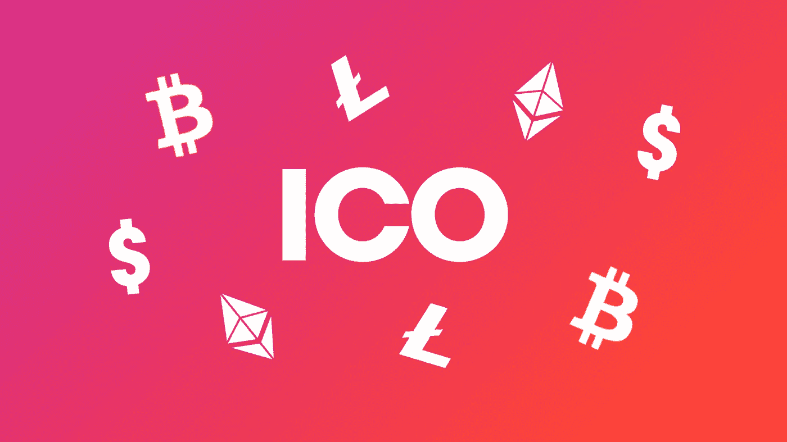

# 你想知道的关于 ICOs 的一切

> 原文：<https://medium.com/hackernoon/all-about-icos-440dee69c5d>

## 什么时候有意义，什么时候没有意义？

如果 **你在创业生态系统**——或者只是一个科技网站的普通读者——我敢肯定，你在过去几个月里听到的大多数融资故事都有一个新名词——ICO。融资并不是通过出售公司的股权，而是通过出售一种叫做“代币”的东西。

对一些人来说，这可能很难相信，但 2017 年，公司通过 ico 筹集的资金实际上比风投筹集的还要多。为你的企业赚钱当然很棒，但我相信 ico 不仅仅是筹集资本的工具。

为了解释 ico 背后的经济学和激励机制，我整理了这本终极指南来帮助你理解 ico。不幸的是，我将无法涵盖你如何开展自己的 ICO，或如何参与 ICO，但不要担心，因为这些可能很快就会到来。

# ICO 中的 C

**虽然全世界都称之为**[一种通过使用加密货币](https://en.wikipedia.org/wiki/Initial_coin_offering)进行众筹的不受监管的方式，但我相信它对商业的意义远不止于此，因为它带来的影响。首字母缩略词 ICO 代表首次发行硬币。仅仅从名字上，我们就可以很容易地看出，公司可以通过提供最初(和/或唯一)的一套硬币来筹集资金。听起来很简单，但是这些提供的“硬币”是什么？

在本指南中，我们将首先深入研究硬币，然后逐步了解上述硬币的初始发行。是时候了解一下 ICO 中的 C 了。为了从这篇文章中获得最大收益，理解区块链是如何工作的真的很有帮助。

**为了使整个事情更简单，我建议我们创建一个假想的场景来阐明 ICO 流程。**

比方说，你想建立一个企业——一个专为手机游戏开发的应用商店。通过你酷炫的新应用商店，游戏玩家将可以下载免费和付费游戏。他们可以在通过你的应用商店购买的游戏中升级能量或解锁奖励等级。无论玩家花多少钱玩游戏，在扣除你的佣金后，你都会把钱交给游戏开发商。

看到你是一个伟大的企业家，你的应用起飞，成为一个蓬勃发展的游戏玩家和游戏开发者的生态系统。最大的游戏开发公司将开始发布他们的游戏，世界上最铁杆的游戏玩家将在你的平台上玩这些游戏。真的，梦想成真了。

但事实就是如此，这只是一个梦想——当然是美好的，但最终还不是现实。为了让你的应用程序商店真正实现，你必须雇佣工程师来建立平台，雇佣人员来让游戏开发者在平台上工作，并花费大量资金向游戏玩家宣传平台。你意识到前面的路还很长，但是你的口袋空空如也。

即使我们允许我们想象你以某种方式设法把应用程序商店和它所有令人惊奇的功能放在一起——你仍然会有问题。游戏开发者需要开始上传他们的游戏，这样游戏玩家才能购买，但是开发者为什么要这么做呢？如果没有任何玩家已经在使用这个平台，准备为游戏付费，开发者就赚不到钱。这不是他们想要的情况，因为他们需要养活自己和他们的团队。

为了解决这个问题，我们回到白板上计划一些东西，在平台上引入一群绝望的游戏玩家来吸引开发者。但是当没有现成的游戏可以下载和玩的时候，他们为什么要来呢？

> 在游戏到来之前，游戏玩家不会到来，而在游戏玩家到来之前，游戏也不会到来。我们新发布的平台将成为典型的第 22 条军规的受害者。

意识到旅途中的所有这些障碍，你可以让它压倒你并放弃——或者找到一个创造性的解决方案来实现想象中的应用程序商店。你不是一个轻易放弃的人。聪明的企业家会找到解决方案。

深奥问题的答案从来都不明显。最近，我们发现了一个可以解决上述所有问题的解决方案，由区块链理工大学提供支持 ICO 中的 C。

# c 代表硬币

**在上面的例子中，你，**作为一个聪明的企业家，想一些不寻常的事情。一个灯泡在你头顶上熄灭，你意识到你可以在生态系统中引入你自己的游戏币。你可以要求玩家用你自己的游戏币支付，而不是要求他们用美元或欧元支付。

另一方面，你可以用自己的游戏币支付给开发者，而不是用美元或欧元。硬币可以被用来从生态系统中获得一些价值，因此，给予硬币所有者一种特权。附有实用工具的硬币也被称为“代币”——这是你在阅读更多关于 ico 的书籍时会听到的术语。

引入你自己的工具来交换生态系统中的价值，让你用它来解决我们上面列出的所有问题。你自己的硬币/代币的核算不会由你一个人在一个不透明的数据库中完成；相反，它将在一个公共的区块链上完成，在那里任何人都可以验证他们对令牌的所有权，并可以自由地将其转让给其他任何人。

甚至在一个人创建和营销他们的平台之前，他们就可以建立并以固定的名义价格出售一批这样的硬币。这就引出了 ICO 的另外两个字母——I 和 o。

# 首次发行

> "幽默是看到一枚硬币三面的能力."——内德·罗勒姆

**作为一名企业家，**你制定了一份商业计划，你的硬币/代币的所有经济因素都在平台上得到考虑，你宣布了硬币的首次发行。

你通过讲述一个故事来说服世界，你是多么可信和有能力为游戏玩家和开发者建立这样一个平台。你还讲述了你的硬币的故事，以及它对世界的价值。你让潜在买家现在就以固定的折扣价购买你的硬币——甚至在平台建立之前——让你筹集足够的资金来继续实际建立它。

你告诉他们，因为你的生态系统将在未来几年蓬勃发展，供应有限的硬币将升值。然后，他们可以自己用硬币支付游戏费用，或者以升值的价格卖给游戏玩家。

最初的硬币发行发生在以太坊、NEO 或 Waves 等公共区块链之上，以提供所有权和可转让性的信任。所以实际上你不会创造一枚全新的硬币。相反，你在另一枚硬币上制造了你自己的硬币。有意思！如果你还没有意识到，金钱或任何数字价值实际上只是账本上的一个条目。(神魂颠倒？)

如果有足够多的人相信你的故事并购买你的硬币/代币，你之前空空如也的口袋现在将会装满现金——给你足够的杠杆去建立这个平台。但是我们知道搭建平台是不够的。我们最终将不得不面对“第 22 条军规”的僵局，这有可能使我们的平台成为一座鬼城。

有趣的是，因为我们的思想是如何工作的，在你的令牌在生态系统中可用之前，让人们拥有它会产生一个有趣的副作用。拥有代币的个人希望代币变得可用并升值。在献币期间，你向他们承诺代币的价值会升值，但是在献币之后，代币拥有者会福音化你的代币和平台，让价值真正升值。

这就是为什么，通过让人们对你平台的成功感兴趣，你会激励他们在你的平台上开发和玩游戏。因此，解决了 catch 22 死锁。

> 代币所有者不仅会成为你的投资者，还会成为你的潜在客户。

# 欺诈、谎言和绝望

> "硬币的两面都有另一面。"—迈伦·斯克尔斯

**就像任何新奇的事物一样，**总会有人在整个过程中找到漏洞，并利用这些漏洞为自己谋利。ico 也不例外。

你可以发现糟糕的演员在讲述虚假的故事，说如果有足够多的人购买他们的代币，他们会建造什么——而实际上他们并没有打算把钱用在好的地方。他们会兑现它，慢慢消失，或者让它们闲置，永远升值。

不是所有的故事都是玫瑰色的。不是所有的故事都会。一个人需要发展一种技能来识别好的 ico 和坏的 ico。如果你想让我做一个终极指南，请在 Twitter 上告诉我。

# 法律不保护投资者吗？

> "律师的权力在于法律的不确定性."—杰里米·边沁

**简而言之:现在不多。**

大多数 ico 都将自己标记为实用程序令牌——可以用来在软件平台上获得一些实用程序。他们忽略了“证券”的定义，因此也忽略了法律。

一些人认为这很好，因为缺乏监管将有助于保持创新和发展更快。这是一个站得住脚的论点，但它让窃贼得以对不完全了解 ico 工作原理的投资者下手。

有一些 ico 在其代币销售中包含监管措施，以增强投资者的信任。一个常见的做法是加入一个功能，说明如果在 ICO 期间没有筹集到目标金额，筹集的资金将退还给投资者——听起来很公平，对吧？

鉴于经济的运行方式，从事 ico 的公司可能会开始在出售代币的智能合约中进行自我监管。

# 结论

> 我不认为把代币当作燃料是一个有缺陷的类比。代币对于平台就像燃料对于交通工具一样。

**ICO 是一种创建燃料**(即实用令牌)的方式，这种燃料将在您将要创建的车辆(即平台)中使用。如果有足够多的人购买这种燃料，你就能得到建造汽车的资金。当汽车真正制造出来时，会有准备好燃料的观众来驾驶汽车。

因此，ICO 不仅仅是一种新的融资方式。这也是一种在商业中获得客户和创造网络效应的新方法。代币是神奇的，当你明白它们能完成什么时，你会大吃一惊。当一家公司在众筹中出售一个代币时，他们会得到三样东西作为回报——投资者、顾客和传播者。作为一名企业家，你还可能想要什么？

## 感谢阅读！:)如果你喜欢，请鼓掌支持👏🏻还有分享帖子。请随意发表评论💬下面。

—

***关于作者***

[https://twitter.com/mohitmamoria](https://twitter.com/mohitmamoria)

*莫希特·马莫里亚是*[***godtoken.org***](https://godtoken.org)*的首席执行官，也是一份每周时事通讯的编辑，*[*un made*](https://unmade.email)*，它将一个来自未来的创业想法发送到你的收件箱里。*

他定期为世界上最大的出版物撰稿，包括 HackerNoon、TechCrunch、TheNextWeb、CoinTelegraph 等。这个故事最早出现在 TheNextWeb *上* [*。*](https://thenextweb.com/contributors/2017/09/22/everything-need-know-icos/#.tnw_akNlBVVH)

*有反馈吗？在推特上做朋友***。*🙌🏻*