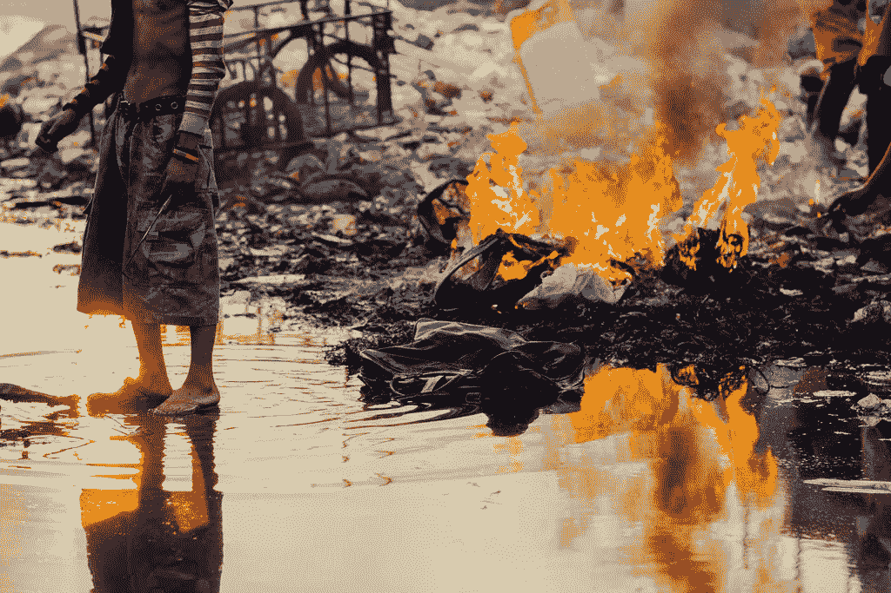

# 所有人类系统都是巨大的垃圾火

> 原文：<https://medium.com/hackernoon/all-human-systems-are-enormous-trash-fires-30b9de6fa603>

Image credit: [https://www.flickr.com/photos/adamcohn/](https://www.flickr.com/photos/adamcohn/24627271369)

在最近一次组织重组[组织](https://hackernoon.com/tagged/organization)的末尾，反思*的混乱*是多么的令人沮丧、失望，似乎永无止境。还记得 Keynote 中两张幻灯片之间的切换只需要一瞬间，但在现实生活中却需要几个月才能完成，中间的娱乐性要差得多。

我也很难眼睁睁地看着所有这些我真心喜欢与之共事的人在一波接一波的变革中挣扎求生。特别是那些最关心的人——那些把他们的心和灵魂投入到这个脆弱的[努力中的人,](https://hackernoon.com/tagged/endeavor)那些希望离开这个地方的人，那些你知道*相信*的人。很难看到他们意识到这个地方——他们迄今为止工作过的最好的地方，所有的可能性和希望，也许这一次——也会让他们失望。

每当我有机会，我就对他们说:所有的人类系统都是巨大的垃圾火。每一个人，不管从外面看起来有多漂亮，或者最初的几个月有多迷人，最终都会被证明是一群该死的灾难性的混蛋。你的公司，你的组织，你的教堂，你的运动，你的乐队，你的政治运动，你的城市，你的晚宴，你的革命:在某个时刻，你会抬头看，注意到你周围的一切都被烧毁了，然后对自己说，“天哪，这个地方是一个巨大的他妈的垃圾火。”

因此，如果你想知道为什么你所在的特定系统总是如此巨大的垃圾火，答案是因为它没有其他方式。没有其他地方会比这更像一场巨大的垃圾大火了。一切都在燃烧，永远永远。

意识到这一点可能会有所启发。一旦你认识到所有的人类系统都是巨大的垃圾火，你就不再试图找出如何切换到一个不是巨大垃圾火的系统，因为它们不存在。相反，你应该问一些更好的关于你现在的垃圾火的问题。比如，“我是否尽我所能来控制这巨大的垃圾火，即使我知道它永远不会熄灭？”"负责的人意识到这整个地方是一场巨大的垃圾大火了吗？"最重要的是，“我周围是一队消防员还是一队纵火犯？”

最终你甚至开始欣赏它的美丽。考虑到每件事都是如此的垃圾，而且每时每刻都在火上浇油，我们设法完成了所有的事情，这是多么令人印象深刻啊。当你设法扑灭哪怕是很小的一块时，那种感觉有多好。即使我们周围的世界在燃烧，我们能尝试是多么幸运。

> [黑客中午](http://bit.ly/Hackernoon)是黑客如何开始他们的下午。我们是 [@AMI](http://bit.ly/atAMIatAMI) 家庭的一员。我们现在[接受投稿](http://bit.ly/hackernoonsubmission)，并乐意[讨论广告&赞助](mailto:partners@amipublications.com)机会。
> 
> 如果你喜欢这个故事，我们推荐你阅读我们的[最新科技故事](http://bit.ly/hackernoonlatestt)和[趋势科技故事](https://hackernoon.com/trending)。直到下一次，不要把世界的现实想当然！

