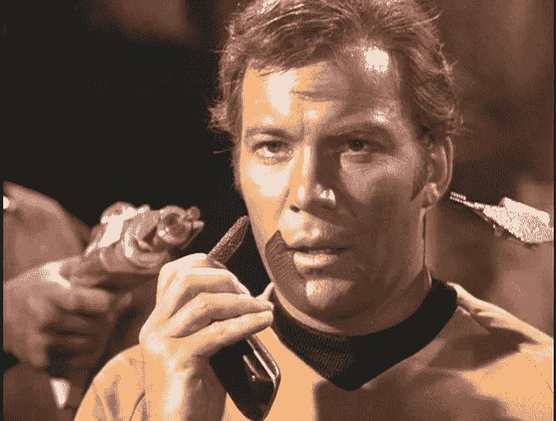

# 《星际迷航》:第 928 课——智能手机只用于关键通信

> 原文：<https://medium.com/hackernoon/all-i-need-to-know-i-learned-from-watching-star-trek-lesson-928-287163563d77>

许多年前，我读了一本名为《我真正需要知道的一切都是从看《星际迷航》中学到的》的书。我被它吸引，不仅因为我是它的粉丝，还因为我确实同意，巧合的是，生活中许多伟大的教训都浓缩在这部伟大的电视剧中。好吧，具体来说:*原系列*、*下一代*和*航海家*——而不是*深空九号*和那个叫做*企业号*的可怕的重启借口。关于 [*发现*](http://www.cbs.com/shows/star-trek-discovery/) *还没有定论。*【2017 . 10 . 9 更新:*发现*很好】——不过我跑题了。

这本书引用了许多例子，包括关系、工作满意度、管理、家庭、和平、战争、爱、恨、生命、死亡和人类的整体本性——它以最搞笑的方式解释了“你在生活中将要面对的每一种情况都已经被星舰企业的船员们面对过了。”

鉴于这本书是在 90 年代中期写的，我认为现在可能是至少进行一次补充的时候了:虽然手持通信器在 1967 年第一部《T21》播出时还是幻想的东西，但在许多方面我们已经远远超过了星际舰队标准版本的能力。有人可能会说，今天的 iPhone 实际上是一个通信器和斯波克的三录仪的组合，但电池寿命更长。

这让我开始思考。那些设备只在非常需要的时候使用。需要传送吗？通信员。检查碳基生命的迹象？三录仪。有一件事我们没看到？企业号上的军官们粘在他们的通讯器上，检查社交媒体，玩游戏等等。

大约一个月前，我决定应用《星际迷航》中的人生经验，我删除了 iPhone 中除了关键应用程序之外的所有程序。没有社交媒体，没有游戏… *Pagh* (那是克林贡语“没有”的意思)。通知现在只来自人类，即短信&电话——没有推特，没有天气，没有新闻快讯——只有人们的向内通信。

当我在笔记本电脑上时，我仍然可以访问有趣的内容，但我不会沉迷于那个屏幕，也不会一直带在身边。仅仅几周之后，我现在变得更有效率、更专注、更专注。这种转变很难，但我强烈推荐它。

如果你和我一样，总是在寻找更有生产力和效率的方法，我强烈推荐应用《星际迷航》中的这个简单的教训:

想要有时间、创造力和注意力去探索陌生的新世界吗？去寻找新生命和新文明？大胆地去没人去过的地方？首先，扔掉手机上不必要的应用程序。

*原载于*【www.peterbrack.com】