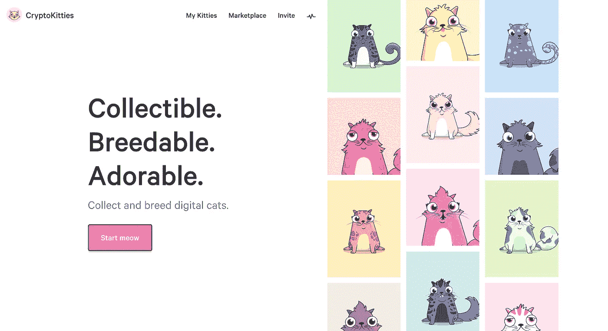

# 所有的平台都需要一款黑仔应用——Cryptokitties 是区块链的不二之选

> 原文：<https://medium.com/hackernoon/all-platforms-need-a-killer-app-cryptokitties-is-the-one-for-blockchain-87db95b02fb4>

我一直喜欢投资能够成为平台的*公司，但不投资平台*。那是什么意思？嗯，简洁点说，卖平台挺难的。你需要向用户/客户展示你的平台是如何解决问题的。每个平台都需要一个杀手级应用来展示平台的力量——秀不要说。回到 [webmethods](https://en.wikipedia.org/wiki/WebMethods) ，DHL 就是这样使用 WIDL(XML 的前身)在其他网站嵌入跟踪信息的。对于 [twilio](http://twilio.com) ，这是[的第一个大机会](https://www.forbes.com/sites/miguelhelft/2016/09/14/the-wizard-of-apps-how-jeff-lawson-turned-twilio-into-the-mightiest-unicorn/#32ccf585b580)成为优步的短信提供商。对于区块链，它是比特币，对于以太坊和智能合约，它是 [Cryptokitties](https://www.cryptokitties.co/my-kitties) 。是的，密码猫。

它正在接管以太坊区块链，尽管有各种企业智能合同和跟踪区块链资产的想法，cryptokitties 是第一个杀手级应用程序(在货币之外)，向最终用户展示他们如何在区块链上创建独特的资产，以及创建、共享、跟踪、交易和销售数字商品。迄今为止，估计交易额超过 1000 万美元，单只猫售价超过 10 万美元。是的，这些数字听起来很疯狂，但我的观点是，像这样的去中心化应用程序向世界展示了以太坊区块链的力量。

根据 cryptokitties 网站:

> *CryptoKitties 是世界上首批基于区块链技术的游戏之一，这一突破使得比特币和以太坊成为可能。比特币和以太是加密货币，但 CryptoKitties 是加密收藏品。你可以像购买传统收藏品一样购买、出售或交易你的 CryptoKitty，因为区块链会安全地追踪所有权。*

要加入进来，我们需要从一个 [Metamask.io](http://metamask.io) 插件开始，将我们的浏览器连接到以太坊区块链和分布式应用的世界。这很简单，一旦你开始运行，你需要通过[比特币基地](http://coinbase.com)或直接转账给你的账户添加一些以太币。一旦你的账户里有了乙醚，你就可以买一只小猫，在不知不觉中进入区块链的世界。

因此，尽管我们一直在讨论将汽车所有权、房地产所有权和其他独特的资产放在区块链上，cryptokitties 这款有趣且令人上瘾的游戏是展示区块链在资产追踪和所有权方面有多么强大的一个应用程序。想一想还有什么其他企业数字资产可以类似地放在区块链上也不是什么难事。