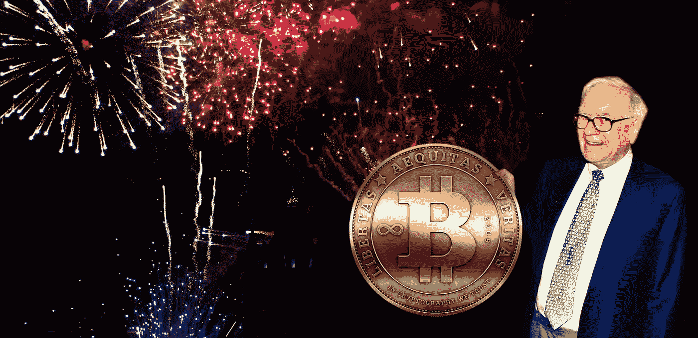
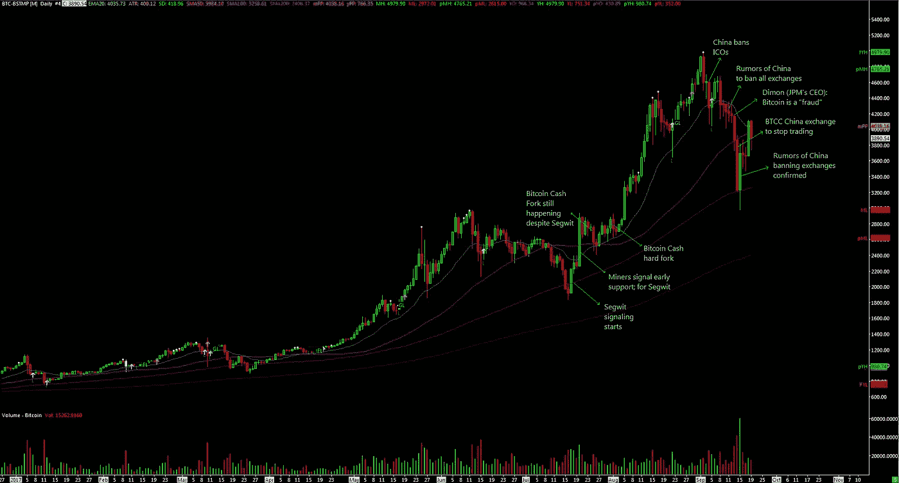
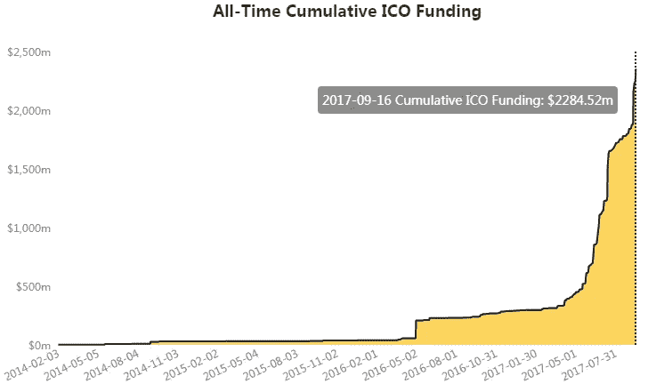

# 精明投资者的加密货币概述

> 原文：<https://medium.com/hackernoon/all-you-need-to-know-about-cryptocurrencies-an-overview-for-the-savvy-investor-bdc035b14982>

Warren Buffett: “**Never invest** in a business **you cannot understand**”.

T 何[区块链](https://www.cnbc.com/video/2017/03/30/what-is-blockchain-cnbc-explains-the-break-though-technology.html) **技术是革命性的。**然而，投资者在提供可怕价值主张的加密货币上投入了数百万美元，尽管最近由于[中国禁止加密货币交易所](https://www.bloomberg.com/news/articles/2017-09-15/china-is-said-to-call-for-bitcoin-exchange-halt-by-month-end-j7lblmdg)，**加密货币仍处于泡沫模式**。

价格可能上涨得太快了:从 2017 年初到现在，[加密货币的总市值](https://coinmarketcap.com/charts/)已经从 180 亿美元增长到 1350 亿美元，增长了 650%。很多估值高得离谱；没有内在价值的加密货币目前价值上亿。尽管投资者热情高涨，但是**技术是开创性的，**基本面通常非常好，一旦加密货币被大规模采用，投入到极其糟糕的投资中的数亿美元应该会成为**沧海一粟。**

这里存在一个看似矛盾的地方。投资于基本面坚实的企业通常是一项好的投资，而不是糟糕的投资。如果企业基本面很好，怎么会有问题呢？解释很简单。对区块链项目的投资不是通过传统渠道(即股票、债券等)，而是通过一种新的渠道:加密货币本身；并且**加密货币通常代表有严重缺陷的投资工具**。

这篇文章旨在为精明的投资者提供加密货币的**深度概述。它包括以下内容:**

*   为什么比特币和以太坊有内在价值，
*   加密货币和数字代币的技术概述，
*   首次硬币发行(ico)，
*   为什么会有泡沫，还有
*   为什么泡沫尽管前景光明。

# 比特币

[比特币](http://preshing.com/20140127/what-is-a-bitcoin-really/)是**的加密货币之王**。它目前的市值是[650 亿美元](https://coinmarketcap.com/currencies/bitcoin/)。比特币区块链提供了一个去中心化的点对点电子现金系统。批评者可能会说比特币没有内在价值，认为它是一种*金融资产*，其货币价值完全来自人们的感知，而且与法定货币不同，它没有央行储备的支持。

批评者误解了比特币。比特币的行为就像一种金融资产。比特币像金融资产一样使用。但比特币实际上代表的是*财产*，而不是金融资产。换句话说，**比特币是一种像金融资产一样交易的财产**。为什么我说比特币代表财产？考虑下面的[定义](https://en.wikipedia.org/wiki/Financial_asset):“金融资产是一种非实物资产，其价值来源于合同债权”(即金融资产代表对他人的负债)。比特币是一种非实物资产，但它不代表任何合同债权。它是一种资产，不是任何实体或个人的负债。

从这个有利位置来看，比特币类似于黄金。黄金也代表了像金融资产一样交易的财产。黄金的价值来源于人们对黄金作为法定货币替代品和长期价值储存手段的看法。黄金无疑具有内在价值。它是一种导电的金属，不会失去光泽，并且有[无数的实际生活用途](http://www.usfunds.com/slideshows/the-many-uses-of-gold/#.WaPBRrKGPdd)。大约[黄金需求的一半来自珠宝和科技](http://www.gold.org/research/gold-demand-trends/gold-demand-trends-q2-2017#package)(黄金用于电子产品内部)。同样，比特币的价值来自于人们对比特币作为法定货币替代品和购买力储备的看法。但比特币也可以被认为具有内在价值。把比特币想象成一件无法破解的电子艺术品，只能通过持有密钥来转移。创造一枚比特币需要先进的编码和强大的计算能力。比特币是不可复制的数学艺术。

即使有一天比特币被认为是一种令人沮丧的技术，鉴于其固定的最大供应量，比特币可能会保持价值，因为它是同类产品中的第一个。所以**最好的情况是，比特币仍然处于加密货币的前沿；最坏的情况是，它变成了珍贵的遗物**。当然，除非有一天有人发现[如何黑掉比特币区块链](https://www.quora.com/How-can-Bitcoin-be-hacked-How-could-a-malicious-entity-either-hack-the-Bitcoin-network-by-stealing-BTCs-or-shock-it-to-death-triggering-panic-and-drops-in-BTC-value)，在这种情况下，比特币会很快降为零。

# 以太坊

[以太坊](https://blockgeeks.com/guides/what-is-ethereum/)是第二受欢迎的加密货币，也是区块链即服务的**之王。它是一个带有图灵完全脚本语言的可编程区块链。像比特币一样，它提供了一个去中心化的点对点电子现金系统。与比特币不同，以太坊允许创建 [**智能合约**](https://blockgeeks.com/guides/smart-contracts/) (即一旦满足某些条件就会自动执行的编程代码)。与比特币不同的是，以太坊开发者可以构建和部署****【基于以太坊的分散式脸书】。******

****智能合同和分散应用程序使以太坊能够根除从基本用户应用程序到如何开展业务的一切。考虑一个建立在以太坊上的去中心化的脸书，用户控制他们自己的数据。考虑分散的自动执行[保险合同](https://etherisc.com/)或[金融衍生品](/@vishakh/a-deeper-look-into-a-financial-derivative-on-the-ethereum-blockchain-47497bd64744)。考虑分散廉洁的[投票平台](https://www.coindesk.com/voting-scheme-ethereum-doesnt-give-away-vote/)。考虑分散的[预测平台](/@cryptojudgement/gnosis-decentralized-prediction-market-platform-24d100cd8d47)。可能性不胜枚举。简而言之，人们可能会认为以太坊是一个**去中心化的虚拟机**或超级计算机，它可以重新定义我们所知道的世界。****

****[以太](https://www.ethereum.org/ether)是区块链以太坊的加密货币。它既是加密货币，也是接入以太坊网络的支付手段。以太坊用户用以太支付他们正在使用的计算能力。**那么就把以太想象成给以太坊网络供电的燃料**。这是以太内在价值的来源。以太公司目前的市值为 270 亿美元。应该注意的是，即使以太坊是区块链，以太是货币，大多数人还是把以太称为以太坊。****

# ****加密货币的技术概述****

*****(本节内容繁重，如果您已经熟悉加密货币和以太币的技术方面，可以跳到下一节)*****

****—加密货币、虚拟货币、电子硬币、数字硬币、数字代币和区块链代币是同一事物的不同名称。****

****—加密货币是存储在被称为区块链的分散公共账本上的 [**数字签名**](https://en.wikipedia.org/wiki/Digital_signature) 的**链(关于深入的解释，请参考中本聪的原始[比特币白皮书](https://bitcoin.org/bitcoin.pdf))。******

****—拥有一种加密货币意味着拥有一个**私钥**(类似于密码)，让持有者能够将加密货币转移给其他人。私钥存储在[数字钱包](http://cryptocurrencyfacts.com/what-is-a-cryptocurrency-wallet/)中。****

****—加密货币通过在区块链中添加交易从一个所有者转移到另一个所有者(深度解释[此处](http://preshing.com/20140127/what-is-a-bitcoin-really/))。****

****—通过验证者的工作，区块链被保护**免受黑客攻击，验证者验证交易(这里有更深入的解释[)。](https://www.multichain.com/blog/2015/07/bitcoin-vs-blockchain-debate/)******

****—验证者每次验证交易时都会获得加密货币作为奖励/支付(即**加密货币为人们成为验证者提供经济激励**)。验证者也可以获得由发送者支付的[交易费](https://en.bitcoin.it/wiki/Transaction_fees)。****

****—有多个**共识机制** 对交易进行验证。主要的有:****

*   ****工作证明(PoW):验证者通过运行一种算法来验证事务，从而解决一个密码难题。这就是所谓的[采矿](https://bitcoin.stackexchange.com/questions/8031/what-are-bitcoin-miners-really-solving?newreg=4c9a69c209c643af8c279a89c01423c0)。采矿创造了新的硬币。验证者将获得新硬币和交易费(如果有的话)。****
*   ****[利害关系证明](https://en.wikipedia.org/wiki/Proof-of-stake) (PoS):验证者通过赌注(“存款”)加密货币来验证交易。没有新的硬币被创造出来。验证者只获得交易费。****

****—加密货币可以通过**挖掘**(例如比特币)或简单地将硬币分配到一个地址(例如 [Ripple 的 XRP](https://bitcointalk.org/index.php?topic=146964.0) )来创建。后者被称为 [**预采**](https://www.cryptocompare.com/coins/guides/what-is-a-premine/) 。习惯上称未开采的硬币为预开采的，即使这样做在技术上是不正确的，如果硬币是不可开采的，比如瑞波的。“预开采”一词来自区块链开发者在向公众发布区块链的源代码，允许公众开采之前为自己创造可开采硬币的做法。****

****—加密货币可以定义为**原生令牌**，它是区块链固有的，用于验证(如比特币)，以及**非原生令牌**，它是在以太坊等可编程区块链的基础上创建的，用于多种用途(稍后将详细介绍)。****

*   ****在以太坊上创建一个令牌就像写 [25 行代码](https://www.ethereum.org/token)一样简单。这使得**以太坊成为最广泛使用的非本地令牌创建协议**。非本地令牌可以被挖掘或预先挖掘，尽管它们通常是完全预先挖掘的。****
*   ****名称**数字代币**主要用于指代建立在以太坊平台上的加密货币(即以太坊代币)，尽管从技术上讲所有的加密货币都是数字代币。****

****—加密货币也可分为 [**协议令牌或**](https://blog.0xproject.com/the-difference-between-app-coins-and-protocol-tokens-7281a428348c)App 令牌。****

*   ****协议是一组规则，而应用程序是建立在协议之上的计算机程序。****
*   ****每个区块链有一个本地协议。非本地协议可以建立在以太坊等可编程区块链之上。****
*   ****协议运行需要协议令牌。协议令牌可以是本机的，也可以是非本机的。大多数本机令牌是协议令牌(Ripple 的 XRP 是一个值得注意的例外)。****
*   ****应用程序或协议不需要应用程序令牌。相反，应用程序用户通常使用应用程序令牌来访问应用程序的服务。****

# ****首次硬币发行****

****公众可以通过采矿、在二级市场购买(即通过点对点交易或交换)或参与[首次硬币发行](https://www.cryptocompare.com/coins/guides/how-does-an-ico-work/)(即直接从代币创造者处购买)来获得代币。**首次公开募股(ico)类似于** [**首次公开募股**](http://www.investopedia.com/terms/i/ipo.asp)**(IPO)，投资者购买的是加密货币而不是股票**。两者之间有一些显著的差异:****

*   ****股票给了股东公司的股权，而加密货币没有给硬币持有者任何股权。****
*   ****股份赋予股东权利，而加密货币并没有赋予持有者任何权利(除了少数罕见的例外)。****
*   ****股票作为[证券](http://www.investopedia.com/terms/s/security.asp?)受到监管，而硬币则不受监管(尽管这种情况正在发生变化，例如参见美国最近的发展[这里](https://www.americanbanker.com/news/sec-report-may-put-an-end-to-ico-boom))。****
*   ****加密货币通常用其他加密货币支付，这有利于国际用户的参与。****

****人们可以把 ico 想象成**大众化的风险投资**，或者[风险投资](https://en.wikipedia.org/wiki/Venture_capital)遇上[众筹](https://en.wikipedia.org/wiki/Crowdfunding)。ico 为区块链爱好者提供了投资区块链初创企业的直接而便捷的途径。ico 使区块链初创企业能够绕过风险投资公司筹集早期资本，甚至没有稀释股权。对于愿意放弃与传统融资相关的股权所有权以换取高流动性投资(典型的风险资本投资缺乏流动性，投资者可能需要很多年才能套现)的风险资本公司来说，ico 也非常有用。****

****ico 的主要缺点是缺乏监管，这使得那些筹集资金的人向投资者提供最少的披露，“[夸大收益，未能识别风险，并制造未经证实的炒作](https://bitsonblocks.net/2017/04/25/a-gentle-introduction-to-initial-coin-offerings-icos/)。筹资者甚至可能是匿名的，例如非常受欢迎的 [Bitconnect](https://steemit.com/bitconnect/@crypto-investor/the-bitconnect-whitepaper-maths-of-a-ponzi) ( [BCC](https://coinmarketcap.com/currencies/bitconnect/) ，市值 9.1 亿美元——注[根据定义](https://en.wikipedia.org/wiki/Market_capitalization)市值不是《coinmarketcap.com》列出的数字，[使用流通供应量](https://coinmarketcap.com/faq/)计算得出，而是价格乘以总供应量得出的通常要大得多的数字)。****

****关于 ICO 的进一步阅读，我推荐这篇[文章，它涵盖了 ICO 披露法规的缺失](https://www.law111.com/ico-issuers-must-self-regulate-while-regulators-get-up-to-speed)。****

# ****ICOs &非本地令牌****

****以太坊让开发者可以轻松创建数字代币，而 ico 让投资者可以轻松访问这些数字代币。宽松的监管框架加上企业家与热切的投资者之间的轻松匹配，导致了大规模的 ICO 热潮。正是在非本土代币的 ico 中，投资者的**非理性繁荣**变得显而易见。****

****无知的或有见识的，不老练的或老练的…各种类型的投资者都在参与 ico，并在通常毫无价值的代币上投入数亿美元，这些代币给投资者带来的除了日后以更高价格出售代币的可能收益之外，几乎没有任何其他收益。****

****想象一下佩达·布洛克(双关语)，一位寻求融资的精明企业家。想象一下，佩达不是通过发行股权(股票)或偿还资金的法律承诺(贷款、债券)来筹集资金，而是通过分发没有法律支持的漂亮纸片来表示他计划偿还。现在想象一下，佩达实际上是通过发放漂亮的纸币来获得资金，而这些纸币甚至没有承诺偿还。此外，想象一下，佩达实际上是匿名的，他甚至不必公开自己的身份来筹集资金。这种情况正在一些 ico 中发生。 [**庞氏骗局**](https://en.wikipedia.org/wiki/Ponzi_scheme) 比比皆是。 [OneCoin](https://en.wikipedia.org/wiki/OneCoin) 是最著名的被揭露的庞氏骗局。Bitconnect 是一种加密货币，提供[保证的 149%年化回报](https://bitconnect.co/bitcoin-information/19/investing-in-bitconnect-lending)(假设每日再投资)加上由“波动性交易机器人”产生的可变回报，在我看来，这是当今时代最引人注目的庞氏骗局。****

****想想吧…****

*   ****购买股票，获得公司的合法所有权。****
*   ****购买债券，并获得收取利息的权利。****
*   ****购买比特币，你将获得一笔流动资产，它的价值来自致力于创造这种数学艺术的计算能力。****
*   ****购买以太，获得一项流动资产，这项资产的价值来源于专门用于创造以太的计算能力，以及作为使用以太坊超级计算机的支付手段的价值。****
*   ****购买任何本地令牌，并获得一种加密货币，为区块链的运行提供经济激励。****
*   ****购买一个非本地令牌…你会得到什么？****

## ****有 ***八个*类别的非本地令牌**:****

1.  ****协议令牌。(例如[预兆](https://augur.net/) : [代表](https://coinmarketcap.com/assets/augur/)，市值 2 亿美元)。****
2.  ****为访问发行公司的平台/服务而发行的代币；准确地说，是未来的服务，因为在大多数情况下，代币是在平台仅仅是一个想法的时候发行的。把它们想象成公用代币或[礼品卡或](https://keepingstock.net/why-api-tokens-are-horrible-for-investors-users-and-business-61b0137f0f98)。(例如 [Factom](/@maxmiddelman/factom-is-awesome-and-this-is-why-c3c4780211db) : [FCT](https://coinmarketcap.com/currencies/factom/) ，市值 1.6 亿美元)。****
3.  ******资产支持代币**，其中区块链资产代表对基础资产的债权，而对基础资产的债权将区块链资产(即代币)发送给发行方。(例如[系绳的](https://www.cryptocompare.com/coins/guides/what-is-usdt-and-how-to-use-it)美元: [USDT](https://coinmarketcap.com/assets/tether/) )。****
4.  ****根据参与未来收入的**承诺而发行的代币，尽管公司通常没有兑现此类承诺的法律义务。参与的百分比和时间几乎总是没有定义。(例如 [DigixDAO](https://www.forbes.com/sites/rogeraitken/2016/04/23/digital-gold-done-right-with-digixdao-crypto-trading-on-openledger/) : [DGD](https://coinmarketcap.com/assets/digixdao/) ，市值 1.5 亿美元)。******
5.  ****代币**据说代表发行公司的股权**，给予代币持有者作为股东的投票权，参与未来的分红，以及公司的所有权。(例如[莱克](/@pullnews/the-story-of-the-lykke-coin-251b8179480c) : [LKK](https://coinmarketcap.com/currencies/lykke/) ，市值 4.1 亿美元)。****
6.  ****根据**升值承诺**发行的代币，由公司承诺在可持续收入实现后回购并销毁代币。(例如[人口众多](https://bitcointalk.org/index.php?topic=1866936.200) : [PPT](https://coinmarketcap.com/assets/populous/) ，市值 1.5 亿美元)。****
7.  ****发行的代币没有任何价值主张。把它们想象成玩具赌场代币。(例如[Steemit](https://steemit.com/steemhelp/@aem/steem-for-noobs):[STEEM](https://coinmarketcap.com/currencies/steem/)，市值 2.9 亿美元)。****
8.  ****潜在的**骗局**(例如[真实](/@EthereumRussian/veritaseum-is-a-scam-c6e05fb1e4eb) : [VERI](https://coinmarketcap.com/assets/veritaseum/) ，市值 89 亿美元——注意只有 2%的硬币在流通)。****

****礼仪代币(#1)和礼品卡代币(#2)肯定很有价值。如果相关的区块链或服务变得流行，它们的价值也会相应上升。它们代表了对底层技术成功的一种押注。****

******资产支持代币(#3)很有用**(例如，以数字形式转让 1000 盎司黄金的所有权比以实物形式转让更容易)。它们的缺点是发行公司的信用风险(如果他们破产或携款潜逃怎么办？).****

******提供收入分成的代币(#4)可能很有价值**。理想情况下，参与条件(百分比、时机)将在 ICO 之前定义，利润分配将按照智能合同中硬编码的指令[自动发生——尽管这并没有发生。一些发行人发挥创意，将这些代币定义为“经济股”或“非所有权股”，试图传达代币是股份，但事实并非如此。](https://en.wikipedia.org/wiki/Hard_coding)****

******股权代币(#5)类似于参与代币**，其中明确提及“股息”和/或投票权**。**发行人大多避免使用股票代币，以降低监管机构将代币归类为受监管证券的可能性。股票代币的营销通常具有误导性，因为简单地将代币称为股票并不能使代币成为股票。没有股权文件支持的[代币不能成为股权](https://prestonbyrne.com/2016/08/12/against-crowdsales/)。股票配售要求向监管机构提交文件，并为投资者发布招股说明书。此外，即使有股权文件，目前还不清楚股权代币是否可以合法代表股份(法律因国家而异，可能会发生变化)。****

******后三种非本地令牌(# 6–8)几乎没有任何内在价值**。然而，投资者们狼吞虎咽，往往分不清伟大的项目和伟大的价值。一个项目可能代表一个奇妙的想法，而相关的投资工具却可能为投资者提供可怕的价值。我们不仅在这里谈论伟大的想法；一个人可以得到任何想法(即使是一个可怕的想法，如[他妈的硬币](https://motherboard.vice.com/en_us/article/evd5je/an-ethereum-token-called-fuck-raised-dollar30000-in-30-minutes))，把它与一个无附加条件的令牌捆绑在一起，投资者的钱可能会随之而来。有人甚至为[无用的以太坊令牌](https://qz.com/1023501/ethereum-ico-people-invested-thousands-of-dollars-in-useless-ethereum-token-uet/)推出了 ICO，并筹集了 4 万美元。****

# ****加密货币泡沫****

****尽管在中国禁止加密货币交易后，近期市场有所调整，但今年比特币仍然上涨了 305%。[乙醚今年上涨 3400%](https://www.tradingview.com/symbols/ETHUSD/) 。这代表泡沫吗？不一定。 [ICO 量增长 675%](https://www.coindesk.com/ico-tracker/) 今年:累计 ICO 资金为 23 亿美元，截至 1 月 1 日为 2.95 亿美元。如果你从 5 月 1 日开始计算，那么比特币上涨了 190%，以太上涨了 240%，ICO 基金上涨了 420%。****

********

****为什么 ico 如此重要？毕竟，比特币和以太网代表了加密货币总市值的三分之二。那么 ico 为什么重要呢？因为 ico 大部分是用比特币和以太支付的，还有大量代币是以太币代币。**ico 在推动价格！******

********

****鉴于推动价格的是真实项目，人们可能会认为不存在泡沫。对吗？现在，请记住投资者是如何向 ico 投入数亿美元的，这些 ico 的代币充其量只是礼品卡，最糟糕的是善意承诺。如果没有闪亮的硬币，这些项目中的许多将不会从投资者那里得到一分钱。公司用不代表责任的代币融资，然而投资者*说服自己*这些代币给予投资者*权利*参与企业的成长。投资者表现得不理性。**投资一种价值取决于公司管理层商誉的资产代表着泡沫行为，让人可以得出确实存在泡沫的结论。******

****公开交易的比特币投资工具是泡沫的明显证据。在没有比特币[交易所交易基金](http://www.investopedia.com/terms/e/etf.asp)(ETF)可供投资的情况下([美国证券交易委员会尚未批准任何](https://www.forbes.com/sites/forbesfinancecouncil/2017/04/04/what-will-it-take-for-a-bitcoin-etf-to-get-approved/#66b7fede36d0))，寻求在不购买比特币的情况下投资比特币的美国资产管理公司和投资者纷纷涌入比特币投资信托( [**、GBTC**](https://grayscale.co/bitcoin-investment-trust/#market-performance) )，这是一种公开上市的证券，旨在跟踪比特币的表现，因为它完全由比特币支持。对 GBTC 的需求如此之高，以至于 GBTC 目前的股价比其净资产价值有 90%的溢价(即 GBTC 根本没有很好地跟踪比特币)。****

****泡沫的另一个很好的例子是 [First Bitcoin Capital](http://bitcoincapitalcorp.com/about/) ，一家公开上市的加拿大公司( [**BITCF**](https://www.bloomberg.com/quote/BITCF:US) )，它自称是一家垂直整合的比特币实体。这是一家用硬币自己编(即 TeslaCoilCoin)来分红的公司。查看这篇彭博的文章，这是一篇关于这个主题的有趣文章。这很有趣，只要你不是那些在 8 月份购买 BITCF 的人，因为它是少数几个投资比特币的公开交易替代品之一。8 月 24 日，SEC 暂停 BITCF 的交易 10 天，“因为担心该公司公开信息的准确性和充分性”。9 月 8 日，BITCF 恢复交易，开盘下跌 69%。****

****还需要说服吗？霍华德·马克斯最新的橡树资本备忘录列出了泡沫发生的九个必要条件——它指出,“其中几个条件会给我们带来牛市；它们都将带来繁荣或泡沫”。这是一本值得一读的书。同样值得注意的是，所有条件无疑都存在于加密货币市场中。****

# ****市场展望****

******泡沫还会继续吗？我相信会的。尽管中国颁布了禁令，但 ICO 淘金热远未结束。大多数机构投资者尚未参与这一资产类别。来自机构和高净值个人的大笔资金即将通过新成立的对冲基金进入市场。大多数散户不知道如何染指比特币和以太。相对来说很少有人了解比特币的工作原理，更不用说以太坊了。民意调查显示，极少有女性参与比特币热潮(coin.dance 发布了一项名为“[按性别划分的比特币社区参与度](https://coin.dance/stats/gender)”的每周民意调查，男性参与者的比例一直在 95%以上)。比特币诞生于 8 年前，但区块链行业仍处于起步阶段，尚未被大规模采用。前景一片光明。******

******主要的市场风险是政府干预的可能性**。中国刚刚禁止了所有加密货币交易，没有什么能阻止其他国家走这条路。政府对加密货币规避资本管制的能力，以及逃税者和洗钱者对加密货币的使用，并不感到欣喜若狂。此外，你可以放心，如果加密货币增长到足以影响央行决定货币政策的能力，即使是最支持自由市场的西方政府也会迅速禁止或严格监管加密货币。****

****话虽如此，有人可能会问，**目前的水平代表着一个好的买入价格吗？**要回答这个问题，请看以下内容:****

1.  ****9 月 4 日，中国禁止 ico，9 月 15 日**中国监管机构宣布加密货币交易所必须在 9 月 30 日前停止交易**。这导致价格大幅下跌。比特币从 9 月 4 日的 4400 美元跌至 9 月 15 日的 2970 美元，随后在同一天的创纪录成交量中反弹约 30%。该禁令将目前全球需求的五分之一拒之门外(例如，根据 bravenewcoin.com 的统计，BTC/CNY 的销量占全球销量的 18%)。这将减少流向加密货币的资本，但不会影响长期基本面。****
2.  ******乙醚有过闪电崩盘的历史**:2017 年 7 月 18 日，乙醚在短短 3 秒内下跌并反弹了整整[20%](https://ibb.co/muNaR5)(发生在现已倒闭的 [BTC 电子交易所](https://www.theverge.com/2017/7/29/16060344/btce-bitcoin-exchange-takedown-mt-gox-theft-law-enforcement))，2017 年 6 月 21 日，乙醚[在几秒内从 319 美元跌至 0.10 美元](https://www.bitsonline.com/gdax-eth-trading-flash-crash/)，不到两分钟就几乎完全恢复(发生在 GDAX 交易所；注意 [GDAX](https://cointelegraph.com/news/gdax-to-compensate-customers-who-lost-money-in-eth-flash-crash) 并没有取消交易，那些从买入崩盘中获利的人保留了他们的利润，然而 [GDAX 却从口袋里掏出钱来补偿](https://cointelegraph.com/news/gdax-to-compensate-customers-who-lost-money-in-eth-flash-crash)那些在崩盘中亏损的人。投资者可以利用限价单来利用闪电崩盘。****
3.  ****价格的关键决定因素是资本流动。大多数即将推出的 ICO 的信息都在[公开发布](https://tokenmarket.net/ico-calendar)，未来的 ICO 数量也可以估算。此外，**机构资金**正在路上。SEC 批准加密货币 ETF 的那一天，资金就会涌入。考虑到当前加密货币的总市值仅占前 400 家机构资产管理公司管理的资产的 0.17%。****
4.  ****想到**市场渗透**。一些估计表明，有 300 万加密货币用户，占全球 14 至 65 岁互联网用户总数的 0.14%。你能想象市场渗透率在五年内增加到 5%吗？这将意味着 1.05 亿用户。那么价格会发生什么变化呢？Snapchat 的第一位投资者 Jeremy Liew 认为，到 2030 年，比特币的用户将达到 4 亿，价格将达到 50 万美元。那会很过分吗？****
5.  ****[**预计比特币将在 11 月中旬**](/@jimmysong/segwit2x-what-you-need-to-know-about-the-2mb-hard-fork-27749e1544ce) 再次硬分叉，带来比特币协议治理方面的重大不确定性，甚至更大的双向价格波动。就其本身而言，这是短期看跌的充分理由。****

****耐心、果断和怀疑是精明投资者工具箱中的重要工具。是时候买了吗？你决定吧。****

# ****在你走之前…****

****如果你喜欢这一点，请考虑通过点击拍手按钮来表达你的支持，以及分享文章:[脸书](https://www.facebook.com/sharer/sharer.php?u=https://hackernoon.com/all-you-need-to-know-about-cryptocurrencies-an-overview-for-the-savvy-investor-bdc035b14982) | [推特](https://twitter.com/home?status=https%3A//hackernoon.com/all-you-need-to-know-about-cryptocurrencies-an-overview-for-the-savvy-investor-bdc035b14982)|[Reddit](http://reddit.com/submit?url=https%3A%2F%2Fhackernoon.com%2Fall-you-need-to-know-about-cryptocurrencies-an-overview-for-the-savvy-investor-bdc035b14982&title=An%20Overview%20of%20Cryptocurrencies%20for%20the%20Savvy%20Investor)|[LinkedIn](https://www.linkedin.com/shareArticle?mini=true&url=https://hackernoon.com/all-you-need-to-know-about-cryptocurrencies-an-overview-for-the-savvy-investor-bdc035b14982)|[Whatsapp](https://api.whatsapp.com/send?text=https://hackernoon.com/all-you-need-to-know-about-cryptocurrencies-an-overview-for-the-savvy-investor-bdc035b14982)|[电报](https://telegram.me/share/url?url=https://hackernoon.com/all-you-need-to-know-about-cryptocurrencies-an-overview-for-the-savvy-investor-bdc035b14982&text=An%20Overview%20of%20Cryptocurrencies%20for%20the%20Savvy%20Investor) | [微博](http://service.weibo.com/share/share.php?url=https://hackernoon.com/all-you-need-to-know-about-cryptocurrencies-an-overview-for-the-savvy-investor-bdc035b14982&title=%7Btext%7D) | [电子邮件](mailto:?subject=https://hackernoon.com/all-you-need-to-know-about-cryptocurrencies-an-overview-for-the-savvy-investor-bdc035b14982)。不要犹豫，在 Twitter 上关注我，保持联系。****

## ****______________________________________________________________________****

****声明:本文仅代表作者观点。它仅供参考，不应被视为投资建议。****