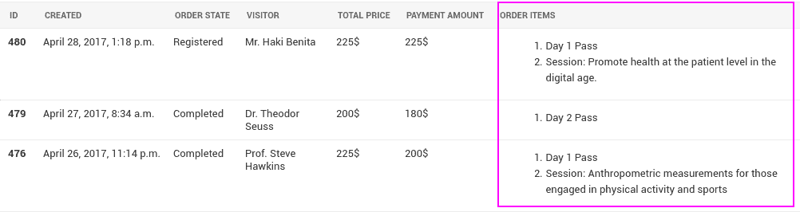

# 关于 Django 中的预取，您只需要知道

> 原文：<https://medium.com/hackernoon/all-you-need-to-know-about-prefetching-in-django-f9068ebe1e60>

为了更好的阅读体验，请在我的网站上查看[这篇文章。](https://hakibenita.com/all-you-need-to-know-about-prefetching-in-django)

我最近在为一个会议开发一个订票系统。对于客户来说，查看订单表非常重要，其中包含一个列，其中列出了每个订单中的程序名称:



模型看起来(大致)是这样的:

```
class **Program**(models.Model):
    name = models.CharField(max_length=20) class **Price**(models.Model):
    program = models.ForeignKey(Program)
    from_date = models.DateTimeField()
    to_date = models.DateTimeField() class **Order**(models.Model):
    state = models.CharField(max_length=20)
    items = models.ManyToManyField(Price)
```

*   **计划**是一个会议、讲座或研讨会日。
*   价格会随着时间的推移而变化，因此我们使用了一个名为 **Price** ，的模型，该模型被建模为一个 [type 2 渐变维度](https://en.wikipedia.org/wiki/Slowly_changing_dimension#Type_2:_add_new_row) (SCD ),它表示某个时间某个节目的价格。
*   用户可以注册一个或多个程序。**订单**中的每一项都是订单生成时的计划价格。

# 开始之前

在本文中，我们将监控 Django 执行的查询。要记录查询，将以下内容添加到`settings.py`中的`LOGGING`设置:

```
LOGGING = {

    ...   

    'loggers': {
 **'django.db.backends': {
            'level': 'DEBUG',
        },**
    },
}
```


Let’s see you trying to find an image related to prefetching…

# 有什么问题？

让我们尝试获取单个订单的程序名:

```
> **o = Order.objects.filter(state=’completed’).first()**(0.002) SELECT … FROM “orders_order” WHERE “orders_order”.”state” = ‘completed’ ORDER BY “orders_order”.”id” ASC LIMIT 1;> **[p.program.name for p in o.items.all()]**(0.002) SELECT … FROM “events_price” INNER JOIN “orders_order_items” ON (“events_price”.”id” = “orders_order_items”.”price_id”) WHERE “orders_order_items”.”order_id” = 29; args=(29,)(0.001) SELECT … FROM “events_program” WHERE “events_program”.”id” = 8; args=(8,)[‘Day 1 Pass’]
```

*   为了获取完成的订单，我们需要**一个查询。**
*   为了获取每个订单的程序名，我们需要再进行两次查询。

我之前[写过 N+1 问题](/@hakibenita/things-you-must-know-about-django-admin-as-your-app-gets-bigger-6be0b0ee9614)，这是一个经典案例。如果我们每个订单需要两个查询，**100 个订单的查询数将是 1 + 100 * 2 = 201 个查询——太多了！**

让我们使用 Django 来减少查询量:

```
> **o.items.values_list(‘program__name’)**(0.003) SELECT “events_program”.”name” FROM “events_price” INNER JOIN **“orders_order_items”** ON (“events_price”.”id” = “orders_order_items”.”price_id”) **INNER JOIN** **“events_program”** ON (“events_price”.”program_id” = “events_program”.”id”) WHERE “orders_order_items”.”order_id” = 29 LIMIT 21;[‘Day 1 Pass’]
```

**太好了！Django 在`Price`和`Program`之间执行了一个连接，并将查询数量减少到每个订单一个。**

此时，对于 100 个订单，我们只需要 101 个查询，而不是 201 个查询。

我们能做得更好吗？

# 为什么不能加入？

应该想到的第一个问题是*“为什么我们不能加入牌桌？”*

如果我们有一个外键，我们可以使用`select_related`或者像上面一样使用 snake case 在一个查询中获取相关字段。

例如，我们使用`**values_list(‘program__name’)**` **在单个查询中获取价格列表的程序名。我们之所以能够做到这一点，是因为每个价格都与一个项目相关。**

如果两个模型之间的关系是多对多，我们就不能这样做。每个订单都有一个或多个相关的价格—如果我们连接两个表，就会得到重复的订单:

```
SELECT
    o.id AS order_id,
    p.id AS price_id
FROM 
    orders_order o 
    JOIN orders_order_items op ON (o.id = op.order_id) 
    JOIN events_price p ON (op.price_id = p.id) 
ORDER BY 
    1,
    2;**order_id** | price_id 
----------+----------
       **45** |       38
       **45** |       56
       **70** |       38
       **70** |       50
       **70** |       77
       71 |       38
```

订单 70 和订单 45 有多个商品，所以它们在结果中出现不止一次— **Django 无法处理这个问题。**

# 输入预取相关

Django 有一个很好的内置方法来处理这个问题，叫做 [prefetch_related](https://docs.djangoproject.com/en/1.10/ref/models/querysets/#prefetch-related) :

```
> o = Order.objects.filter(
    state='completed',
)**.prefetch_related(
    'items__program',
)**.first()(0.002) SELECT ... FROM "orders_order" WHERE "orders_order"."state" = 'completed' ORDER BY "orders_order"."id" ASC LIMIT 1;(0.001) SELECT ("orders_order_items"."order_id") AS "_prefetch_related_val_order_id", "events_price"... FROM "events_price" INNER JOIN "orders_order_items" ON ("events_price"."id" = "orders_order_items"."price_id") WHERE "orders_order_items"."order_id" IN (29);(0.001) SELECT "events_program"."id", "events_program"."name" FROM "events_program" WHERE "events_program"."id" IN (8);
```

我们告诉 Django 我们打算从结果集中获取`items__program`。在第二个和第三个查询中，我们可以看到 Django 从`events_program`获取了直通表`orders_order_items`和相关程序。**预取的结果缓存在对象上**。

当我们试图从结果中获取程序名时会发生什么？

```
> **[p.program.name for p in o.items.all()]**[‘Day 1 Pass’]
```

**没有额外的查询** —这正是我们想要的！

当使用预取时，重要的是**处理对象而不是查询**。尝试用一个查询获取程序名会产生相同的结果，但会导致一个额外的查询:

```
**> o.items.values_list(‘program__name’)**(0.002) SELECT “events_program”.”name” FROM “events_price” INNER JOIN “orders_order_items” ON (“events_price”.”id” = “orders_order_items”.”price_id”) INNER JOIN “events_program” ON (“events_price”.”program_id” = “events_program”.”id”) WHERE “orders_order_items”.”order_id” = 29 LIMIT 21;[‘Day 1 Pass’]
```

此时，**获取 100 个订单只需要 3 次查询。**

我们能做得更好吗？

# 引入预取

在 1.7 版本中，Django 引入了一个新的`[Prefetch](https://docs.djangoproject.com/en/1.11/ref/models/querysets/#django.db.models.Prefetch)` [对象](https://docs.djangoproject.com/en/1.11/ref/models/querysets/#django.db.models.Prefetch)，扩展了`prefetch_related`的功能。

新对象允许开发人员覆盖 Django 用来预取相关对象的查询。

在我们之前的例子中，Django 使用了两个预取查询——一个针对直通表，一个针对程序表。如果我们能告诉姜戈把这两个人结合在一起会怎么样？

```
**> prices_and_programs = Price.objects.select_related(‘program’)**> o = Order.objects.filter(
    state='completed'
).prefetch_related(
 **Prefetch('items', queryset=prices_and_programs)**
).first()(0.001) SELECT … FROM “orders_order” WHERE “orders_order”.”state” = ‘completed’ ORDER BY “orders_order”.”id” ASC LIMIT 1;(0.001) SELECT (“orders_order_items”.”order_id”) AS “_prefetch_related_val_order_id”, “events_price”…., “events_program”…. INNER JOIN “events_program” ON (“events_price”.”program_id” = “events_program”.”id”) WHERE “orders_order_items”.”order_id” IN (29);
```

我们创建了一个将价格与程序联系起来的查询。然后我们告诉 Django 使用这个查询来预取值。这就像告诉 Django 您打算为每个订单获取项目和程序。

获取订单的程序名称:

```
> **[p.program.name for p in o.items.all()]**[‘Day 1 Pass’]
```

没有额外的查询, —成功了！

# 更上一层楼

当我们之前谈到模型时，我们提到价格被建模为 SCD 表。这意味着我们可能只想查询特定日期的有效价格。

如果价格在`from_date`和`end_date`之间，则价格在某一日期有效:

```
> now = timezone.now()> active_prices = Price.objects.filter(
    from_date__lte=now,
    to_date__gt=now,
)
```

使用预取对象，我们可以告诉 Django 将预取的对象存储在结果集的一个新属性中:

```
> **active_prices_and_programs = (
    Price.objects.filter(
        from_date__lte=now,
        to_date__gt=now,
    ).select_related('program')
)**> o = Order.objects.filter(
    state='completed'
).prefetch_related(
 **Prefetch(
        'items',
        queryset=active_prices_and_programs,
        to_attr='active_prices',
    ),**
).first()(0.001) SELECT … FROM “orders_order” WHERE “orders_order”.”state” = ‘completed’ ORDER BY “orders_order”.”id” ASC LIMIT 1;(0.001) SELECT … FROM “events_price” INNER JOIN “orders_order_items” ON (“events_price”.”id” = “orders_order_items”.”price_id”) INNER JOIN “events_program” ON (“events_price”.”program_id” = “events_program”.”id”) WHERE (**“events_price”.”from_date” <= ‘2017–04–29T07:53:00.210537+00:00’::timestamptz AND “events_price”.”to_date” > ‘2017–04–29T07:53:00.210537+00:00’::timestamptz** AND “orders_order_items”.”order_id” IN (29));
```

我们可以在日志中看到 Django 只执行了两个查询，预取查询现在包含了我们定义的自定义过滤器。

为了获取活动价格，我们可以使用在`to_attr`中定义的新属性:

```
> [p.program.name for p in **o.active_prices**][‘Day 1 Pass’]
```

**没有附加查询！**

# 最后的话

预取是 Django ORM 一个非常强大的特性。我强烈建议仔细阅读这些文件——你肯定会大获成功。

如果你喜欢 Django 优化技巧，可以看看我在 medium 上的其他故事:

[](/@hakibenita/things-you-must-know-about-django-admin-as-your-app-gets-bigger-6be0b0ee9614) [## 随着你的应用变得越来越大，关于 Django Admin 你必须知道的事情

### Django admin 是一个非常强大的工具。我们用它进行日常操作、浏览数据和支持。随着我们的成长…

medium.com](/@hakibenita/things-you-must-know-about-django-admin-as-your-app-gets-bigger-6be0b0ee9614) [](/@hakibenita/bullet-proofing-django-models-c080739be4e) [## 防弹 Django 模型

### 我们最近在我们的一个产品中添加了类似银行账户的功能。在开发过程中，我们遇到了…

medium.com](/@hakibenita/bullet-proofing-django-models-c080739be4e) [](https://hackernoon.com/timing-tests-in-python-for-fun-and-profit-1663144571) [## 为了乐趣和利益用 Python 进行计时测试

### 因为提高测试性能的第一步是意识！

hackernoon.com](https://hackernoon.com/timing-tests-in-python-for-fun-and-profit-1663144571) 

> [黑客中午](http://bit.ly/Hackernoon)是黑客如何开始他们的下午。我们是 [@AMI](http://bit.ly/atAMIatAMI) 家庭的一员。我们现在[接受投稿](http://bit.ly/hackernoonsubmission)并乐意[讨论广告&赞助](mailto:partners@amipublications.com)机会。
> 
> 如果你喜欢这个故事，我们推荐你阅读我们的[最新科技故事](http://bit.ly/hackernoonlatestt)和[趋势科技故事](https://hackernoon.com/trending)。直到下一次，不要把世界的现实想当然！