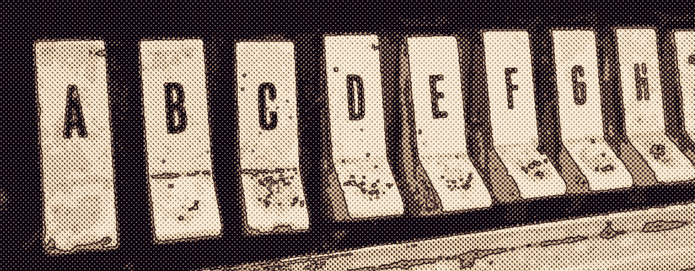
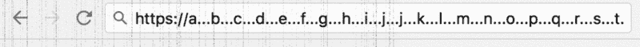

# 按字母顺序排列的互联网所有权

> 原文：<https://medium.com/hackernoon/alphabetical-internet-ownership-1a9bd9492f84>

A 代表【ALEXA.com】**(**[**括号内排名**](http://www.alexa.com/topsites) **)** 因为我们引用的是流量，虽然不知道有多准确。我们可以谷歌一下。

B 代表**BAIDU.com(第四)**因为他们提供了中国 40 亿月度搜索查询的大部分，而这仅仅是他们业务的开始。

C 代表**CNN.com(第 89 位)**因为新闻是所有者感兴趣的新闻，看到一个网站的本来面目并不流行。

D 代表**DROPBOX.com(第 72 位)**因为数字存储将永远是一个挑战，创建一个带有“咄”声的网站并不受欢迎。

E 代表 EBAY.com(第 32 位),因为他们让普通市民相信他们可以在互联网上赚钱。他们过去的排名要高得多。

F 代表 FACEBOOK.com(第三名)因为它是控制互联网上十亿个身份的幕后黑手。

G 代表**GOOGLE.com(第一)**因为我们对它的点击资助了字母表，现在它是我们相信可以结束任何争论的动词。

H 为 [**钢领**](http://hackernoon.com) **。com(**[**6358**](http://www.alexa.com/siteinfo/hackernoon.com)**)**因为我在评估网络新闻时代对“志同道合赞助”的利弊。

我支持**INSTAGRAM.com(第 16)**，因为它过滤了世俗的东西，他们在盗窃数码产品的[故事中并不感到羞耻](https://hackernoon.com/why-im-leaving-snapchat-for-instagram-stories-abf419963d08#.kcvd093w3)。

J 代表**JD.com(第 337 名)**因为为什么不把中国和世界的消费者联系起来。所以很少有网站以“j”开头

K 是给 **KINOGO.club(第 256th】因为是俄罗斯电影网站，也是唯一的。俱乐部是排名第一的网站。**

L 代表 LIVE.com(第 12 名)T2(第 3 名)，因为我们喜欢假装谷歌(第 5 名)并不垄断谷歌搜索。

M 代表**MSN.com(**[**第 42**](http://42hire.com)**)**因为它的排名高于它的母公司**微软(第 44)**但低于它的兄弟**(直播，第 12)。**

N 代表**NETFLIX.com(第 50)**因为他们为流媒体[娱乐](https://twitter.com/davidwadler/status/783736456607129604)的成本设定了市场价格。

代表 ONCLICKADS.com(31 日)因为我们不能忘记，眼球是用来让我们的手指知道点击哪个广告的。

P 代表**PINTEREST.com(第 45)**因为如果有更好的方式来组织图像，它将被这个字母世界所接受。

问代表**QQ.com(第 10)**因为谁不喜欢通过一排排没有图片的 8 字形标题阅读中文新闻呢？

R 代表**REDDIT.com(第 25)**因为对于互联网的特殊性质来说，没有哪个网站的结构比 upvote/downvote 更完美了。

SINA.com(第 19 位)【T45 位】代表**因为哇又一个中国媒体网站…不管政府，流量赚钱。**

T 代表**TWITTER.com(第 8)**因为也许有一天我会写信回家说:“嘿，妈妈，你不会相信，他们证实了[我](http://twitter.com/davidsmooke)！!"

U 代表**UOL.com.br(第 126 名)**因为葡萄牙语是一种美丽的语言，这里是葡萄牙语使用者最大的互联网门户。

V 代表**VK.com(第 15)**因为脸书不拥有欧洲！这家位于圣彼得堡的社交网络拥有 3.69 亿多用户。

W 代表**WIKIPEDIA.org(第五)**因为它改写了字典以外的任何术语。这是。com 重定向到它的。org，只有一个上榜！

X 代表 **XVIDEOS.com(第 74 届)**因为色情是互联网许多创新背后的驱动因素。

Y 代表 **YOUTUBE(第二)**因为世界历史上所有的视频都应该在**谷歌**的一个网站上，对吗？

Z 为**ZHIHU.com(第 135th】因为问答是互联网的光明与黑暗。除了网址，这个网站不是英文的。**

> 编者按:除了**“A”**和**“H”**因为**“啊”**互联网，每个网站都是 Alexa 排名最靠前的！

> 黑客中午是黑客如何开始他们的下午。我们是这个家庭的一员。我们现在[接受投稿](http://bit.ly/hackernoonsubmission)并乐意[讨论广告&赞助](mailto:partners@amipublications.com)机会。
> 
> 如果你喜欢这个故事，我们推荐你阅读我们的[最新科技故事](http://bit.ly/hackernoonlatestt)和[趋势科技故事](https://hackernoon.com/trending)。直到下一次，不要把世界的现实想当然！

