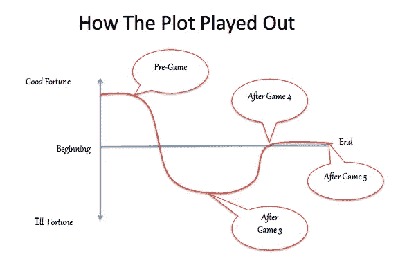
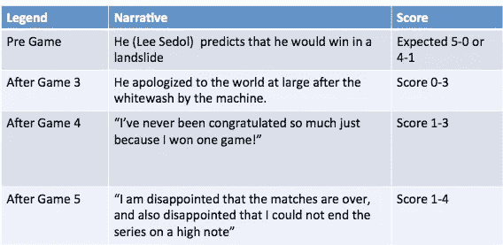

# 在机器学习和人类直觉的交汇点。谷歌品牌是赢家

> 原文：<https://medium.com/hackernoon/alphago-beats-lee-sedol-what-it-means-for-you-clear-winner-is-google-5264c0168692>

感谢谷歌的 AlphaGo 胜利。你同意吗？

****

我以为我知道。现在，我不太确定。

我一直认为我会一直庆祝人工智能的胜利，将其视为人类思维的胜利。1997 年“深蓝”战胜加里·卡斯帕罗夫时，我就有这种感觉。我年轻又认真。

最近，我看了地球上最聪明的棋手 Lee Sedol 与谷歌的 AlphaGo 之间的比赛。AlphaGo 以 4 比 1 赢得了比赛。我的左脑，逻辑思维，将人与机器的竞赛合理化为人类的胜利，不管结果如何。我的右脑不太确定。

> 当这台机器连续赢了前三场比赛时，整个世界(阅读新闻文章)开始窃窃私语计算机已经涉足的大 I 字(不，它不是苹果产品)——直觉。

直觉是我们(人类)的本能，我们还不知道它是如何工作的。我们只知道它在我们体内工作。报纸有办法用它们的标题劫持我们。

> 直觉被机器掌握了吗？还是只是媒体的空话？

以下是我以故事形式的叙述。(我一直梦想将一个对人类有意义的复杂话题转换成一个简单、引人入胜的故事。)

**设置**

两个玩家面对面坐着玩棋盘游戏，“Go”在中间。Lee Sedol 面前有韩国国旗。另一名棋手做出 AlphaGo 推荐的棋步。前面的旗帜是英国的米字旗。AlphaGo 是 Deepmind 的宝贝，一家被谷歌家族收购的英国公司。

这种设置会在所有五个游戏中重复。受库尔特·冯内古特故事叙述的启发，情感的过山车及其结局如下图所示。

**计算机实际上做了什么？(我的目标:没有人工智能行话的话)**

想起了一个关于学生的故事。我年轻的时候听过这句话。这个学生一直想去沃顿学习并获得工商管理硕士学位。于是，他去了趟费城，在沃顿商学院门前拍了张照片，从高中时代就一直放在电脑前。当我第一次读到这个故事时，让我印象深刻的是他头脑中清晰的目标，而这个目标又被眼前的景象所强化！他不知道具体是怎么做到的，但他做到了——他从沃顿商学院毕业，获得了工商管理硕士学位。

这正是这个 AlphaGo 所做的——至少在我看来是这样。它是由过去的游戏训练出来的，就像一匹戴着眼罩的马。这是我们期待机器学习去做的事情——谷歌的图片搜索就是一个很好的例子。

AlphaGo 有趣的地方在于它有特殊的眼罩，让眼睛有更广阔的周边来评估多个轨道选项(就像火车变轨的杠杆)。AlphaGo 有精神耐力来可视化不同轨道的可能结果(就像有图片的学生一样)并分配赔率。在这个过程中，它想象自己的游戏，自我从自己的创造中学习！

> 作为一个更好的计数员，AlphaGo 赢了前三局和第五局。这使得第四场比赛，李·塞多尔赢的那场比赛变得有趣起来。

与国际象棋不同，Alphago 实际上不可能模拟所有可能的路径——显然，在可观测的宇宙中，除了原子之外，还有更多选择。所以，它是基于路径样本的概率近似值。作为人类的天才，李发现了一条隐藏在不太可能的路线中的孤独之路。

> 赢得那场比赛后，人们起立为他鼓掌。赛后的庆祝活动讲述了世界的感受，以及我们的心倾向于哪一方以寻求安慰。

像我们许多人一样，在我内心深处，我对人类的胜利越来越多愁善感。我父亲曾半开玩笑地说，“随着年龄的增长，你会变得更加多愁善感，因为你有更多的东西可以回顾。”

这对你我意味着什么:我们的直觉和谷歌品牌。

我能肯定地分享的是奥运会取得的成就。在品牌方面 Alphabet 公司有最大的(间接)广告来吸引“算法”极客，这些极客给了它持续的智力优势。为了避免这个小细节被遗忘，观众中有 Alphabet 的首席执行官拉里·佩奇(Larry Page)，电脑程序名称 AlphaGo 的适用性以及他们卓越的(和潜意识的)营销变得显而易见。技术人才的战争正在进行，Alphabet 显然是今天的赢家。

人类对机器可能是明显的争论。我相信直觉仍然掌握在有着所有弱点的人类手中。所有机器所做的就是自我学习，解决目标明确且可量化的问题。

> 对我们中的一些人来说，目标充其量只是一个移动的目标。对我们许多人来说，生命像地球上的流浪者一样飘过。对于被选中的少数人来说，他们行走在这个世界上，假装他们知道他们未来的所有目标。电脑可以咀嚼的场景。在那之前，直觉是人类的特权。

谈论直觉和 LinkedIn——你的直觉告诉你不要联系一个联系请求，你仍然给他们好处。不到 10 分钟，他们就给你发来了一份 100 万美元的计划书和他们的私人邮件，而你因为没有听从自己的直觉，用手掌轻轻拍了拍额头。

> 这就是我们成为人类和有趣的原因——就像伟大的李·塞多尔，当他在工作时，他在座位上坐立不安，而另一边却像机器一样精确地工作。在那些时刻，我能和李·塞多尔产生共鸣。

我还记得传奇作家兼诗人玛娅·安杰洛令人回味的话，“人们会忘记你说过的话，会忘记你做过的事，但人们永远不会忘记你带给他们的感受。”

我将永远记得首尔奥运会给我的感觉，像你们中的许多人一样，在那之后我将继续我的生活——作为一个有着自己目标的地球流浪者。目标是另一回事。

对你在评论区的想法感兴趣。

— —

Karthik Rajan
我喜欢在分析和人际关系的交叉点上写作。

> [黑客中午](http://bit.ly/Hackernoon)是黑客如何开始他们的下午。我们是 [@AMI](http://bit.ly/atAMIatAMI) 家庭的一员。我们现在[接受投稿](http://bit.ly/hackernoonsubmission)并乐意[讨论广告&赞助](mailto:partners@amipublications.com)机会。
> 
> 如果你喜欢这个故事，我们推荐你阅读我们的[最新科技故事](http://bit.ly/hackernoonlatestt)和[趋势科技故事](https://hackernoon.com/trending)。直到下一次，不要把世界的现实想当然！

