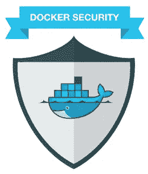
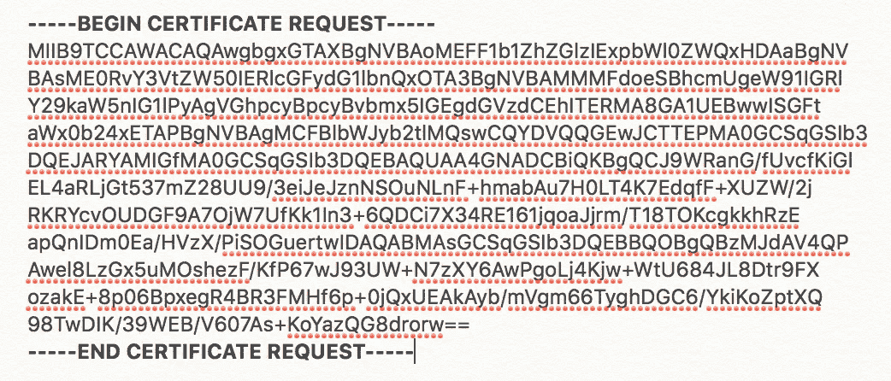
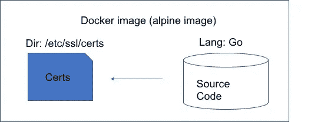

# 在 Alpine 映像中安装证书以建立安全通信(SSL/TLS)

> 原文：<https://medium.com/hackernoon/alpine-docker-image-with-secured-communication-ssl-tls-go-restful-api-128eb6b54f1f>

每个客户端/服务器通信都需要通过具有安全套接字层/传输层安全性的协议来保护。传输层安全性(TLS)的前身是安全套接字层(SSL)，TLS 存在的原因是因为 SSL 容易受到攻击，并且 SSL 与 TLS 在应用程序间通信的加密标准上有所不同。

应用程序之间的安全通信依赖于由客户端和服务器双方同意的认证机构(CA)分发的证书(cert)。CA 是一个发行数字证书的实体，它具有 x.509 标准(使用公钥加密)，少数领先的 CA 提供商是 Comodo、GoDaddy、Global Sign & Symantec。

本文将关注如何将证书安装到带有 RESTful API 的 docker 映像中。我们可以将本文分为三个部分，解释安全性的关键概念以及如何实现它。

*   证书格式
*   客户机/服务器通信和单向认证
*   将证书添加到 docker 映像

## 证书格式

大多数证书格式都带有后缀-。pem，。cer，。crt，。钥匙。与服务器通信的客户端(浏览器/客户端系统)将保持*。pem(隐私增强邮件)或. cer(SSL 证书的文件扩展名),用于建立安全连接。

**Common Format of a *.pem, *.cer, *.crt**

RSA(Rivest–sha mir–ad leman)算法用于加密和解密通信中的消息，其中一个密钥保持公开，另一个密钥保持私有，这定义了公钥加密(也称为非对称加密)的概念。使用 TLS 可以防止最常见的攻击，如 MITMA(中间人攻击)。注册机构(RA)帮助认证来自可用公钥基础设施(PKI)的证书，并充当 CA 的中间人。

## 客户机/服务器通信和单向认证

简而言之，下面总结了通过单向认证在两个资源之间建立安全连接的整个通信。

1.  客户端从服务器请求受保护的资源(RESTful API 调用)
2.  客户端向服务器提供用其公钥加密的信息
3.  服务器使用其私钥(仅在服务器端可用)评估请求，并根据请求的资源做出响应

对于相互身份验证，它的工作方式是相同的，客户端和服务器都提供它们的公钥，并用它们自己的私钥解密它们的消息。

## 将证书添加到 docker 映像

我们可以看到一个演示如何在一个 docker 容器中实现单向认证，这个容器有 Golang RESTful API。请参考文章 [Golang & Docker —企业模型的微服务(RESTful API)](https://hackernoon.com/golang-docker-microservices-for-enterprise-model-5c79addfa811)来说明创建 RESTful API 并将其打包成 Docker 映像的步骤。

docker 映像由多个资源组成，这些资源将构成一个容器，在云中独立地为请求提供服务，管理员负责在映像内部的根目录中安装相关证书，以确保其安全。另外，在代码中指示在调用其他安全 API 时考虑来自根的证书。

Image with certs installed

在 alpine 中，我们有一个名为 [ca-certificates](https://pkgs.alpinelinux.org/package/v3.3/main/x86/ca-certificates) 的包实用程序，它带有 Mozilla 浏览器的预装证书。此外，您需要使用 TLS 所需的第三方证书来更新捆绑包，这可以通过指定 Dockerfile 中的更新证书命令来完成。

> 来自阿尔卑斯山:最新
> 
> 运行 apk 更新&& apk 添加 ca 证书&& rm -rf /var/cache/apk/*
> 
> 收到。/mycert . CRT/usr/local/share/ca-certificates/mycert . CRT
> 
> 运行更新-ca-证书

将以下命令添加到解释以下步骤的 Docker 文件中。

*   从码头登记处调出阿尔卑斯山的图像
*   在 docker 映像中安装 ca-certificates 包，并删除 temp 文件夹
*   将证书从您的本地机器复制到要构建的映像中的所需文件夹。
*   运行命令 update-ca-certificates 将新证书更新到相应的文件夹中

以上步骤会将您的第三方证书添加到您的 docker 映像中，一旦映像构建完成且容器启动，Golang 库将检测证书(x.509 标准)并提供适当的公钥，以便与调用 API 建立安全连接