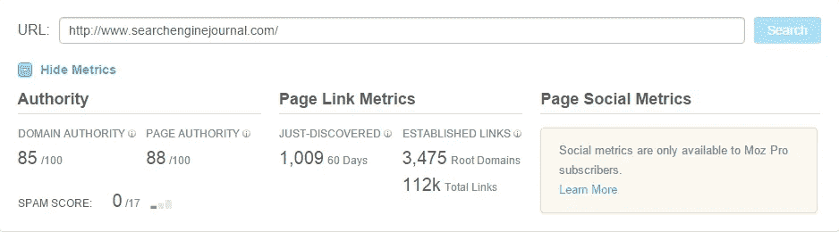
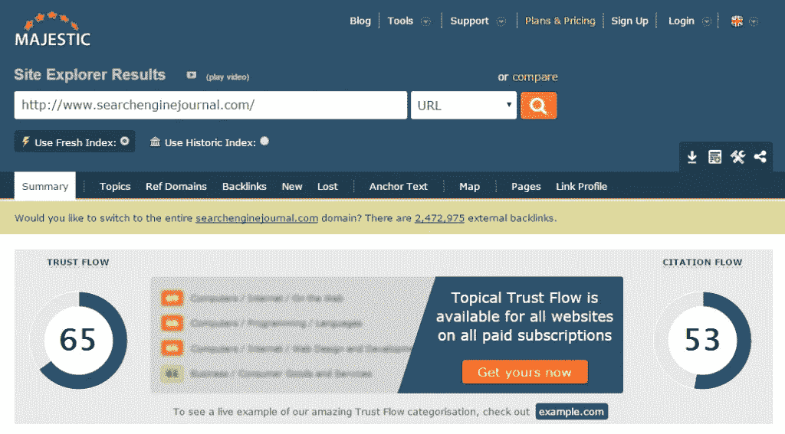
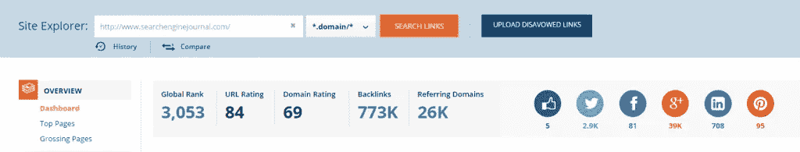
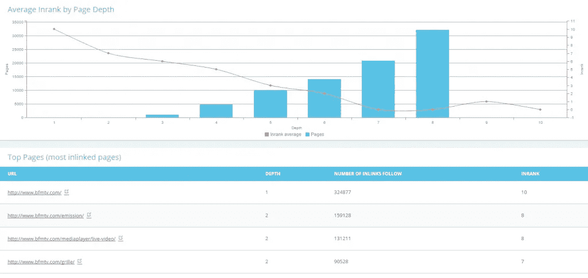

# Google PageRank 的替代品

> 原文：<https://medium.com/hackernoon/alternatives-to-google-pagerank-f7d248d85c60>

页面排名是指 Google 推出的一种**链接分析算法**，用来告诉网站是否重要。这个**分数从 0 到 10** ，并且基于指数等级。

然而，这个分数似乎不再像以前那样重要了。谷歌通常每三个月更新一次这种算法，但在最近一段时间，没有任何进展。当马特·卡茨被问及 PageRank 是否会在 2014 年之前更新时，他回答说“如果发生的话，我会很惊讶的”。最后一次更新发生在 2014 年 12 月 6 日。SEO 专家倾向于说 PageRank 肯定是死的，但是它是什么，现在有什么替代品吗？

# 为什么 PageRank 有用？

这个链接指标对于链接审核非常有用，因为除此之外，PageRanks 对排名没有真正的影响，因为 Google 更加重视关系和相关性。
对于链接审计，PageRank 过去常常用主页 PR0 或 Gray 之类的过滤器传递关于低价值和垃圾链接的信息。但是由于服务不再更新，这个工具对于 SEOs 来说变得越来越不相关。

# 现在有什么选择？

随着 PageRanks 慢慢消失，其他解决方案也应运而生。许多反向链接报告公司已经开发了链接度量工具来与 PageRank 竞争，但并不是所有的工具都是定性的。下面是我们推荐的三款。

## MOZ — [页面权限](https://moz.com/researchtools/ose/)

Moz 页面权威指标指的是一个给定的网页在 Google 的 SERPs 中的排名。它不评估整个域权限。该分数以 100 分为基础，基于 Mozscape web 索引的数据，包括链接计数、MozRank、MozTrust 和其他秘密因素。举例来说，一个网站从 20 增长到 30 比增长到 70 到 80 更容易。

正如你在这里看到的，搜索引擎杂志有很大的 88/100 的页面权限。

## Majestic — [信任流](https://majestic.com/reports/site-explorer?q=example.com&IndexDataSource=F)

Majestic 开发了一种工具，可以测量链接到另一个可信网站的网站的信任度。如果一个指向你网站的链接具有权威性和定性，那么你的信任流量就会增加。想了解更多关于信任流的知识，可以[查看我们之前的文章](http://www.oncrawl.com/citation-flow-vs-trust-flow-what-is-it/)。

在这里，搜索引擎期刊的信任流量为 65，这是相当不错的。

## Ahrefs [URL 排名](https://ahrefs.com/site-explorer)

这一指标衡量所有反向链接对一个给定页面的影响。一般来说，给定 URL 的反向链接越多，它获得的 URL 排名就越高。但这不仅仅是数量的问题，因为一个定性链接比数百个垃圾反向链接更能提升排名。费率还包括内部链接。

# 然后我们开发了自己的工具。

## OnCrawl [InRank](http://www.oncrawl.com/pricing/)

我们开发了一个叫做 InRank 的工具，这是一个关键指标，可以帮助你了解内部流行度是如何通过你的内链接流动的。这个分数从 0 到 10 分不等，这样可以通过向你最好的页面分配链接来帮助你优化你的首页。

可以试试，30 天免费！

[**开始分析我的 INRANK，提高我的 SEO**](https://app.oncrawl.com/signup)

原文写于:[http://www.oncrawl.com/alternatives-to-google-pagerank-2/](http://www.oncrawl.com/alternatives-to-google-pagerank-2/)

> [黑客中午](http://bit.ly/Hackernoon)是黑客如何开始他们的下午。我们是 [@AMI](http://bit.ly/atAMIatAMI) 家庭的一员。我们现在[接受投稿](http://bit.ly/hackernoonsubmission)并乐意[讨论广告&赞助](mailto:partners@amipublications.com)机会。
> 
> 如果你喜欢这个故事，我们推荐你阅读我们的[最新科技故事](http://bit.ly/hackernoonlatestt)和[趋势科技故事](https://hackernoon.com/trending)。直到下一次，不要把世界的现实想当然！

