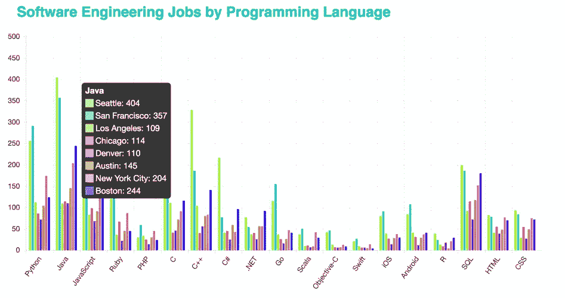

# 永远要编码:编程语言的地区差异

> 原文：<https://medium.com/hackernoon/always-be-coding-regional-differences-in-programming-languages-9957785dd4e6>

我工作的那家初创公司出人意料地宣布要关门了，这已经过去一周了。这是旧金山，我们都去过那里。现在我失业了，住在世界上最昂贵的城市之一，沉迷于此是我无法承受的奢侈。

是时候找份工作了。

作为一名新的程序员，我一直坚持通过修补来加速我的学习。但是特别是现在，如果我没有和招聘人员一起喝咖啡，或者不穿裤子午睡，那么毫无疑问我应该编码。

我一直在学习 [React](https://hackernoon.com/tagged/react) ，这是旧金山 web 开发人员的最新热门话题。你不可能扔石头而不击中一个机构招聘人员，他绝望地问你是否知道反应。几乎每天都有免费和付费的研讨会来学习它。如果你问旧金山的一些开发人员，他们可能会敦促正在探索新的 web 框架的程序员学习 React，忘记 Angular。他们说，React 更容易学习，也有更多的社区支持。

但是最近在 web 开发重镇多伦多参加一个会议，大家都在讨论 Angular。事实上，Angular 的市场份额比 React 大得多，Angular 2 应该会在性能方面缩小差距。在这个特别的会议上，React 只是一个事后的想法。

如果旧金山和多伦多对 web 框架有如此截然不同的看法，那么与美国其他地方相比，硅谷的封闭性可能也会扭曲我对其他技术的看法。

就像生活中的许多事情一样，如果你选择和与你非常相似的人在一起，一次又一次地强化相同的观点，当你意识到世界上的其他人和你想法不一样时，你可能就不会那么惊喜了。哼。。。所以悬浮滑板和自动驾驶汽车真的不是无处不在。

如果我想振作起来找份工作，我应该投资什么语言？

## 哪些编程语言比较受欢迎？

根据 Indeed.com 过去 15 天的求职结果，Java 程序员几乎在所有主要的科技市场都是最受欢迎的。用友。还有什么？

View [details](http://indeed.meowsergirl.com/#all-cities) for job postings by programming languages

各城市之间有一些差异，但没有我预计的那么多。数据科学重要的地方寻找具有 SQL 或 r 技能的开发人员是有道理的。金融技术占主导地位的公司重视 Java 和 c 等低级语言。具有强大的移动和 web 开发能力的城市重视这些语言。在西雅图和旧金山这样的城市里，到处都是创建新代码库的初创公司，Rust 和 Elm 这样的时髦语言也可以大放异彩。

View details, and [select 2 cities to compare](http://indeed.meowsergirl.com/#city-compare)

虽然许多程序员确实是语言不可知论者，但是花时间学习一门新语言是有机会成本的。学习与你已经掌握的语言相同的语言更容易，为什么要学习一门没有人愿意雇佣你的语言呢？

除了工作机会之外，还有综合的[指数](http://www.tiobe.com/tiobe-index/)来考虑其他因素，当你决定投资什么时，你可能会有其他的原因。

[亲自看看](http://indeed.meowsergirl.com/)，看看你的家乡需要什么——裤子可选。

> [黑客中午](http://bit.ly/Hackernoon)是黑客如何开始他们的下午。我们是 [@AMI](http://bit.ly/atAMIatAMI) 家庭的一员。我们现在[接受投稿](http://bit.ly/hackernoonsubmission)并乐意[讨论广告&赞助](mailto:partners@amipublications.com)机会。
> 
> 如果你喜欢这个故事，我们推荐你阅读我们的[最新科技故事](http://bit.ly/hackernoonlatestt)和[趋势科技故事](https://hackernoon.com/trending)。直到下一次，不要把世界的现实想当然！

