# 我错过了马特马克的什么吗？

> 原文：<https://medium.com/hackernoon/am-i-missing-something-with-mattermark-876053df4270>

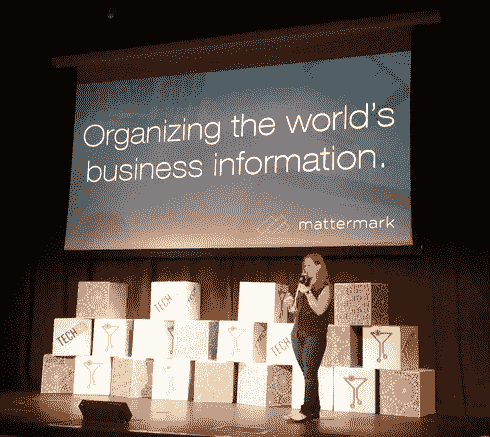

[http://tech.co/celebrate-danielle-morrill-mattermark-2015-10](http://tech.co/celebrate-danielle-morrill-mattermark-2015-10)

Mattermark 承诺了一些非常特别的事情:通过为创业公司建立[彭博](http://mattermark.com/we-shut-down-our-old-startup-to-build-mattermark-heres-what-the-investor-update-email-announcing-our-new-direction-said/)，让[组织全世界的信息](https://mattermark.com/team/)。

我完全相信这个承诺。想象一下，如果一个软件真的可以识别一个初创公司的增长潜力或现实世界的势头(！)并为您提供在一个地方做出投资、招聘或销售决策所需的一切信息。

布拉德·菲尔德，博尔德杰出的风险投资家，投资并非常看好公司，该公司[融资](http://mattermark.com/mattermark-daily-tuesday-december-16th-mattermark-raises-6-5m-series-a/)超过 1000 万美元。

首席执行官 Danielle Morrill 最近在拉斯维加斯的一次会议上用这句话彻底打动了我:

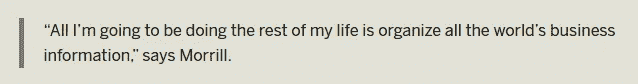

[http://tech.co/celebrate-danielle-morrill-mattermark-2015-10](http://tech.co/celebrate-danielle-morrill-mattermark-2015-10)

太酷了。

所以我全押在马特马克身上。

在我更深入地了解我使用该工具的经历之前，让我声明一下，我真的理解这个问题极难解决，并且我知道该公司有一个非常长远的愿景。一切都很好。这里没有仇人。

话虽如此，但我确实相信，如果马特马克在卖东西，就必须有一个 [MSP](https://www.saastr.com/if-youre-going-to-do-a-saas-start-up-you-have-to-give-it-24-months/) (最低可售产品)，但我就是看不到。

我总是很好奇他们去了哪里，他们的信息有多好。我为早期[初创企业](https://hackernoon.com/tagged/startup)的投资者做尽职调查，我们正在做:

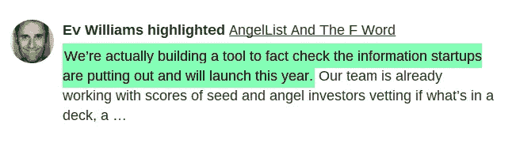

所以我想让 Mattermark 拥有大量的信息，因为这对每个人都有好处，而且肯定会让我的生活轻松很多。

因此，几天前，我获得了 Mattermark 的试用订阅，并开始查看我知道的一些公司，看我是否能获得一些像样的数据。我观察的大多数公司都处于早期阶段，但这些公司很难收集到好的情报。很容易读懂像 [Buffer](http://www.buffer.com) 这样的公司，但早期阶段才是有趣的地方。去年[有 73，400 家创业企业获得资助](https://paulcollege.unh.edu/sites/paulcollege.unh.edu/files/webform/2014%20Analysis%20Report.pdf)，由于《就业法案》第三章的规定，非授权投资者和普通投资者涌入市场，早期投资者需要他们能够获得的所有信息。

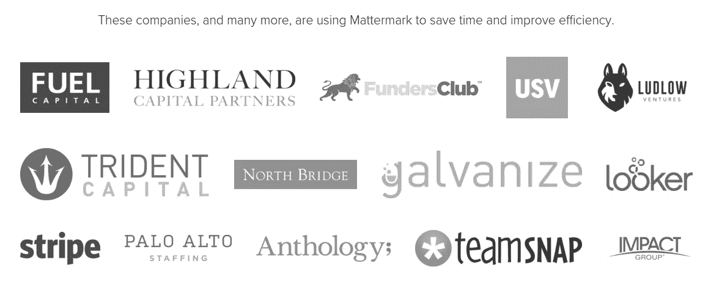

我再一次强调这一点，我知道 Mattermark 还为时过早，团队充满热情，问题真的真的很难解决。但是如果你每月向[收取 500 美元](http://mattermark.com/pricing/)，我认为这是很严重的事情。请记住，该公司并不是说它只是给你一个工具来玩，而是不相信其数据的质量。它没有告诉我，当我查看 Buffer 的资料时，它正确的可能性是 99%，而当我查看一家早期公司时，数据可能只有 70%的可靠性。

在我进入我的发现之前，这是我的一个大问题:

我没有得到 Mattermark 吗？我用错了吗？是不是其他人都很激动而我却不明白？或者你只是相信你所读到的，而不是真的好奇，比如赚一百万美元会让你快乐(我可以告诉你一个事实)，或者一瓶 100 美元的葡萄酒比一瓶 10 美元的好(答案:很少)。

**1。栖息**

Roost 是一家 500 家创业公司中的第 12 批公司，它正在建造 AirBnB，用于自助存储。Roost 于 2014 年成立，目前已筹集了不到 10 亿美元 2M。

Mattermark 上的很多信息与公司不符。例如，虽然它成立的年份是真实的，但看看最后一个资助的盒子。一个一年前创立的公司，怎么可能 7 年前就拿了资金？

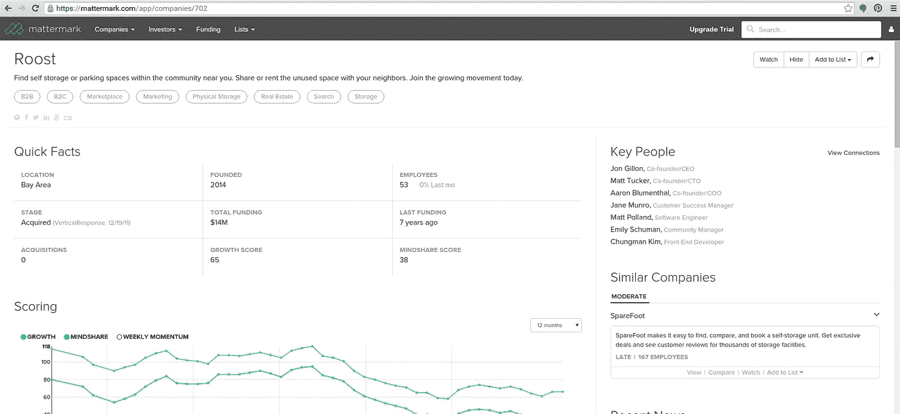

此外，我从首席执行官那里了解到一个事实，该公司有 7 名员工，他们实际上被列为右手边的关键人员。那么为什么说公司有 53 名员工呢？

这里发生了什么？

Mattermark 获取了几年前被出售的 Roost.com 公司的信息，并将其置于新 Roost 的新信息之下，后者购买了旧域名。

首席执行官证实这是真的。Techcrunch/Crunchbase 也搞错了，把两家公司搞混了(见左边的文章和右边的公司简介)。

但这不是借口，解决这个问题很容易。

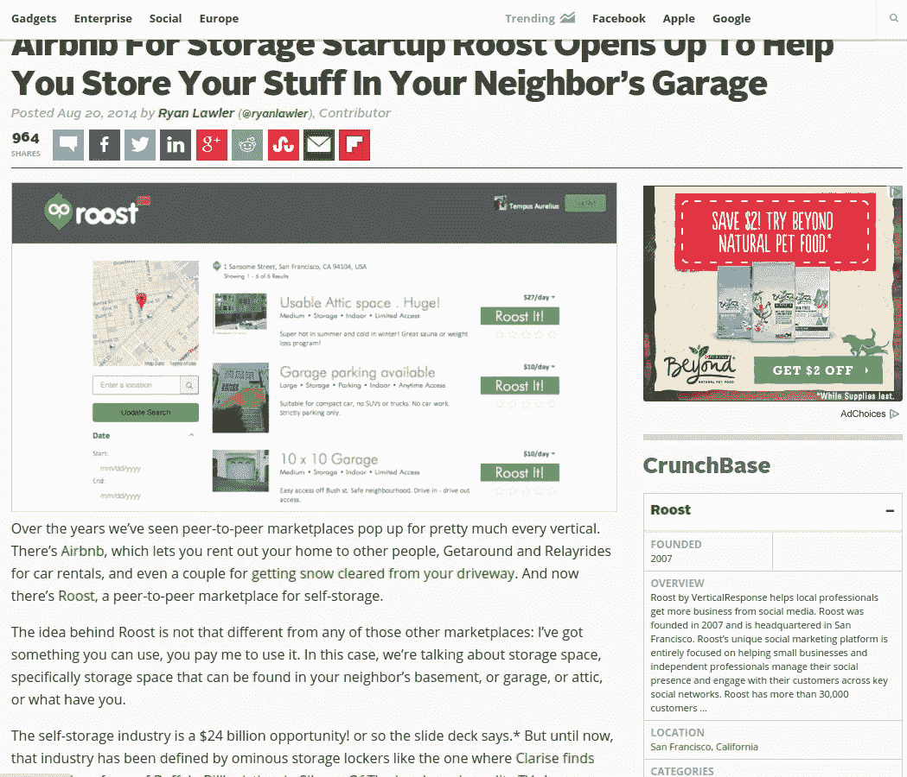

**2。承包商见解**

Contractor Insights 是我曾短暂隶属的一家公司，于 2015 年 3 月在特拉华州注册为 C-Corp，然后在科罗拉多州注册为外国实体。

该公司存在，而且实际上很快就要推出一种产品，但它在 Mattermark 并不存在。没有记录。

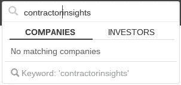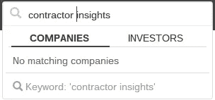

这家初创公司正在重新制作它的登录页面，所以我知道它还在继续发展，而且已经有了创始人，可能还有外部融资。它肯定存在，甚至有一个 LinkedIn 公司页面:

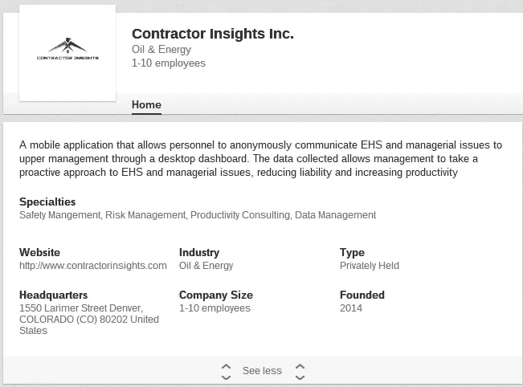

**3。综合诊所**

英特尔诊所通过其非常成功的 Kickstarter 活动(超过目标 4 倍)将 Neuroon 睡眠面膜推向市场。Neuroon 是产品，Intelclinic 是公司——非常简单。

Mattermark 列出了两项记录，并给出了 Intelclinic 的资助数字，而没有给出 Neuroon 的资助数字(这很有道理)。

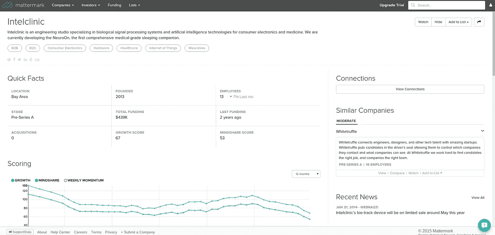

但除了在 Kickstarter 上筹集了 43.9 万美元，该公司还在早些时候筹集了一笔小额启动资金。Mattermark 没有提到这一点，尽管它确实从 Crunchbase 中提取了信息，其中确实包含这一轮的信息。

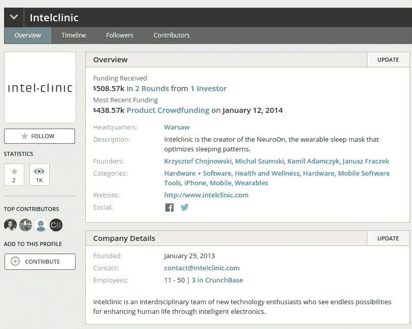

据首席执行官称，员工人数和独特性也不相符合。该公司还获得了媒体的高度关注，比如:

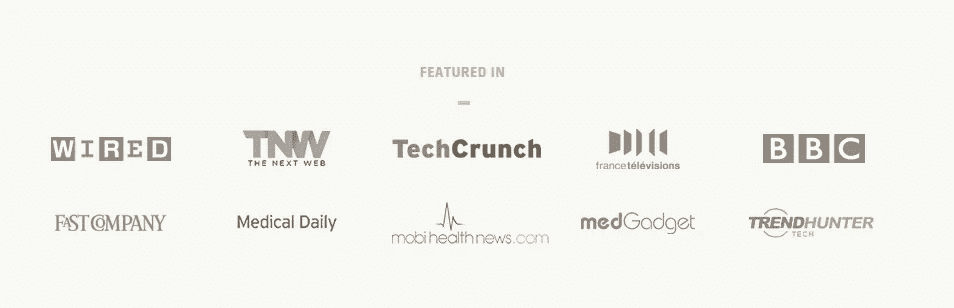

source: Neuroon

但是 Mattermark 只提到了 2014 年的一篇文章

**4。Brand24**

Brand24 为宜家、H&M、法国航空、英特尔和许多其他公司进行社交媒体监控和分析。

Mattermark 将该公司的两个网站(一个是波兰语的，一个是英语的)列为两个不同的公司。但只有一家企业(就像苹果只有一个网站，而不是苹果注册的数百个网站)。

在这两个记录中，Mattermark 显示有 24 名员工:

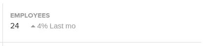

周五深夜，当我问这位 CEO 有多少人在 Brand24 工作时，他回答道:

同样清楚的是，该公司成立于 2010 年(但根据其商业注册文件，2011 年注册为 TDB ),但这家美国实体的注册时间可能要晚得多。马特马克没有提到这种区别。

尽管 Mattermark 表示没有收到外部资金，但该公司已经获得了外部资金。这家初创公司实际上在 2012 年被出售(50.49%)给了一家[战略合作伙伴。](http://www.bankier.pl/wiadomosc/CAM-MEDIA-S-A-Objecie-wiekszosciowego-pakietu-akcji-w-spolce-Brand-24-S-A-2701551.html)

**5。Makeena**

Makeena 是消费者应用领域的一家本地公司，目前正在筹集资金。

Mattermark 表示，该公司已经筹集了 7.6 万美元:

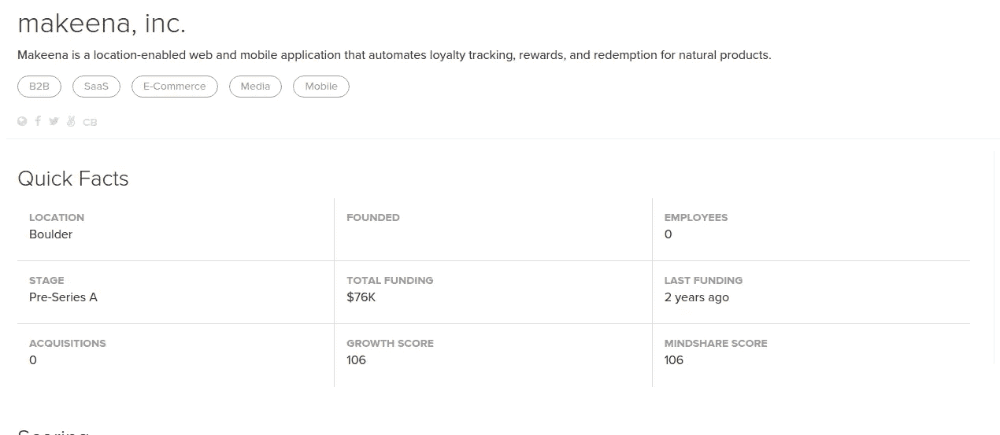

这和 Angel.co 相符

但是去 Crunchbase 会看到信息说它养的比较多(不一定靠谱)。

我知道一个事实，该公司筹集的资金甚至超过了 176，460 美元，但 7.6 万美元是 Mattermark 报告的数额。

您还可以看到，该公司没有填写其成立年份，但有这样的信号:

Crunchbase (2013 年)

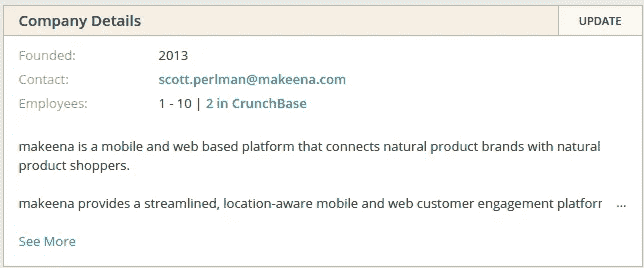

推特(2012 年 3 月加入)

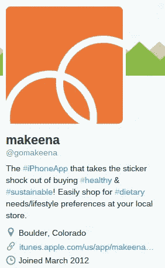

阵风 here(成立于 2012 年 8 月)

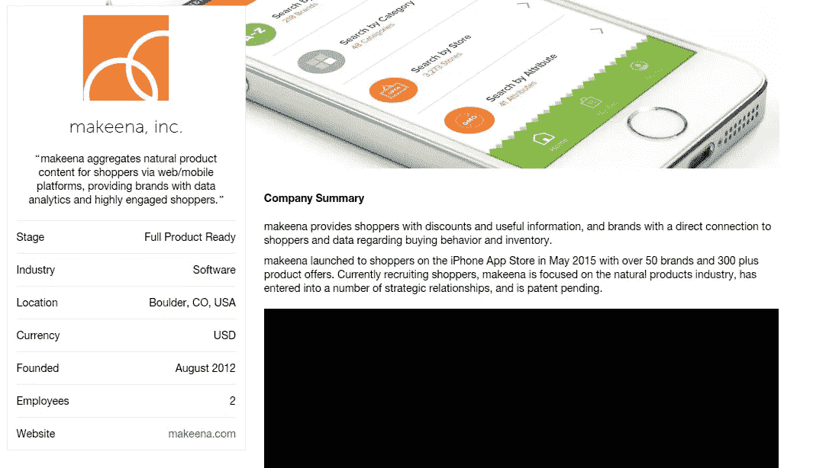

当然，在 [AngelList](https://angel.co/makeena) 上，他们列出了 2013 年的成立。

**6。菲多实验室**

Fido Labs 是硅谷一家令人兴奋的公司，承诺在机器学习和深度数据处理方面取得突破。有一个 Fido 实验室，他们有几个不同项目和产品的域名和子域名，但这是一个业务。

Mattermark 列出了 3 家不同的公司，但它们是同一个实体。

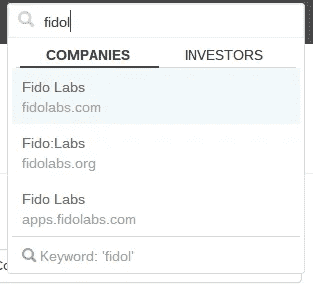

并表示该公司从未筹集资金

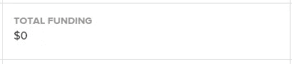

True for all 3 FidoLabs profiles (www.fidolabs.org, fidolabs.com and apps.fidolabs.com)

虽然我知道它已经出版了:

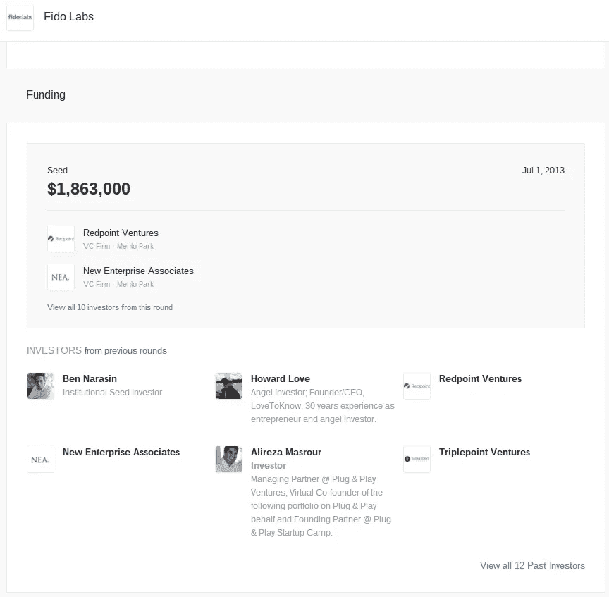

source: AngelList

他们是认真的人，用数据做着严肃的事情，不断前进，你在 Mattermark 上看不到任何东西。

**7。喷雾网络**

Spray 是一家提供近距离信息服务的公司。这家初创公司已经从米奇·洛(网飞的联合创始人)等人那里筹集了资金，有几十万美元的资金。

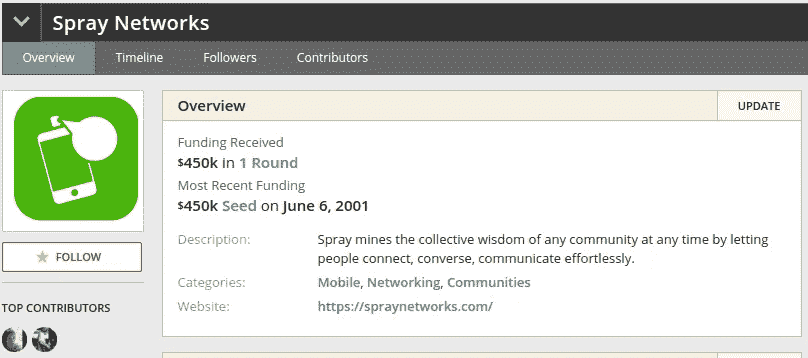

据首席执行官 Kamil ku chta(2015 年 11 月 12 日)称，该公司有 20 名员工。马特马克列出了 13 条。

Mattermark 报告说，它没有提出任何问题，它再次显示重复，因为该公司注册了两个域名网络(www.spraynetworks.com 和 getspray.com)。

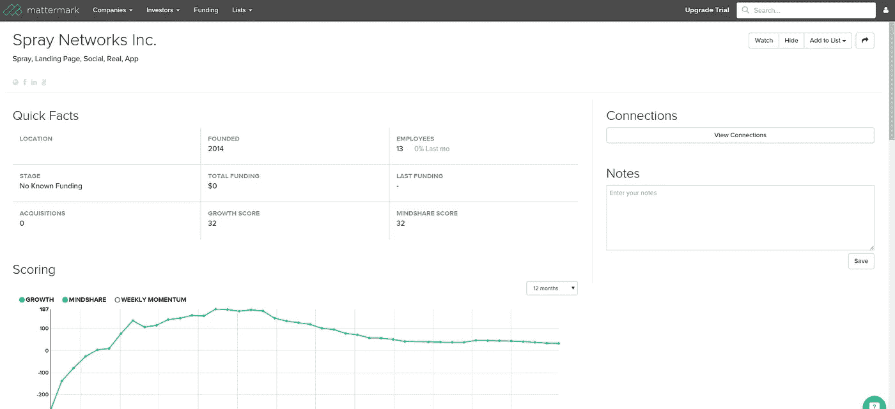

所以你有它。我知道并想分析的 7 家公司以及我在 Mattermark 上看到的信息对所有 7 家公司来说既不可信也不可靠。所有 7 个都是注册实体。都是直播。都在美国有业务。

你不能根据这些信息做出任何商业决策。我理解这种愿景，我知道其意图是纯粹的，但我只是没有看到任何价值计算坏数据来给出增长分数或势头分数或任何其他基于与现实无关的信息的指标。

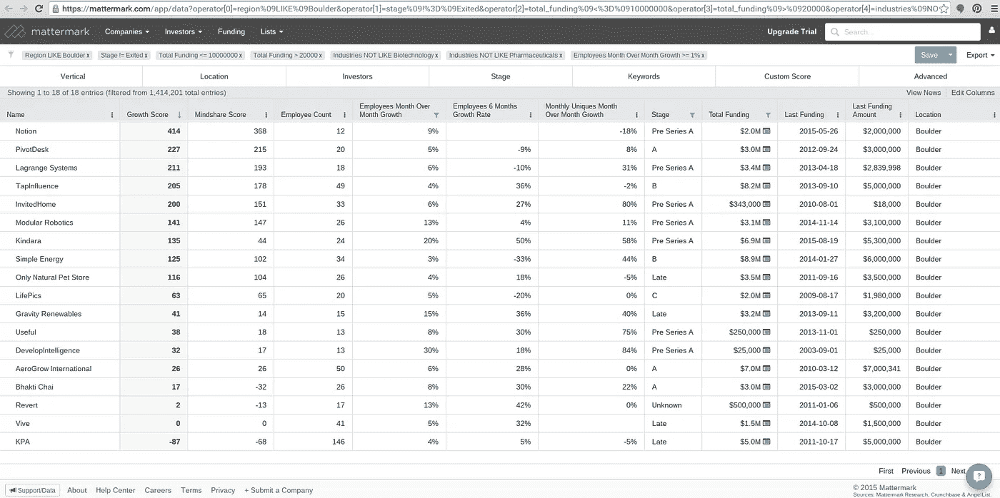

因此，虽然我愿意相信我在这里看到的(博尔德市增长最快的公司列表)是真实的，但事实是我不知道这些是否可信。当然，Crunchbase、Angel List 和 [others](http://mattermark.com/category/data-quality/sources/) 也经常离题很远，但如果那里的信息相互矛盾，那么就应该仔细看看，特别是因为他们声称自己有*成千上万的数据来源*。

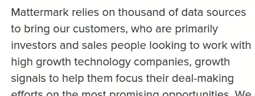

[http://mattermark.com/data-crush-producthunt-is-quickly-becoming-the-hot-new-destination-for-sourcing-startup-investment-opportunities/](http://mattermark.com/data-crush-producthunt-is-quickly-becoming-the-hot-new-destination-for-sourcing-startup-investment-opportunities/)

我们看到了什么？我还不太确定，但我正在努力理解这个问题。

现在它就像烹饪一样:你必须从好的原料开始，因为你真的不能用垃圾做任何像样的东西，即使你把它打扮成这样:

Seared Spam with Tostitos queso-dip mashed potatoes and canned green beans. Topped with a Flamin’ Hot Cheetos and Corn Nut salsa verde.

所以，我想再次重申我的要求:

> 我做错了什么吗？是否有一个警告说，这只是一个玩具，或者因为我有一个免费试用，我得到了坏的数据，还是有其他事情发生？说实话，所有这些都没问题。马特马克正在解决一个巨大的问题，没有人期望一切从一开始就尽善尽美。但是如果你从严肃的人那里拿了严肃的钱来换取严肃的承诺，事情就需要加起来。

我知道 Mattermark 有一个更新数据质量的流程，这当然很有用，但连续 7 条记录出现严重错误并不是一个可报告的问题，这是一个系统性甚至是结构性的问题。

我知道该公司在努力收集信息方面非常透明。

就像我在开头写的:产品不需要完美。但它必须是真实的。

**我喜欢你的反馈，坦率地说，我喜欢被告知我错了或者我不理解某些事情。我甚至准备撤下这篇文章，如果我只是一无所知，我做错了。**

但是我的直觉告诉我，事情远比看上去的要复杂。

## **雅各布·科斯特基是 StartupFactCheck.com 的创始人兼首席执行官，该公司为世界上最优秀的初创企业投资者进行早期投资的尽职调查和分析。**

如果你觉得这篇文章有用，请点击推荐并与你的社区分享，这样我就可以收集更多关于 Mattermark 上信息可信度的信息。