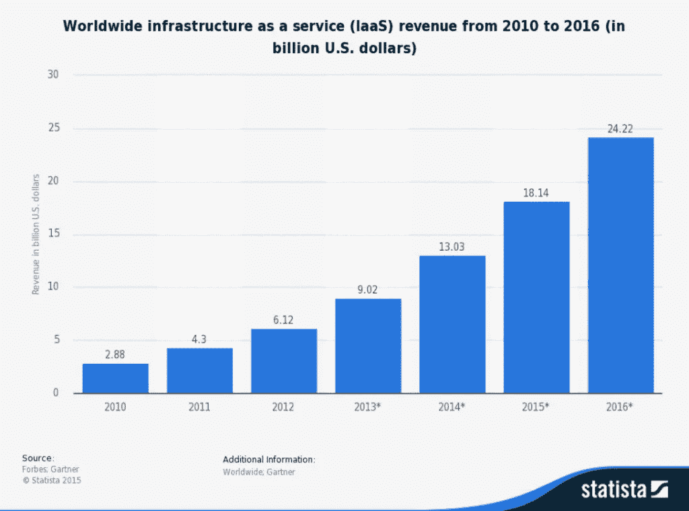
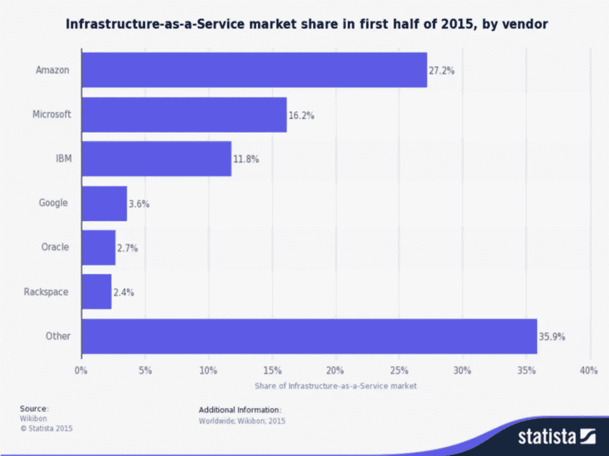

# 亚马逊:一只 217.6 磅重的 IaaS 大猩猩

> 原文：<https://medium.com/hackernoon/amazon-a-217-6-pound-iaas-gorilla-2daca873b3c4>

## IaaS 供应商选择:个人历史

在我的上一份工作中，我们必须通过三家主机提供商才能找到一家合适的。一开始，我们的需求不大，但是很具体，我们最终偶然发现了一个对我们有意义的提供商。我们没有正式的[采购](https://hackernoon.com/tagged/purchasing)流程(或编制 RFP 的免费周期),对于我们来说，很难调和为我们的 [SaaS](https://hackernoon.com/tagged/saas) 提供主机服务的不可思议的重要性与大多数小企业面临的财务和时间限制。虽然我们最终找到了一家托管公司，它的服务和文化非常符合我们的需求，但我们从未对我们的选择感到自满。有没有性能更好、成本更低或者更符合我们要求的产品？

随着我们业务的发展，我们的需求也在发展。特别是，我们的计算工作量会出现不可预测的峰值。亚马逊，在那一点上，仅仅被认为是一个在线零售巨头，推出了一项名为 EC2 的服务的测试版，以按需的方式提供一些空闲的计算周期。在这一点上，我们对我们的主机提供商非常满意。因此，虽然我们更换现有产品没有意义，但我们利用 EC2 并采用多提供商战略却意义重大。可以说，事情进展得很顺利，我们愉快地参与了一个案例研究:【https://aws.amazon.com/solutions/case-studies/twistage/。

在亚马逊首次涉足 IaaS(基础设施即服务)大约十年后，此类服务的市场经历了“曲棍球棒”式的增长。就在 2010 年，3B 全球市场的市值还只有 250 亿美元，而现在，这一数字预计将在 2016 年接近 250 亿美元。

图表来自:[https://www . statista . com/statistics/203598/forecast-for-the-world wide-public-cloud-services-market-for-iaas-unt-2014/](https://www.statista.com/statistics/203598/forecast-for-the-worldwide-public-cloud-services-market-for-iaas-until-2014/)

到目前为止，亚马逊保持了其先发优势，仍然是 IaaS 领域的最大玩家。但是对于所有他们收到的媒体来说，最大的市场份额属于非亚马逊公司。不久前，微软将他们的云主管塞特亚·纳德拉提升为首席执行官。最近，谷歌负责技术基础设施的高级副总裁 Urs hlz le 分享道:“我的目标是让我们在 2020 年将谷歌视为一家云公司，因为我们的收入大于广告收入，这是一个现实的可能性。”考虑到谷歌在 2015 年创造了 673.9 亿美元的广告收入，这是一个极其远大的目标。

## 分散的市场

云服务作为一个类别的增长曲线如此陡峭，以至于公司追逐明星是有意义的。一个庞大且快速增长的市场的另一个副作用是，新进入者会快速加入竞争。将上述公司——亚马逊、谷歌和微软——的 IaaS 市场份额相加(见下表),你仍然会看到不到 50%的市场份额。事实上，提供 IaaS 最成功的公司是“其他”向 Other Inc .致歉，图表中的“Other”根本不是一家公司，而是代表了那些未能有幸上榜的公司的综合市场份额。

 [## 2015 年全球供应商 IaaS 市场份额|统计数据

### 该统计显示了 2015 年上半年基础架构即服务(IaaS)供应商的市场份额。在…

www.statista.com](https://www.statista.com/statistics/478143/iaas-vendor-market-share-ranking-worldwide/) 

什么最适合您的企业？它很可能是市场领导者之一。然而，最适合你的可能是一家你还没有发现的公司。但是你如何发现他们，更不用说评估他们了？这就是我们的切入点。我们将让您探索市场领导者的产品，以及发现隐藏的宝石。然后，我们将提供工具来并排评估这些供应商，以便您能够做出最符合您组织需求的明智决策。我们不偏不倚，只有一个目标——帮助您做出最佳的购买决定。

(对于还被标题搞糊涂的朋友，请允许我解释一下。市场领导者有时被称为“800 磅的大猩猩”。在上图中，亚马逊的 IaaS 市场份额为 27.2%，我只拿了 800 磅的 27.2%，瞧——一只小得多的大猩猩！)

*最初发表于* [*【多得——买造更好的*](http://www.vendorful.com/iaas-sorting-through-fragmented-market/) *。*

> [黑客中午](http://bit.ly/Hackernoon)是黑客如何开始他们的下午。我们是 [@AMI](http://bit.ly/atAMIatAMI) 家庭的一员。我们现在[接受投稿](http://bit.ly/hackernoonsubmission)，并乐意[讨论广告&赞助](mailto:partners@amipublications.com)机会。
> 
> 如果你喜欢这个故事，我们推荐你阅读我们的[最新科技故事](http://bit.ly/hackernoonlatestt)和[趋势科技故事](https://hackernoon.com/trending)。直到下一次，不要把世界的现实想当然！

