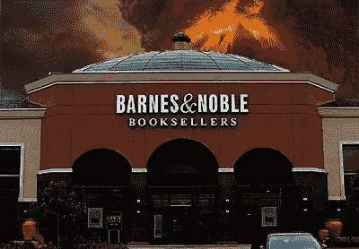

# 亚马逊——1999 年的观点

> 原文：<https://medium.com/hackernoon/amazon-a-view-from-1999-3a802b982279>

## (或者:术语“变得令人惊叹”的起源)

Back to the future

我希望我有一台时光机去看看在未来会有多疯狂。但在埃隆·马斯克造出这台机器之前，谷歌是最接近时光倒流的机器。

我会首先回到 1999 年，让人们知道 2000 年 1 月 1 日不会发生任何事情，没有千年虫。我会去寻找 1999 年的我。

2017 我:“年轻的我，你很辣！看看你的 abb！”

1999 年的我:“老我，你想怎么样？现在才 1100 点，让我回去睡觉吧”

2017 年的我:“好吧，年轻的我，当你醒来的时候记住——带上你所有的积蓄，还有爸爸妈妈的，去买苹果股票。好吗？股票代码是纳斯达克:AAPL。好吗？?"

1999 我:“你怎么还在这里？Zzzzzzzz”

我想 1999 年的我，刚刚十八岁，像小鸟一样自由，一点也不在乎。

但对于 T2、亚马逊和电子商务历史学家来说，跳进我的时间机器，看看尼娜·芒克 1999 年 6 月的《财富》文章，这是我第一次发现“变得令人惊叹”这个词。全文可在此处获得:

[http://archive . fortune . com/magazine/fortune/fortune _ archive/1999/06/21/261689/index . htm](http://archive.fortune.com/magazines/fortune/fortune_archive/1999/06/21/261689/index.htm)

我最喜欢的部分:

资金管理集团 Zak Capital 的负责人苏珊娜扎克(Suzanne Zak)记得她开始认真对待贝佐斯的那一天，她当时是巴恩斯贵族的大股东。1998 年 7 月 24 日，她参加了由[***【Amazon.com】***](http://amazon.com/)***为分析师和基金经理举办的会议。“最初，像许多人一样，我们对亚马逊持怀疑态度，”她解释道。“但在那次会议上，听贝佐斯讲话时，我突然明白了。我说，“我们会有一个问题。”***

Barnes Noble 的基础受到了如此严重的破坏，以至于有一个新的表达方式流传开来——“变得令人惊叹”。

So severely has Barnes & Noble’s foundation been damaged that there’s a new expression making the rounds — “getting Amazoned,”