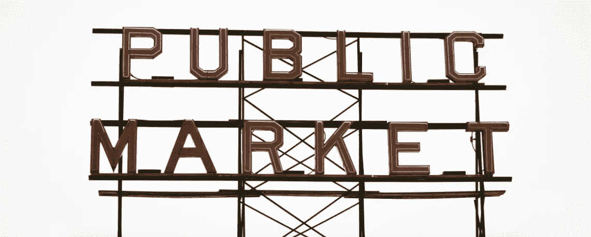
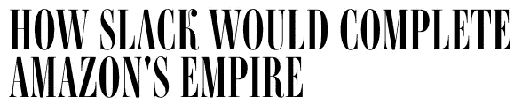
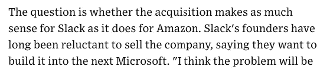
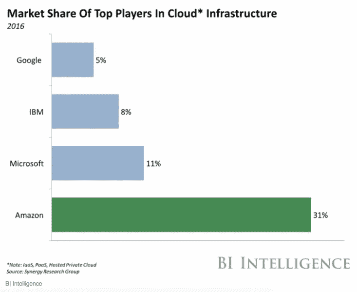
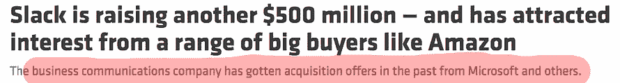
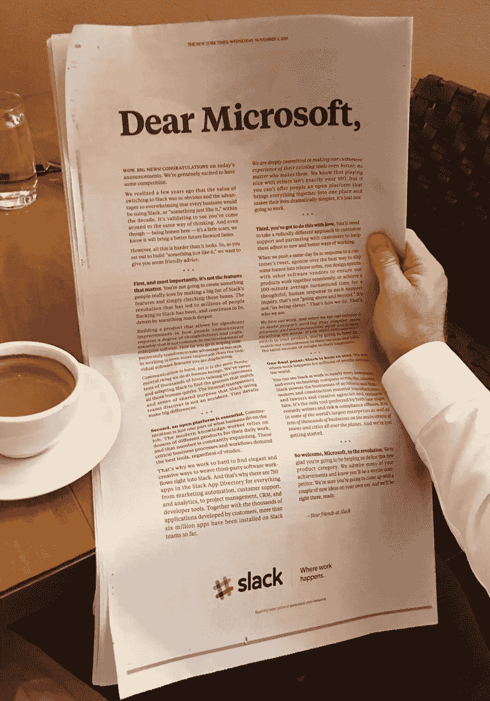
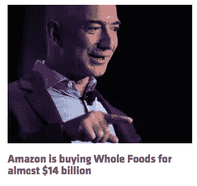

# 亚马逊以 90 亿美元向 slack 示好。事实还是虚构？

> 原文：<https://medium.com/hackernoon/amazon-is-courting-slack-at-9bn-fact-or-fiction-48ac4faef513>

## 我今天早上醒来，听到小道消息说亚马逊可能试图将这只猫装进一个价值 90 亿美元的袋子里。这可能发生吗？



([img src](https://unsplash.com/photos/FtutC3NqiMI))

让我们从🐘(*大象*)先在房间里。亚马逊收购 Slack 有多大意义？

好吧。这是一个棘手的问题。一个不可能用白纸黑字来回答的问题——*，这就是所有这些谣言的来源。*

事情变得更加棘手，因为事实上[的故事是由信息传播方面更值得信赖和可信的来源之一——彭博发布的。](https://www.bloomberg.com/news/articles/2017-06-15/messaging-startup-slack-said-to-draw-interest-from-amazon-com)

# 硬币的两面

这个故事有两个方面。一面展示了过去导致不同科技初创公司被收购的所有指标，以及为什么亚马逊收购 Slack 是有意义的。它甚至提到了这样一种可能性，即这笔交易对 Slack 的意义可能不如对亚马逊的意义大。

```
*When you read that last line (from the* [*wired article*](https://www.wired.com/story/slack-complete-amazon-empire-acquisition/)*), did anyone else remember Snapchat, Facebook’s repeated attempts to acquire it at extravagant valuations — only to get turned down over and over again by Spiegel?*
```

另一方面，你有合理化，更重要的是，两家公司的历史和过去的指标。

问题是——哪一方会赢得这场拉锯战？

# 为什么这笔交易对 SLACK 没有意义？

这是一个比较容易回答的问题。

几年来，Slack 一直是互联网创业公司的典型代表。Pivot、前所未有的用户增长和保持率、收入，以及超出他们所知用途的更多资金— *这个故事拥有一切。*

Slack 相信它有能力把自己变成下一个微软，这是一个足够好的理由来保住你的位子。

# 为什么亚马逊想要收购？

我甚至不需要试着举出理由。让我们看看一些媒体的报道。



当谈到云基础设施时，亚马逊是一个要与之抗衡的强大力量，但当谈到访问企业员工的普通部分时，亚马逊没有足够的产品提供给除程序员之外需要一些计算能力的任何人。有了消息和协作应用，亚马逊可能会改变这种情况。

但是亚马逊真的需要这样吗？

*   看看脸书的职场。进入这个市场相当晚，但它拥有像苏格兰皇家银行这样的客户。
*   Slack 的客户群令人印象深刻。但我真的不确定他们是否有能力深入所有这些公司。毕竟，Slack 是一个为“*团队*”而设计的系统，所以 Slack 声称在其排班表上的公司——完全可以想象，只有一个小团队在使用 Slack 进行内部讨论。
*   如今的企业(*包括 Slack btw* )都运行在 AWS 上。亚马逊已经可以接触到几乎所有重要人物。即使亚马逊想跳过产品上线运行所需的开发工作，也有无数与之竞争的系统符合这个要求。(*他们中的一些实际上比 Slack* 更好的系统)

我看不出亚马逊或微软收购 Slack 有多大价值。看看微软就知道了。人们总是说，如果微软只是将微软团队与整个微软套件(*更具体地说——只是 MS Office* )进行定位和整合，那就是微软需要做的一切。微软过去曾用 MS Communicator 做到过这一点。所以他们已经看到了它是如何运作的。如果企业已经有了一款看起来、摸起来和闻起来都像 Slack 的通信应用，企业在为这样的服务付费之前会三思。

# &现在，为什么我认为-----不行！！！

我一遍又一遍地说(*和许多其他人一样*)，你很少会遇到像杰夫·贝索斯这样竞争激烈的人。那家伙是一个可恶的独霸*单人机器*。他赢了，而且他已经习惯了。但他还有一个为人所知的地方——他并不真的喜欢被高估的收购。

## 我是不是听到有人小声说 Flipkart？_wink wink_

在亚马逊进入竞争领域之前，Flipkart 曾是印度领先的电子商务公司，外界普遍猜测亚马逊可能会在它进入印度时超过它。令创始人尤其是投资者沮丧的是，这并没有发生。

其次，我不太相信巧合。而且这气味越来越臭，带着一股浓浓的巧合的恶臭。

如果我没记错的话，我很确定一年多前就有类似的 Slack 和微软恋情的传闻。这最终似乎没有实现。

现在，商业交易失败并不罕见——即使是在最后阶段。但是，如果你考虑到微软几个月后推出了自己的团队沟通和协作应用程序这一事实(除了其他因素，这个故事就变得有趣了。毕竟，微软试图收购 Slack 这样的公司的唯一原因是:

1.  他们没有自己的系统，与从头开始建立公司相比，简单地收购一家成熟的公司似乎是更好的选择。
2.  他们想要他们试图收购的公司的现有客户群。Slack 确实有一个令人印象深刻的客户列表。许多财富 500 强公司的团队都在休息，他们中的许多人都是真正的付费客户。

但我真的不认为这两个都适用。

*   微软已经有了一款符合要求的产品。
*   就拥有商业信誉而言，微软手里有足够多的商业信誉。Slack 可能拥有数百万活跃用户，但微软的吸引力要大得多——无论是深度还是广度。

然后是相互矛盾的报道。



因此，Business Insider 报道称[微软正在考虑 80 亿美元的收购](http://www.businessinsider.in/Bill-Gates-reportedly-talked-Microsoft-out-of-bidding-8-billion-for-Slack/articleshow/51262683.cms)——但最终没有实现。另一方面，Recode 非常清楚地提到 [Slack 确实收到了来自微软**和其他**](https://www.recode.net/2017/6/15/15810088/slack-deal-funding-amazon-microsoft-buyers-business-communication) **的报价。** ( *“和其他人”是一个很好的新补充*)

别管媒体报道了。我还从微软可靠的内部消息人士那里听说，这种交易甚至从未在考虑之列——至少没有接近高级管理层的办公桌。

天哪。“可靠的消息来源”。我听起来像特朗普。 ]

然后，去年年底，当微软还没有发布团队的时候，报纸上就有了广告。



现在正在发生的事情看起来差不多，只有两个明显的区别:

1.  现在是 90 亿美元，而不是去年的 80 亿美元
2.  这次是亚马逊，而不是微软和其他公司

不过有趣的是，融资周期的融资后估值保持不变。去年的新闻报道称，微软对 Slack 有 80 亿美元的兴趣，而 Slack 正在市场上试图以 50 亿美元的预期后估值结束一轮融资。不幸的是，这种情况并没有发生，最终融资额略低于 40 亿美元。这一次，Slack 再次寻求新的现金注入——50 亿美元的后续资金。

如果这整件事后来被证明是在萧条结束时的一个精心策划的计划，以推动其估值上升，并为任何融资对话的最后阶段铺平道路，这不会是完全荒谬的。与 Slack 目前希望筹集的 5 亿美元相比，企业已经做得更多，获得的收益也少得多。

# 但是等等。我见过亚马逊收购昂贵的企业



他们当然知道。现在就拿桌上的这个——全食超市。收购“*”线下*”连锁零售店对亚马逊来说是有意义的，因为这与它进军杂货店购物和自动化整个体验的领域完全一致——这是亚马逊已经尝试了一段时间的事情。

建立一个如此规模的线下网络，并拥有良好的存在——这需要时间，成本高昂，而且不容易。对亚马逊来说，简单地挖走一个人是有意义的。

Slack 没有这个优势。正如我之前所说，如果跳过开发周期是唯一的担忧，亚马逊会很乐意以十分之一的价格获得类似的服务。

# 现在真正的问题，或者更准确地说:

*   如果传言属实，亚马逊的成本收益矩阵看起来是否足够健康，足以让它受到两次严重冲击？
*   如果这是公司为了推高成本而故意设的骗局，在投资者明智地看穿表象之前，slack 还能反复做多少次同样的事情。

> 我个人还有一个问题——他们真的需要这笔钱吗？？

所以。这真的是一场骗局，还是在所有这些烟幕下有一些火？他妈的如果我知道。也许你知道一些我不知道的事。

# 今天到此为止。明天见。


```
I am Abhishek. I am here... there.... Everywhere...[**Medium**](/@abyshake) **|** [**Twitter**](http://twitter.com/@abyshake) **|** [**Facebook**](http://facebook.com/abyshake) **|** [**Quora**](http://bit.ly/abyshake) **|** [**LinkedIn**](http://in.linkedin.com/in/abyshake) **|** [**E-mail**](mailto:mail@abyshake.com)
```

[](http://bit.ly/HackernoonFB)[](https://goo.gl/k7XYbx)[](https://goo.gl/4ofytp)

> [黑客中午](http://bit.ly/Hackernoon)是黑客如何开始他们的下午。我们是 [@AMI](http://bit.ly/atAMIatAMI) 家庭的一员。我们现在[接受投稿](http://bit.ly/hackernoonsubmission)，并乐意[讨论广告&赞助](mailto:partners@amipublications.com)机会。
> 
> 如果你喜欢这个故事，我们推荐你阅读我们的[最新科技故事](http://bit.ly/hackernoonlatestt)和[趋势科技故事](https://hackernoon.com/trending)。直到下一次，不要把世界的现实想当然！

