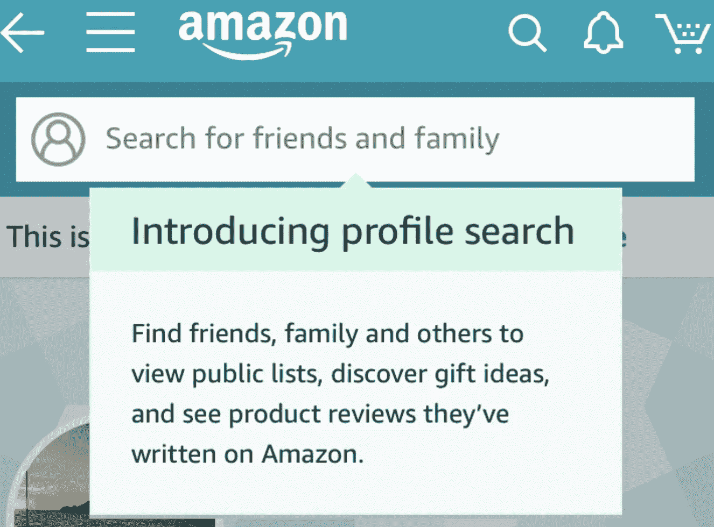

# 亚马逊在建立购物社交网络吗？

> 原文：<https://medium.com/hackernoon/amazon-social-network-is-here-234b6cf4f9f2>

## 亚马逊悄悄地将用户档案社会化

购物应该是社交。过去，脸书和 Twitter 等公司曾试图将其社交网络转变为“与朋友和家人一起”购物。

但将一个社交网络转变为购物网站，比将一个已经被 8000 万家庭使用的购物应用转变为社交网络更难。

Rich Profile and “Hearts” and Connections

今天，亚马逊在我的账户上推出了下一步计划，将我们的购物变成一个由评论者、家人和朋友组成的社交网络。

Find friends, family and others — sounds like a social network?

在典型的亚马逊风格中，没有重大的公告。仅仅是过去一年左右的产品改进——如果继续下去，将会把亚马逊变成一个更加强大的公司。

如果你曾经写过亚马逊产品评论，你已经是社交网络上的创作者了。如果你已经阅读或投票，你就是一个活跃用户(DAU/MAU)。

购物应该是社交。看起来，亚马逊正在这样做。