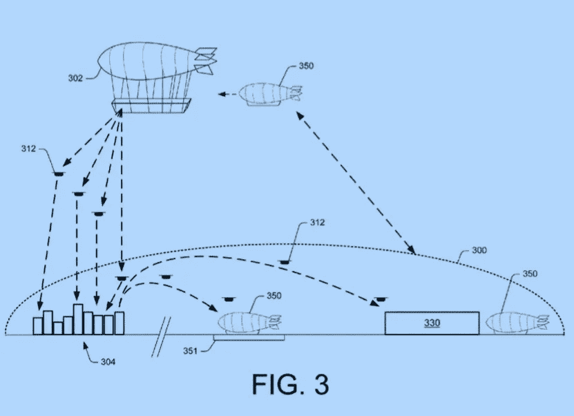

# 亚马逊:为什么不为飞行数据中心申请专利？

> 原文：<https://medium.com/hackernoon/amazon-why-not-patent-flying-data-centers-9d53501738e2>

首先，我们祝愿我们的媒体作者和读者新年快乐，愿 2017 年对所有人来说都是伟大的一年！

根据最近的新闻报道，亚马逊最近申请了一项关于“飞行仓库”的专利——本质上是一种空中履行中心，将储存一定数量的库存，并位于亚马逊预测某些商品需求将很快激增的位置附近。好主意，对吧？飞行仓库对亚马逊来说很有意义，因为他们似乎正在认真对待无人机送货。

现在，飞行仓库与亚马逊的电子商务业务相关。然而，众所周知，亚马逊也是领先的公共云提供商。这一事实使人很自然地想知道同样的想法是否不能应用于 AWS 环境中的数据中心！:)疯狂愚蠢的想法？

**飞行数据中心的使用案例是什么？**

好吧，假设我们正在乘坐一辆由最新的图像识别 SaaS 驱动的高级无人驾驶汽车，该汽车由 AWS 等受欢迎的公共云提供商托管。现在，当汽车在一条有大量交通灯和路标的繁忙道路上行驶时，为了给软件足够的时间近乎实时地处理不同的路标，然后将反馈发送给汽车，延迟非常低是非常重要的。否则，汽车将无法在停车标志上停下来！

上面的假设示例对延迟非常敏感，因此理想情况下需要在离汽车更近的地方进行图像处理的虚拟机，以防止潜在的道路碰撞。现在想象一下，托管虚拟机的数据中心不是位于另一个城市，而是实际上就在汽车所在城市的上空飞行。

当然，飞行数据中心存在一些明显的挑战，最明显的挑战是数据传输的效率和速率。最简单也可能是最有可能的数据中心传输数据的方式是通过电磁波传输，类似于卫星和手机。这种传输方法当然比现代数据中心使用的光纤有线传输慢得多。飞行数据中心的另一个挑战是与飞机和直升机等其他空中物体发生碰撞的可能性。即使你考虑将飞行数据中心放在轨道上以避免地球的空中危险，你仍然需要考虑与轨道上其他物体发生潜在碰撞的小概率(甚至不考虑非常小但可能发生的流星碰撞！).

最后，让我们考虑一下物联网的使用案例以及数十亿联网设备给主流云计算带来的挑战。思科最近的 [报告预测如下:](http://www.cisco.com/c/en/us/solutions/collateral/service-provider/visual-networking-index-vni/vni-hyperconnectivity-wp.html)

●到 2020 年，每两分钟就会有相当于所有电影的千兆字节(GB)通过全球互联网。

●在全球范围内，IP 流量将在 2020 年达到 511 万亿比特每秒(Tbps)，相当于 1.42 亿人每天全天同时传输互联网高清(HD)视频。

●2020 年全球 IP 流量将相当于每年 5040 亿张 DVD，每月 420 亿张 DVD，或每小时 5800 万张 DVD。

为了应对如此大的数据量，需要在网络边缘(即靠近数据生成位置)分析最关键的数据，而不是将大量设备生成的数据发送到云进行分析，然后必须等待额外的关键时间才能得到结果。

## *你怎么看？亚马逊应该为飞行数据中心申请专利吗？:)*

新年快乐

*发帖人*[*bambordébaldé*](https://medium.com/u/665359d135fa?source=post_page-----9d53501738e2--------------------------------)*，联合创始人|推特:*[*@ cloud balde*](https://twitter.com/cloudbalde)*|领英:*[linkedin.com/in/bambordé](https://www.linkedin.com/in/bambord%C3%A9)

> [黑客中午](http://bit.ly/Hackernoon)是黑客如何开始他们的下午。我们是这个家庭的一员。我们现在[接受投稿](http://bit.ly/hackernoonsubmission)并乐意[讨论广告&赞助](mailto:partners@amipublications.com)机会。
> 
> 如果你喜欢这个故事，我们推荐你阅读我们的[最新科技故事](http://bit.ly/hackernoonlatestt)和[趋势科技故事](https://hackernoon.com/trending)。直到下一次，不要把世界的现实想当然！

