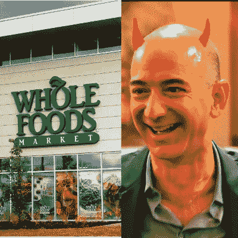

# 游戏结束，食品杂货:亚马逊收购全食超市内幕

> 原文：<https://medium.com/hackernoon/amazons-acquisition-of-whole-foods-gameover-groceries-71098afa07c9>

Jeff Bezos is hungry, so he bought a grocery chain

亚马逊是西方世界有史以来垄断性最强、地位最有利的市场。去年，他们实现了 1360 亿美元的收入，每年都有两位数的增长。

*你猜怎么着，刚刚录了这个的视频版。希望你喜欢！*