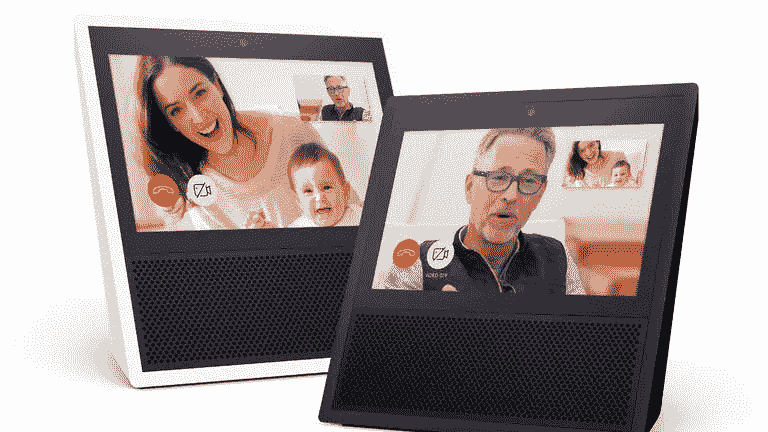

# 亚马逊的 Alexa 通话和信息战略

> 原文：<https://medium.com/hackernoon/amazons-strategy-for-alexa-calling-messaging-f4e7b330ed5b>

上周，亚马逊[宣布了他们新的亚马逊回声秀](https://techcrunch.com/2017/05/09/amazon-unveils-the-230-echo-show-with-a-screen-for-calls-shipping-june-28/)，随之而来的是他们新的 [Alexa 呼叫&信息服务](https://www.amazon.com/gp/browse.html?node=16713667011)。虽然主要注意力已经转移到 Echo Show 的视频通话功能，但现有的 Echo 设备和 Alexa 手机应用程序已经可以进行通话和发送消息。

但是，亚马逊对这一新功能的目标是什么？

在这篇文章中，我简要介绍了我认为[亚马逊](https://hackernoon.com/tagged/amazon)正在考虑的四个服务选项，这将推动其未来的发展和新的发布。这些是选择，但不是替代，因为亚马逊可能会同时追求其中的几个。

## 选项 1:涵盖基础知识

要考虑的第一个方面是新的[通信](https://hackernoon.com/tagged/communication)功能是 Echo 设备家族所需要的。[我在之前的文章](/@jorge.serna/what-was-missing-from-amazon-echo-9f39778fc910)中已经讨论过这一点，但是发送和接收简单信息或打免提电话的能力是这些产品所缺乏的，实际上[有一段时间](https://www.cnet.com/news/your-next-home-phone-might-be-an-amazon-echo-or-a-google-home/)人们一直在期待这一点。因此，提供这种功能似乎是保持 Echo 硬件系列在市场中的相关性的基本需求，而**亚马逊这样做可能只是为了销售更多的 Echo 设备**。我们还需要明白，销售更多的 Echo 设备不仅仅是硬件销售，而是让 Alexa——以及销售更多亚马逊产品和服务的机会——更接近他们的用户。

有趣的是亚马逊是如何选择做到这一点的:通过建立一个封闭的通信服务。在这种情况下,“关闭”是指该服务只能用于与同一服务的其他用户进行交流，无论是通过 Alexa 应用程序还是使用其他 Echo 设备。

这与苹果公司在 iPhone 4 上推出 FaceTime 时使用的方法相同，它为特定设备带来了价值，并使其有别于其他替代品。但在这种情况下，情况完全不同，因为尽管 Android 尚未提供 FaceTime 的原生替代品(你可以使用应用程序制作视频，但它不是特定于设备或操作系统的东西)，但 Echo line 的竞争已经在提供通信。

谷歌在他们的 IO 会议上宣布 [Google Home 也将支持语音通话](https://twitter.com/Google/status/864897892758294529)，但是允许向任何美国或加拿大的电话号码拨打电话。谷歌的方法在某些方面更灵活(例如，可以用来简单地定位你的家庭电话，这是 Alexa 只有通过特定技能才能提供的)，但也更有限，因为它还没有提供消息功能(我预计这将是亚马逊用户在一段时间内最常用的通信选项)或来电功能。

如果亚马逊只是想提供 Echo line 所需的基本通信能力，他们可以用不同的方式来实现。再次以 FaceTime 为例，他们本可以将服务仅限于点对点通信。但相反，他们也在 Alexa 应用程序中启用了通信功能，这为亚马逊的战略开辟了另一种选择。

## 选项 2:在社交领域竞争

Alexa 应用程序的通信功能允许您向 Echo 设备发送和接收语音消息和呼叫，还可以与其他应用程序用户进行通信，无需 Echo 硬件。超越点对点通信似乎是合理的，即使价值主张是围绕设备构建的，他们在自己的视频广告中也表明了这一点(请看 1 分 48 秒):

但是这些用例仍然围绕着你的家人，并且总是有一个 Echo 作为端点。如果亚马逊的目标“仅仅”是销售更多的 echo——如上所述——他们可以在几个方面限制 Alexa 服务:

*   仅允许来自应用程序的呼叫/消息回显端点
*   使用特定的地址簿，有限的设备列表(如家庭、父母、特定的朋友……)进行通信
*   对 Alexa 应用程序进行授权或链接，并允许它与特定的 Echo 进行对话

一般来说，一种“内部通话”方式，面向使用 Alexa 应用程序和 Echo 本身，只是为了与 3 或 4 个“通常的嫌疑人”进行交流。

亚马逊选择做别的事情，他们把你的整个电话地址簿上传到云端，这样你就可以根据他们的电话号码和那里的任何人联系。这种方法，也是 WhatsApp、[等其他通用通信应用所遵循的方法，已经引发了一些初步的批评](/@elise81/alexa-calling-has-a-major-privacy-flaw-7ee42ddcb493)。

任何有你电话号码的人都可以给你打电话，这是传统电话的一个众所周知的证明问题，这就是为什么随着时间的推移，手机中能够阻止来电者的[服务](https://www.att.com/esupport/article.html#!/local-long-distance/KM1010645)和[功能得到了发展。但对于像亚马逊 Echo 这样的新设备来说，这个问题是一个问题，特别是当它可以通过 Alexa 应用程序本身的一些地址簿管理选项或使用不同的身份识别方法来解决时。](https://support.apple.com/en-us/HT201229)

如果 Alexa 呼叫和消息服务的全部目的是为 Echo 设备系列带来额外的价值，那么我在 Alexa 应用程序联系人列表中看到的一些人就没有必要出现在那里。这让我想到**亚马逊认为保持“Alexa 网络”开放很有趣，这样它就可以用于更广泛的通信目标，而不仅仅是家庭内部通话**。如果你的水管工有 Alexa 应用程序，你实际上可以用你的 Echo 给他打电话…或者直接从你手机里的 Alexa 应用程序打电话。

按照其设计方式，Alexa 通信服务不需要任何 Echo 设备，亚马逊可以利用这一特性直接推动通信领域的价值，这样 Alexa 就可以直接与 Viber、Skype、WhatsApp 等竞争。随着 Echo Show 将视觉方法引入等式，消费视频通信产品并与之互动，SnapChat 开创的“故事”方法以及脸书将其引入整个社交通信线，可能会带来一些有趣的元素。

但现有的竞争是我不认为这是亚马逊的目标的原因。像 Alexa 这样的应用程序很难像今天这样与脸书竞争，与其他社交通信服务的数十亿用户相比，设备角度而不是差异化只能减少规模。正如我在[上一篇文章](/@jorge.serna/what-was-missing-from-amazon-echo-9f39778fc910)中提到的，我认为混合通信和 Alexa 服务管理功能的方法有点令人困惑，这是一个严重的限制，无法带来良好的通信应用程序交互，可以接近 Messenger 或 WhatsApp。

## 选项 3: Echo 设备作为通信平台

因此，与其将当前的 Alexa 通话和信息服务视为最终目标，不如将它作为亚马逊的参考实现呢？

亚马逊的战略是将他们提供的每一个组件都变成一个平台，这是它最大的优势之一，所以他们将这一功能封闭在他们的设备中是错误的。按照之前 FaceTime 的例子，苹果在每部 iPhone 上都提供视频通话体验，但允许 iOS 开发者也在他们的应用程序中提供视频通信。同样的事情也可能发生在亚马逊。

事实上，亚马逊已经开始开放一些功能，T2 宣布了他们的 Alexa 技能通知 API。使用这种功能，开发人员可以将现有的消息服务扩展到 Echo 设备，提供与亚马逊自己的原生消息类似的体验。但语音和视频支持仍然缺失，这也是亚马逊应该开放的，以便社交通信领域的现有参与者可以将他们的服务扩展到 Echo 设备中。

这将保持现有的 Alexa 服务作为一个基本选项，任何 Echo 用户都可以开箱即用，但开放环境，以便它可以通过应用程序(技能)进行扩展，以连接到任何其他通信网络，包括像 Google Home 这样的常规电话网络。

通过 Echo 拨打 WhatsApp 或 Skype 电话感觉是非常自然的事情，但**向开发者开放 Echo Show 的功能将创造出超越亚马逊最初雄心的新用例，从而使他们的设备对客户更有价值**。更有价值的 Echo 意味着亚马逊可以销售更多产品和服务的 Alexa 终端。

想想在 Echo Show 中使用 Instagram 故事，或者在该设备中使用 HouseParty 的机会。从学生通过视频一起参加长时间的学习会议，到通过 Echo Show 参加实际的家庭聚会。

## 选项 4:作为平台的 Alexa 通信服务

但随着每个 Echo 设备上现成的通信功能，以及 Alexa 应用程序潜在的额外毛细作用，Alexa 通信网络本身随着时间的推移会变得更有价值。亚马逊可能会有 B2B 业务，允许第三方与之连接。

所以也许你可以用你的 Echo Show 打电话给你的银行或者你的房地产经纪人，或者打电话给一家家庭维修公司，并在设备中显示你的问题到底是什么。

如果亚马逊采用选项 3，银行、真正的国家机构或任何人都有机会建立自己的 Alexa 技能来创建这种交互，但这将是:

*   一个更高的摩擦模型，这将需要最终用户找到并安装在 Alexa 的技能，而不是简单地说“Alexa 打电话给我的银行”
*   比直接从亚马逊获得服务更贵，因为构建和维护一个软件应用程序并不简单，尤其是对一些企业而言
*   一个比完整的 B2B 服务更糟糕的解决方案，可能还包括 CRM 功能，以及与其他业务功能的潜在集成，如亚马逊的 Chime 功能。

就像[我预计 WhatsApp 会利用他们的网络来包括 B2B 通信](/@jorge.serna/whatsapp-for-a2p-messaging-39c5a4d7bb8d)一样，Alexa 的强大网络将使亚马逊能够遵循同样的路线。

## 那么，什么是最好的选择呢？

正如我在开始时所说的，这些不是替代方案，所以这意味着亚马逊可以同时追求几个。但是每一种选择都伴随着额外的工作。特别是:

*   **选项 1** 可以说已经完成了。但是，如果他们不希望最终进入选项 2，他们将需要解决基本提议中的问题(如联系人阻止功能)，甚至完全改变身份模型。
*   **选项 2** 需要做很多工作，可能从将通信功能从 Alexa 管理应用中分离出来开始，并开始考虑其他相关和差异化的通信功能，如多方视频或更丰富的消息功能(想想 SnapChat 过滤器，但针对语音消息)。即便如此，Alexa Calling & Messaging 仍然比社交通讯领域的主要参与者(即脸书)落后几个数量级。所以可能不是最好的选择。
*   **选项 3** 要求在 ASK (Alexa 技能套件)中为音频和视频通话支持开放新的 API，并与几个相关合作伙伴(像脸书这样的大公司，或能带来差异化的公司，如 HouseParty)合作，展示 Echo 设备上的通信机会。支持比现有的基本技能方法更复杂的东西会很困难，但我认为这是值得的。
*   **选择 4** 可能需要获取更多关于达成业务的市场需求的信息，所以我建议采取观望的方式。等待选项 1 或选项 2 中设备的使用和通信服务的使用，对于选项 3，看看企业是否投资于创造具有通信能力的技能。这将是一个伟大的市场验证，以推动亚马逊自己的 B2B 产品的创造。

因此，如果我必须推动一些事情，我认为关键的方面是继续努力**修复选项 1 的基础，并开始为选项 3** 开放功能(就像他们对消息传递所做的那样)。但取决于这两个维度如何演变，亚马逊可能有更多的机会在互联设备中创建一种新的通信服务模式，并利用它成为该领域的一个普通玩家。

Google Home 会做些什么，或者苹果公司会对传闻中的 Siri 连接扬声器采取什么样的方式？好吧，也许这是未来文章的主题。

*【6 月 8 日更新】:想了解苹果在这个领域的计划吗？看看一个月后宣布的是什么吧**[***HomePod 与社会沟通***](/@jorge.serna/wwdc-2017-social-comms-5-homepod-and-social-communications-475839fdf457)*