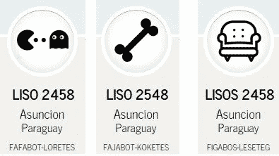

# 一个可以给 70 亿人即时解答的算法

> 原文：<https://medium.com/hackernoon/an-algorithm-that-can-give-an-instant-solution-to-7-billion-people-60bf628205a2>

Joshi’s new address

乔希有地址

他不需要市政府深思熟虑，达成共识来挑一个。他不需要将它添加到谷歌地图、开放地图或任何其他地图提供商。事实上，没有人需要知道它，但是，任何人都可以使用这些服务找到它。

拿到地址几分钟后，乔希通过短信把它发给了他的第一个病人普拉纳夫。尽管 Pranav 在农村没有互联网，但他只用纸和笔就找到了 Joshi 新诊所的确切位置。

一个不需要互联网，可以用笔和纸，甚至不出现在任何地图上的即时地址？。

欢迎来到算法地址的世界。

# **算法正在吞噬世界**

从我们在脸书时间线中发现奶奶在做什么的方式，到我们使用 Youtube 视频学习用鞋子打开酒瓶的方式，幕后的表演是由算法运行的。

最近算法成为了 T2 的焦点，基本上是因为它们是黑箱，可以用于 T4 的不正当目的。

但是什么才是真正的算法呢？

*   将一个柠檬切成两半→挤压柠檬→加入冰和糖

这就是:获取柠檬汁的算法。

一个算法最纯粹的形式是一系列的步骤来得到一些东西。

那么它和一个印度医生搬到乡下的算法有什么关系呢？

# **位置，位置，位置(不针对 40 亿人)**

75% of world population does not have a physical address

根据联合国的数据，超过 40 亿人没有实际地址；这意味着，没有办法快速呼叫救护车、消防队员或警察，没有简单的方法递送邮件，或精确定位供水系统、电力或电话的中断，它们在许多方面都是看不见的。

为了解决这个问题，人们投入了大量的努力和投资，从非政府组织为贫民窟提供邮政地址，到世界银行关于如何应对挑战的手册。

# **技术救援**

纬度和经度是定位地球上任何东西的明确而精确的方法，但是使用 20 06 ' 33.5 " N 79 18 ' 58.3 " E 作为地址既不直观，在日常交往中也不够有用。

科技为我们提供了一种方式，将这种位置转换成一种更简单的方式来传达同样的信息。例如:

[**Geohash**](https://en.wikipedia.org/wiki/Geohash) **:** 是古斯塔沃·尼迈耶(Gustavo Niemeyer)发明的地理编码系统，并置于公共领域。

使用 geohashing 对 20 06 ' 33.5 " N 79 18 ' 58.3 " E 进行编码，这将为我们提供一种有效地传输相同信息的更短方式

许可:免费-公共领域。

[**Mapcode:**](https://en.wikipedia.org/wiki/MapCode) 由 Mapcode 基金会运营，是由两组字母和数字组成的代码，中间用点号隔开。它表示地球表面的一个位置，在单独指定的国家或地区的上下文中。

编码 20 06'33.5"N 79 18'58.3"E 会给我们两个选择:
**MH 9X3N。TX** 为国家代码或 [**NQBHM。YKSF**](http://www.mapcode.com/getcoordst.html?iso3=112&mapcode=NQBHM.YKSF) 为国际代码，两者也都比原来的短。

许可证:免费- Apache 许可证版本 2.0。

[**Openlocationcode:**](https://en.wikipedia.org/wiki/Open_Location_Code)**是一个地理编码系统，用于识别地球上任何地方的一个区域。它由谷歌苏黎世工程办公室开发，于 2014 年 10 月下旬发布。开放位置代码也称为“加号代码”**

**编码 20 06'33.5"N 79 18'58.3"E 会给我们 **4858+PF Vadholi，442404，Maharashtra** 或另一个具有较短代码的选项 [**7JGX4858+PF**](https://plus.codes/7JGX4858+PF)**

**许可:免费开源**

**[**What3words:**](https://en.wikipedia.org/wiki/What3words) 是一个地理编码系统，用于位置的简单通信，分辨率为 3 m，What3words 将地理坐标编码为 3 个字典字。**

**编码 20 06'33.5"N 79 18'58.3"E 会给我们 [**适应性强.执拗.头面人物**](https://map.what3words.com/20%C2%B006'33.5%22N+79%C2%B018'58.3%22E)**

**许可证:商业专利寻址模式。**

> **以防有人认为寻址是一个不值得解决的问题，What3words 是一家于 2013 年启动的英国初创公司，迄今已从英特尔投资等机构筹集了超过[**1350 万美元**](https://angel.co/what3words) 用于将其解决方案商业化**
> 
> **除了门牌号和街道名称之外，**蒙古的**国家邮政投递服务[也将开始使用它](http://qz.com/705273/mongolia-is-changing-all-its-addresses-to-three-word-phrases/)。**

# ****生活中最好的东西是免费的(并且开源)****

****

**This is Joshi’s Xaddress; latitude and longitude are encoded inside.**

**我们回到乔希，我们的乡村医生，他有了新的地址。但这不是普通的地址，它是由 2016 年 8 月发布的免费开源算法 [**Xaddress**](http://www.xaddress.org) 创建的。**

**所以是的，Xaddress 会编码:**

**20° 06 ' 33.5 "北纬 79° 18 ' 58.3 "东经进入 **1031 喜爱的作品——印度马哈拉施特拉邦****

**Xaddress 是一种算法，是一种配方，您可以在您的应用程序、网站或内部服务中使用它来将位置从纬度和经度编码和解码为类似于普通地址的形式。**

**Xaddress 被设计为使用低技术解码，所以你可以使用笔和纸(也许是一个袖珍计算器，甚至是你的手机计算器)知道 **1031 LOVED WORKS** 在哪里。**

**我们说现在的算法名声不好，因为它们晦涩难懂，你不知道它们到底在做什么，那么展示一下 Xaddres 到底做了什么，就像 Pranav 解码 Joshi 的地址一样？。**

****

**Decoding Joshi’s Xaddress step by step using pen and paper — Animated gif, reload to start again.**

**你可以[按照这个指南](https://github.com/roberdam/Xaddress/tree/master/by_hand)手工编码和解码一个 Xaddress，或者你也可以在 Xaddress 网站上完成。**

**Xaddress 也是:**

*****离线*****

**Xaddress 可以离线使用，所以当 Joshi 创建他的 Xaddress 时，他不需要互联网接入，Pranav 也不需要到达 Joshi 的位置，需要地址的 40 亿人中的大多数也可能离线。**

*****视觉错误检测*****

**Xaddress 为每个创建的地址使用一个图像或“头像”作为视觉哈希，所以如果你输入错误，它会显示另一个图像。**

****

**Any mistype will create a different image to alert you about the error**

**当乔希通过电话给出他的地址时，他会说**

> **" **1031 件喜爱的作品——印度马哈拉施特拉邦**图像将是一个原子"**

*****短地址*****

**Xaddress 将另外创建一个用于存储或传输的短地址，例如 [CUKAKIK-GEFEJUJ](http://ubicate.me/CUKAKIK-GEFEJUJ)**

*****多语言*****

**Xaddresses 可以在任何语言上创建，甚至可以在传统地址可用时使用，以便更容易地传达位置。例如:**

**对于西方读者来说，Nándorfejérvári út 4 可以作为“残酷的奔跑 4604——匈牙利布达佩斯”来分享。**

# ****你有机会影响一个全球性的问题。****

**Xaddress 是您的工具。**

**在人类历史上，知识从来没有如此容易获得，这些知识可以用来改变现实和你们环境的限制。**

**渴望的头脑可以挑战强加的范式，并对他们的社区、国家和整个世界产生影响。**

**有时候你需要的只是一个工具。**

**把 Xaddress 作为你的地址，开始在你的社区中寻找解决问题的方法。不需要投资，不需要请求许可。**

**开发人员:为全球问题创建创新的解决方案，并将现有服务与 Xaddress 集成，以创建新的产品和服务。**

**地图或服务提供商:通过免费使用 Xaddress 整合 40 亿潜在客户，提高服务的使用率。**

**地方政府:使用 Xaddress 分配一个即时地址来管理维修、税收、运输发票等。**

> **可能性是无穷的，你准备好了吗？**

**在 Github 上用 [Xaddress 开始玩，或者在](https://github.com/roberdam/Xaddress)[www.xaddress.org](http://www.xaddress.org)中试试**

************

> **[黑客中午](http://bit.ly/Hackernoon)是黑客如何开始他们的下午。我们是阿妹家庭的一员。我们现在[接受投稿](http://bit.ly/hackernoonsubmission)并乐意[讨论广告&赞助](mailto:partners@amipublications.com)的机会。**
> 
> **如果你喜欢这个故事，我们推荐你阅读我们的[最新科技故事](http://bit.ly/hackernoonlatestt)和[趋势科技故事](https://hackernoon.com/trending)。直到下一次，不要把世界的现实想当然！**

****