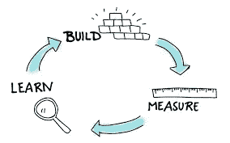

# 一个 API 初创公司的一年回顾

> 原文：<https://medium.com/hackernoon/an-api-startups-year-in-review-4e9102a2b470>

这一年开始时我是一名员工，结束时我是一名联合创始人。这篇博客从一位年轻的科技联合创始人的角度简要回顾了 2016 年，他开始着手建立一个基于云的内容管理平台，其核心是一个强大的 JSON API。

# 2016 年 1 月

2016 年 1 月 2 日，我坐在我以前的互动品牌代理公司的办公桌前。我在该机构的角色是寻找和获得新客户，确定他们的项目范围，并随后管理他们直到后期制作。这是一家好机构的一个好职位，但指标还没有显示出作为一名新出现的联合创始人，我今年会有什么收获。

# 2016 年 4 月 1 日

今天就是那一天。我厌倦了，更重要的是，我累了。我已经在我的互动公司追了两年了，大多数人会证明这就像是在“正常工作”中的 7 年。“更聪明地工作”的概念似乎在代理商的口头禅中消失了，不断建议客户使用 WordPress 内容管理解决方案的挫败感很重。我鼓起勇气监督我的辞职通知，开始更大更好的事情。虽然辞职并不顺利，但这是愚人节，这将开始我的人生转变。

# 2016 年 4 月

这可能是我一生中最重要的纳税日，因为我现在的联合创始人(托尼)给我打了一个电话，告诉我他在下班后偷偷摸摸地工作的一个机会。我的联合创始人并不陌生，因为我们曾在我们的数字机构一起工作，一起开发网络应用程序好几年了。我引入项目，确定范围并管理它们，而我的联合创始人带领他的前端和后端开发团队负责开发。托尼和我在我们公司有一个共同的问题:我们的互动项目执行起来既费时又费钱。他一直在开发一个基于云的内容管理平台，他觉得这个平台有一天会“取代 WordPress”。[Cosmic Stack](https://cosmicjs.com/blog/the-cosmic-stack)是一个轻量级的、基于云的内容管理解决方案，通过只需要 Cosmic JS CMS API 和一个代码库来简化您的堆栈。Cosmic JS 的工作原理是将内容从代码中分离出来，允许开发人员用他们想要的任何编程语言来构建流畅的应用程序和网站。

# 2016 年 5 月

我们扣动了扳机。在读了几本书、数百篇文章，甚至看了几个 YouTube 视频后，我们决定扣动扳机，将[宇宙 JS](https://cosmicjs.com) 合并为特拉华州的 C-Corp，带着光明的希望和抱负开始我们的联合创始人之旅。

# 2016 年 6 月

我们在做什么？同样的希望，同样的雄心，同样伟大的产品，但是信息传递被切断了。我们的故事还不匹配。我们不知道在哪里推销产品，以什么方式或什么顺序。我们写了专门的博客，在推特上发布了我们构建的新的示例应用程序，但是内聚性还不是我们的中间名。我们花了 5 月、6 月和 7 月初的时间整理公司成立阶段的文书工作，建立支付网关、银行账户、聘请律师，并更新我们自己的社交网络，以反映我们的新实体。我们正在为公开测试做准备。

# 2016 年 7 月

我们决定在 7 月 19 日星期二发布我们的公开测试版，使用产品搜索作为我们测试版的上市工具。注册人数和流量开始激增，我们对点击量的胃口也是如此。从去年 7 月 19 日开始，用户可以注册该平台，而无需我们批准他们进入该系统。支付网关已连接，但仍在准备于 2016 年 8 月 1 日上线。

# 2016 年 8 月

牵引力，你这个逃避的动物。用户涌入系统，注册并联系 Cosmic JS c0-founders，寻求帮助查找博客、教程、演示，以及向我们提出问题。“迭代反馈循环”对我们来说是无价的，因为我们开始为用户想要什么，他们正在经历什么样的痛点，以及什么可以最有效地缓解这些痛点建立优先级阶梯。

我说过我们找到了第一个付费客户吗？！

# 2016 年 9 月

第二个付费客户。第三。第四。开始为 HackerNoon.com 做贡献。日平均注册人数开始增加。总体日流量正在增加。我们根据需要每周进行 3 到 4 天的演示，编辑网站内容，并制定了一个更具凝聚力的社交媒体战略。我们开始根据一周或几周前设定的活动目标进行每日和每周的冲刺。我们开始收到加速器、风投和天使财团的消息。宇宙 JS 用户点击 [50 万 API 请求](https://cosmicjs.com/blog/cosmic-js-users-hit-500000-api-requests)。选项开始出现。

# 十月/十一月/十二月

由于 VCs 和加速器要求外部交付物，我们开始预测对公司本身的异议，这对于我们来说是一个新的前沿，因为到目前为止我们主要关注与平台和工具本身相关的异议。当我们寻求资金和顾问帮助我们将创业推向更高水平时，我们意识到许多审查我们的人觉得我们对这个过程和我们的产品一样重要。我们改造了[主页](https://cosmicjs.com)，创建了[宇宙 JS 社区](https://cosmicjs.com/community)，推出了几个新功能集，并开始通过[视频](https://www.youtube.com/channel/UCDzCWWJLVWLpoHB5oGH0H-A)和我们的[开发者聚光灯系列](https://cosmicjs.com/blog/developer-spotlight-simple-media)记录公司和产品。哦，宇宙 JS 用户点击[100 万 API 请求](https://cosmicjs.com/blog/one-million-requests-one-million-thanks)。

# 产品演示

# 见见创始人

# 2017 年 1 月

作为一家成熟的初创公司，我们第一年的开始。自成立以来，我们的总体目标和轨迹如下:

> *以 250%的速度增长 MOM 收入剪辑*
> 
> *12 月份签约率最高*
> 
> *首批 20+付费客户使用 30+付费产品*
> 
> *确定纽约顾问上船*
> 
> *为财富 500 强企业征集企业演示和合同*
> 
> *80 多个国家使用的平台*
> 
> *自成立以来注册人数翻了一番*
> 
> *与 AngelList 辛迪加合作锚定天使之轮*
> 
> *宇宙 JS 用户点击 200 万 API 请求*

感谢您阅读了我们过去 9 个月的旅程。我们知道，2017 年对我们的初创公司以及作为共同创始人的我们来说都是巨大的一年。我很感激任何来自创业社区的反馈和指导，他们成功地将产品推广到了能让他人生活更好的公司。在[推特](https://twitter.com/carsoncgibbons)上关注我，查看我的[网站](https://carsongibbons.com)。

[Cosmic JS](https://cosmicjs.com/) 是一个 API 首创的基于云的内容管理平台，可以轻松管理应用和内容。如果你对 Cosmic JS API 有任何疑问，请通过 [Twitter](https://twitter.com/cosmic_js) 或 [Slack](https://cosmicjs.com/community) 联系创始人。

> 卡森·吉本斯是 [Cosmic JS](https://cosmicjs.com) 的联合创始人& CMO，这是一个 API 第一的基于云的[内容管理平台](https://cosmicjs.com)，它将内容与代码分离，允许开发人员用他们想要的任何编程语言构建流畅的应用程序和网站。

> [黑客中午](http://bit.ly/Hackernoon)是黑客如何开始他们的下午。我们是阿妹家庭的一员。我们现在[接受投稿](http://bit.ly/hackernoonsubmission)并乐意[讨论广告&赞助](mailto:partners@amipublications.com)机会。
> 
> 如果你喜欢这个故事，我们推荐你阅读我们的[最新科技故事](http://bit.ly/hackernoonlatestt)和[趋势科技故事](https://hackernoon.com/trending)。直到下一次，不要把世界的现实想当然！

