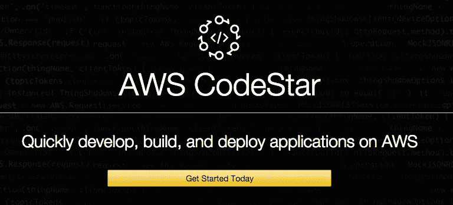
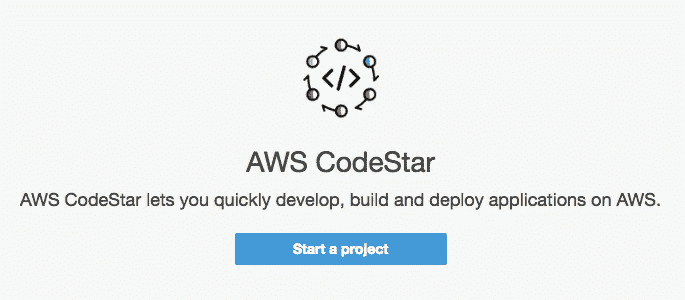
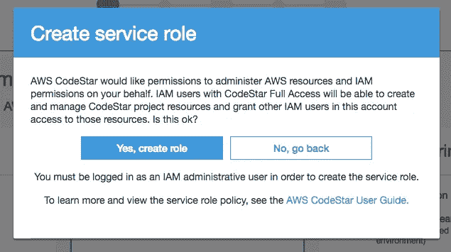
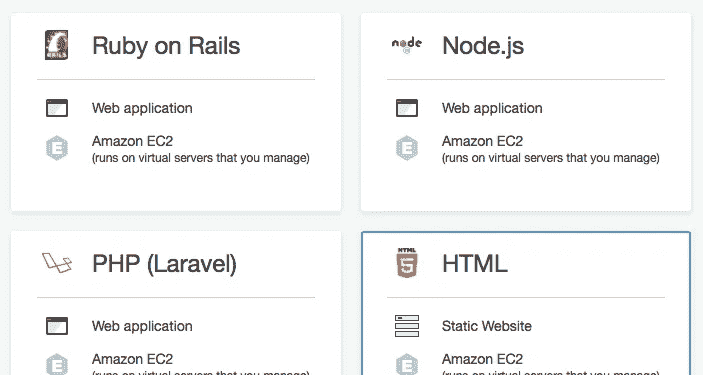
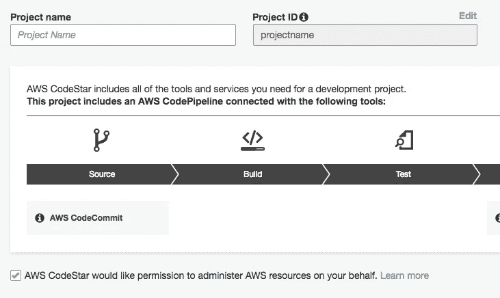
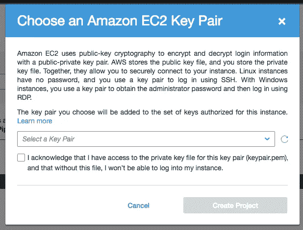
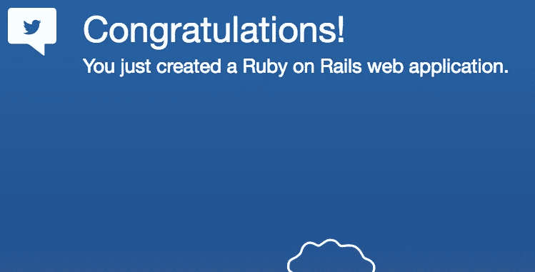

# 从应用程序开发人员的角度看 AWS CodeStar

> 原文：<https://medium.com/hackernoon/an-application-developers-perspective-of-aws-codestar-938e05ebf9fc>

不久前，亚马逊宣布了他们的最新服务，AWS CodeStar T1。在应用程序开发领域，这是一个非常令人兴奋的发展。

我真正希望从 CodeStar 看到的是一个工具，它将取代我最不喜欢的 web 开发方面……devo PS。虽然这很有趣，而且我处理得也很好，但实际上我并不*喜欢*这么做。

创建和配置服务器变得单调乏味，而在生产环境中管理这些服务器更是伤脑筋。CodeStar 有很大的潜力来简化应用程序开发人员的工作流程，但我想知道它是否足以完全取代我配置和管理基础架构的需求。

## 你得到了什么

CodeStar 支持 Java、JavaScript、PHP、Ruby 和 Python。它为每种语言都提供了“模板”,用于在几分钟内配置整个应用程序基础架构。在 EC2、AWS Lambda 或 AWS Elastic Beanstalk 上启动应用程序时可以使用模板。

每个应用程序都有一个附带的仪表板，您可以在其中跟踪提交、构建、测试和部署。您还可以查看应用程序的性能统计数据，并通过内置的 JIRA 集成跟踪问题。

当你看到你得到的一切时，CodeStar 听起来很棒。这听起来*如此*惊人以至于[它甚至产生了对 DevOps](https://news.ycombinator.com/item?id=14149570) 未来的一点担忧…

CodeStar 似乎是应用程序开发人员正在寻找的解决方案。问题是它能实现所有的潜力吗？我想我应该去兜一圈看看。

我将介绍我使用 CodeStar 部署第一个应用程序的过程，并分享我对这一体验的想法。

# 入门指南

CodeStar 使入门变得非常容易。从 [CodeStar 主页](https://aws.amazon.com/codestar/)我点击了 ***今天就开始*** 。

这将我带到我的 CodeStar 仪表板，在那里我可以看到我所有的应用程序。因为我还没有创建，所以我看到了这个:

点击 ***启动项目*** 后，系统提示我授予 CodeStar 代表我管理 AWS 资源的权限。这是因为我从未设置过我的 IAM 权限。继续我点击了 ***是，创建角色*** 。

# 创建项目

我有 27 个不同的“模板”应用程序可供选择。每个模板都给了我关于将创建什么类型的基础设施的详细信息。

## Ruby on Rails

我想看看与 Heroku 相比，启动 Ruby on Rails 应用程序的过程感觉如何，因为这是近十年来最简单的方法。

我选择在 Elastic Beanstalk 上发布 Ruby on Rails 应用程序。命名我的应用程序后，我点击 ***创建项目*** ，剩下的工作由 CodeStar 完成:

我被提示向 AWS 添加一个 SSH 密钥，因为我过去没有添加过。添加 SSH 凭据后，我就可以继续创建我的应用程序了:

# 仪表板

我可以在仪表板的右上角看到我的应用程序的进度。当我的应用程序被创建时，我花时间四处看看。

要做的事情太多了，我不知道从哪里开始…

从仪表板上，我可以管理资源、监控应用程序性能、查看我的代码库和提交、管理 CI 管道等等。真正的亚马逊形式，他们几乎给了我一切和厨房水槽。实际上有点让人不知所措。

15 分钟后，我的申请完成了。我可以使用主仪表板上的 ***应用程序端点*** 部分来查看它。

模板 Rails 应用程序实际上非常酷。它不只是一个默认的 Rails 应用程序，而是一个轻度品牌化的定制 Rails 应用程序，可以根据一天中的时间改变背景。

我的开发人员认为这有点傻，但我的人认为对细节的关注实际上非常棒。

# 这么多事要做，时间却这么少

我不可能在仪表盘上查看我能做的每一件事，我们会在这里呆上好几天。我会强调一些我喜欢的东西，然后是一些我不喜欢的。

# 我喜欢什么

我喜欢项目创建过程如此简单。很容易开始，选择模板，并启动我的项目。我喜欢 CodeStar 在我的项目创建过程中带我完成额外的设置。

我还喜欢能够查看我的应用程序代码库和提交历史。因为它全部托管在 AWS CodeCommit repo 中，所以他们就把它放在仪表板上。

我喜欢的最后一个值得注意的东西是默认应用程序。我认为 AWS 给他们的模板应用打上商标真的很酷。

# 我不喜欢的是

我尽量不要对 CodeStar 太挑剔，因为我希望我的分析是客观的。然而，在过去的 6 个月里，我一直在使用 [Nanobox](https://nanobox.io/) ，所以我有一些非常高的期望。

## 调配时间

我注意到的第一件事是调配基础架构所花费的时间。他们的入门指南提到，基础架构将在“几分钟内”建立起来。在我的脑海中，我想的是五分钟或更少，这是我已经习惯了的。

最终，正如我已经提到的，我的项目花了将近 15 分钟才启动并运行。这比我希望的要长得多。唯一的可取之处是，在那段时间里，我经历了一些额外的配置，这使得它看起来不那么长。

## 所有的事情

下一个对我来说是个缺点，但也许不是对所有人。为了从 CodeStar 中获得任何好处，你不得不将 AWS 用于所有的事情。

如果只能在一个地方使用，那么有这么酷的工具还有什么意义。如果我想要 CodeStar 的任何好处，我就必须使用 AWS。虽然我没有经常到处部署我的应用程序，但还是感觉有点令人窒息。

我喜欢知道我可以自由地在任何地方部署我的应用程序…以防万一。

## 语言/框架支持

CodeStar 一开始就支持有限的语言和框架模板，这让我有点失望。

我希望看到对 Golang 和 Elixir (Phoenix)以及更多 Node.js 和 PHP 框架的支持。我确信他们将来会增加更多，但同样，与我习惯的相比[，这感觉非常有限。](https://guides.nanobox.io/)

## 日志

让我感到非常奇怪的是，你是如何用 CodeStar 访问你的日志的。您可以选择查看最后 100 个日志，或者下载整个日志…

当我对正在运行的应用程序进行故障排除时，我需要流式日志。简单明了。如果我能点击页面，看看到底发生了什么，事情就简单多了。此外，我不喜欢看到 100 个或所有内容，而是喜欢一次一步地查看我的日志块，以跟踪输出结果，找到错误的根源。

## 工作流程

这对我来说是一件大事，使用 CodeStar 感觉像是一个巨大的退步。我一直在隔离的开发环境中进行开发，可以在任何地方部署。

我不必管理语言、版本和依赖关系。所有这些都是为我准备的。我描述了我的应用程序环境，无论是在本地还是在生产中，它每次都是相同的配置。有了 CodeStar，我感觉自己又回到了“老方法”上。

## 800 磅。大猩猩

是时候解决我对 CodeStar 最大的不满了。这和我对大多数 AWS 产品的抱怨是一样的……仪表盘。

> “(亚马逊仪表盘)的问题在于，他们随身携带着所有这些隐含的环境。你想要一个香蕉，但你得到的是一只大猩猩拿着香蕉和整个丛林。”~乔·阿姆斯特朗

虽然这段引文实际上是在谈论面向对象语言，但我觉得它完美地描述了我在尝试使用 CodeStar 时的感受。

虽然仪表盘有很多很酷的功能和你可以用它做的事情，但它太大了*。事实上，仪表板是如此之大，它实际上是四个仪表板伪装成一个。*

*理论上，CodeStar 似乎通过消除 DevOps 的所有复杂性提供了简单性。最终，所有的复杂性都被局限在一个仪表板中，很难找到您想要的东西，理解它的功能，以及它是如何协同工作的。*

**

*“EVERY THING ON IT — Shel Silverstein”*

# *结论*

*亚马逊承认存在问题的事实说明了一切。他们朝着正确的方向迈出了一大步，但还差一点。就目前情况来看，我不认为 CodeStar 会成为 DevOps 的终结。只是还没到那一步。*

*我将坚持使用我一直使用的。它给了我一个完整的生产工作流程的发展，并检查了所有的盒子。不是我不能做 DevOps…我只是不想再做了。*

*我热爱学习、创造和建设。这就是为什么我如此喜欢发展。但是，我已经精疲力尽了，因为我必须成为一个全栈、DevOps、sys。管理员，摇滚明星，忍者，大师。我只想写代码，做一些很酷的东西。*

*可能是因为我是一个 30 多岁的开发者，但是戴这么多帽子脖子都疼。*