# 一个人为的例子，MobX 确实很出色，而 Redux 并不真正适合它

> 原文：<https://medium.com/hackernoon/an-artificial-example-where-mobx-really-shines-and-redux-is-not-really-suited-for-it-1a58313c0c70>

首先，提醒一句。在这篇文章中，我不是说 MobX 更好，或者我更喜欢它，或者任何东西。

Redux 和 MobX 我都用。

我喜欢他们两个，可能会再次使用他们两个。

本文**仅**给出了一个**人工示例**一个应用程序，如果我们需要它在相同的**性能水平上运行，那么用 MobX 很容易编写，但用 Redux 很难。**如果我没有说清楚，**这是一个不公平的比较。**

因此，这篇文章根本不是一个全面的比较，不应该被认为是基于现实世界的情况。所以请不要指着一个像这样的人造基准说“让我们都用*这个*而不是*那个*。快了*。*

我不相信有一个最好的工具。我相信每个工具都有自己的闪光点和不擅长的地方。

凡事都有个时间。我做这种实验是为了更好地了解我使用的工具，这样我就可以在未来为正确的工作选择正确的工具。

说完了，我们继续。

# 版本

就像 JavaScript 世界中的其他事情一样，我相信随着事情的进一步优化，这篇文章会很快过时。这就是为什么我要在这里列出版本号:

*   `react@15.4.1`，`react-dom@15.4.1`
*   `redux@3.6.0`，`react-redux@5.0.0-rc.1`
*   `mobx@2.6.4`，`mobx-react@4.0.3`

# 任务:像素绘画

我将使用 React 创建一个**【像素绘画】**应用程序。它有一个画布，在 128×128 的网格上显示可绘制的像素。

你可以用鼠标悬停在任何像素上进行绘画。

我们将并排渲染两张画布，但两张画布共享同一个图像。否则，每个像素都可以使用自己的本地组件状态，我们根本不需要使用任何状态管理库。

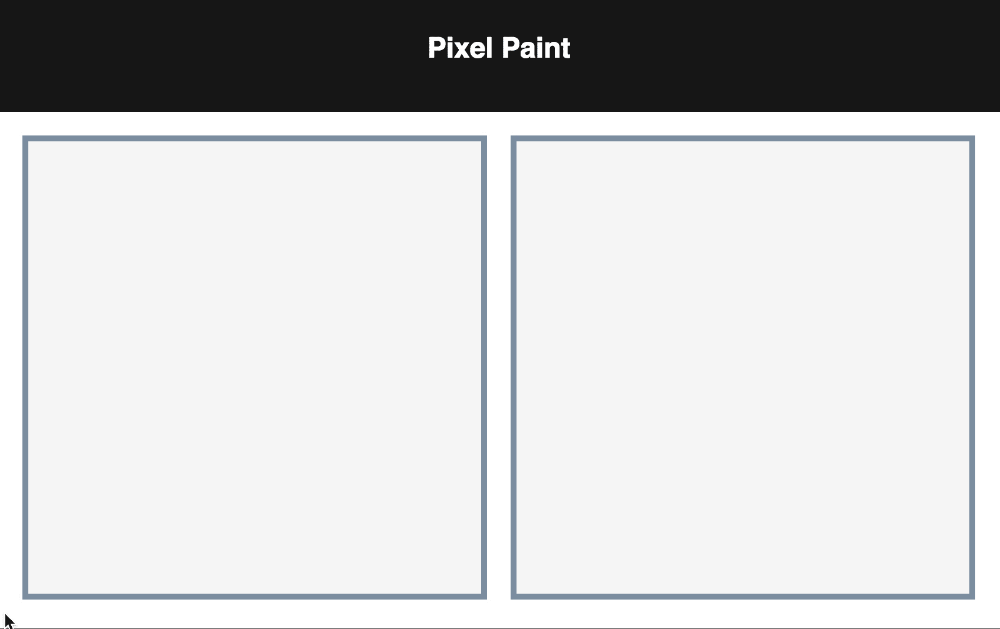

每个像素由一个`<div>`表示。

所以要渲染和更新 128×128×2=32768 个 DOM 节点。

这个实验将会非常缓慢。

**注意:**所有测试都是在生产版本上进行的。

# MobX 版本

这是商店。(我在避免修饰语法，因为在撰写本文时，语法[正在等待提案](https://github.com/babel/babel/issues/2645)。)

```
**const** store = observable({
  pixels: asMap({ }),
  isActive (i, j) {
    **return** !!store.pixels.get(i + ',' + j)
  },
  toggle: action(**function** toggle (i, j) {
    store.pixels.set(i + ',' + j, !store.isActive(i, j))
  })
})
```

我们的画布渲染每个像素。

```
**function** MobXCanvas () {
  **const** items = [ ]
  **for** (**let** i = 0; i < 128; i++) {
    **for** (**let** j = 0; j < 128; j++) {
      items.push(<PixelContainer i={i} j={j} key={i + ',' + j} />)
    }
  }
  **return** <div>{items}</div>
}
```

每个像素在存储中观察自己的状态。

```
**const** PixelContainer = observer(**function** PixelContainer ({ i, j }) {
  **return** <Pixel
    i={i}
    j={j}
    active={store.isActive(i, j)}
    onToggle={() => store.toggle(i, j)}
  />
})
```

[**结果来了。**](https://dtinth.github.io/pixelpaint/?experiment=MobXCanvas) 可以进入屏幕右上角的`[mobx-react-devtools](https://github.com/mobxjs/mobx-react-devtools)`。

这是分析应用程序性能的结果:

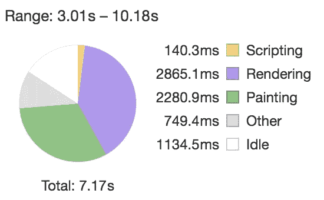

在上面的饼图中，脚本只占一小部分。大部分时间花在渲染和绘画上。

所以这意味着 MobX 正在尽最大努力！

# Redux 版本:首次尝试

这是减速器:

```
**const** store = createStore((state = Immutable.Map(), action) => {
  **if** (action.type === 'TOGGLE') {
    **const** key = action.i + ',' + action.j
    **return** state.set(key, !state.get(key))
  }
  **return** state
})
```

选择器:

```
**const** selectActive = (state, i, j) => state.get(i + ',' + j)
```

动作创建者:

```
**const** toggle = (i, j) => ({ type: 'TOGGLE', i, j })
```

我们的 Redux 商店准备好了。

我们的画布为每个像素提供了`store`:

```
**function** ReduxCanvas () {
  **const** items = [ ]
  **for** (**let** i = 0; i < 128; i++) {
    **for** (**let** j = 0; j < 128; j++) {
      items.push(<PixelContainer i={i} j={j} key={i + ',' + j} />)
    }
  }
  **return** <Provider store={store}>
    <div>
      {items}
    </div>
  </Provider>
}
```

每个像素的 T2 对应于那个 T3。

```
**const** PixelContainer = connect(
  (state, ownProps) => ({
    active: selectActive(state, ownProps.i, ownProps.j)
  }),
  (dispatch, ownProps) => ({
    onToggle: () => dispatch(toggle(ownProps.i, ownProps.j))
  })
)(Pixel)
```

[**下面是结果**](https://dtinth.github.io/pixelpaint/?experiment=ReduxCanvas) **。**你可以用`redux-devtools-extension`来查看店铺状态、行动，还可以做一些时间旅行。

好像这个版本比 MobX 的版本慢很多。让我们看看侧写。

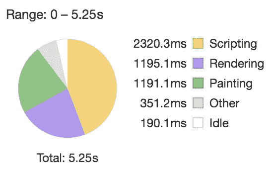

**运行 JavaScript 花费了大量时间。**差不多 50%。这可不好。为什么要花这么长时间？

让我们做一些分析:

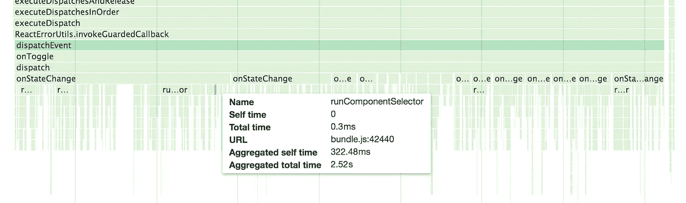

原来 Redux 的订阅模式就是这么运作的。

在上面的例子中，每个像素都被`connect`存储，这意味着它订阅了存储。当它改变时，每个订户决定它是否对该改变感兴趣，并做出相应的反应。

这意味着当我改变一个像素时，Redux 会通知所有 32，768 个用户。

与 Angular 1 的*检污机构*相同。而且它的建议对 Redux 也成立:*不要在屏幕上渲染太多东西。*

**使用 Redux，只能整体订阅店铺。你不能订阅你的状态的子树，因为那个子树只是一个普通的旧 JavaScript 对象，不能被订阅。**

有了 MobX，每一个状态都是可观察的。因此，在 MobX 版本中，每个像素都订阅自己的状态子树。所以从第一次尝试就这么快。

# 第二次尝试:单一订户

因此，太多的用户可能是一个问题。所以这一次，我会让它只有一个订户。

这里，我们创建了一个`Canvas`组件，它将订阅存储并呈现所有像素。

```
**function** ReduxCanvas () {
  return <Provider store={store}><Canvas /></Provider>
}**const** Canvas = connect(
  (state) => ({ state }),
  (dispatch) => ({ onToggle: (i, j) => dispatch(toggle(i, j)) })
)(**function** Canvas ({ state, onToggle }) {
  **const** items = [ ]
  **for** (**let** i = 0; i < 128; i++) {
    **for** (**let** j = 0; j < 128; j++) {
      items.push(<PixelContainer
        i={i}
        j={j}
        active={selectActive(state, i, j)}
        onToggle={onToggle}
        key={i + ',' + j}
      />)
    }
  }
  **return** <div>{items}</div>
})
```

然后，`PixelContainer`将把从`Canvas`收到的道具传递给它的`Pixel`。

```
**class** PixelContainer **extends** React.PureComponent {
  **constructor** (props) {
    **super**(props)
    **this**.handleToggle = **this**.handleToggle.bind(**this**)
  }
  handleToggle () {
    **this**.props.onToggle(**this**.props.i, **this**.props.j)
  }
  render () {
    **return** <Pixel
      i={**this**.props.i}
      j={**this**.props.j}
      active={**this**.props.active}
      onToggle={**this**.handleToggle}
    />
  }
}
```

[**下面是结果**](https://dtinth.github.io/pixelpaint/?experiment=ReduxCanvasV2) **。**

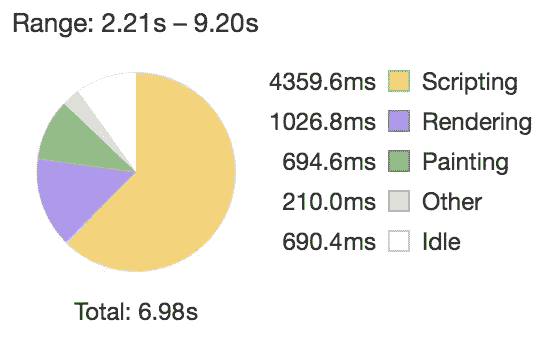

这个版本的表现比第一次更差。

让我们看看是怎么回事。


问题好像是我们的`Canvas`。因为它是唯一订阅该商店的用户，所以现在它负责管理所有 16，384 个像素。

**每个店铺派单需要用正确的道具渲染 16384 个** `**Pixel**` **s** 。

这意味着 16，384 个`React.createElement`调用，随后 React 试图为每个画布协调 16，384 个孩子。不太好。

我们可以做得更好！

# 第三次尝试:平衡树

Redux 的一个关键优势在于它的**不可变状态树**(它支持一些很酷的特性，比如无痛热重装和时间旅行)。

事实证明，我们构建数据和视图的方式并不是一成不变的。

不可变状态树存储在平衡树中时效果最好。我在这篇文章中讨论过这个想法:

[](/@dtinth/immutable-js-persistent-data-structures-and-structural-sharing-6d163fbd73d2) [## 不可变的. js，持久数据结构和结构共享

### 为什么要用 Immutable.js 而不是普通的 JavaScript 对象？

medium.com](/@dtinth/immutable-js-persistent-data-structures-and-structural-sharing-6d163fbd73d2) 

## **所以让我们对我们的应用程序做同样的事情。**

我们将画布细分为四个象限。

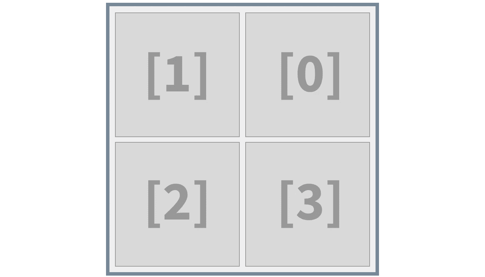

当我们需要改变一个像素时，

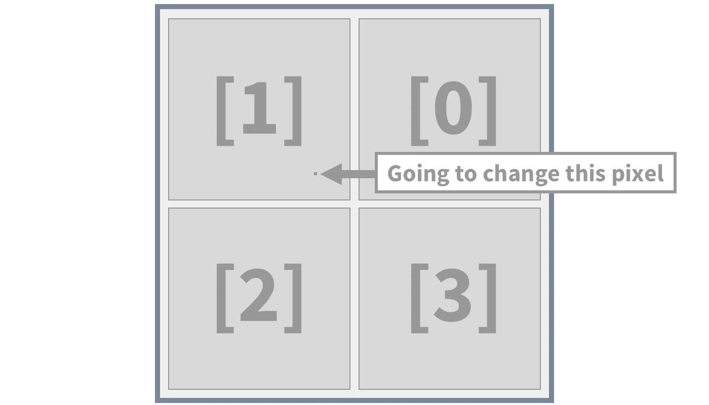

我们可以只更新相关的象限，不去管其他 3 个象限。

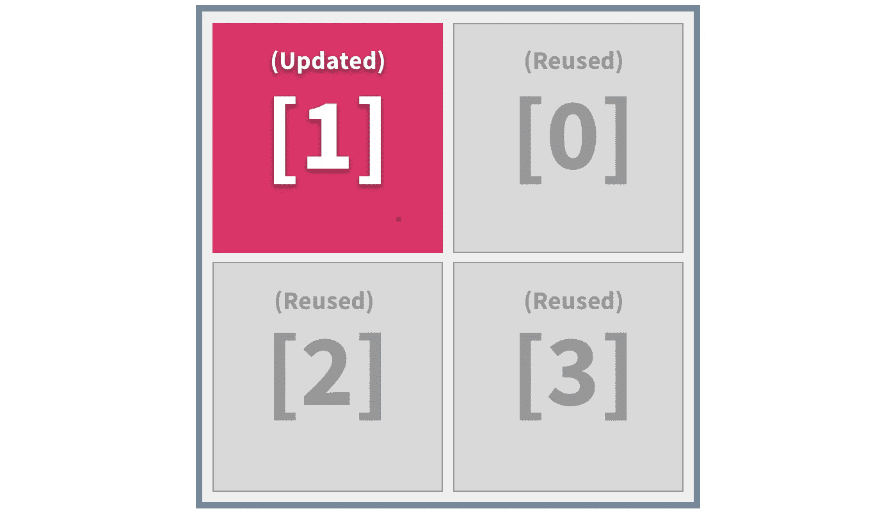

我们可以只重新渲染 64×64=4096 个像素，而不是重新渲染所有 16，384 个像素。这在性能上节省了 75%。

4096 还是一个很大的数字。所以我们要做的是递归地细分画布，直到达到 1×1 像素的画布。

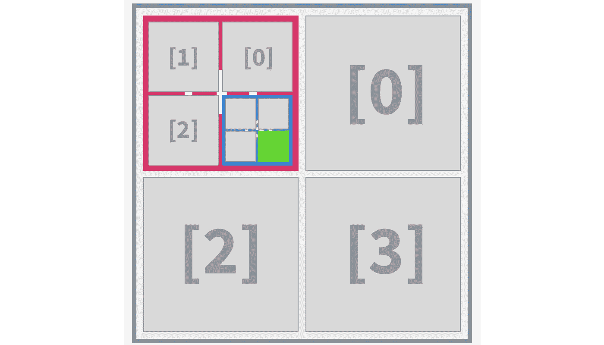

**为了能够以这种方式更新组件，我们也需要以同样的方式构造我们的状态，**这样当状态改变时，我们可以使用`===`操作符来确定象限的状态是否已经改变。

下面是(递归地)生成初始状态的代码:

```
**const** generateInitialState = (size) => (size === 1
  ? **false**
  : Immutable.List([
    generateInitialState(size / 2),
    generateInitialState(size / 2),
    generateInitialState(size / 2),
    generateInitialState(size / 2)
  ])
)
```

现在我们的状态是一个递归嵌套的树，不是像(58，52)那样通过坐标来引用每个像素，而是像(1，3，3，2，0，2，1)那样通过路径来引用每个像素。

但是要在屏幕上显示它们，我们需要能够根据路径计算出坐标:

```
**function** keyPathToCoordinate (keyPath) {
  **let** i = 0
  **let** j = 0
  **for** (**const** quadrant **of** keyPath) {
    i <<= 1
    j <<= 1
    **switch** (quadrant) {
      **case** 0: j |= 1; **break**
      **case** 2: i |= 1; **break**
      **case** 3: i |= 1; j |= 1; **break**
      **default**:
    }
  }
  **return** [ i, j ]
}
```

我们还需要反过来做:

```
**function** coordinateToKeyPath (i, j) {
  **const** keyPath = [ ]
  **for** (**let** threshold = 64; threshold > 0; threshold >>= 1) {
    keyPath.push(i < threshold
      ? j < threshold ? 1 : 0
      : j < threshold ? 2 : 3
    )
    i %= threshold
    j %= threshold
  }
  **return** keyPath
}
```

现在我们可以改变我们的减速器看起来像这样:

```
**const** store = createStore(
  **function** reducer (state = generateInitialState(128), action) {
    **if** (action.type === 'TOGGLE') {
      **const** keyPath = coordinateToKeyPath(action.i, action.j)
      **return** state.updateIn(keyPath, (active) => !active)
 *//* | *//           This is why I use Immutable.js:
      //           So that I can use this method.*    }
    return state
  }
)
```

然后，我们创建一个组件来遍历这棵树，并把所有东西放在适当的位置。`GridContainer`连接到商店并呈现最外面的`Grid`。

```
**function** ReduxCanvas () {
  **return** <Provider store={store}><GridContainer /></Provider>
}**const** GridContainer = connect(
  (state, ownProps) => ({ state }),
  (dispatch) => ({ onToggle: (i, j) => dispatch(toggle(i, j)) })
)(**function** GridContainer ({ state, onToggle }) {
  **return** <Grid keyPath={[ ]} state={state} onToggle={onToggle} />
})
```

然后每个`Grid`递归地渲染自己的一个较小版本，直到它到达一片叶子(一个白色/黑色 1x1 像素的画布)。

```
**class** Grid **extends** React.PureComponent {
  **constructor** (props) {
    **super**(props)
    **this**.handleToggle = **this**.handleToggle.bind(**this**)
  }
  shouldComponentUpdate (nextProps) {
    *// Required since we construct a new `keyPath` every render
    // but we know that each grid instance will be rendered with
    // a constant `keyPath`. Otherwise we need to memoize the
    // `keyPath` for each children we render to remove this
    // "escape hatch."*
    **return** this.props.state !== nextProps.state
  }
  handleToggle () {
    **const** [ i, j ] = keyPathToCoordinate(**this**.props.keyPath)
    **this**.props.onToggle(i, j)
  }
  render () {
    **const** { keyPath, state } = **this**.props
    **if** (**typeof** state === 'boolean') {
      **const** [ i, j ] = keyPathToCoordinate(keyPath)
      **return** <Pixel
        i={i}
        j={j}
        active={state}
        onToggle={**this**.handleToggle}
      />
    } **else** {
      **return** <div>
        <Grid onToggle={**this**.**props**.onToggle} keyPath={[ ...keyPath, 0 ]} state={state.get(0)} />
        <Grid onToggle={**this**.**props**.onToggle} keyPath={[ ...keyPath, 1 ]} state={state.get(1)} />
        <Grid onToggle={**this**.**props**.onToggle} keyPath={[ ...keyPath, 2 ]} state={state.get(2)} />
        <Grid onToggle={**this**.**props**.onToggle} keyPath={[ ...keyPath, 3 ]} state={state.get(3)} />
      </div>
    }
  }
}
```

[**下面是结果**](https://dtinth.github.io/pixelpaint/?experiment=ReduxCanvasV3) **。**

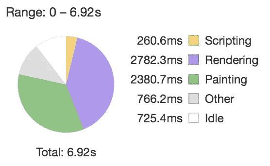

唷，我们又回到速度了！感觉和 MobX 版本一样快。另外，你还可以进行热重装和时间旅行。

我们的 DOM 树看起来也更像树:

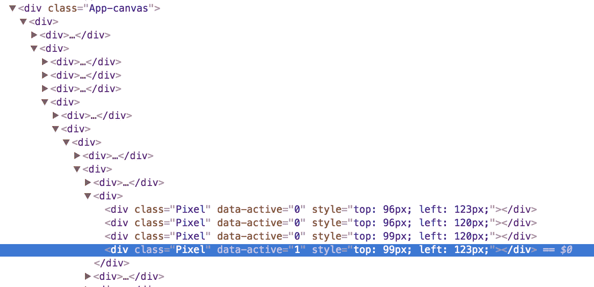

与所有以前的方法相比:

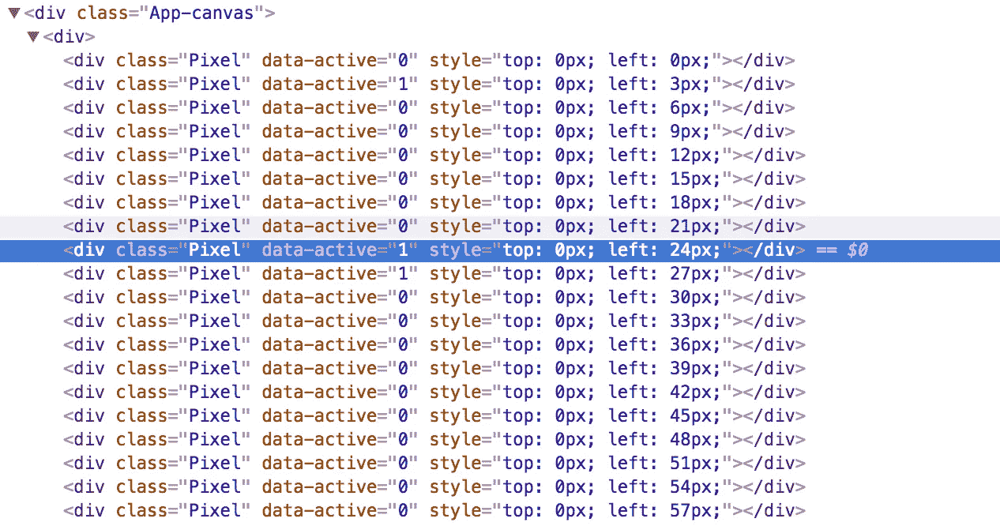

# 终极优化

这个我没有编码，因为没用。

下面介绍:**为每个像素创建一个 Redux store。**我还没有测试过这个，但是我很确定这个方法是用 Redux 可以实现的最快的方法。

如果你真的走这条路，你也会失去使用 Redux 的大部分好处。比如 Redux DevTools 很可能就坏了。一次一个像素的时间旅行不是很有用，不是吗？

# 更好的解决方案？

所以我能想到的就这些了。

如果你知道更好/更优雅的解决方案，请告诉我。

**更新:**

*   丹·阿布拉莫夫 [提交了他的版本](https://github.com/dtinth/pixelpaint/pull/1)，它比 V1 更快，但“效率不如 V3，但也简单得多”

# 结论

这是一个有趣的实验。

我们中的许多人在优化命令式算法方面都有扎实的知识，但当涉及到基于不可变数据的应用时，如果我们不知道性能影响，那么优化可能会很有挑战性。

一旦我们优化了 Redux 版本，我们可以看到性能优化会导致代码可读性更差。[我上面做的多乱啊！](https://github.com/dtinth/pixelpaint/blob/master/src/ReduxCanvasV3.js)

正如丹·阿布拉莫夫所说的那样， [Redux 提供了一种交换](/@dan_abramov/you-might-not-need-redux-be46360cf367)(MobX 也是如此)。那么，你会在不丧失热加载和时间旅行能力的情况下，用代码的清晰性和可读性来换取性能吗？

在我的 [**midi-instruments**](https://our.wonderful.software/my-musical-instruments-f88ed8b12331) 项目中，应用程序将在 MobileSafari 中运行，因此性能非常重要，尤其是当一个乐器可能包含数百个按钮时。

我还想快速构建新仪器的原型，而不必担心使用不可变数据时的性能影响。

我也发现热重装和时间旅行在这个项目中不是很有用。大多数状态持续几秒钟，我的项目足够小，我可以重新加载页面。

所以我很愉快地在这个项目中使用 MobX。

在我正在开发的节奏游戏 [**Bemuse**](https://github.com/bemusic/bemuse) 中，我觉得使用不可变的数据有助于我编写简单且易于测试的代码。

我不必担心意外的状态突变，因为没有什么可以突变的。

也没有太多的数据需要渲染，所以我可能不需要像上面的例子那样进行优化。

手头有一个 Redux DevTools 并且所有的状态更新都集中在一个地方也会让我受益匪浅。在这里，Redux 大放异彩！

所以我很愉快地在这个项目中使用 Redux。

## 不公平的绩效比较

当我试图比较功能性方法(Redux)和命令性方法(MobX)时，这种比较从一开始就是不公平的。

1996 年，Chris Okasaki 在他的 [140 页的论文](https://www.cs.cmu.edu/~rwh/theses/okasaki.pdf)、*‘纯函数数据结构’*中总结道:

> 不管编译器技术如何进步，只要函数式程序员可用的算法比命令式程序员可用的算法慢得多，函数式程序就永远不会比命令式程序快。

在那篇论文中([现已成为一本书](https://www.amazon.com/Purely-Functional-Structures-Chris-Okasaki/dp/0521663504))，他试图让函数式编程中的数据结构和它的命令式对应物一样高效。

> 这篇论文提供了许多函数式数据结构，它们和最好的命令式实现一样有效

我不会仅仅因为函数式编程永远不会像命令式算法那样快，就停止进行函数式编程

这都是权衡的问题。这也是为什么我从来不说‘让我们把 Redux/MobX 用于*一切吧！*.”这就是为什么当人们问“2017 年我应该使用 MobX 还是 Redux”时，我无法提供足够的答案没有任何其他背景。这就是我写这篇文章的原因。

# 感谢阅读！

Reddit 上有一些很好的讨论！

丹·阿布拉莫夫的拉请求中还有一些讨论(谢谢！):

[](https://github.com/dtinth/pixelpaint/pull/1) [## 通过 gae Aron Pull Request # 1 dtinth/pixel paint 添加一个简单但相当快速的 Redux 版本

### 它的效率比 V3 低，但也简单得多。依赖于道具的记忆(这是你想在…

github.com](https://github.com/dtinth/pixelpaint/pull/1) [](http://bit.ly/HackernoonFB)[](https://goo.gl/k7XYbx)[](https://goo.gl/4ofytp)

> [黑客中午](http://bit.ly/Hackernoon)是黑客如何开始他们的下午。我们是 [@AMI](http://bit.ly/atAMIatAMI) 家庭的一员。我们现在[接受投稿](http://bit.ly/hackernoonsubmission)，并乐意[讨论广告&赞助](mailto:partners@amipublications.com)机会。
> 
> 如果你喜欢这个故事，我们推荐你阅读我们的[最新科技故事](http://bit.ly/hackernoonlatestt)和[趋势科技故事](https://hackernoon.com/trending)。直到下一次，不要把世界的现实想当然！

