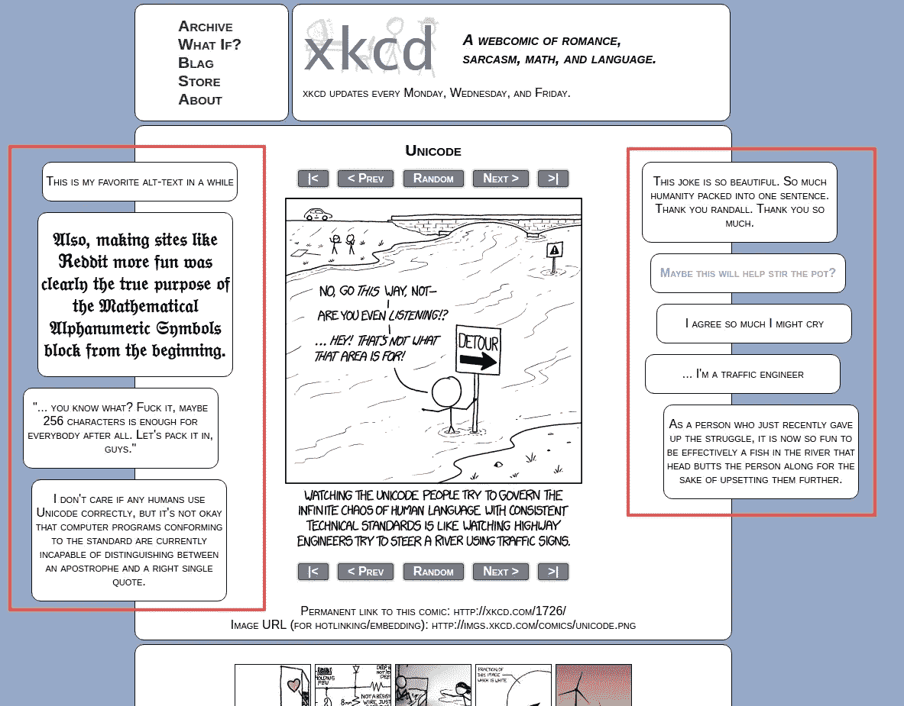

# 无论多么微小的影响

> 原文：<https://medium.com/hackernoon/an-effect-however-small-c66d9b15f720>

六个月前，我辞掉了工作，全身心地投入到一个语音翻译应用程序中。

**虽然听起来很老套，但我的动机是*创造一些有意义的东西。***

当我感到沮丧并开始思考我的人生在做什么时，我几乎没有报酬地工作，而我以前的同事却赚了超过 90K，**有一个发光的屏幕，我喜欢回到那里:**

Actual People Using My Stuff!

## 这些是我 3 年前编写的一个非常小的项目的统计数据。

这是一个非常简单的 [Chrome](https://hackernoon.com/tagged/chrome) 扩展，用于 XKCD.com[网站](https://hackernoon.com/tagged/website)在漫画旁边显示 Reddit 评论:

XKCD comics + Reddit comments

没有什么比看到这个随机项目更能激励我的了，这个项目是几年前在一个无聊的课程中一起开发的，现在每天仍有几十个人在使用它。

它提醒我，作为一名计算机科学家，我可以用 300 行代码对人们的生活产生影响，不管这种影响有多小。它提醒我，把一个想法变成现实并放到人们手中从来没有这么容易过。这提醒了我为什么要做我现在正在做的事情:**继续创造更多人们想要使用的东西。**

*Psst…读 XKCD？用 Reddit？* [*从 Chrome 商店获得扩展*](https://chrome.google.com/webstore/detail/xkcd%20r/kjfdpkjdjiefealdecjlgeogjbklhmgi) *。*